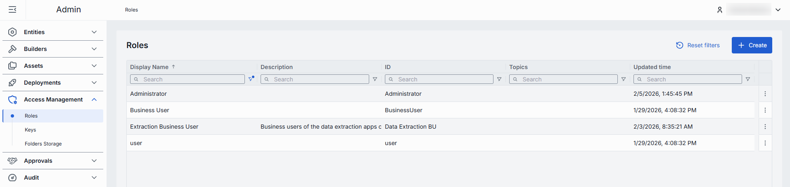
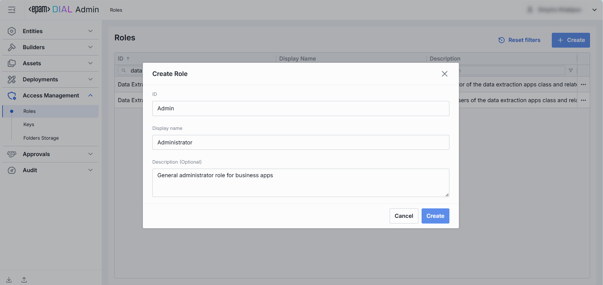
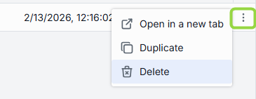
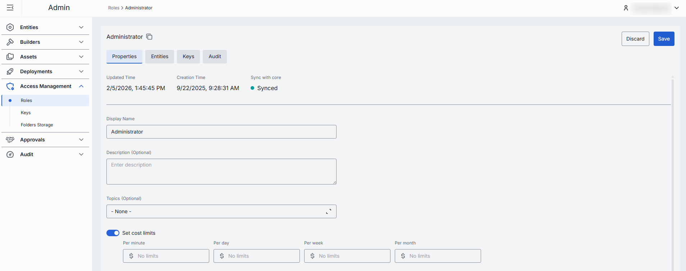
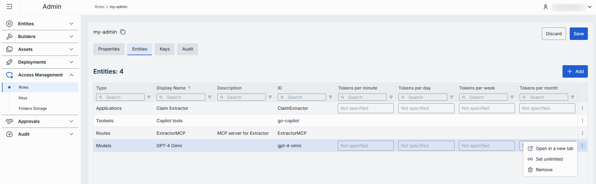
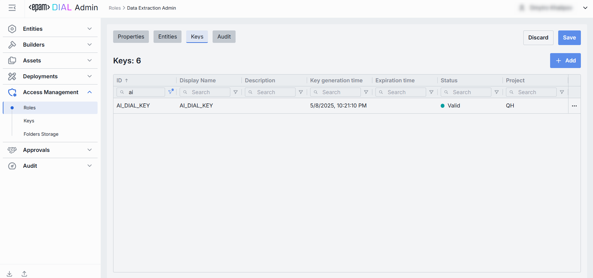
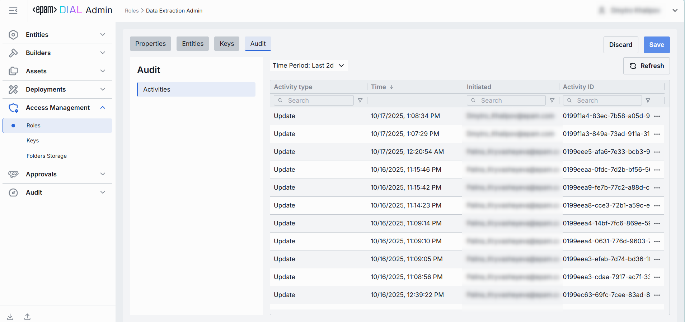
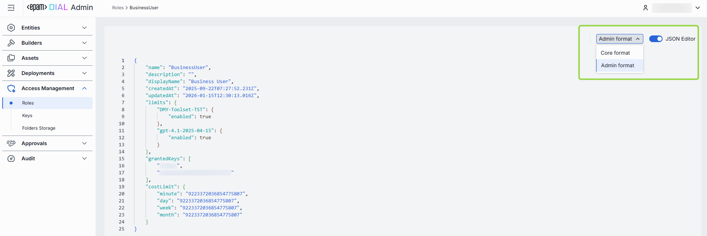

# Manage roles

This page explains how to create, configure, and delete roles in DIAL Admin. Roles control which models, applications, tool sets, and routes each user group can access, and set token usage and cost limits. You need administrator access to DIAL Admin to perform these tasks.

**Note**
> Roles can also be defined directly in [DIAL Core configuration](https://github.com/epam/ai-dial-core/blob/development/docs/dynamic-settings/roles.md). Changes made in DIAL Admin sync to DIAL Core automatically every two minutes.

For background on how roles work in the platform, see [Authentication and access control](../../2.understand-dial/4.security-and-governance/1.authentication-and-access-control.md). To configure roles for API keys or JWT, see [Roles and rate limits](../../4.operating-dial/5.auth-and-access-control/3.roles-and-rate-limits.md).

## Roles grid

Navigate to **Access Management → Roles** to see all roles defined in your DIAL instance.

| Column | Description |
|--------|-------------|
| **ID** | Unique role identifier. |
| **Display Name** | Role name displayed in the UI. |
| **Description** | Description of the role. |
| **Updated Time** | Last update timestamp. |
| **Topics** | Semantic tags assigned to the role (e.g., "admin", "user"). |

## Create a role

1. Click **Create** to open the **Create Role** modal.
2. Fill in the required parameters:

    | Field | Required | Description |
    |-------|----------|-------------|
    | **ID** | Yes | Unique role identifier. |
    | **Display Name** | Yes | Role name displayed in the UI. |
    | **Description** | No | Description of the role. |

3. Click **Create**. The modal closes and the new role's [configuration screen](#configure-a-role) opens. The role appears immediately in the listing.

    

## Delete a role

Click **Delete** in the role's actions menu on the main screen, or use the **Delete** button on the role's configuration screen, to permanently remove the selected role.

## Configure a role

Click any role on the main screen to open its configuration screen.

### Properties

The Properties tab defines the identity and metadata for the role.

| Field | Required | Description |
|-------|----------|-------------|
| **ID** | — | Unique role identifier. |
| **Updated Time** | — | Last update timestamp. |
| **Creation Time** | — | Creation timestamp. |
| **Sync with core** | — | Indicates the synchronization state between DIAL Admin and DIAL Core. Sync occurs automatically every two minutes (configurable via `CONFIG_AUTO_RELOAD_SCHEDULE_DELAY_MILLISECONDS`).  **Synced**: States are identical in Admin and Core for valid entities, or the entity is missing in Core for invalid entities. **In progress…**: Synced conditions are not met and changes were applied within the last two minutes (configurable via `CONFIG_EXPORT_SYNC_DURATION_THRESHOLD_MS`). **Out of sync**: Synced conditions are not met and changes were applied more than two minutes ago. **Unavailable**: Cannot determine the entity's state in Core—occurs when the config was not received from Core, or the configuration is not fully compatible between Admin and Core.  Sync state is not available for sensitive information (API keys, tokens, auth settings). |
| **Display Name** | Yes | Role name displayed in the UI. |
| **Description** | No | Description of the role. |
| **Topics** | No | Semantic tags assigned to the role (e.g., "admin", "user"). |
| **Set cost limits** | No | Token usage limits for this role. Available periods: Tokens per minute, Tokens per day, Tokens per week, Tokens per month. If no limits are set for this role, the **default** role limits apply. If no **default** role limits are set, the value is unlimited. See [DIAL Core documentation](https://github.com/epam/ai-dial-core/blob/development/docs/dynamic-settings/roles.md) for all available options. |
| **Sharing** | No | Sharing limits for specific resource types. **Expiration time** sets the TTL of the sharing link (default: 72 hours). **Max users** sets the maximum number of users who can accept a sharing link (default: 10 for APPLICATION; unlimited for other resource types). See [DIAL Core documentation](https://github.com/epam/ai-dial-core/blob/development/docs/dynamic-settings/roles.md#rolesrole_nameshare) for details. |

### Entities

The Entities tab controls which models, applications, tool sets, and routes this role can access, along with per-entity token rate limits.

| Column | Description |
|--------|-------------|
| **ID** | Unique entity identifier. |
| **Display Name** | Entity name displayed in the UI. |
| **Description** | Description of the entity. |
| **Type** | Entity category: [Models](../2.entities/1.models.md), [Applications](../2.entities/2.applications.md), tool sets, or routes. |
| **Tokens per minute** | Maximum tokens this role may consume per minute when calling this entity. Available for applications and models. |
| **Tokens per day** | Maximum tokens this role may consume per day when calling this entity. Available for applications and models. |
| **Tokens per week** | Maximum tokens this role may consume per week when calling this entity. Available for applications and models. |
| **Tokens per month** | Maximum tokens this role may consume per month when calling this entity. Available for applications and models. |

| Action | Description |
|--------|-------------|
| **Add** | Add an entity this role can access. |
| **Remove** | Remove entities to revoke this role's access. |
| **Set unlimited** | Remove token limits for selected entities. Available for applications and models. |

### Keys

The Keys tab shows the API keys associated with this role. API keys are managed in [Access Management → Keys](./2.keys.md).

| Column | Description |
|--------|-------------|
| **Display Name** | Key name displayed in the UI. |
| **Description** | Description of the key. |
| **ID** | Unique key identifier. |
| **Creation Time** | Key creation timestamp. |
| **Key generation time** | Timestamp of the key's secret value generation. |
| **Expiration time** | Key expiration timestamp. Blank means the key does not expire. |
| **Status** | Current validity status. A key is **invalid** when it has no roles assigned, or its secret value is missing or expired. |
| **Topics** | Tags assigned to the key (e.g., "admin", "user"). |
| **Updated Time** | Last update timestamp. |
| **Project** | Name of the project the key was created for. |

| Action | Description |
|--------|-------------|
| **Add** | Assign an API key to this role. |
| **Remove** | Disconnect the role from an API key. To delete the key, go to [Keys](./2.keys.md). |

### Audit

The Activities section shows all changes made to this role. It mirrors the global [Audit → Activity and rollback](../8.audit/1.activity-and-rollback.md) view but is scoped to this role.

### JSON editor

Advanced users can view and edit role properties as raw JSON. This is useful for bulk updates, copying configuration between environments, or modifying settings not exposed in the UI.

**Tip**
> You can switch between UI and JSON only when there are no unsaved changes.

Use the **View** dropdown to switch between Admin format and Core format. These formatting options are for convenience only—Core format view does not render the actual configuration stored in DIAL Core, but the configuration in the Admin service displayed in DIAL Core format.

To use the JSON editor:

1. Navigate to **Access Management → Roles** and select the role you want to edit.
2. Click the **JSON Editor** toggle (top-right). The raw JSON is revealed.
3. Select **Admin** or **Core** format from the view dropdown.
4. Make your changes and click **Save**.

## Next steps

- [Manage API keys](./2.keys.md) — create and rotate API keys, assign roles to keys
- [Manage entities: models](../2.entities/1.models.md) — add models to a role's entity list
- [Review activity and rollback](../8.audit/1.activity-and-rollback.md) — audit all role changes and restore previous states
