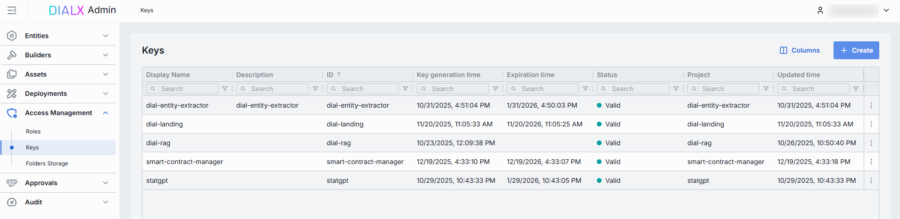
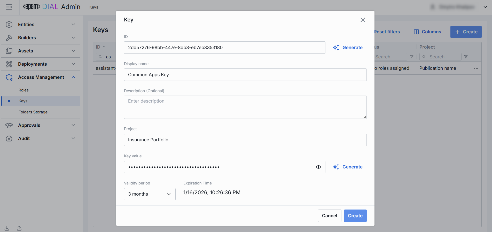
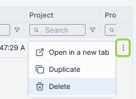
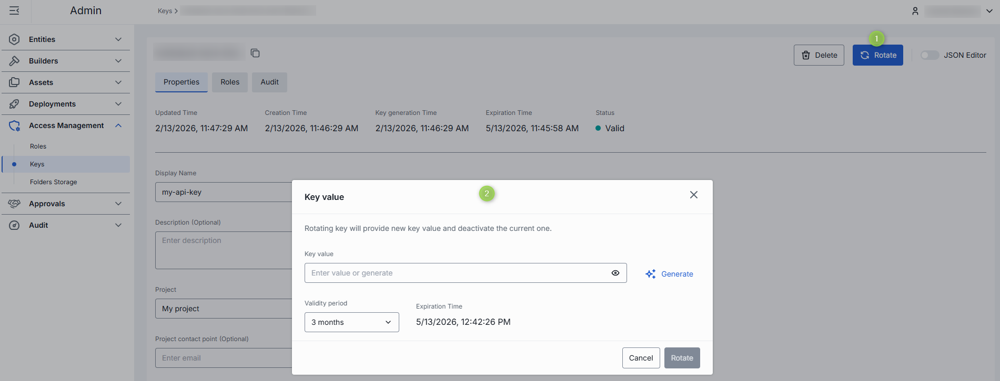
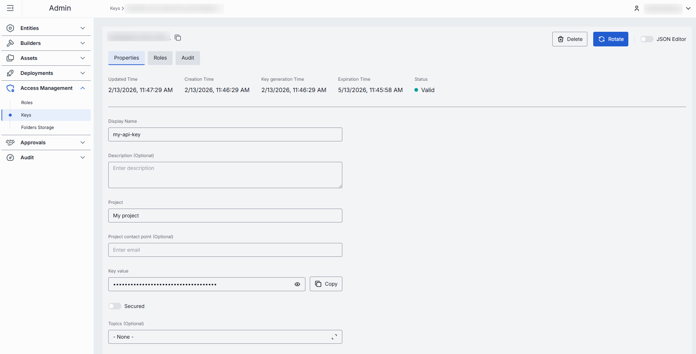
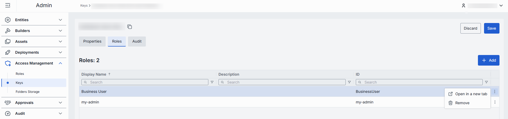
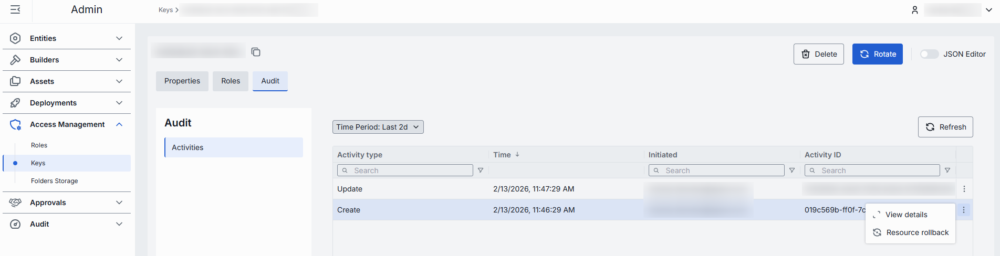
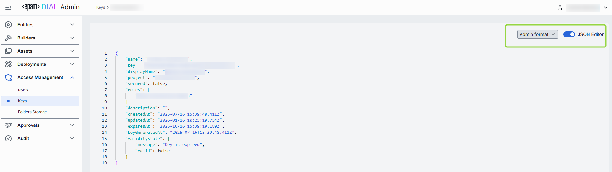

# Manage API keys

This page explains how to create, configure, rotate, and delete API keys in DIAL Admin. API keys allow external applications to authenticate with DIAL Core and access resources. You need administrator access to DIAL Admin to perform these tasks.

**Note**
> API keys can also be defined directly in [DIAL Core configuration](https://github.com/epam/ai-dial-core/blob/development/docs/dynamic-settings/keys.md). Changes made in DIAL Admin sync to DIAL Core automatically every two minutes.

For background on access control, see [Authentication and access control](../../2.understand-dial/4.security-and-governance/1.authentication-and-access-control.md). To configure API key roles and rate limits, see [Roles and rate limits](../../4.operating-dial/5.auth-and-access-control/3.roles-and-rate-limits.md).

## Keys grid

Navigate to **Access Management → Keys** to see all API keys defined in your DIAL instance.

**Tip**
> Use the **Columns** selector to customize which columns are visible in the grid.

| Column | Description |
|--------|-------------|
| **ID** | Unique key identifier. |
| **Display Name** | Key name displayed in the UI. |
| **Description** | Description of the key. |
| **Creation Time** | Key creation timestamp. |
| **Updated Time** | Timestamp of the latest change. |
| **Key generation time** | Timestamp of the key's secret value generation. |
| **Expiration time** | Key expiration timestamp. Setting expirations enforces regular key rotation. |
| **Status** | Current validity status. A key is **invalid** when it has no roles assigned, or its secret value is missing or expired. |
| **Project** | Name of the project the key was created for. |
| **Project contact point** | Email of the responsible person or group. |
| **Secured** | Indicates whether this is a [secured API key](https://github.com/epam/ai-dial-core/blob/development/docs/privacy.md#applications-audit-logs). |
| **Topics** | Tags assigned to the key (e.g., "admin", "user"). |

## Create an API key

1. Click **Create** to open the **Key** modal.
2. Specify the parameters for the new key:

    | Field | Required | Description |
    |-------|----------|-------------|
    | **ID** | Yes | Unique key identifier. Click **Generate** to create a GUID automatically. |
    | **Display Name** | Yes | Key name displayed in the UI. |
    | **Description** | No | Description of the key. |
    | **Project** | Yes | Name of the project the key is created for. |
    | **Key value** | Yes | Secret string used for authentication. Initially hidden—click the eye icon to reveal. Click **Generate** to produce a GUID automatically. The value can be changed later in [Properties](#properties). |
    | **Validity Period** | Yes | Key expiration period. Use to enforce credential rotation and retirement. |

3. Click **Create**. The modal closes and the new key's [configuration screen](#configure-an-api-key) opens. The key appears immediately in the listing.

    

## Delete an API key

Click **Delete** on the main screen to permanently remove the selected key.

**Warning**
> All entities (applications, models, routes) bound to the deleted API key will stop working.

## Configure an API key

Click any key on the main screen to open its configuration screen.

### Key rotation

Use **Rotation** to replace the secret value of an existing API key without deleting it. After rotation, the key's generation timestamp updates.

1. Click the key to open its configuration screen.
2. Click **Rotate**.
3. Paste or auto-generate a new secret in the **Key value** field.
4. Pick the **Validity period**. The default expiration period is three months.
5. Click **Rotate** to apply.

### Properties

The Properties tab shows metadata and editable settings for the selected API key.

| Field | Required | Description |
|-------|----------|-------------|
| **ID** | — | Unique key identifier. |
| **Updated Time** | — | Timestamp of the last update. |
| **Creation Time** | — | Key creation timestamp. |
| **Key Generation Time** | — | Timestamp of the key's secret value generation. |
| **Expiration Time** | — | Key expiration timestamp. Setting expirations enforces regular key rotation. |
| **Status** | — | Current validity status. A key is **invalid** when it has no roles assigned, or its secret value is missing or expired. |
| **Display Name** | Yes | Key name displayed in the UI. |
| **Description** | No | Description of the key. |
| **Project** | Yes | Name of the project the key was created for. |
| **Project contact point** | No | Email of the responsible person or group. |
| **Key value** | Yes | Secret string used for authentication. Initially hidden—click the eye icon to reveal. Click **Copy** to copy it to clipboard. |
| **Secured** | Yes | Indicates whether this is a secured API key. |
| **Topics** | No | Tags assigned to the key (e.g., "admin", "user"). |
| **IPs access restriction** | No | List of IP address ranges controlling which clients can use this key. — **Allow all** or undefined: any client has access. — **Block all**: no client has access. — **Only selected ranges**: only clients with an IP address within the specified ranges can access. Supports IPv4 and IPv6. |

### Roles

API keys must be associated with at least one role to be valid. Roles grant access to specific DIAL resources and can impose token usage and cost limits.

The Roles tab lets you associate the selected API key with existing [roles](./1.roles.md).

| Column | Description |
|--------|-------------|
| **Display Name** | Role name displayed in the UI. |
| **Description** | Description of the role. |
| **ID** | Unique role identifier. |

| Action | Description |
|--------|-------------|
| **Add** | Assign a role to this API key. |
| **Remove** | Disconnect the role from this key. To delete the role, go to [Roles](./1.roles.md). |

### Audit

The Activities section shows all changes made to this API key. It mirrors the global [Audit → Activity and rollback](../8.audit/1.activity-and-rollback.md) view but is scoped to this key.

### JSON editor

Advanced users can view and edit key properties as raw JSON. This is useful for bulk updates, copying configuration between environments, or modifying settings not exposed in the UI.

**Tip**
> You can switch between UI and JSON only when there are no unsaved changes.

Use the **View** dropdown to switch between Admin format and Core format. These formatting options are for convenience only—Core format view does not render the actual configuration stored in DIAL Core, but the configuration in the Admin service displayed in DIAL Core format.

To use the JSON editor:

1. Navigate to **Access Management → Keys** and select the key you want to edit.
2. Click the **JSON Editor** toggle (top-right). The raw JSON is revealed.
3. Select **Admin** or **Core** format from the view dropdown.
4. Make your changes and click **Save**.

## Next steps

- [Manage roles](./1.roles.md) — create roles and assign entities and token limits
- [Review activity and rollback](../8.audit/1.activity-and-rollback.md) — audit all key changes and restore previous states
- [Monitor usage and dashboards](../8.audit/2.monitoring-dashboards.md) — track per-project API consumption
