# Review and approve publications

This page explains how to review, approve, decline, and delete publication requests in DIAL Admin. DIAL users can publish private resources—applications, files, prompts, and tool sets—to share them with others in the organization. Each request requires an administrator review before the resource becomes publicly available. You need administrator access to DIAL Admin to perform these tasks.

For background on how publications work in DIAL, see [Publications](https://docs.dialx.ai/platform/7.collaboration-intro#publication). To learn about the publication process from the perspective of a DIAL Chat end user, see the [DIAL Chat User Guide](https://docs.dialx.ai/tutorials/0.user-guide#publications). For programmatic creation and management of publication requests, see the [Publication API](https://dialx.ai/dial_api#tag/Publications).

## Publications grid

Navigate to **Approvals → [Resource type] Publications** to see all pending and historical publication requests for that resource type.

| Column | Description |
|--------|-------------|
| **Name** | Title of the submitted publication request. |
| **Author** | The user who submitted the request. |
| **Creation Time** | Timestamp when the request was submitted. |

## Review a publication request

Click any request on the main screen to open its review page. On the review page you can inspect the request and take an action. You can also modify selected properties before taking action.

### Actions

| Action | Description |
|--------|-------------|
| **Publish** | Approve a publish request. The resource is moved to the Public folder and becomes accessible to other users. |
| **Unpublish** | Approve an unpublish request. The resource is removed from the Public folder and becomes inaccessible. **Removing a published resource can break workflows that depend on it.** |
| **Decline** | Reject the request. You are prompted to enter a reason that is sent back to the request author. |
| **Delete** | Delete the publication request without taking action on the resource. |

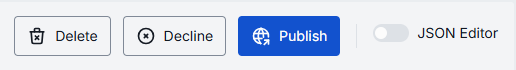

### Common properties

All publication types share these request-level fields in the Properties tab.

| Property | Editable | Description |
|----------|----------|-------------|
| **Action** | No | Action requested: Publish or Unpublish. |
| **Creation Time** | No | Timestamp when the request was submitted. |
| **Author** | Yes | Name of the request creator. |
| **Folder Storage** | Yes | Target path in the Public file storage where the resource will be published. Use **Move to** to change the destination. |

### Permissions

By default, resources are published into the root Public folder, which all authenticated users can access. If the request author created a sub-folder and targeted it in the **Publish to** field, that sub-folder may have access rules applied.

This section shows any access rules that apply to the selected request. You can modify them before approving.

### JSON editor

All publication types support a JSON editor view for advanced scenarios: bulk updates, copying configuration between environments, or modifying settings not exposed in the UI.

**Tip**
> You can switch between UI and JSON only when there are no unsaved changes.

---

## Application publications

Navigate to **Approvals → Application Publications**.

The Application Publications screen shows all publish/unpublish requests submitted via [DIAL Chat UI](https://docs.dialx.ai/tutorials/0.user-guide#publish-2) or the [Publication API](https://dialx.ai/dial_api#tag/Publications).

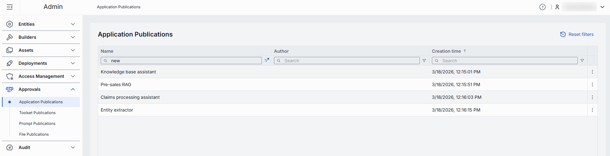

Published applications are accessible in the **Assets → Applications** section.

### Application properties

The Properties tab includes the [common request properties](#common-properties) plus the following application-specific fields.

| Property | Editable | Description |
|----------|----------|-------------|
| **ID** | Yes | Unique identifier of the application. |
| **Display Name** | Yes | Application name displayed in the UI. |
| **Version** | Yes | Version of the application to be published. |
| **Description** | Yes | Description of the application. |
| **Icon** | Yes | Application icon rendered in the UI. |
| **Topics** | Yes | Semantic labels (e.g., "finance", "support") for navigation. Topic names must not exceed 255 characters and must not contain leading or trailing spaces. |
| **Source type** | Yes | Determines how DIAL Core communicates with the application. — **Endpoints**: Standalone application. DIAL Core communicates via explicitly provided chat completion, responses, and/or MCP endpoints. — **Application runner**: Application runner acts as a factory for app instances with different configurations, based on a JSON schema. Available runners are managed in [Builders](./3.builders.md). |
| **Application runner** | Yes | Select an available application runner. Required when Source Type is **Application runner**. |
| **Completion endpoint** | Yes | Chat completion endpoint. Required when Source Type is **Endpoints**. |
| **Responses endpoint** | Yes | Endpoint URL that supports the OpenAI Responses API. Required when Source Type is **Endpoints**. |
| **MCP Endpoint** | Yes | MCP endpoint DIAL Core uses to communicate with the application. Required when Source Type is **Endpoints**. — **Transport**: Transport used by the MCP server. HTTP by default. — **Forward per request key**: Set to `true` to forward a per-request key to the MCP endpoint, allowing the MCP server to access files in DIAL storage. — **Configuration delivery**: How application properties are sent to the MCP server. `Header` delivers them in an HTTP header; `Meta` includes them in the `_meta` field of the MCP message payload. |
| **Attachment types** | Yes | Types of attachments this app accepts. — **No attachments**: Disables all attachment types. — **All attachment types**: Allows all file attachments. Optionally specify a maximum count. — **Specific attachment types**: Define specific [MIME types](https://developer.mozilla.org/en-US/docs/Web/HTTP/Basics_of_HTTP/MIME_types/Common_types). |
| **Attachments max number** | Yes | Maximum number of input attachments. Enabled when attachment types are configured. |
| **Completion Defaults** | Yes | Default parameters applied when a request to the `chat/completions` API does not include them. |
| **Responses Defaults** | Yes | Default parameters applied when a request to the `openai/v1/responses` API does not include them. |
| **Forward auth token** | Yes | When enabled, the authorization token is forwarded in an HTTP header to the chat completion endpoint. |
| **Max retry attempts** | Yes | Number of times DIAL Core retries a failed request (due to timeouts or 5xx errors). |

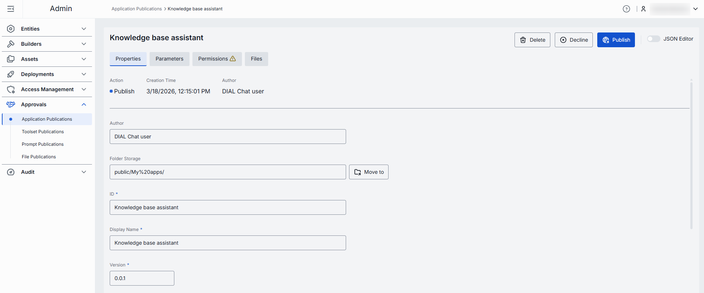

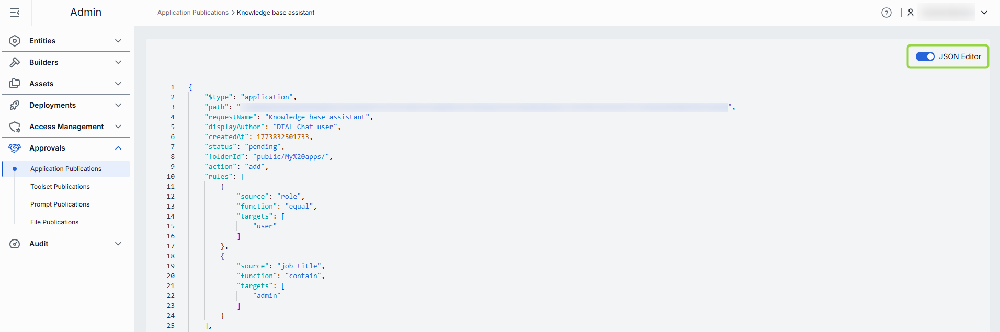

### Parameters tab

The Parameters tab shows application-specific parameters that influence behavior. The available parameters are determined by the [related application runner configuration](./3.builders.md).

### Files tab

If the application includes files (for example, source data files for a talk-to-your-data application), they are published together with the application.

Published files are accessible in **Assets → Files** in the target folder specified in the request.

| Field | Description |
|-------|-------------|
| **Display Name** | Name of the file. |
| **Extension** | File extension (e.g., `.json`, `.png`). |
| **Actions** | **Preview**: view file content (may be disabled for some types). **Download**: save the file to your device. **Remove**: remove the file from the publication request. |

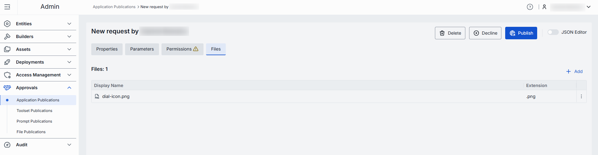

Click **Add** to attach additional files to the request.

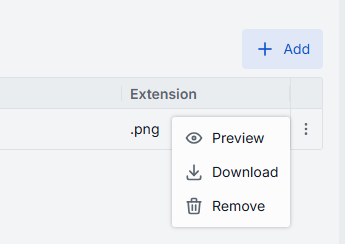

### Permissions tab

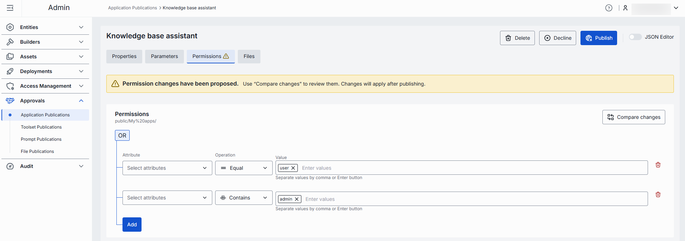

---

## File publications

Navigate to **Approvals → File Publications**.

The File Publications screen shows all publish/unpublish requests submitted via the [Publication API](https://dialx.ai/dial_api#tag/Publications).

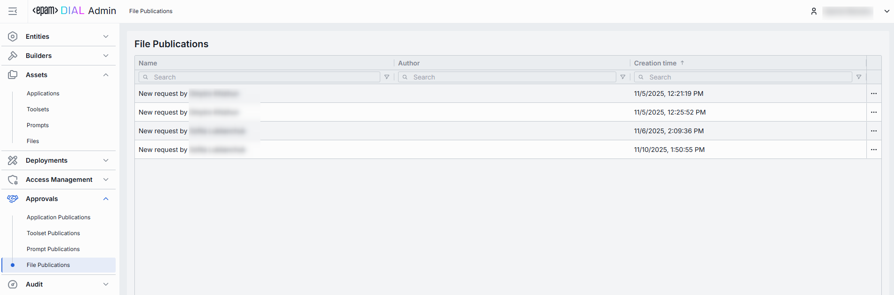

Published files are accessible in the **Assets → Files** section, including files published together with applications.

### File request properties

The Properties tab contains the [common request properties](#common-properties).

**Note**
> Some actions are disabled for certain file types. Preview and download are supported for: `.html`, `.htm`, `.css`, `.js`, `.mjs`, `.json`, `.xml`, `.txt`, `.md`, `.csv`, `.jpg`, `.jpeg`, `.png`, `.gif`, `.webp`, `.svg`, `.ico`, `.bmp`, `.avif`, `.mp3`, `.wav`, `.ogg`, `.mp4`, `.webm`, `.pdf`.

Available file actions:

| Action | Description |
|--------|-------------|
| **Download** | Download the file. May be disabled for certain types. |
| **Preview** | Preview the file content. May be disabled for certain types. |
| **Remove** | Remove the file from the publication request. |
| **Add** | Add files to the publication request. |

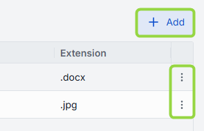

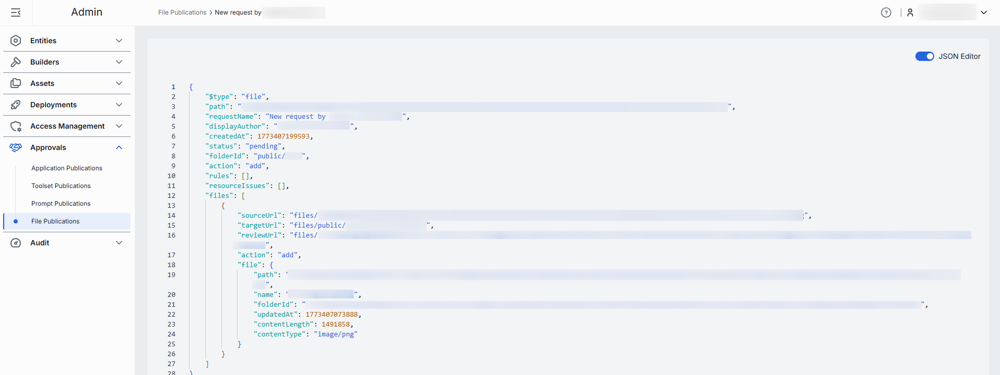

### Permissions tab

---

## Prompt publications

Navigate to **Approvals → Prompt Publications**.

The Prompt Publications screen shows all publish/unpublish requests submitted via [DIAL Chat UI](https://docs.dialx.ai/tutorials/0.user-guide#publish-1) or the [Publication API](https://dialx.ai/dial_api#tag/Publications).

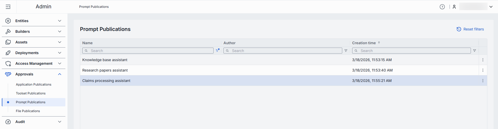

Published prompts are accessible in the **Assets → Prompts** section.

### Prompt request properties

The Properties tab contains the [common request properties](#common-properties) plus these prompt-specific fields.

| Property | Editable | Description |
|----------|----------|-------------|
| **Version** | Yes | Prompt version. |
| **Description** | Yes | Description of the prompt purpose. |
| **Content** | Yes | The prompt content. |

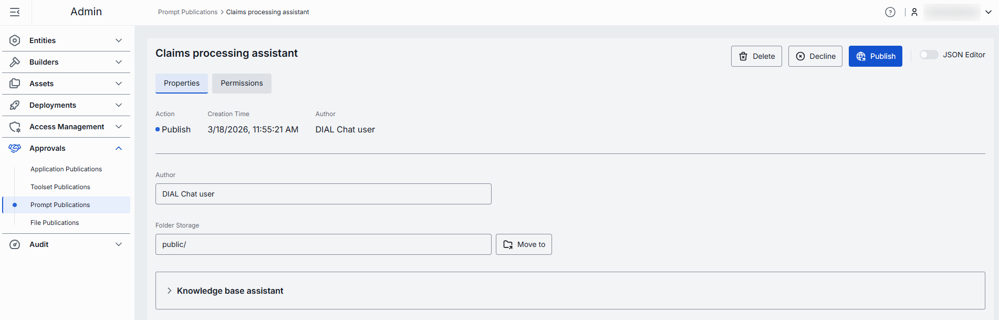

A publication request submitted via the Publication API can include more than one prompt. Use **Delete** in the prompt properties area to remove individual prompts from the request if necessary.

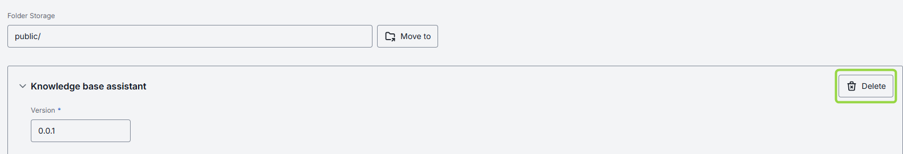

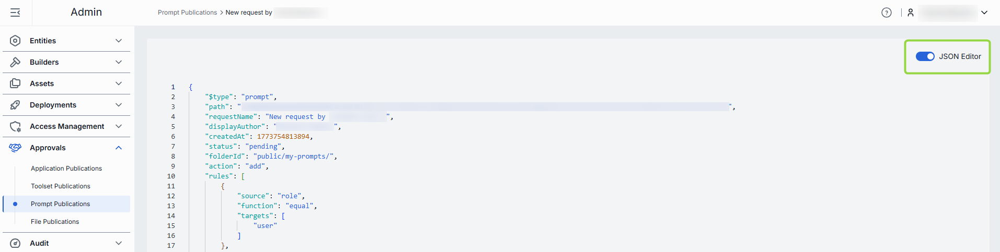

### Permissions tab

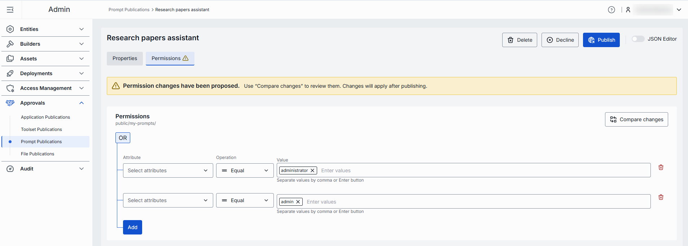

---

## Tool set publications

Navigate to **Approvals → Toolsets Publications**.

The Toolsets Publications screen shows all publish/unpublish requests submitted via [DIAL Chat UI](https://docs.dialx.ai/tutorials/0.user-guide#publish-3) or the [Publication API](https://dialx.ai/dial_api#tag/Publications).

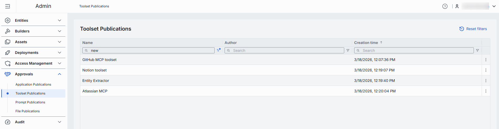

Published tool sets are accessible in the **Assets → Toolsets** section.

### Tool set properties

The Properties tab contains the [common request properties](#common-properties) plus these tool set-specific fields.

| Property | Editable | Description |
|----------|----------|-------------|
| **Authentication** | No | Current authentication status of the tool set: — **Logged out**: not authenticated with the MCP server. — **Logged in (Personal)**: authenticated with personal credentials only. — **Logged in (Organization)**: authenticated with organization credentials only. — **Logged in**: authenticated at both personal and organization levels. |
| **ID** | Yes | Unique tool set identifier. |
| **Display Name** | Yes | Tool set name displayed in the UI. |
| **Version** | Yes | Version to be published. |
| **Description** | Yes | Description of the tool set. |
| **Icon** | Yes | Tool set icon rendered in the UI. |
| **Topics** | Yes | Semantic labels (e.g., "finance", "support") for navigation. Topic names must not exceed 255 characters and must not contain leading or trailing spaces. |
| **External Endpoint** | Yes | Tool set API endpoint for MCP calls. |
| **Transport** | Yes | Transport supported by the endpoint. Available options: HTTP (default) or SSE (deprecated). |
| **Authentication** | Yes | Tool set authentication configuration. See the Entities — Tool sets page for details. |

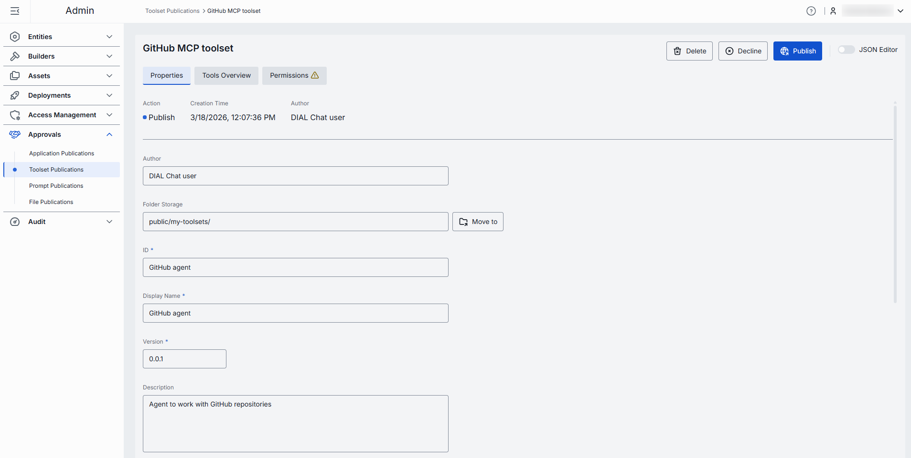

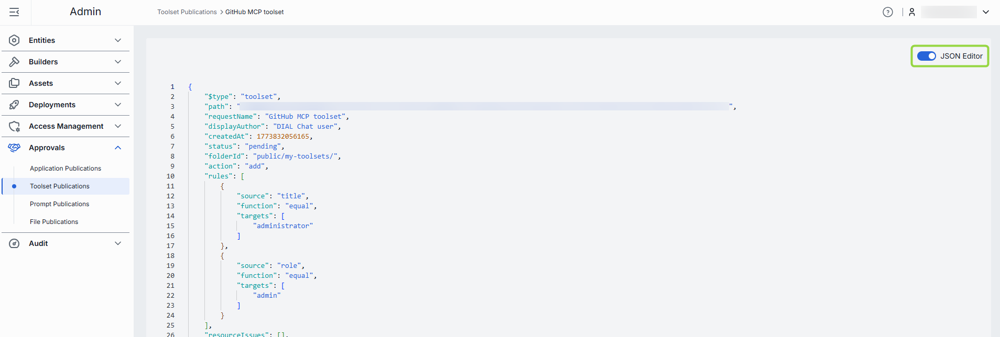

### Tools overview tab

[Tools](https://modelcontextprotocol.io/specification/2025-06-18/server/tools) are functions supported by the related MCP server. This tab shows and lets you edit the tools included in the tool set being published. See the Entities — Tool sets page for details on tools management.

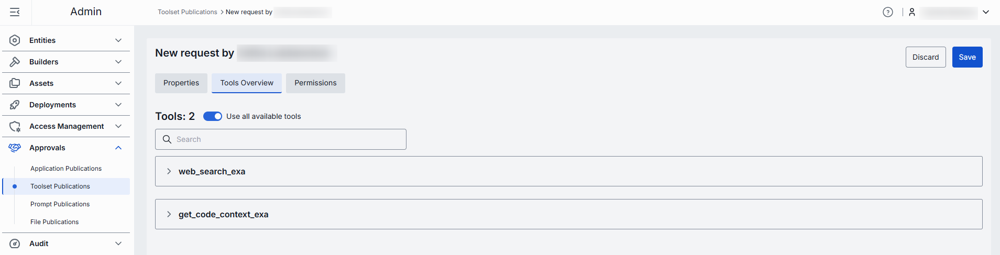

### Permissions tab

---

## Next steps

- [Manage roles](./6.access-management/1.roles.md) — configure folder-level access rules and resource permissions
- [Manage API keys](./6.access-management/2.keys.md) — create and rotate API keys for programmatic publication requests
- [Review activity and rollback](./8.audit/1.activity-and-rollback.md) — audit publication approvals and other admin actions
