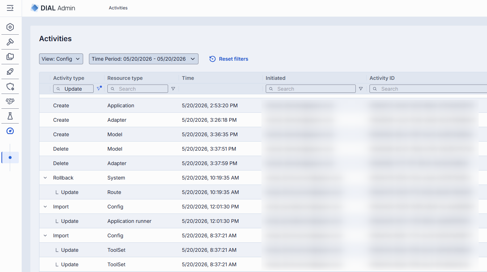
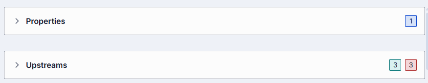
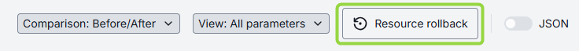
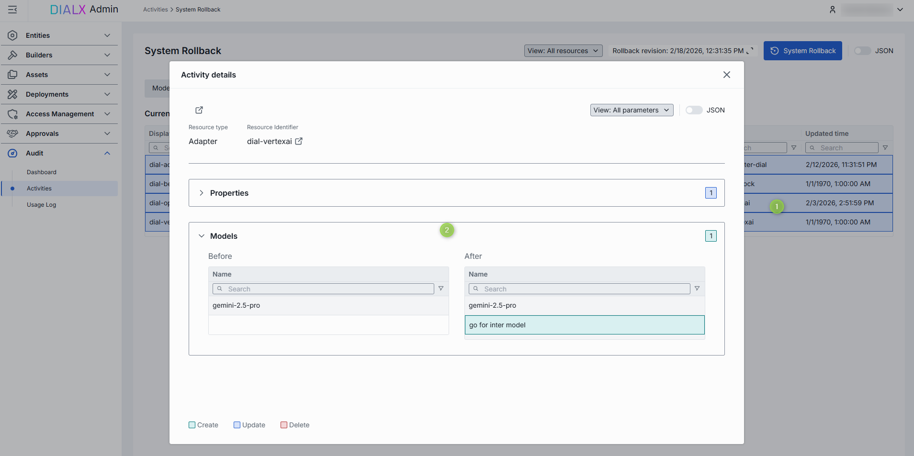
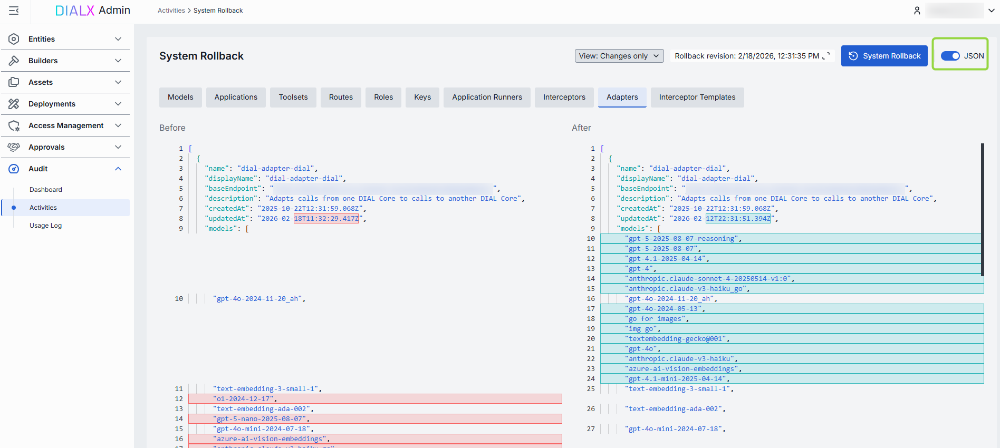

# Review activity and roll back changes

This page explains how to use the Activity Audit screen in DIAL Admin to trace configuration changes, inspect before/after diffs, and restore previous resource states. The audit trail records every administrative action—who made it, what changed, and when. You need administrator access to DIAL Admin to perform these tasks.

With Activity Audit you can:

- Trace modifications across all resource types (models, applications, roles, interceptors, and more).
- Verify compliance by reviewing detailed before-and-after comparisons of configuration changes.
- Investigate issues by drilling into individual events with timestamped, user-attributed records.
- Restore stability through granular resource rollback or system-wide state restoration.

## Activity grid

Navigate to **Audit → Activity** to view all events recorded in DIAL Admin.

### Top bar controls

| Control | Description |
|---------|-------------|
| **Time Period** | Scopes the activity table to a specific time range. |
| **View** | Filters the grid by category: **Config** (import, rollback, configuration entity changes), **Assets** (tool sets, prompts, files), or **Deployment** (images, containers). |
| **Refresh** | Reloads the table with the latest data, applying all active filters. |
| **System Rollback** | Opens the system rollback screen. See [System rollback](#system-rollback). |

### Activity grid columns

| Column | Description |
|--------|-------------|
| **Activity type** | Action performed on the resource (e.g., Create, Update, Delete). |
| **Resource type** | Category of the affected object (e.g., Model, Interceptor, Role, Application). |
| **Resource identifier** | Identifier of the specific resource that was acted upon. |
| **Time** | Timestamp of the change. |
| **Initiated** | Email of the user who triggered the action. |
| **Activity ID** | Immutable UUID that uniquely identifies the audit event. |

## Activity details

Click any activity in the grid to open a detailed view of the change. This panel provides forensic-level insight into what was modified.

| Field | Description |
|-------|-------------|
| **Activity ID** | Immutable UUID uniquely identifying this audit event. |
| **Activity type** | Action performed (e.g., Create, Update, Delete). |
| **Resource type** | Category of the affected object (e.g., Models, Properties, Parameters). |
| **Resource identifier** | Name of the resource or deployment ID. |
| **Time** | Timestamp when the platform committed the change. |
| **Initiated** | Email of the user who performed the action. |
| **User ID** | Unique identifier of the user who performed the action. |

### Review changes

The activity details view includes a side-by-side diff between the before and after states.

- **Comparison** dropdown: switch between **Before vs. After** (the state immediately before and after this specific change) and **Before vs. Current** (the state before this change compared to the present system state). Use Before vs. Current to track how a resource evolved over multiple modifications.
- **View** dropdown: filter the diff to show all parameters or only those with differences, reducing noise when reviewing large configurations.
- **Categories** (e.g., Features, Roles, Interceptors): logical groupings of changes within a resource. Click to expand or collapse. A numeric badge shows the number of distinct changes in each group.
- **Before/After columns**: side-by-side diff with color coding per change type:
  - **Green** (Create): a field was added in the After state and did not exist before.
  - **Blue** (Update): a field's value was modified—both rows are highlighted in blue.
  - **Red** (Delete): a field was removed—present in Before, absent in After.

Use the **JSON** toggle to switch between the form-based UI and raw JSON to view parameters not rendered in the UI.

### Resource rollback

Use **Resource Rollback** within the activity details view to restore a single resource to its state before the selected change. The rollback is recorded as a new entry in the activity grid, so the action is fully traceable.

## System rollback

Use **System Rollback** to restore all resources modified during a specified time period to their previous state in a single operation.

The rollback is logged as a parent entry in the activity grid capturing the rollback parameters (target time range), with a child entry for every affected resource. This lets you trace the bulk operation as a whole and drill into each individual resource it touched.

On the System Rollback screen, tabs list all affected resources. Open any tab to drill into the corresponding resource: review the before/after diff, switch between table and JSON view, and apply or skip the rollback for that resource. Use the filters to limit the diff to changed parameters only and to narrow the time range.

Use the **JSON** toggle to view parameters not rendered in the UI.

### System-wide operations

Other system-wide operations are tracked the same way as rollbacks. **Import Config**, for example, is logged as a single parent entry capturing the import action, with a child entry for every resource it created or modified. Open the parent entry to drill into each affected resource and review the changes applied at the global level.

## Next steps

- [Monitor usage and dashboards](./2.monitoring-dashboards.md) — track request throughput, token usage, and costs
- [Manage roles](../6.access-management/1.roles.md) — each role's configuration screen links back to its audit entries
- [Manage API keys](../6.access-management/2.keys.md) — each API key's configuration screen links back to its audit entries
