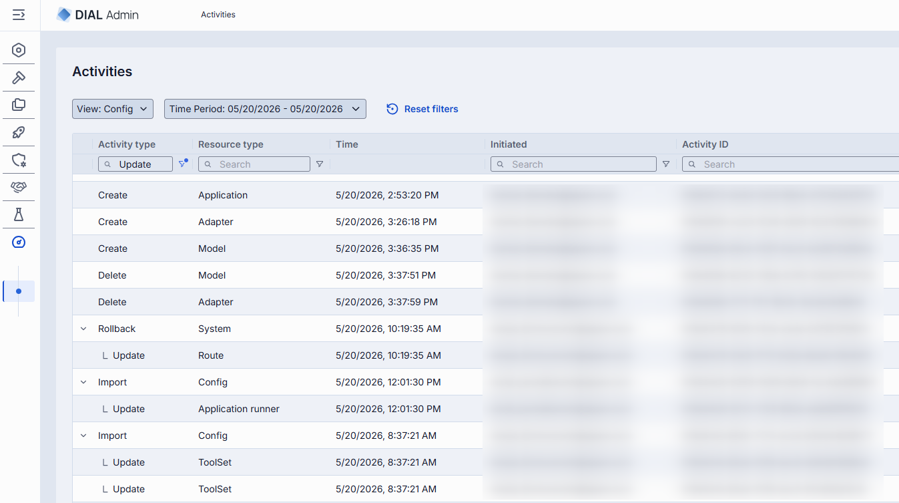
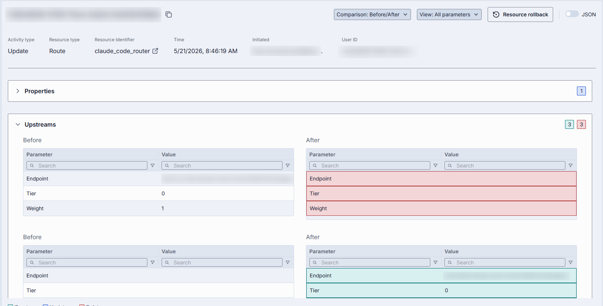
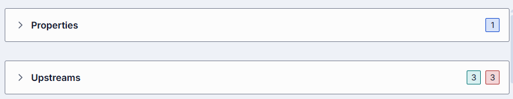
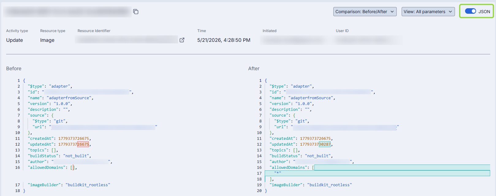
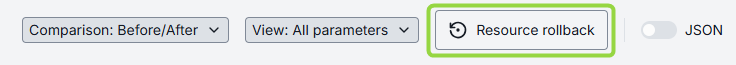
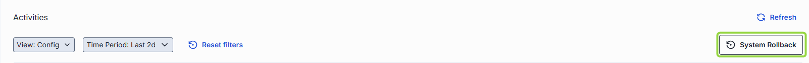
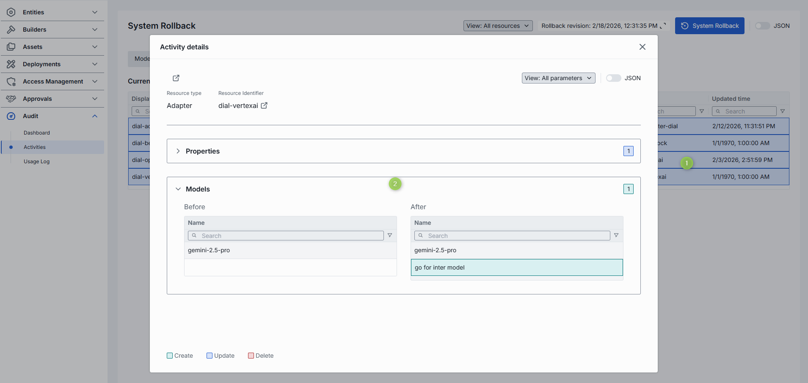
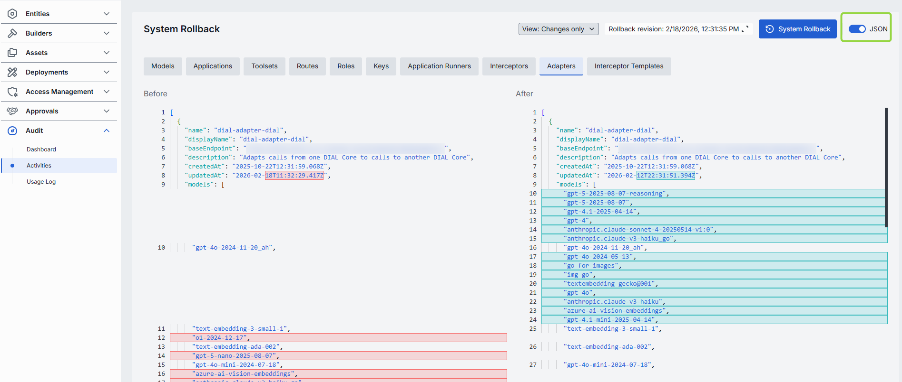

# Activities and rollback

This page explains how to use the Activity Audit screen in DIAL Admin to trace configuration changes, inspect before/after diffs, and restore previous resource states. The audit trail records every administrative action—who made it, what changed, and when. You need administrator access to DIAL Admin to perform these tasks.

With Activity Audit you can:

- Trace modifications across all resource types (models, applications, roles, interceptors, and more).
- Verify compliance by reviewing detailed before-and-after comparisons of configuration changes.
- Investigate issues by drilling into individual events with timestamped, user-attributed records.
- Restore stability through granular resource rollback or system-wide state restoration.

## Activity grid

Navigate to **Audit → Activity** to view all events recorded in DIAL Admin.

### Top bar controls

| Control | Description |
|---------|-------------|
| **Time Period** | Scopes the activity table to a specific time range. Options include preset ranges and a custom date picker. The **Since Creation** option shows all activity since the resource was created. When using a custom range, the end date defaults to today. |
| **View** | Filters the grid by category: **Config** (import, rollback, configuration entity changes), **Assets** (toolsets, prompts, files), or **Deployment** (images, containers, firewalls). |
| **Refresh** | Reloads the table with the latest data, applying all active filters. |
| **System Rollback** | Opens the system rollback screen. See [System rollback](#system-rollback). |

### Activity grid columns

| Column | Description |
|--------|-------------|
| **Activity type** | Action performed on the resource (e.g., Create, Update, Delete). |
| **Resource type** | Category of the affected object (e.g., Model, Interceptor, Role, Application). |
| **Resource identifier** | Identifier of the specific resource that was acted upon. |
| **Time** | Timestamp of the change. |
| **Initiated** | Email of the user who triggered the action. |
| **Activity ID** | Immutable UUID that uniquely identifies the audit event. |

## Activity details

Click any activity in the grid to open a detailed view of the change. This panel provides forensic-level insight into what was modified.

| Field | Description |
|-------|-------------|
| **Activity ID** | Immutable UUID uniquely identifying this audit event. |
| **Activity type** | Action performed (e.g., Create, Update, Delete). |
| **Resource type** | Category of the affected object (e.g., Models, Properties, Parameters). |
| **Resource identifier** | Name of the resource or deployment ID. |
| **Time** | Timestamp when the platform committed the change. |
| **Initiated** | Email of the user who performed the action. |
| **User ID** | Unique identifier of the user who performed the action. |

### Review changes

The activity details view includes a side-by-side diff between the before and after states.

- **Comparison** dropdown: switch between **Before vs. After** (the state immediately before and after this specific change) and **Before vs. Current** (the state before this change compared to the present system state). Use Before vs. Current to track how a resource evolved over multiple modifications.
- **View** dropdown: filter the diff to show all parameters or only those with differences, reducing noise when reviewing large configurations.
- **Categories** (e.g., Features, Roles, Interceptors): logical groupings of changes within a resource. Click to expand or collapse. A numeric badge shows the number of distinct changes in each group.
- **Before/After columns**: side-by-side diff with color coding per change type:
  - **Green** (Create): a field was added in the After state and did not exist before.
  - **Blue** (Update): a field's value was modified—both rows are highlighted in blue.
  - **Red** (Delete): a field was removed—present in Before, absent in After.

#### Diff Mini Map

For large configurations with many changes, a **Diff Mini Map** appears alongside the diff view. The
mini map provides a compressed overview of the entire diff, highlighting where changes occur. Click
or drag in the mini map to jump to a specific section of the diff.

<!-- SCREENSHOT NEEDED: diff mini map in activity details -->

Use the **JSON** toggle to switch between the form-based UI and raw JSON to view parameters not rendered in the UI.

### Resource rollback

Use **Resource Rollback** within the activity details view to restore a single resource to its state before the selected change. The rollback is recorded as a new entry in the activity grid, so the action is fully traceable.

## System rollback

Use **System Rollback** to restore all resources modified during a specified time period to their previous state in a single operation.

The rollback is logged as a parent entry in the activity grid capturing the rollback parameters (target time range), with a child entry for every affected resource. This lets you trace the bulk operation as a whole and drill into each individual resource it touched.

On the System Rollback screen, tabs list all affected resources. Open any tab to drill into the corresponding resource: review the before/after diff, switch between table and JSON view, and apply or skip the rollback for that resource. Use the filters to limit the diff to changed parameters only and to narrow the time range.

Use the **JSON** toggle to view parameters not rendered in the UI.

### System-wide operations

Other system-wide operations are tracked the same way as rollbacks. **Import Config**, for example, is logged as a single parent entry capturing the import action, with a child entry for every resource it created or modified. Open the parent entry to drill into each affected resource and review the changes applied at the global level.

## Deployment audit views

The **Deployment** view in the activity grid shows audit events for images, containers, and
firewall changes. Selecting this view filters the grid to deployment-related actions only.

<!-- SCREENSHOT OUTDATED: activities.png may not show the Deployment view filter -->

| View | Description |
|------|-------------|
| **Image details** | Changes to image properties, versions, and build configuration. |
| **Container details** | Container lifecycle events (create, start, stop, delete) and configuration changes. |
| **Firewall details** | Changes to global firewall rules and per-image firewall settings. |

Each deployment entity's own configuration screen also includes an **Audit** tab that shows the
same activity data scoped to that specific image or container. Platform model detail views also
include an **Audit** tab, providing per-model change history alongside configuration properties.

### Deployment entity rollback

Deployment entities (images, containers) support the same rollback workflow as configuration
entities. You can roll back a deployment entity to a previous state from its activity details view.
The rollback is recorded as a new entry in the activity grid, keeping the action fully traceable.

### Audited entity types

In addition to standard resource types, the audit trail tracks routes and interceptors as synthetic
entities. Changes to route configurations and interceptor assignments can be reviewed, compared, and
rolled back using the same workflow as any other resource.

| Entity type | Description |
|-------------|-------------|
| **Routes** | Route configuration changes, including endpoint paths, methods, and role assignments. |
| **Interceptors** | Interceptor assignment changes at global, runner, and entity levels. |

## Next steps

- [Usage log](./2.monitoring-dashboards.md) — inspect row-level request records
- [Analytics → Dashboards](../14.analytics/1.dashboards.md) — system-wide usage, cost, and latency dashboards
- [Manage roles](../6.access-management/1.roles.md) — each role's configuration screen links back to its audit entries
- [Manage API keys](../6.access-management/2.keys.md) — each API key's configuration screen links back to its audit entries
