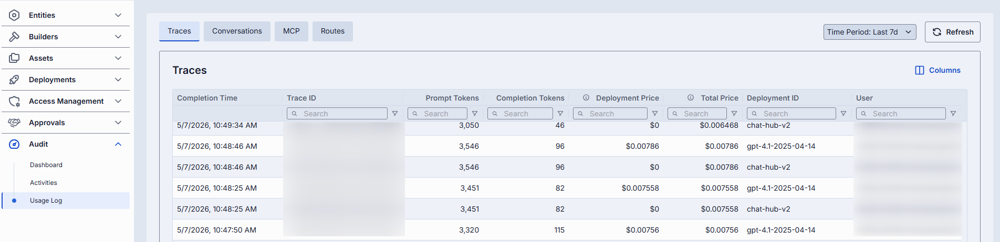
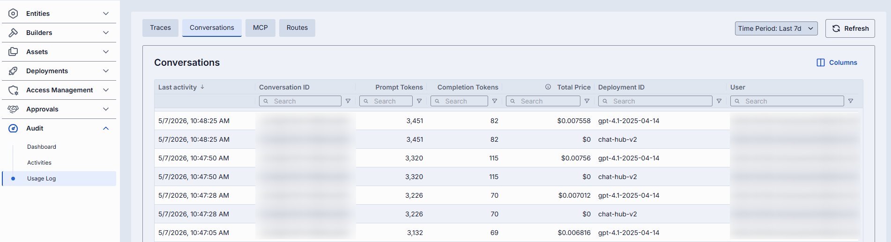
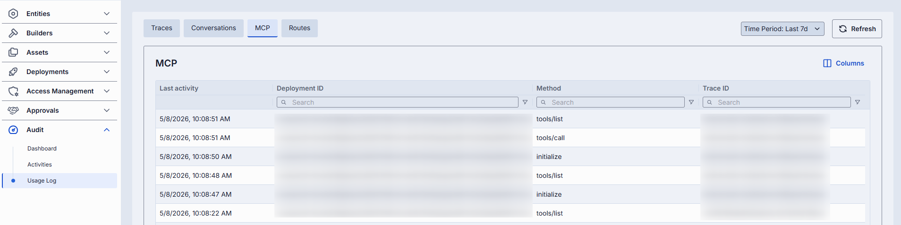
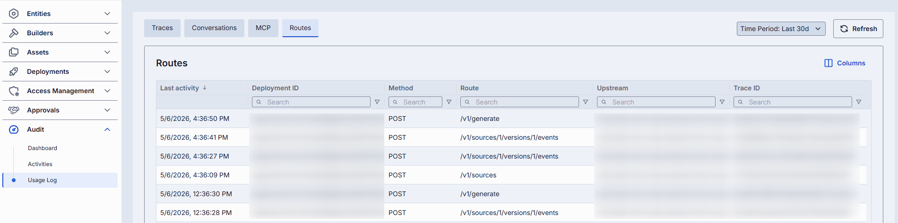

# Usage log

This page explains how to use the **Usage Log** screens in DIAL Admin to inspect detailed, row-level records of every request processed by DIAL Core. You need administrator access to DIAL Admin to perform these tasks.

**Note**
> System-wide dashboards (usage, cost, latency, and activity heatmaps) now live under [Analytics → Dashboards](../14.analytics/1.dashboards.md). Each entity also has its own scoped dashboard in its **Audit** tab (see, for example, the Models [Audit → Dashboard](../2.entities/1.models.md#dashboard)).

For background on observability and system monitoring in DIAL, see [Observability](../../4.operating-dial/6.observability/0.index.md).

---

## Usage log

Navigate to **Audit → Usage Log** to access detailed, row-level records of all requests processed by DIAL Core.

Each request to DIAL Core may trigger a sequence of calls that all share the same **Trace ID**. Each call in the sequence has a unique **Core Span ID**. Together, Trace ID and Core Span ID uniquely identify every request, enabling end-to-end tracing.

For example, a root call from DIAL Chat to DIAL Core might trigger calls to GPT-4, a RAG application, and Gemini—all sharing the same Trace ID:

```text
DIAL Client
  |
  v
DIAL ChatHub
  |
  +--> GPT-4
  |
  +--> DIAL RAG --> Gemini
```

Usage Log offers two complementary views: **Traces** for individual request details and **Conversations** for aggregated conversation-level metrics. There are also dedicated tabs for **MCP** and **Routes** activity.

All Usage Log grids support **column sorting** (click a column header to sort ascending or
descending) and **per-column filters** for all columns. Use the filter icon on any column header
to narrow results by specific values or ranges.

### Top bar controls

| Control | Description |
|---------|-------------|
| **Time Period** | Scopes the table to a specific time range (e.g., last 24 hours, last 7 days, custom range). |
| **Refresh** | Reloads the table with the latest data, applying all active filters. |

### Traces

The Traces tab provides a detailed view of all requests processed by DIAL Core. Each row represents an individual request—whether initiated by an external or internal DIAL client. Use it to investigate specific interactions, troubleshoot issues, or analyze usage patterns.



| Column | Description |
|--------|-------------|
| **Completion Time** | Timestamp when DIAL Core finished processing the request. |
| **Number of request messages** | Chat conversation length (for chat completion requests) or input count (for embedding requests). |
| **Trace ID** | OpenTelemetry trace ID uniquely identifying the root request. All subsequent calls triggered by this request share the same Trace ID. |
| **Core span ID** | OpenTelemetry span ID for this request. |
| **Core span parent ID** | OpenTelemetry span ID of the DIAL Core request that called this request. |
| **Response ID** | Identifier of the response object returned by the AI model. |
| **Conversation ID** | DIAL Chat conversation identifier this request belongs to. |
| **Deployment ID** | Identifier of the DIAL deployment for this request. |
| **Parent Deployment ID** | Identifier of the DIAL parent deployment that triggered this request. |
| **Execution path** | List of DIAL Deployment IDs representing the call stack. For example, `['app1', 'app2', 'model1']` means `app1` called `app2`, which called `model1`. The last element equals the Deployment ID; the penultimate element (when present) equals the Parent Deployment ID. |
| **Prompt tokens** | Total tokens in prompts sent to AI models during this request. |
| **Cached prompt tokens** | Number of prompt tokens served from cache (prompt caching) in this request. |
| **Completion tokens** | Tokens generated by the AI model as output. |
| **Deployment price** | Cost of this specific request, excluding costs of any requests it triggered. |
| **Total price** | Total cost of this request including all related requests it directly or indirectly triggered. Always: Total price ≥ Deployment price. |
| **Model** | Identifier of the underlying AI model used. |
| **Project** | Project ID corresponding to the DIAL API key used for this request. |
| **Upstream** | The upstream endpoint (e.g., the model's completions endpoint). |
| **User** | Unique hash identifying the user who initiated the request. |
| **User title** | Job title of the user (if available). |
| **Topic** | Auto-generated subject summarizing the request. |
| **Language** | Language detected in the request (e.g., `en`). |
| **Reactions** | Indication of user reactions (like/dislike) for this request. |

### Conversations

The Conversations tab aggregates metrics for requests sharing the same Conversation ID. Each row represents a conversation session. Use it to analyze multi-turn dialogues, track user engagement patterns, and monitor resource utilization across entire conversations.



| Column | Description |
|--------|-------------|
| **Last activity** | Timestamp of the most recent request in the conversation. |
| **Conversation ID** | DIAL Chat conversation identifier. |
| **Deployment ID** | Identifier of the DIAL deployment for this conversation. |
| **Prompt tokens** | Total request/prompt tokens sent to the AI model within the conversation. |
| **Cached prompt tokens** | Prompt tokens served from cache within the conversation. |
| **Completion tokens** | Total tokens generated by the AI model in the conversation. |
| **Total price** | Total cost of all requests in the conversation. |
| **Number of request messages** | Conversation length (for chat completion) or input count (for embedding). |
| **Project** | Project ID corresponding to the DIAL API key used. |
| **User** | Unique hash identifying the user who initiated the conversation. |
| **User title** | Job title of the user (if available). |
| **Topic** | Auto-generated subject summarizing the conversation. |
| **Language** | Detected language (e.g., `en`). |

### MCP tab

The MCP tab provides a focused view of MCP-related activity. Each row represents an MCP call. Use it to monitor tool usage, trace individual calls, and analyze integration patterns.



| Column | Description |
|--------|-------------|
| **Last activity** | Timestamp of the most recent MCP call. |
| **Deployment ID** | Deployment name of the DIAL toolset or application corresponding to the call. |
| **Project** | Project ID associated with the call, based on the DIAL API key used. |
| **Tool Name** | Name of the tool invoked. |
| **Trace ID** | OpenTelemetry trace ID uniquely identifying the MCP call sequence. |
| **Method** | Method or operation performed by the MCP tool. |

### Routes tab

The Routes tab provides a focused view of route-related activity. Each row represents a call to a route.



| Column | Description |
|--------|-------------|
| **Last activity** | Timestamp of the most recent route call. |
| **Route** | Name of the route invoked. |
| **Method** | Method or operation performed by the route. |
| **Upstream** | The upstream endpoint called during the route call. |
| **Deployment ID** | The DIAL deployment whose route endpoint was called. |
| **Project** | Project ID associated with the call, based on the DIAL API key used. |
| **Trace ID** | OpenTelemetry trace ID uniquely identifying the route call sequence. |

---

## Next steps

- [Analytics → Dashboards](../14.analytics/1.dashboards.md) — system-wide usage, cost, and latency dashboards
- [Activities and rollback](./1.activity-and-rollback.md) — audit configuration changes and restore previous states
- [Manage API keys](../6.access-management/2.keys.md) — review per-project key usage and set validity periods
- [Manage roles](../6.access-management/1.roles.md) — configure token rate limits and cost limits per role
