# Conversations

This page shows you how to hold and manage conversations in DIAL Chat: send prompts, work with responses and attachments, choose an agent, adjust conversation settings, and organize your history. It is for end users of DIAL Chat. No technical background is required. To share or publish a conversation, see [Sharing and publishing](./6.sharing-and-publishing.md).

In DIAL, a conversation is a dialogue between you and a conversational agent — a language model or an application. Within one conversation you can refer to earlier questions and answers, but different conversations do not share context.

**Note**
> All your conversations are stored on the server, so you can access them from any device.

## The chat area

The chat occupies the central part of the main screen. Here you enter messages, see replies, and run supported tasks based on the agent and conversation settings.

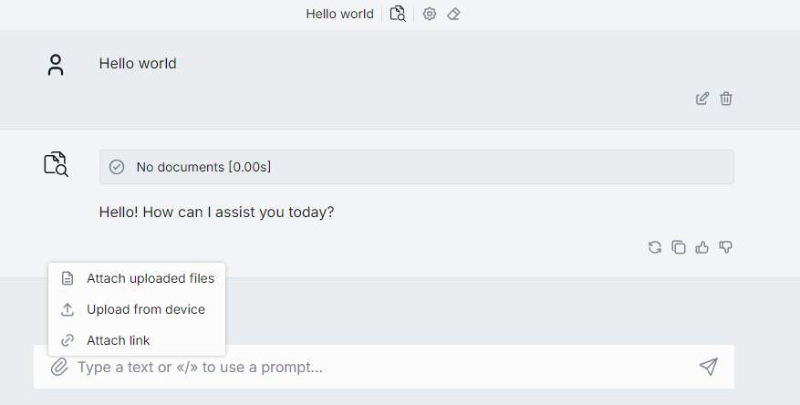

## Work with prompts in a conversation

### Enter a prompt

Enter your prompt in the text box. In [Settings](./7.settings.md), you can configure the keyboard combination that sends the message.

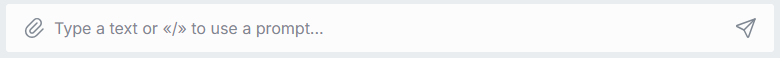

You can type a prompt manually or reuse a saved one. Type `/` in the chat box to select an available prompt. You can also use a saved prompt from the [Prompts](./2.prompts.md) panel to populate the box or to enter prompt variables.

### Edit, delete, and template messages

During a conversation, several tools help you work with your messages.

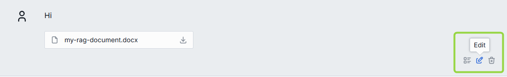

- **Edit** — edit a message in the ongoing conversation. You can also edit attached files using drag-and-drop, Ctrl+V, or the Attachments Manager. After you edit a message, the response is regenerated and all messages after the edited one are deleted.

  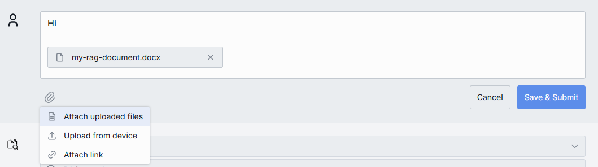

- **Delete** — delete a message in the ongoing conversation. The corresponding response is deleted too.
- **Set message template** — turn any message into a template for a [parameterized conversation](#parameterized-replay).

## Work with responses

### Copy a response

You can copy answers to reuse them elsewhere, as plain text or in Markdown.

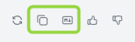

**Tip**
> You can set how responses render in conversation settings — see [Response format](#response-format).

### Stop and regenerate

While a response is being generated, click the **Stop** icon in the text box to stop it.

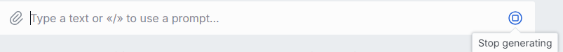

After stopping, you can regenerate the response.

**Warning**
> If you hit a server error or stop generation and receive an empty response, the **Send** button is disabled. Generate the answer again to continue. With a partial response (text plus an error), a model can still continue, but for applications you must generate the response again.

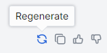

### Like or dislike a response

You can like and dislike responses. Use likes to highlight valuable responses and dislikes to mark responses you find unhelpful or incorrect.

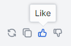

For a dislike, you are prompted to enter a comment.

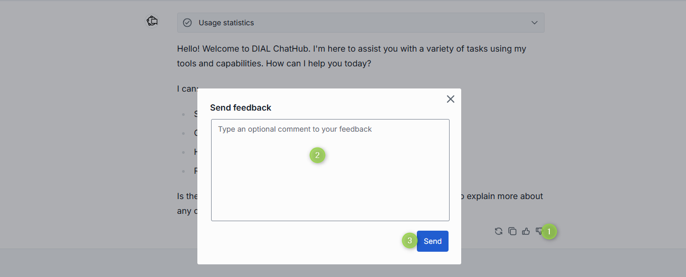

## Work with attachments

Some models and applications (for example, DIAL RAG) support attachments — files, links, and folders. When supported, an **Attachments** icon appears in the chat box. Click it to upload a file or select an already-uploaded one. You can also drag-and-drop files or use Ctrl+V.

**Note**
> Attached files are available in [Files](./5.files.md).

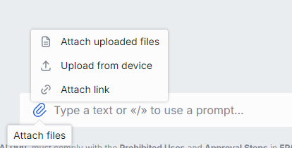

### Attach a folder

If the agent supports it, click the attachment icon and select **Attach folders**.

**Note**
> You can attach only folders that already exist in [Files](./5.files.md). You cannot upload folders from an external source.

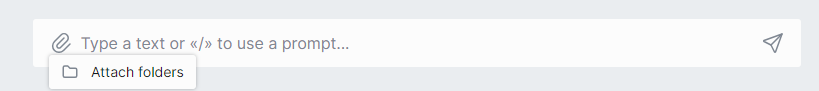

In the dialog, select the checkbox for the folder you want to attach. It then appears in the chat box and becomes available to the application.

### Attach a link

If the agent supports it, attach a link to use it when generating responses:

1. Click the attachment icon and select **Attach link**.

   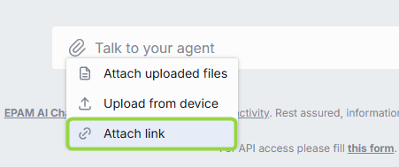

2. Enter a valid URL and click **Attach**. The link appears as an attachment in the chat box.

   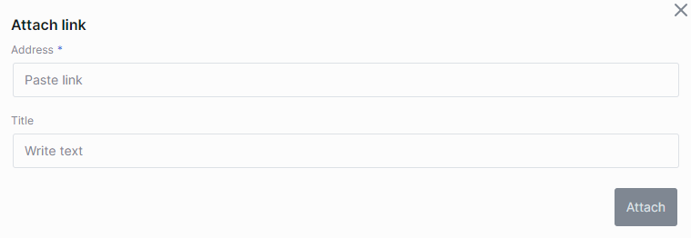

### Attach files

If the agent supports it, click the attachment icon and select **Attach uploaded files** or **Upload from device**. You can also drag-and-drop files or paste them with Ctrl+V.

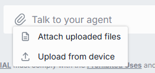

- **Attach uploaded files** — select files you have already uploaded in [Files](./5.files.md).
- **Upload from device** — select files to upload. Uploaded files appear in [Files](./5.files.md).

The files appear as attachments in the chat box and become available to the application.

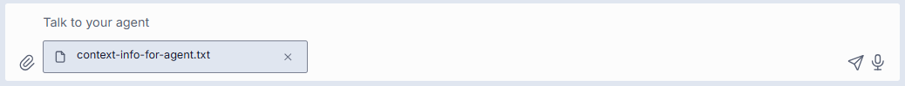

### View or download attachments

On attachments returned in AI-generated responses, you can:

- **Download** — click the **Download** icon to save the attachment to your device.
- **Preview** — click the **Down arrow** icon to preview the attachment inline.
- **Full screen** — click the **Expand** icon to view graphics full screen.

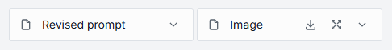

## Choose and change the agent

In DIAL Chat you converse with agents: [language models and applications](./3.marketplace-and-apps.md). You find available agents in [DIAL Marketplace](./3.marketplace-and-apps.md) and add them to your workspace.

By default, the main window shows the last agent you used. You can keep using it or change it before or during a conversation:

- **Before a conversation** — click **Change agent** to open the **Select an agent for conversation** window, then choose an added agent or go to My workspace.

  

- **During a conversation** — click the agent icon in the header to view the current agent and change it.

  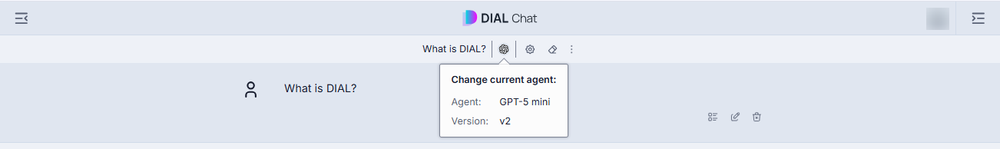

**Tip**
> You can set a **default agent** to start conversations with in your [Settings](./7.settings.md).

## Conversation settings

**Note**
> Conversation settings vary by agent. Some agents have no configurable settings.

Depending on the selected agent, conversation settings can include:

- [System prompt](#system-prompt)
- [Temperature](#temperature)
- [Response format](#response-format)

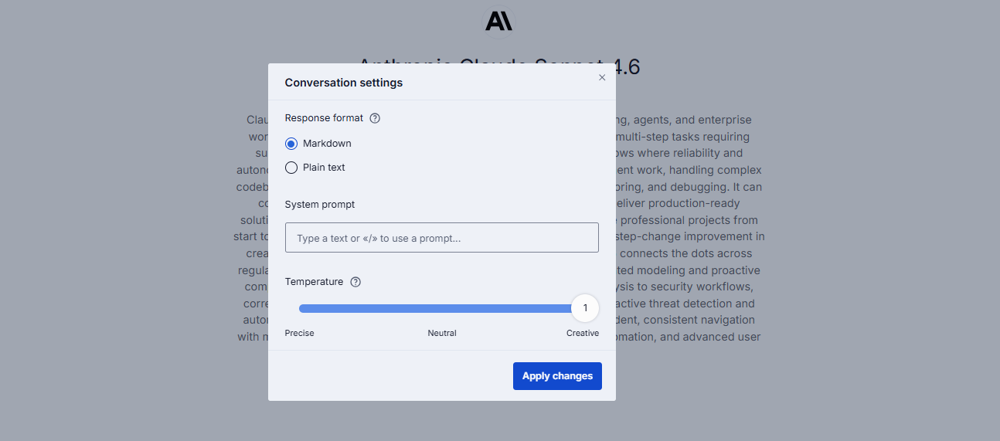

You can change conversation settings before or during a conversation:

- **Before** a new conversation, click **Configure settings** in the main chat area to open the **Conversation settings** window.

  

- **During** a conversation, click the **gear** icon in the header.

From the conversation header menu you can also:

- View and change the current agent by clicking the agent icon.
- Open the conversation actions menu by clicking the three-dot icon.
- Clear the conversation history by clicking the eraser icon.

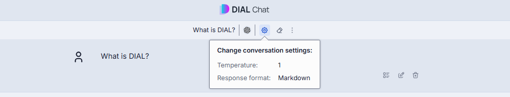

### System prompt

**Note**
> Some language models do not support a system prompt. In that case it is disabled.

The system prompt is the initial set of instructions you give the model. It guides the model to stay aligned with the intended purpose and outcome of the conversation.

Type `/` in the text box to select a previously created prompt as a system prompt — see [Create a prompt](./2.prompts.md) — and it sets the context and tone for the whole conversation.

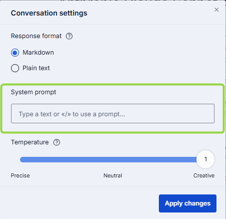

### Temperature

Temperature controls the creativity and randomness of the model's output. A higher temperature (for example, 1.0) makes output more diverse and creative; a lower temperature (for example, 0.1) makes it more focused and deterministic.

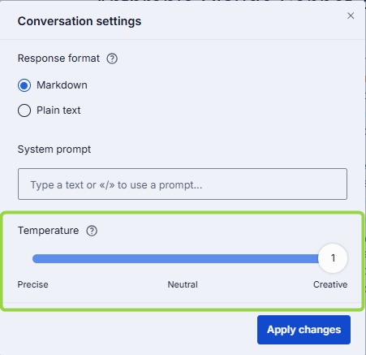

### Response format

Choose whether the agent's response renders as plain text or Markdown.

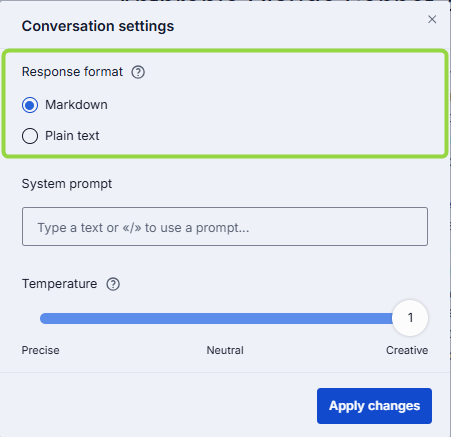

## The conversation actions menu

Click the **...** icon to open a conversation's actions menu.

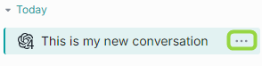

**Note**
> Available actions vary by conversation. For example, **Unpublish** is unavailable if the conversation has not been published.

The supported actions are:

- **Select** — select conversations to delete. See [Select conversations to delete](#select-conversations-to-delete).
- **Rename** — rename a conversation. See [Rename a conversation](#rename-a-conversation).
- **Compare** — compare conversations with different settings. See [Compare](#compare).
- **Duplicate** — duplicate a shared conversation. See [Duplicate](#duplicate).
- **Replay** — reproduce a conversation with different settings. See [Replay](#replay).
- **Playback** — replay the conversation without calling models. See [Playback](#playback).
- **Export** — export a conversation. See [Export](#export).
- **Move to** — relocate conversations into folders. See [Organize conversations into folders](#organize-conversations-into-folders).
- **Share**, **Remove access**, **Unshare**, **Publish**, **Unpublish** — see [Sharing and publishing](./6.sharing-and-publishing.md).
- **Info** — view conversation metadata. See [Info](#info).
- **Delete** — delete a single conversation. See [Delete](#delete).

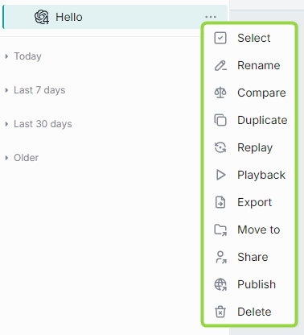

## Organize conversations into folders

To create a folder, click the folder icon in the bottom menu.

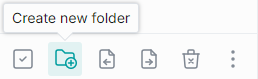

You can also create a folder or move a conversation from the **Move to** menu. New folders appear in the **Pinned conversations** tab.

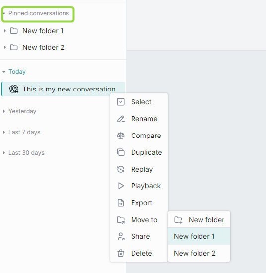

You can nest folders up to three levels. Create a folder and drag it into another to nest it. Drag a conversation into a folder, or use **Move to**, to move it to a parent folder.

**Note**
> Empty folders are deleted after you refresh the page.

**Naming conventions**

> These symbols are not allowed in folder or conversation names and are removed: tab, `"`, `:`, `;`, `/`, `\`, `,`, `=`, `{`, `}`, `%`, `&`. You can use `.` at the start or inside a name, but a trailing dot is removed. Names are limited to 160 characters; anything beyond is cut off.

## Search and filter

Use the **Search** box to find conversations by name. If you have shared conversations, apply the **Shared by me** filter to list them.

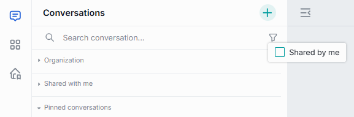

## Create a conversation

There are several ways to start a conversation with an [agent](#choose-and-change-the-agent):

- Start typing in the chat box to talk to the current agent (by default, the last one you used).
- In My workspace or Marketplace, select an agent and click **Use** to start. See [Marketplace and apps](./3.marketplace-and-apps.md).
- On the main screen, click the **Plus** icon to select an agent and start.
- Use an application's starter buttons to choose a starting prompt. See [Custom buttons in apps](../3.building-with-dial/1.apps/5.custom-apps/4.custom-buttons.md).

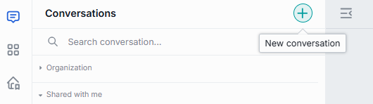

**Note**
> New conversations appear in the conversations panel on the left. If you start a conversation and close it while it is still empty, it is neither displayed nor saved.

## Rename a conversation

A new conversation is named automatically after the first line of your first prompt, up to 160 characters. You can rename it afterward.

1. Click **Rename** in the conversation's menu.
2. Enter a new name and submit.

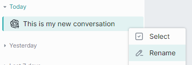

The same naming conventions as folders apply.

## Duplicate

Duplicate a conversation that was shared with you so you can change it. Click **Duplicate** in the menu.

**Note**
> This is available only for conversations shared with you.

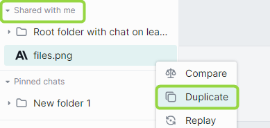

## Export

You can export conversations. If a conversation has attachments, export it with or without them. You can also export all conversations at once, without attachments, as JSON.

**Note**
> Exported files are named with the prefix `epam_ai_dial_chat`, then `with_attachments` if applicable, then `month_day`. The naming pattern is configurable in the chat config.

- **Single conversation with attachments** — in the conversation menu, point to **Export** and click **With attachments**. The conversation is exported as a ZIP archive named `file_name.dial`.

  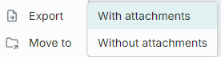

- **Single conversation without attachments** — point to **Export** and click **Without attachments**. The conversation is exported as a JSON file.

  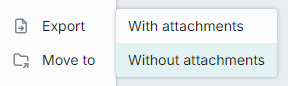

- **All conversations** — click the **Export conversations** icon at the bottom of the left panel. Conversations are exported without attachments.

  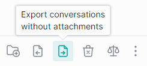

## Import

To import a JSON conversation or a ZIP archive of several conversations (which can include attachments), click the **Import conversations** icon at the bottom of the left panel and select the file.

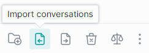

When you import a conversation with attachments, the attachments appear in the parent of the root folder in [Files](./5.files.md).

When importing a duplicate of an existing conversation, choose one option for the conversation and each attachment:

- **Replace** — replace the original.
- **Ignore** — do nothing.
- **Postfix** — add a postfix to the imported item, for example `my-conversation 1`.

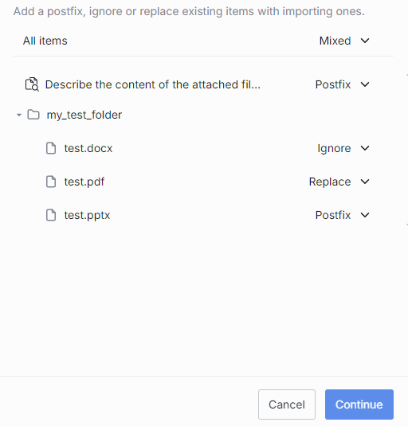

## Info

Click **Info** in the conversation menu to view metadata: the update date and the creation date.

## Delete

You can delete a single conversation, selected conversations, or all conversations.

- **Single** — in the conversation menu, select **Delete** and confirm.
- **All** — click the **Delete all conversations** icon at the bottom of the left panel.

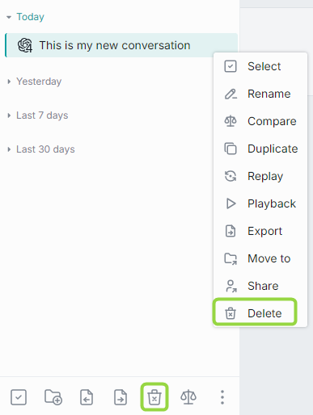

## Select conversations to delete

You can use selection mode to choose conversations to delete:

- Click **Select all** in the bottom panel to preselect all conversations, then unselect the ones to keep. Click **Unselect all** to clear the selection.

  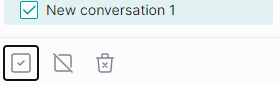

- Click **Select** in a conversation's menu to enter selection mode, then use the checkboxes. Click **Unselect all** to clear the selection.

  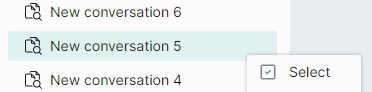

## Replay

Use **Replay** to reproduce a conversation with different settings — for example, a different model. A replayed conversation lets you compare responses to the same questions across models and settings.

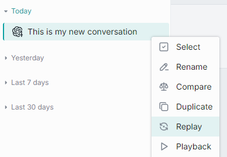

Use **Replay as is** to reproduce the conversation with its original settings. Find it by clicking **Change agent** or the agent icon in the header.

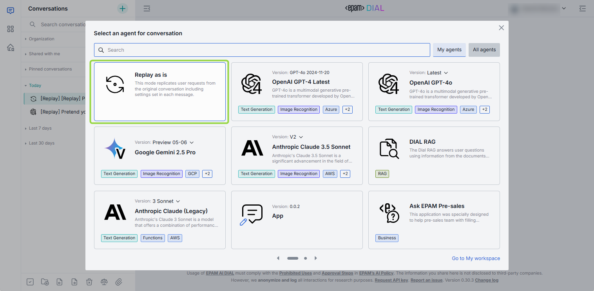

**To replay a conversation:**

1. Click **Replay** in the conversation menu.
2. Click **Start replay**.
3. During replay, use **Stop generating** and **Continue replay** in the text box to pause and resume.

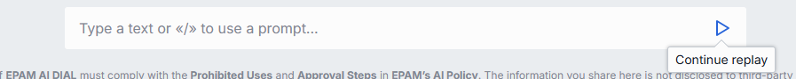

The replayed conversation appears as a new conversation with the `[Replay]` tag.

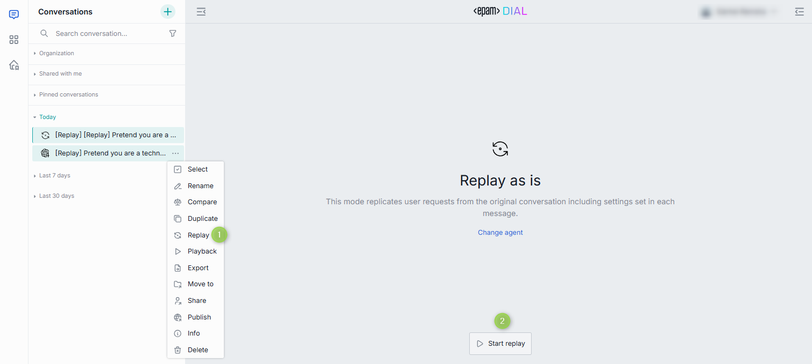

## Parameterized replay

Parameterized replay lets you build chats with custom variables and share them with your team. Others can follow the same conversation but supply their own values for a personalized experience.

### Prompt-based

You can create a parameterized conversation using a prompt with variables.

1. [Create a prompt](./2.prompts.md) with [variables](./2.prompts.md), using `{{VariableName|DefaultValue}}` or `{{VariableName}}`. For example: `I'd like to travel to {{country|Japan}}. Could you please suggest {{num-attractions|10}} of the best attractions? I will be there for {{num-days}}. Thank you.`
2. Type `/` in the chat box and select your prompt. Enter values for the variables and click **Submit**, then send the message.
3. The chat returns its response.
4. Click **Replay** to repeat the dialogue with different inputs.
5. [Share](./6.sharing-and-publishing.md) the conversation. Recipients are prompted to fill in their own values.

### Dynamic

You can create a parameterized conversation from any message, with no pre-configured prompt.

1. Use **Set message template** on a message to open the **Message template** window.

   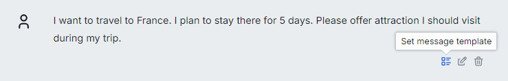

2. Under **Set template**, replace parts of the message with variables. Copy a segment into the first box, then define a variable in the second box using `{{Variable name}}`. In this example, "France" is replaced with `{{Country}}`.

   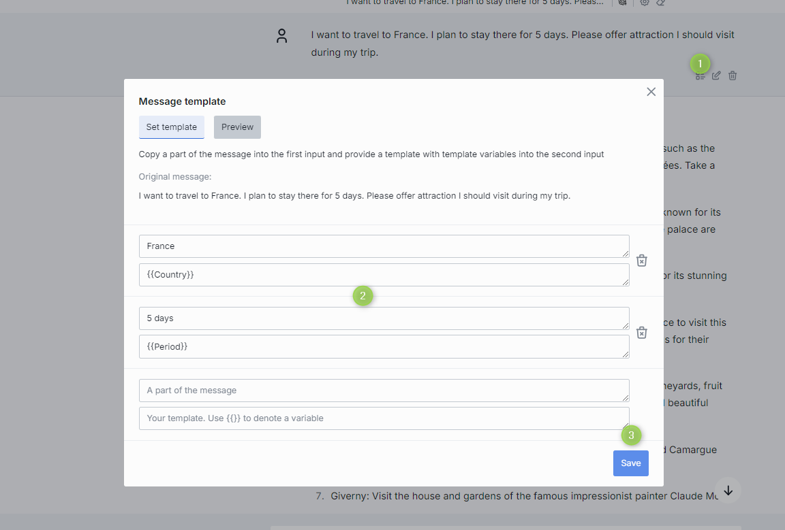

   The **Preview** tab shows the message with variables.

   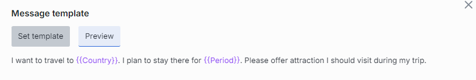

3. Save, return to the conversation, and select **Replay** to start it. The chat prompts you for variable values. Use **Replay as is** to keep the original model, or change the settings to experiment.
4. [Share](./6.sharing-and-publishing.md) the conversation so others can supply their own inputs.

## Playback

Playback mode replays the current conversation without calling any models. It reproduces the conversation like a recording.

**Note**
> This differs from [Replay](#replay), where prompts are resent to the model and the outcome may differ. Playback support in schema-rich applications can be toggled in the application's JSON schema with the `dial:applicationTypePlaybackSupport` property.

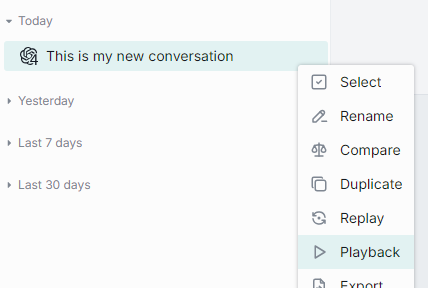

During playback you can rewind, fast forward, or stop.

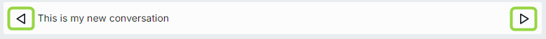

## Compare

Use Compare mode to compare two new — or two existing — conversations with different settings, such as different models or temperatures.

**To compare two new conversations:**

1. Click the **Compare** icon in the bottom menu of the left panel.
2. Click **Configure settings** for each conversation to set its options.
3. Type your prompt in the chat box to begin.

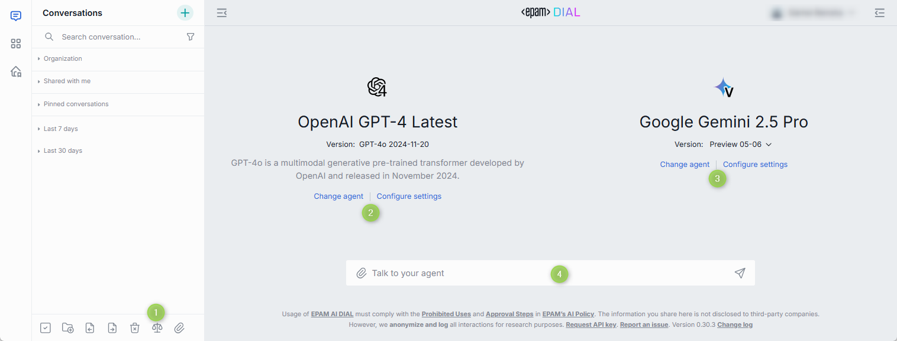

DIAL Chat creates two new conversations with the same name plus numbers. If the models differ, the icons differ accordingly.

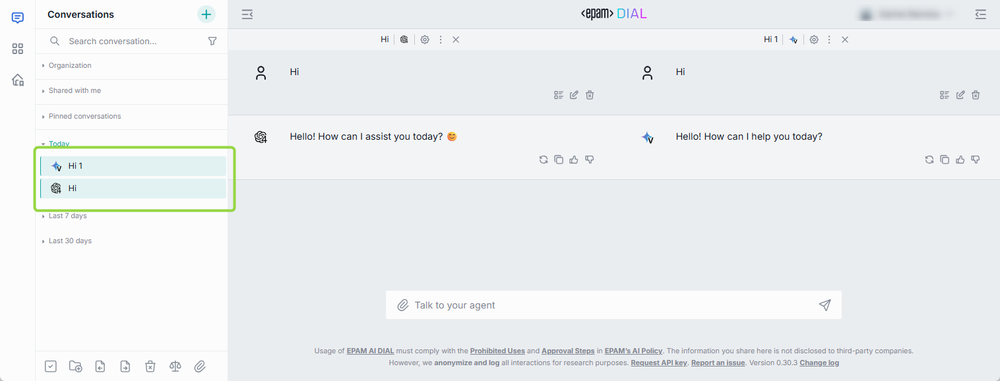

**To compare two existing conversations:**

**Note**
> Compare works only with conversations that have the same number of user prompts.

1. In a conversation's menu, select **Compare**.
2. Under **Select conversation to compare with**, choose the second conversation.
3. By default, only conversations with the same name appear. Select **Show all conversations** for the full list.
4. Type your prompt in the chat box.

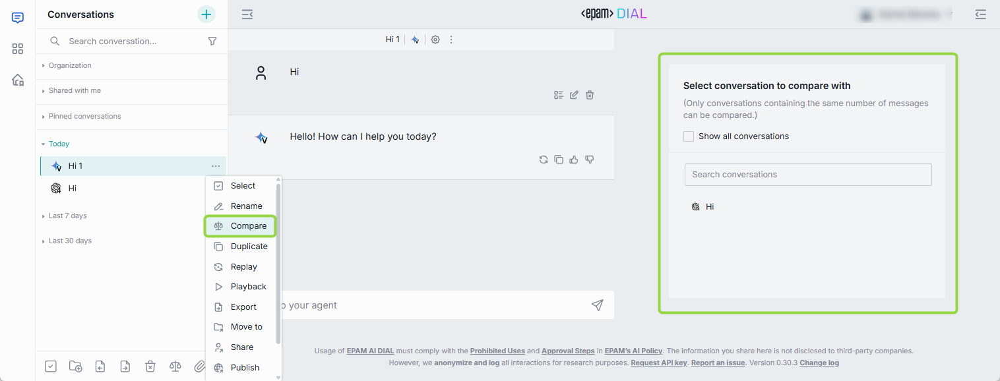

## Next steps

- [Sharing and publishing](./6.sharing-and-publishing.md) — share a conversation or publish it to your organization
- [Prompts](./2.prompts.md) — save reusable prompt templates with variables
- [Marketplace and apps](./3.marketplace-and-apps.md) — find and add agents to your workspace
