# Marketplace and apps

This page shows you how to discover agents in DIAL Marketplace and manage them in My workspace: add and use models and applications, build apps with the no-code and low-code wizards, and connect to agents. It is for end users of DIAL Chat. No technical background is required. To share or publish an app, see [Sharing and publishing](./6.sharing-and-publishing.md).

## DIAL Marketplace

DIAL Marketplace is the single entry point for all applications, agents, tools, and models available to you, based on your roles and permissions.

**Note**
> Access to agents is governed by your role. See [Authentication and access control](../2.understand-dial/4.security-and-governance/1.authentication-and-access-control.md).

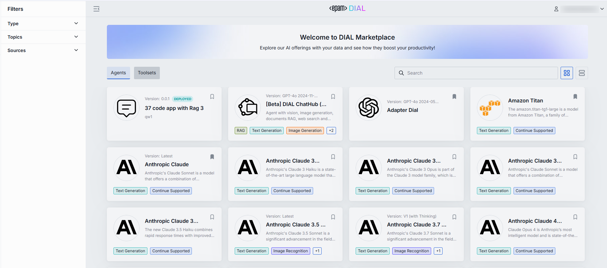

### Navigate the Marketplace

Open the Marketplace from the main DIAL Chat screen.

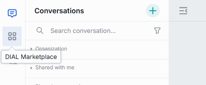

From the Marketplace, click **Chat** to return to the main chat screen.

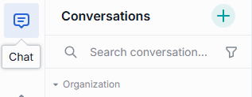

From the Marketplace, you can also go to your workspace.

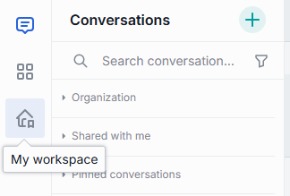

### Filters and views

- **Type** — filter by conversational agents and AI models, or show all. By default, all agents are shown.
- **Topics** — refine by the topic that describes an agent's area of application.
- **Source** — filter by source, such as agents shared with you or only published agents.
- **Search** — locate any item by name.
- **View toggle** — switch between table and card views.

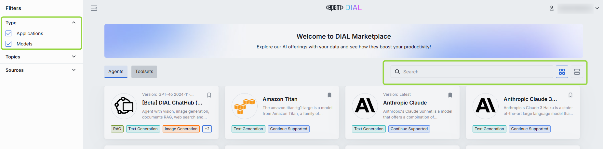

### Add an agent to My workspace

In the Marketplace, view any agent or toolset and add it to [My workspace](#my-workspace) with the bookmark icon on its card.

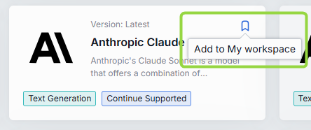

You can also add an agent by starting a conversation with it. For a model:

1. Select a model in the Marketplace.
2. Click **Use model** to return to the main chat screen with that model preselected.

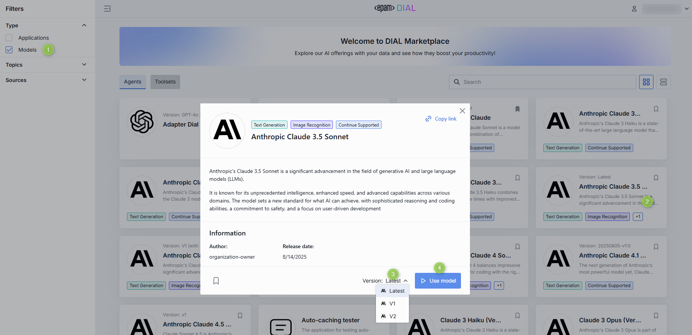

**Note**
> If you start a conversation and then remove its agent from My workspace, you must add the agent back to continue. A call-to-action button appears in place of the chat box — click it to restore the agent and resume.

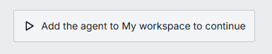

## My workspace

In **My workspace**, you access and manage every agent and toolset you have created or added from the Marketplace. Here you also open the wizards to build applications and add [Tool Sets](./4.tool-sets.md).

### Models

You can add AI models to your workspace from the Marketplace for convenience.

**Note**
> See [Supported providers](../3.building-with-dial/3.adapters/2.supported-providers.md) for the models supported in DIAL.

**Talk to a model**

1. Click a model.
2. Click **Use model** to start a conversation on the main screen.

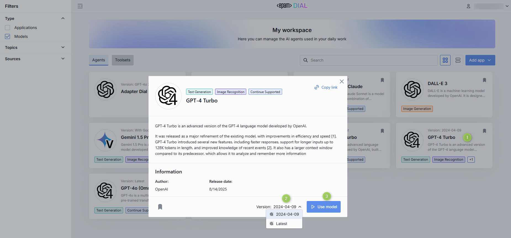

You can also use AI models as tools in [Quick Apps 2.0](#quick-apps-20).

**Remove a model**

Remove a model from your workspace at any time with the bookmark button on its card.

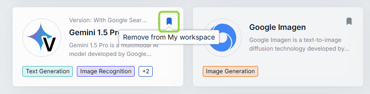

**Model link**

For models available organization-wide, copy a link that takes users straight to the model's card in the Marketplace.

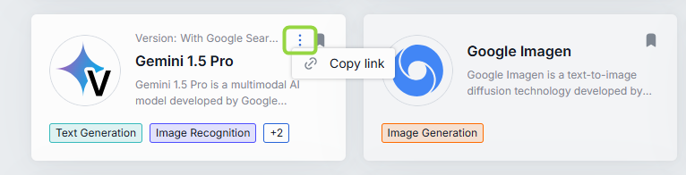

### Applications

In your workspace you access applications you bookmarked in the Marketplace and add your own with the application wizards.

#### Application types

DIAL is an application server for developing, deploying, hosting, and managing different types of GenAI applications. It supports applications built on DIAL as well as non-conversational apps built with other technologies.

**Note**
> See the [DIAL Apps overview](../3.building-with-dial/1.apps/0.index.md) for in-depth information about applications and application types.

Applications that follow the DIAL Unified protocol are DIAL-native apps, and the standard chat interface is designed for them. Your environment can also include non-conversational apps with custom interfaces that override the standard chat interface; those are out of scope here.

The DIAL SaaS edition includes several predefined application types — Quick Apps, Code Apps, and Mind Maps — that provide no-code and low-code wizards for building applications. Self-hosted setups can add custom application types with fully custom interfaces, which are out of scope here.

#### Use an application

1. Click an application.
2. Click **Use application** to start interacting with it on the main screen.

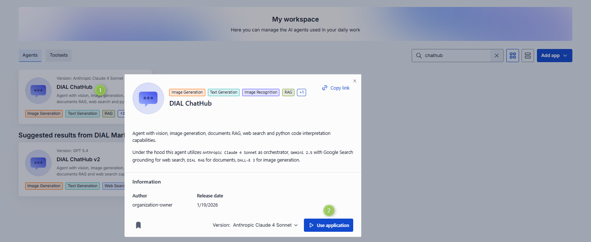

You can also use DIAL apps as tools in [Quick Apps 2.0](#quick-apps-20).

#### Application Builder

My workspace includes no-code and low-code application builders (also called wizards or editors) for the predefined application types. Use them to configure, test, host, and deploy new applications. The builder interface varies by application type.

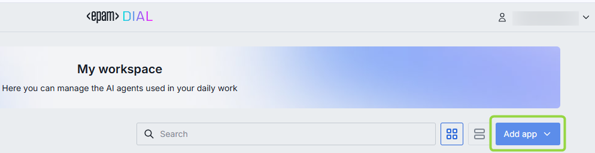

#### Quick Apps

Quick Apps is a no-code orchestrator, conceptually similar to OpenAI's GPTs, that simplifies building multi-agent workflows. You combine AI agents, MCP toolsets, REST APIs, language models, and other DIAL building blocks into an application.

For example, you can build an app with a toolset that calls an external API for a real-time weather forecast, or a RAG-like application that answers from predefined sources.

**Note**
> See the [Quick Apps overview](../3.building-with-dial/1.apps/2.quick-apps/0.index.md) for configuration and deployment guidance for developers.

**Add a Quick App:**

1. In My workspace, click **Add app** and select **Quick App** to open the Application Builder for Quick Apps.
2. Specify the application's parameters. See the form below.
3. Test your solution in the preview screen.
4. Click **Save and exit** to register the application in DIAL.

**Note**
> Your Quick App appears only in My workspace. To let others use it, [share or publish](./6.sharing-and-publishing.md) it.

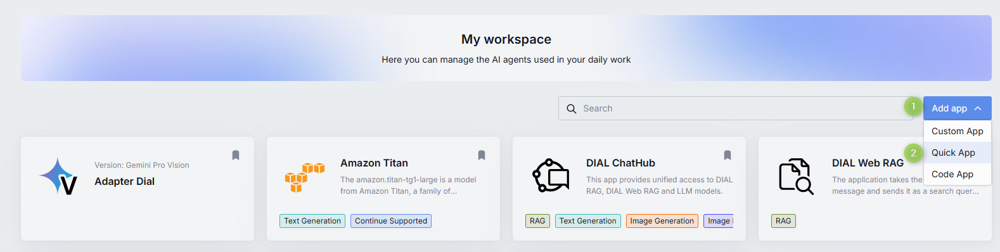

| Field | Required | Description |
|--------|:-------:|-------------|
| Name | Yes | Quick App name. |
| Version | Yes | Version in `x.y.z` format, numbers and dots only. |
| Icon | No | The icon rendered in the chat interface for this Quick App. |
| Description | No | A short description rendered in the chat interface. Add two line breaks to provide more detail. |
| Topics | No | Assign a predefined topic. Topics and their styles are defined in [DIAL Chat Themes](https://github.com/epam/ai-dial-chat-themes/blob/development/static/config.json). |
| Document relative URLs | No | If the toolset queries documents to generate responses, select the documents in [Files](./5.files.md). |
| Model | Yes | A language model that replies to prompts and orchestrates agent actions. |
| Configure toolset | No | Valid JSON with a toolset configuration. See the [Quick Apps overview](../3.building-with-dial/1.apps/2.quick-apps/0.index.md). |
| Instructions | No | Instructions for the language model. |
| Temperature | Yes | Controls the creativity and randomness of the model's output. |

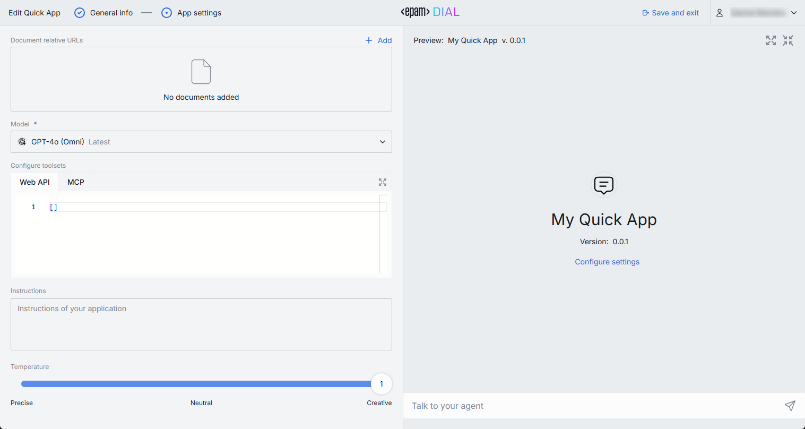

#### Quick Apps 2.0

Quick Apps 2.0 is a composer for building applications from reusable components. It assembles applications from DIAL agents (apps and AI models) and external integrations (MCP servers), with any AI model registered in DIAL Core acting as the orchestrator.

**Add a Quick App 2.0:**

1. In My workspace, click **Add app** and select **Quick App 2.0** to open the editor.
2. Specify the application's parameters. See the forms below.
3. Test your solution in the preview screen.
4. Click **Save and exit** to register the application in DIAL.

**Note**
> Your Quick App 2.0 appears only in My workspace. To let others use it, [share or publish](./6.sharing-and-publishing.md) it.

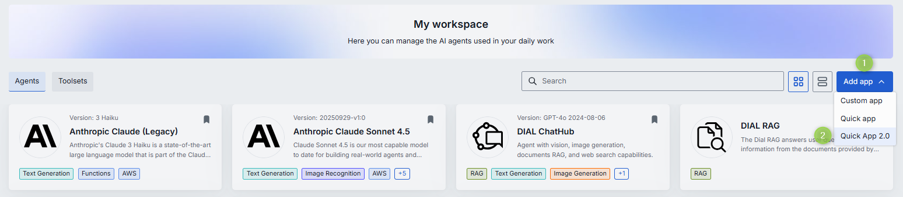

**General Info**

| Field | Required | Description |
|-------|:--------:|-------------|
| Name | Yes | Application name shown in the interface. |
| Version | Yes | Version in `x.y.z` format, numbers and dots only. |
| Icon | No | The icon rendered in the chat interface and Marketplace. Use the [files manager](./5.files.md) to select or upload one. |
| Description | No | A short description rendered in the chat interface and Marketplace. Add two line breaks to provide more detail. |
| Topics | No | Assign a predefined topic. Topics and their styles are defined in [DIAL Chat Themes](https://github.com/epam/ai-dial-chat-themes/blob/development/static/config.json). |

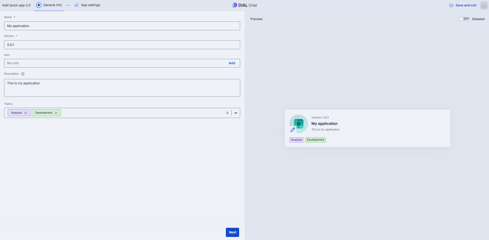

**App Settings — Orchestrator**

Define the language model that drives the agent: it picks tools, calls them, and composes the final answer.

| Field | Required | Description |
|-------|:--------:|-------------|
| Model | Yes | A language model that can work with toolsets, used to reply to prompts and orchestrate agents. |
| Instructions | No | Instructions for the orchestration model. |
| Temperature | No | Controls the creativity and randomness of the model's output. |

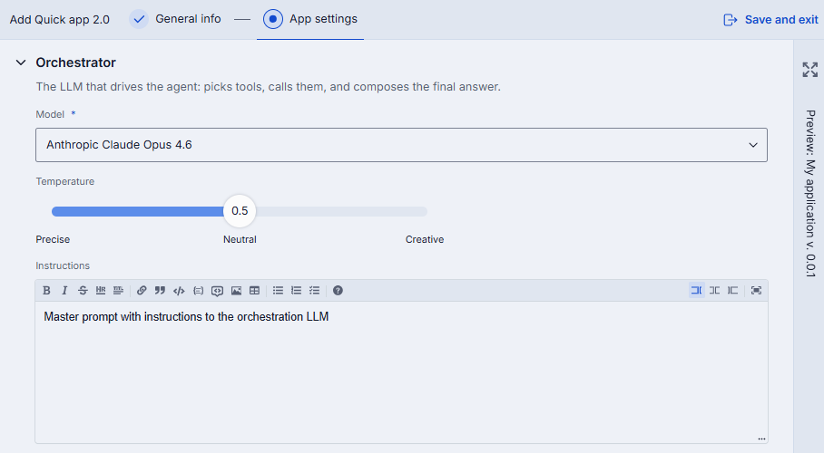

**App Settings — Context and Tools**

Define the knowledge and capabilities available to the agent: context files, toolsets, and code execution.

| Field | Required | Description |
|-------|:--------:|-------------|
| Agents and Toolsets | No | Add [Tool Sets](./4.tool-sets.md), [apps](#applications), or [AI models](#models) to use as agents. Advanced users can use the JSON editor. Hover to see details and state; click to access actions such as deploy/undeploy or login/logout. Make sure you are logged in to any toolset that requires authentication. |
| Context files | No | Add files the agents use to generate responses, such as documents and datasets. Agents decide which files to use and how to route them. |
| Code Interpreter | No | Enable to use a code interpreter agent that runs or analyzes Python code in a controlled environment and generates visualizations in the conversation. |

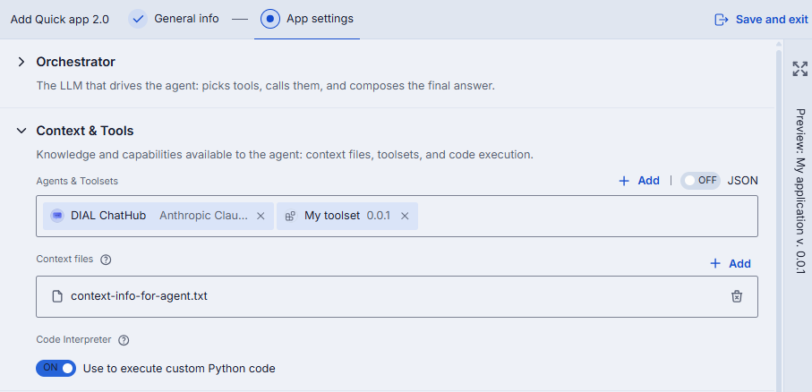

**App Settings — User Attachments**

Define rules for files end users can upload during a conversation.

| Field | Required | Description |
|-------|:--------:|-------------|
| Attachment types | No | Allowed attachment types per the [MIME standard](https://developer.mozilla.org/en-US/docs/Web/HTTP/Basics_of_HTTP/MIME_types/Common_types), for example `image/png`. Enter `*/*` to allow all types. |
| Max. attachments number | No | The maximum number of attachments allowed. Leave blank for the maximum integer. Enter `0` to disable attachments. |

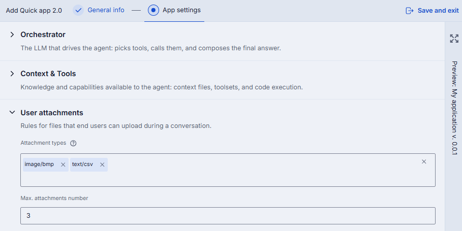

**App Settings — Conversation Starters**

Define buttons near the chat input that suggest example prompts.

**Note**
> See [Custom buttons in apps](../3.building-with-dial/1.apps/5.custom-apps/4.custom-buttons.md) to learn more.

| Field | Required | Description |
|-------|:--------:|-------------|
| Button title | Yes | The text shown on the conversation starter button. |
| Prompt to send in chat | Yes | The prompt sent when the button is clicked. |
| Intro text | No | Text shown above the starter buttons. |
| Starters behavior | Yes | **Immediately send prompt** sends the prompt on click. **Populate prompt in the chat input** fills the input so users can edit it before sending. |
| Disable chat input | No | Toggle to disable the chat input so users can only use starters. |

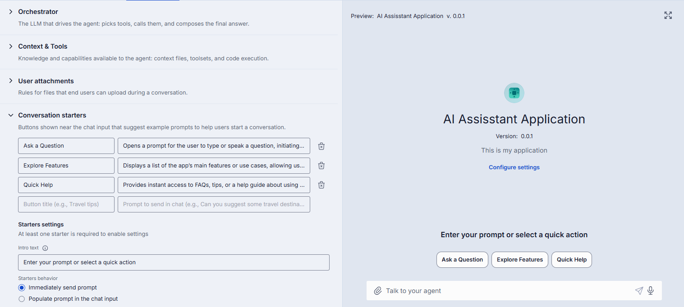

#### Code Apps

DIAL Code Apps let you develop, deploy, and run Python applications directly in the DIAL interface — useful for quickly building a proof of concept, deploying it, and sharing it with a selected audience.

In the Application Builder for Code Apps you can:

- Create and customize Code Apps in the built-in Python editor.
- Deploy Code Apps without managing hosting or scalability.
- Implement the endpoints required for DIAL compatibility.
- Manage environment variables.
- Edit and publish Code Apps.

Limitations and security restrictions:

- Code Apps are deployed and maintained exclusively by the DIAL platform, similar to cloud lambda functions.
- Code Apps have no internet access.
- Code Apps have no state outside DIAL APIs.
- You can use only Python libraries, databases, and models supported by DIAL.
- Code Apps cannot call each other or external endpoints, except DIAL Core if allowed.
- All traffic is encrypted, and Code Apps run in an isolated network.

**Add a Code App:**

**Note**
> Adding Code Apps can be disabled for some user roles. If it is unavailable, contact your administrator.

1. In My workspace, click **Add app** and select **Code App** to open the Application Builder.
2. Specify the application's parameters. See the form below.
3. Deploy and test your solution in the preview screen.
4. Click **Save and exit** to register the application in DIAL.

**Note**
> Your Code App appears only in My workspace. To let others use it, [share or publish](./6.sharing-and-publishing.md) it.

**Deploy a Code App**

A Code App must be deployed before use. App owners, administrators, and users with editing rights can deploy, undeploy, and redeploy.

1. Select a Code App and open its menu.
2. Click **Deploy**.
3. When deployed, you get a notification and the status icon turns from yellow to green — this can take a few minutes.

   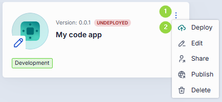

4. Select the deployed app and click **Use application** to launch it.

You can also deploy a Code App when you add it as a tool for [Quick Apps 2.0](#quick-apps-20).

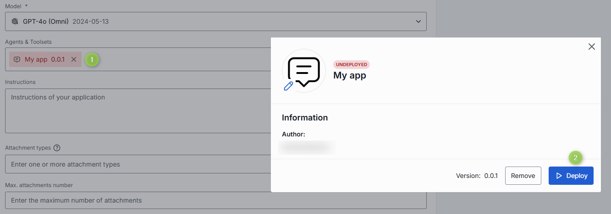

**Undeploy a Code App**

Undeploy a Code App to withdraw it from use or to make changes. To apply changes with less downtime, use redeploy.

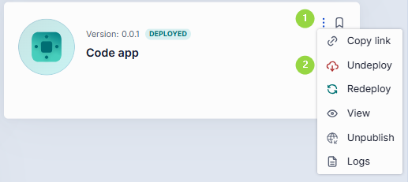

**Redeploy a Code App**

Use **Redeploy** in the menu or the builder to apply changes to a deployed app without the downtime of undeploy and deploy.

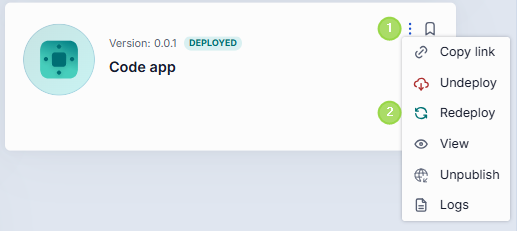

**Edit a Code App**

If you are the owner or have editing rights, you can modify the source code or the form parameters.

**Note**
> Changes apply on the next deployment. To change anything except the name and version, make changes and redeploy. To change the name or version, undeploy, make changes, then deploy. You cannot modify the name and version of apps shared with you.

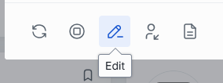

| Field | Required | Description |
|-------|:--------:|-------------|
| Name | Yes | Code App name. |
| Version | Yes | Version in `x.y.z` format, numbers and dots only. |
| Icon | No | The icon rendered in the chat interface and Marketplace. |
| Topics | No | Assign a predefined topic. Topics and their styles are defined in [DIAL Chat Themes](https://github.com/epam/ai-dial-chat-themes/blob/development/static/config.json). |
| Description | No | A short description rendered in the chat interface and Marketplace. |
| Attachment types | No | Allowed attachment types per the [MIME standard](https://developer.mozilla.org/en-US/docs/Web/HTTP/Basics_of_HTTP/MIME_types/Common_types). Enter `*/*` to allow all types. |
| Max. attachments number | No | The maximum number of attachments allowed. Leave blank for the maximum integer. Enter `0` to disable attachments. |
| Select folder with source files | Yes | Defines the file structure and opens the built-in Python editor, where you write your app or upload source files. |
| Runtime version | Yes | The environment in which the Python code runs. |
| Endpoints | Yes | A Code App must expose a chat completion endpoint. You can also add rate and configuration endpoints. Code Apps cannot call each other or external endpoints, except DIAL Core if allowed. |
| Environment variables | No | Environment variables used by the application. |

**Access Code App logs**

1. Click **Logs** on the deployed Code App.

   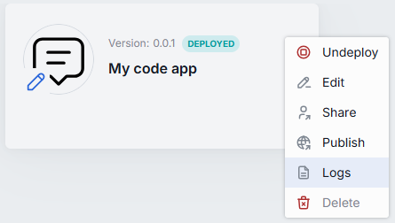

2. In the dialog, view, refresh, and download the log file.

   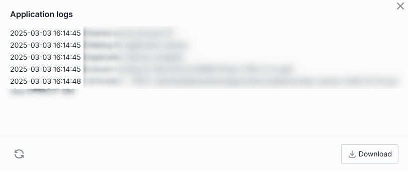

#### Mind Maps

A Mind Map gives users an interactive knowledge graph they navigate with natural language. The application pulls data from sources such as documents and URLs and presents it as an interactive graph.

**Add a Mind Map:**

1. In My workspace, click **Add app** and select **Mind Map** to open Mind Map Studio.
2. Follow the studio to configure your solution.
3. Test your solution in the preview screen.
4. Click **Save and exit** to register the application in DIAL.

**Note**
> Your Mind Map appears only in My workspace. To let others use it, [share or publish](./6.sharing-and-publishing.md) it. For the full authoring workflow, see [Mind Map Studio](../3.building-with-dial/1.apps/4.mind-map-studio/0.index.md).

#### Custom Apps

Use the Custom App wizard to add your own GenAI application that does not fit a predefined application type, provided it exposes a chat completion endpoint for DIAL Core and follows the DIAL [Unified API](https://dialx.ai/dial_api#operation/sendChatCompletionRequest).

**Add a Custom App:**

1. In My workspace, click **Add app** and select **Custom App** to open the Application Builder.
2. Specify the application's parameters. See the form below.
3. Test your solution in the preview screen.
4. Click **Save and exit** to register the application in DIAL.

**Note**
> Your app appears only in My workspace. To let others use it, [share or publish](./6.sharing-and-publishing.md) it.

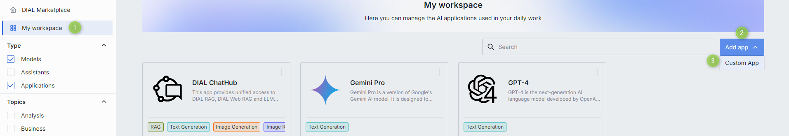

| Field | Required | Description |
|-------|:--------:|-------------|
| Name | Yes | Application name. |
| Version | Yes | Version in `x.y.z` format, numbers and dots only. |
| Icon | No | The icon rendered in the chat interface and Marketplace. |
| Topics | No | Assign a predefined topic. Topics and their styles are defined in [DIAL Chat Themes](https://github.com/epam/ai-dial-chat-themes/blob/development/static/config.json). |
| Description | No | A short description rendered in the chat interface and Marketplace. |
| Features data | No | Application features in JSON, such as `rateEndpoint` and `configurationEndpoint`. |
| Attachment types | No | Allowed attachment types per the [MIME standard](https://developer.mozilla.org/en-US/docs/Web/HTTP/Basics_of_HTTP/MIME_types/Common_types). Enter `*/*` to allow all types. |
| Max. attachments number | No | The maximum number of attachments allowed. Leave blank for the maximum integer. Enter `0` to disable attachments. |
| Chat completion URL | Yes | The chat completion URL your application exposes, used by DIAL Core to send requests. |

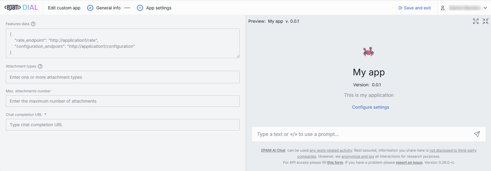

### Edit an application

A new application is stored in your private folder, under your full control — you can edit or delete it anytime. When you [publish an application](./6.sharing-and-publishing.md), a specific version appears in the public folder. You cannot modify a published version, but you can keep working in your private space and publish new versions.

**Note**
> You can edit only your own apps. Undeploy a Code App before editing it.

1. In your workspace, click **Edit** in the application card's menu to open the editor.
2. Make changes and click **Save**.

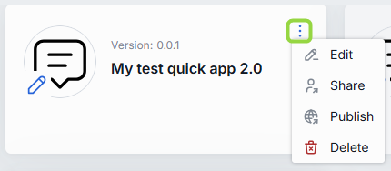

### Remove an application

Remove an application from your workspace at any time with the bookmark button on its card.

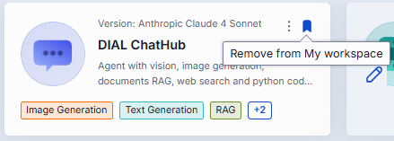

### Delete an application

Use **Delete** in the app's menu to delete the application completely.

**Note**
> You can delete only your own apps that have not been published. Published applications cannot be deleted — send an unpublish request to withdraw them.

1. In your workspace, select one of your own apps.
2. Click **Delete** in the card's menu.
3. Confirm the action.

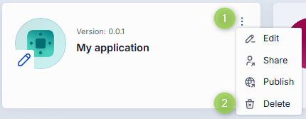

### Connect to an agent

**Agent link**

For agents (apps and AI models) available organization-wide, copy a link that takes users straight to the agent's card in the Marketplace.

1. Click the actions menu on the agent's card.
2. Click **Copy link**.

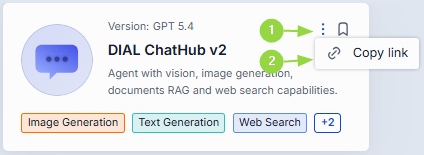

**MCP endpoint**

For agents that expose an MCP endpoint, copy the endpoint URL to integrate it into your workflow.

1. Click the actions menu on the agent's card.
2. Click **Connect**.
3. Click **Copy URL** in the dialog.

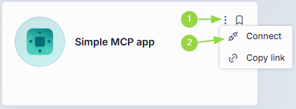

## Next steps

- [Tool Sets](./4.tool-sets.md) — connect MCP servers to use as tools in Quick Apps 2.0
- [Sharing and publishing](./6.sharing-and-publishing.md) — share or publish your apps
- [Conversations](./1.conversations.md) — start chatting with the agents you added
