# Tool sets

This page shows you how to work with Tool Sets in DIAL Chat: authenticate, add and edit a Tool Set, use it in an app, and connect to it. It is for end users of DIAL Chat. No technical background is required. To share or publish a Tool Set, see [Sharing and publishing](./6.sharing-and-publishing.md).

A Tool Set is a connector to an MCP server that you can use as a tool in [Quick Apps 2.0](./3.marketplace-and-apps.md) to perform specific actions in your workflows.

In DIAL Marketplace you find all Tool Sets available in your environment. You can access only those allowed for your [user role](../2.understand-dial/4.security-and-governance/1.authentication-and-access-control.md). In [your workspace](./3.marketplace-and-apps.md), you access Tool Sets added from the Marketplace and add new ones.

## Authentication

If a Tool Set requires authentication, you must sign in before you can use it. An application that relies on a Tool Set displays an error prompting you to authenticate before proceeding. Make sure you are authenticated with any Tool Set you plan to use.

The Tool Set card shows its authentication state:

- **LOGGED OUT** — you are not logged in.

  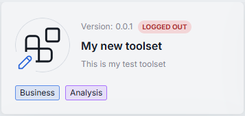

- **MY CREDS** — you are logged in with your own credentials.

  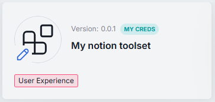

- **ORG CREDS** — the Tool Set was [published with credentials](./6.sharing-and-publishing.md) or an administrator logged in with organization credentials, so it is available to all users.

  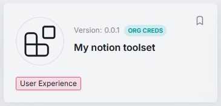

- **No label** — the Tool Set does not require authentication.

  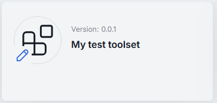

### Log into your own Tool Set

1. Select one of your Tool Sets that requires authentication and click **Log in** in its menu. You can also click the card and use the **Login** button in the details.
2. Complete authentication at the MCP server provider as configured in the Tool Set.

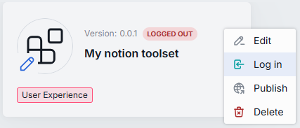

### Log into a public Tool Set

A public Tool Set can be logged in or not:

- **Logged in** — the **ORG CREDS** label is shown. Use it right away, or log in with your own credentials.
- **Not logged in** — the **LOGGED OUT** label is shown. Click **Login with my creds** to log in and use it.

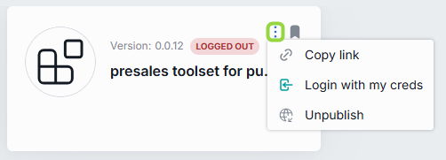

### Log out

1. Select the Tool Set where you are logged in and click **Log out** in its menu.
2. Confirm to log out.

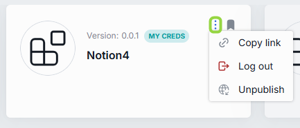

**Note**
> Administrators can manage authentication for public Tool Sets, including logging in and out with organization credentials on behalf of all users. See [Publications and review](../5.administering-dial/7.publications-and-review.md).

## Add a Tool Set

In [your workspace](./3.marketplace-and-apps.md), you can add new Tool Sets. They are stored in your private folder. You can [publish](./6.sharing-and-publishing.md) a Tool Set to list it on the Marketplace for other users.

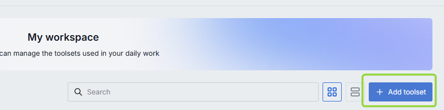

1. Click **Add toolset** to open the Tool Set editor.
2. Fill in the required fields.
3. Click **Save and exit** to register the Tool Set in DIAL.

**Note**
> Your Tool Set appears only in your workspace. To let others use it, [share or publish](./6.sharing-and-publishing.md) it.

| Field | Required | Description |
|-------|:--------:|-------------|
| Name | Yes | Tool Set name. |
| Version | Yes | Version in `x.y.z` format, numbers and dots only. |
| Icon | No | The icon rendered in the chat interface and Marketplace. |
| Description | No | A short description rendered in the chat interface and Marketplace. |
| Topics | No | Assign a predefined topic. Topics and their styles are defined in [DIAL Chat Themes](https://github.com/epam/ai-dial-chat-themes/blob/development/static/config.json). |
| Endpoint | Yes | The MCP endpoint a Quick App calls to fetch external data. |
| Transport protocol | Yes | A transport supported by the MCP server: HTTP (default) or SSE (deprecated). |
| Authentication | No | Select an authentication method. **With login** for dynamic client registration (only the MCP endpoint is required). **With login and config** for static registration, providing a client name and secret. **API keys** to authenticate with an API key name and value. |
| Without authentication | No | Choose to create a Tool Set that does not require authentication. |
| Allowed tools | No | The [tools](https://modelcontextprotocol.io/specification/2025-06-18/server/tools) — functions the related MCP server supports — that clients can use. Ask the MCP server provider about supported tools. |

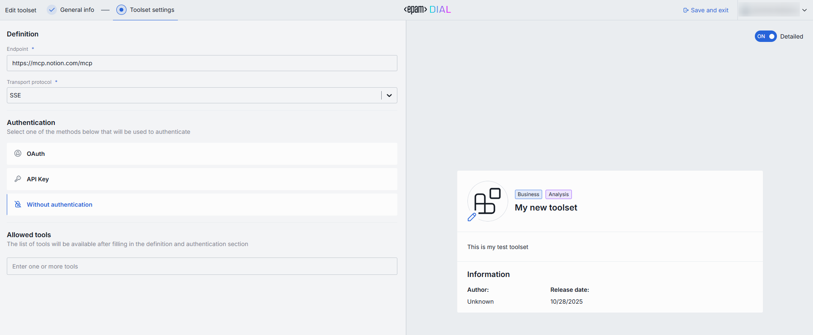

## Use a Tool Set

Use available Tool Sets as tools in [Quick Apps 2.0](./3.marketplace-and-apps.md) to perform specific actions.

## Edit a Tool Set

You can edit Tool Sets stored in your private space.

1. Click **Edit toolset** in the card's menu to open the editor.
2. Update the fields.
3. Click **Save and exit** to update the Tool Set.

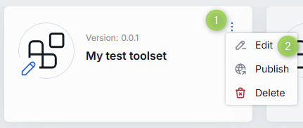

## Remove a Tool Set

Remove a public Tool Set from your workspace at any time.

1. Select a Tool Set in your workspace.
2. Disable the bookmark button on its card.

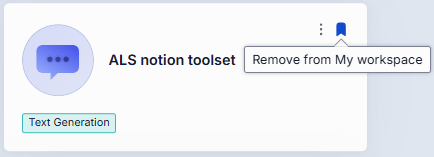

## Delete a Tool Set

Use **Delete** in the Tool Set's menu to delete it completely. Applications that use it show an error when communicating with it, and it is highlighted in red in the Quick Apps 2.0 editor.

**Note**
> You can delete only your own Tool Sets that have not been published. Published Tool Sets cannot be deleted — send an unpublish request to withdraw them.

1. Select one of your own Tool Sets in your workspace.
2. Select **Delete** in the card's menu.

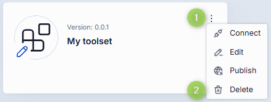

## Connect to a Tool Set

**Tool Set link**

For Tool Sets available organization-wide, copy a link that takes users straight to the Tool Set's card in the Marketplace.

1. Click the actions menu on the Tool Set's card.
2. Click **Copy link**.

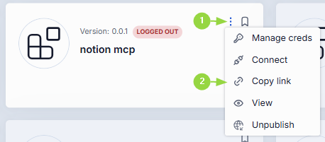

**Tool Set URL**

Copy a Tool Set URL to integrate it into your workflow.

1. Click the actions menu on the Tool Set's card.
2. Click **Connect**.
3. Click **Copy URL** in the dialog.

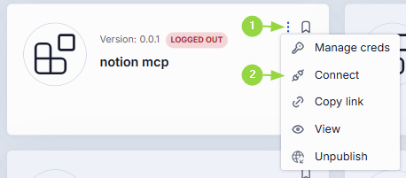

**Tip**
> The Tool Set URL is also available in the Tool Set info card and the editor.

## Next steps

- [Marketplace and apps](./3.marketplace-and-apps.md) — add a Tool Set to a Quick App 2.0
- [Sharing and publishing](./6.sharing-and-publishing.md) — publish a Tool Set, with or without credentials
- [Tool Sets for developers](../3.building-with-dial/1.apps/2.quick-apps/1.quick-app-2/9.tool-sets/0.index.md) — define, register, and integrate MCP servers
