# Sharing and publishing

This page shows you how to share and publish your assets in DIAL Chat — conversations, prompts, applications, and Tool Sets. Sharing gives specific people direct access through a link. Publishing makes an asset available to your organization after an administrator approves it. It is for end users of DIAL Chat. No technical background is required.

By default, every asset you create — an agent, conversation, Tool Set, or prompt — is stored in your private folder and cannot be accessed by anyone else. To give others access, you share it or publish it.

## How publishing works

When you publish an asset, it is placed in the public folder, where authorized users can access it, including from [DIAL Marketplace](./3.marketplace-and-apps.md). For security, every publication request is reviewed by an administrator, who can approve, modify, or decline it. Published assets can be unpublished to withdraw them entirely or for selected user groups.

**The publication flow:**

1. You send a publication request for the selected assets.
2. An administrator reviews it and approves or declines it. The administrator can also modify the request, including access rules. See [Publications and review](../5.administering-dial/7.publications-and-review.md).
3. When approved, published conversations and prompts appear in the **Organization** section, attachments appear in [Files](./5.files.md) under **Organization**, and published agents and Tool Sets appear in [DIAL Marketplace](./3.marketplace-and-apps.md).
4. You or an administrator can unpublish the asset to withdraw it entirely or apply access limits.

**Note**
> Publications must be enabled in your deployment. See [Enable publications](../4.operating-dial/4.configuration/8.enable-publications.md).

## Sharing

You share an asset by sending a link or QR code to the recipient. Sharing differs from publishing: it grants direct access to specific people without administrator review, and it can grant editing rights for applications.

**Note**
> See [Collaboration and sharing](../2.understand-dial/3.capabilities/4.collaboration-and-sharing.md) to learn more about collaboration in DIAL.

### Share a conversation

**Warning**
> When a conversation is shared, all its attachments are shared as well and become available in [Files](./5.files.md).

To share a conversation or a folder, click **Share** in its menu and send the link or QR code to the recipient. When you share a folder, all its subfolders and attachments are shared too.

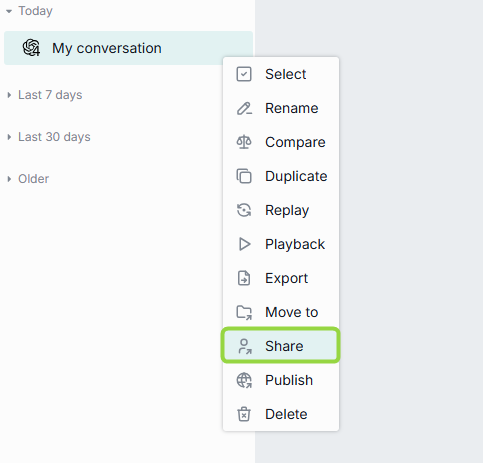

After the recipient opens your link, an arrow icon appears next to the conversation name. You may need to reload the page to update the status.

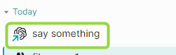

To list only the conversations you have shared, select **Shared by me** in the filter.

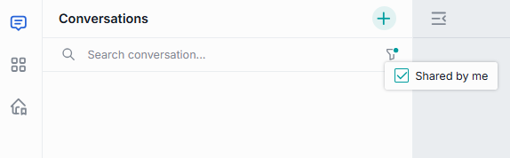

**Receive a shared conversation**

A conversation shared with you appears in the **Shared with me** section in the left panel.

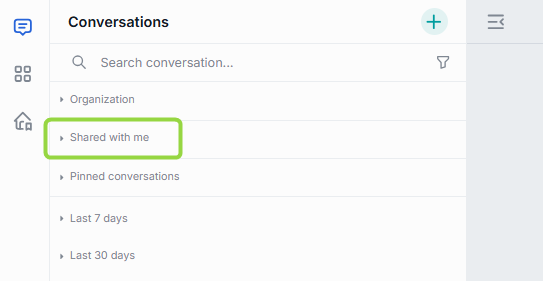

**Note**
> You cannot change a conversation shared with you. To work with it, [duplicate it](./1.conversations.md).

**Remove access to a conversation**

To revoke access from everyone you shared with, click **Share** in the menu, then click **Remove access for all users**.

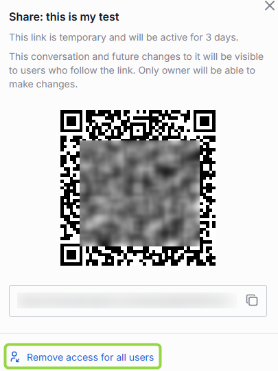

**Unshare a conversation**

In **Shared with me**, click **Unshare** in a conversation's menu to remove it from the list.

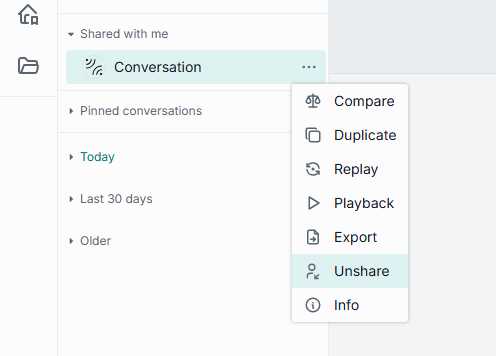

### Share a prompt

To share a prompt or a folder, click **Share** in its menu and pass the link or QR code to the recipient. List your shared prompts with the **Shared by me** filter. When you share a folder, all folders and prompts in it are shared.

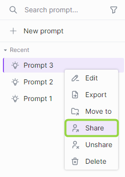

Once the recipient opens your link, an arrow icon appears next to the prompt name.

**Receive a shared prompt**

To receive a shared prompt, open the link or scan the QR code; the prompt is imported into your chat and appears in **Shared with me** on the right panel. On a prompt shared with you, you can:

- **View** — open a preview.
- **Duplicate** — duplicate it so you can modify it.
- **Unshare** — remove it from the list.
- **Export** — download it as JSON.

**Note**
> You cannot change a prompt shared with you. To work with it, [duplicate it](./2.prompts.md).

**Remove access to a prompt**

To revoke access to a prompt you shared, select **Share** in its menu and click **Remove access for all users**.

**Unshare a prompt**

To remove a prompt from **Shared with me**, click **Unshare** in its menu and confirm.

### Share an application

Applications in your private space are available only to you. To grant access to specific users, generate a sharing link.

**Note**
> You can share only your own applications. You cannot share an application shared with you unless re-sharing rights were explicitly granted. See [Collaboration and sharing](../2.understand-dial/3.capabilities/4.collaboration-and-sharing.md).

1. Click **Share** on the application card's menu.

   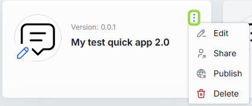

2. If needed, select a specific version to share.
3. Choose whether to grant editing rights with the link.
4. Confirm the action.
5. Send the link or QR code to the recipient.

A shared application, or a shared version, is marked with a blue arrow.

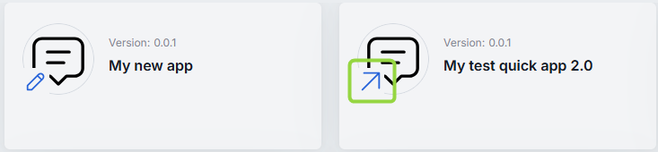

**Sharing with editing rights**

The key difference between sharing and publishing is that sharing can grant editing access, not just usage. Applications shared with editing rights allow the recipient to edit, deploy, or undeploy the application.

**Warning**
> When an application or version is shared, your updates become immediately available to everyone it is shared with. Conflict resolution for simultaneous edits is not supported — the first change submitted is applied for all users.

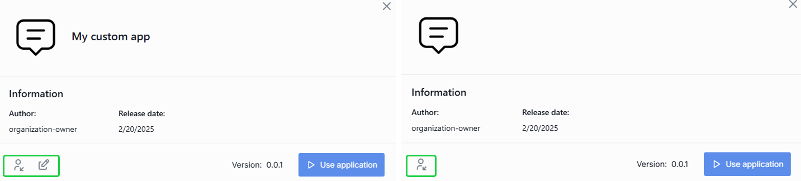

**Access to application files**

Applications can rely on files to operate. When an application is shared, its resources are shared too, and appear in [Files](./5.files.md) under **Shared with me**. With editing rights — for example, a Code App with its source files — you can access the files in the Attachments Manager under **Shared with me** and delete specific source files via the actions menu.

**Remove access to an application**

**Note**
> A shared application is revoked from shared use when the owner changes its name or version.

1. Select the shared application — identified by the blue arrow.
2. Click **Share** in its menu.
3. Click **Remove access for all users** and confirm.

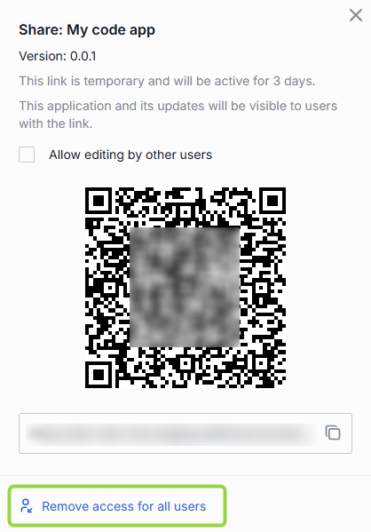

**Unshare an application**

Use **Unshare** to remove an application shared with you from your workspace. To find apps shared with you, use the **Source** filter in My workspace.

1. In the shared application's menu, click **Unshare**.
2. Confirm the action.

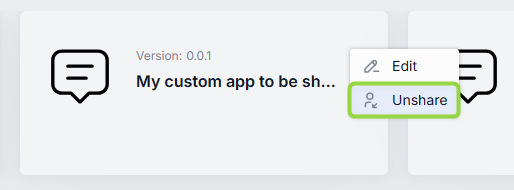

## Publishing

When you publish an asset, choose where to place it and which access rules apply, then send the request for review.

### Versioning

Each publication request requires a unique version number in `0.0.0` format. The system rejects a duplicate version. Versioning lets you create publications for different groups, run experiments, and track changes.

You add a version next to the asset's checkbox in the request form.

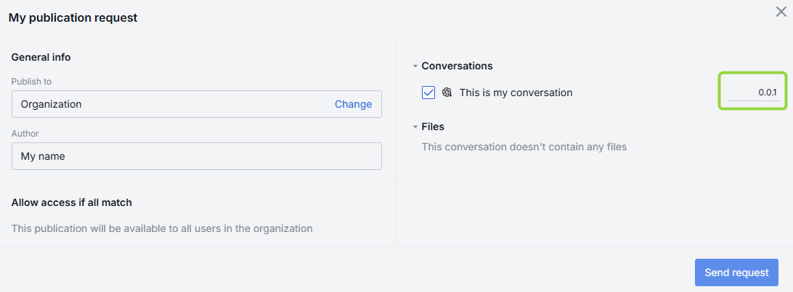

If you publish the same asset again, you can view the last version or a drop-down of versions.

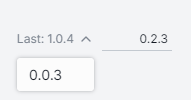

When you open a published conversation, you can view and switch between versions in the [conversation settings](./1.conversations.md).

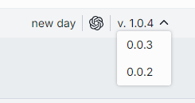

### Publish a conversation

**Note**
> To publish a conversation shared with you, [duplicate it](./1.conversations.md) first. All publication requests are reviewed by administrators.

1. Click **Publish** in the conversation menu.

   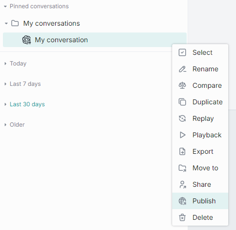

2. In the dialog:
   - Enter a **publication request name** and the **author** name.
   - In **Publish to**, select or create a subfolder in the Organization folder.
   - In **Allow access if all match**, specify [access rules](#access-rules). Rules apply only to subfolders; assets in the root folder are accessible to all authorized users.
   - In **Conversations**, choose which conversations to publish, and select their attachments in **Files**.
   - Assign a [version](#versioning).
   - Click **Send request**.

   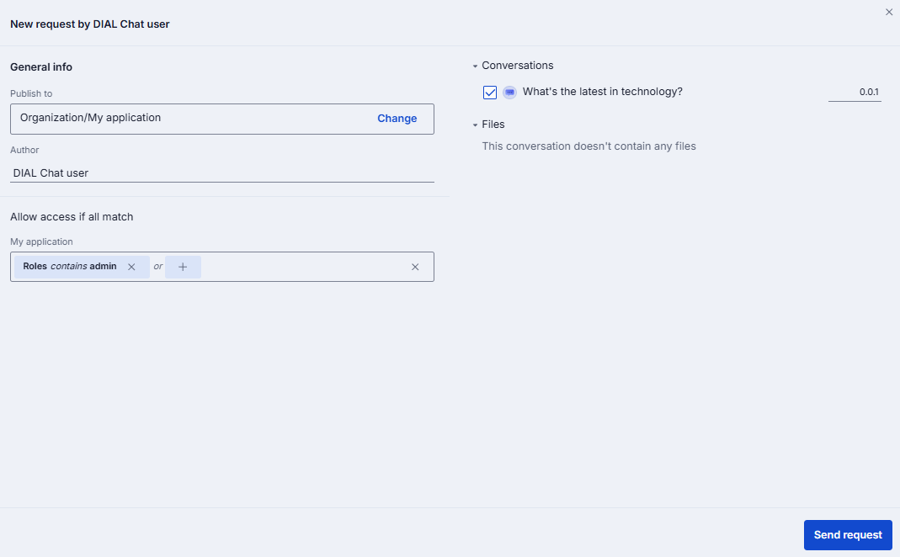

3. When approved, the published conversation appears in the specified folder for authorized users.

   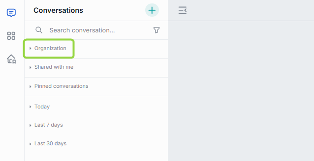

### Publish a prompt

**Note**
> To publish a prompt shared with you, [duplicate it](./2.prompts.md) first. All publication requests are reviewed by administrators.

1. Click **Publish** in the prompt menu.

   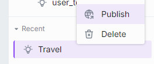

2. In the dialog:
   - Enter a **publication request name** and the **author** name.
   - In **Publish to**, select or create a subfolder in the Organization folder.
   - In **Allow access if all match**, specify [access rules](#access-rules).
   - In **Prompts**, choose which prompts to publish.
   - Assign a [version](#versioning).
   - Click **Send request**.

   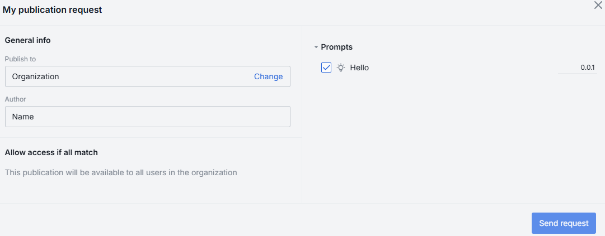

3. When approved, the published prompt appears in the specified folder for authorized users.

   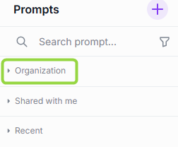

### Publish an application

Until published, your application is private and cannot be accessed by anyone. Publishing makes it available to a selected audience or all authorized users, and lists it on [Marketplace](./3.marketplace-and-apps.md).

**Note**
> All publication requests are reviewed by administrators. See [Authentication and access control](../2.understand-dial/4.security-and-governance/1.authentication-and-access-control.md) to learn about public resources.

1. In the application menu (or the Edit application form), click **Publish**.
2. Enter a **publication request name**.
3. In **Publish to**, select or create a subfolder in the Organization folder.
4. In **Allow access if all match**, specify [access rules](#access-rules).
5. In **Applications**, choose which applications to publish if a folder holds more than one.
6. Select the **version** to publish.
7. Enter the **author** name.
8. Click **Send request**.

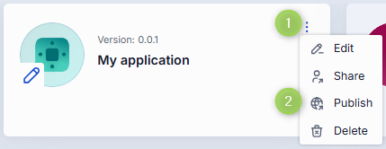

**Continue working after publication**

Publishing creates another instance of the application. On the Marketplace you find both: the original in your private folder and the published one in the public folder.

The original has the editor icon, so you can keep modifying it and publish new versions. To use the version you published, find it on the Marketplace and bookmark it to [add it to your workspace](./3.marketplace-and-apps.md). A published version cannot be modified — you can only unpublish it.

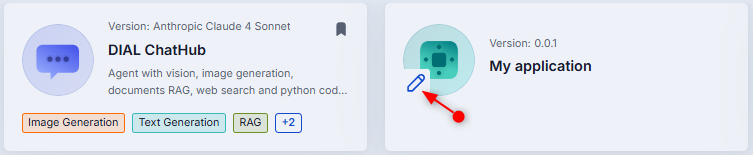

**Access to application files**

When an application is published, its resources are published too. You can access them in [Files](./5.files.md) under **Organization**.

### Publish a Tool Set

Until published, your Tool Set is private. Publishing makes it available to a selected audience or all authorized users, and lists it on [Marketplace](./3.marketplace-and-apps.md).

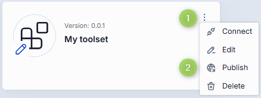

1. In the Tool Set menu, click **Publish**.
2. Enter a **publication request name**.
3. In **Publish to**, select or create a subfolder in the Organization folder.
4. In **Allow access if all match**, specify [access rules](#access-rules).
5. In **Toolsets**, choose which Tool Sets to publish.
6. Enter the **author** name.
7. Click **Send request**.

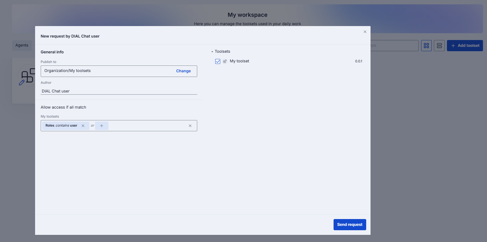

**Publish a Tool Set with credentials**

You can publish a Tool Set together with credentials, so users can log in with the credentials that accompany it.

1. Log in.
2. In the Tool Set card's menu, click **Publish**.
3. In the request window, select the **Credentials** checkbox.

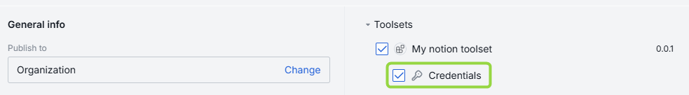

## Unpublishing

Unpublish an asset to withdraw it from public use entirely or for selected user groups. The owner or an administrator can unpublish. When unpublished, the asset is removed from the public folder and the Marketplace.

**Note**
> All unpublish requests are reviewed by administrators. In an unpublish request, the **Allow access if all match** rules determine which rules lose access — access remains for any other rules in the original publication. For example, if the publication included rules A and B and you unpublish rule B, rule A keeps access.

### Unpublish a conversation

1. In the Conversations panel, open the **Organization** tab to see published conversations.
2. Select a conversation and click **Unpublish**, then fill in the request form.
3. After approval, the conversation is removed from the Organization folder.

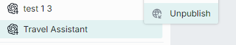

You can unpublish a single conversation or a published folder, choosing which conversations in the folder to unpublish.

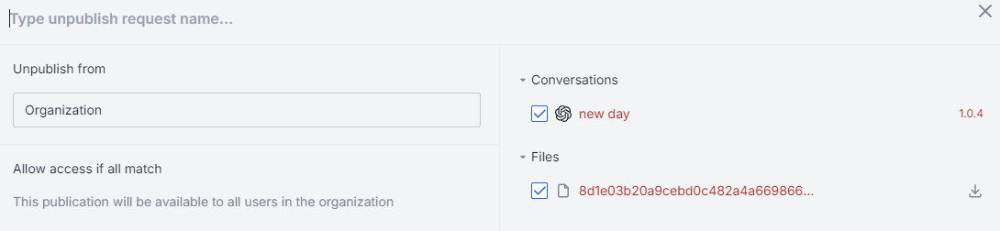

### Unpublish a prompt

1. In the Prompts panel, open the **Organization** tab to see published prompts.
2. Select a prompt and click **Unpublish**, then fill in the request form.
3. After approval, the prompt is removed from the Organization folder.

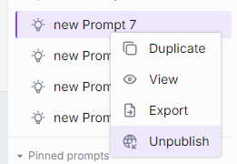

You can unpublish a single prompt or a published folder.

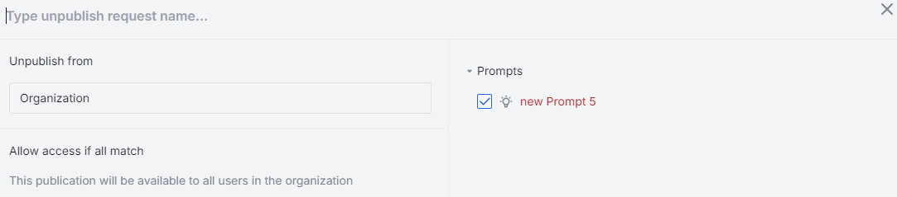

### Unpublish an application

1. In [Marketplace](./3.marketplace-and-apps.md), filter by Type = Applications and Sources = Public.
2. Select **Unpublish** in the application's menu and fill in the request form.
3. After approval, the application is removed from the Marketplace.

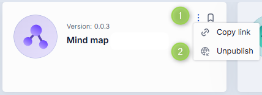

### Unpublish a Tool Set

1. In [Marketplace](./3.marketplace-and-apps.md), filter by Sources = Public.
2. Select **Unpublish** in the Tool Set's menu and fill in the request form.
3. After approval, the Tool Set is withdrawn from public use.

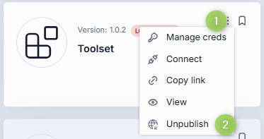

## Access rules

When an asset is published, it is placed in the public folder. When you publish into a subfolder, the subfolder both organizes assets and applies access rules.

**Important**
> The effective access rule for an asset in a subfolder includes restrictions from all parent subfolders up to the root. See [Work with publications](../3.building-with-dial/7.working-with-dial-resources/2.publications-api.md#effective-rules) to learn about effective rules for folders.

Access rules for subfolders use three parameters, combined with the logical **OR** condition so several rules apply at once:

- **Attribute** — DIAL Core matches `claims` in the JWT from your identity provider against the rule's attribute. Ask your administrator which claim values your organization supports.
- **Operation** — the matching function for claims and values, such as Equals.
- **Value** — an array of claim values, such as `admin`.

In the request form, choose attributes in the **Select** field, pick an operation, and enter values. In this example, two rules apply to the *My application* subfolder: `claims` roles containing `user` OR `claims` DIAL Roles with value `admin`.

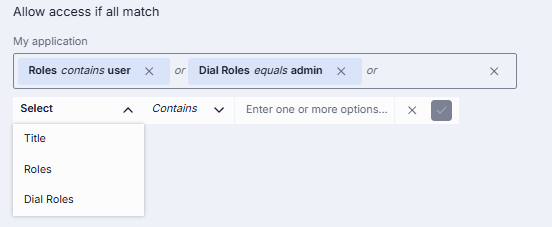

## Next steps

- [Conversations](./1.conversations.md) — share and replay parameterized conversations
- [Marketplace and apps](./3.marketplace-and-apps.md) — publish your apps to the Marketplace
- [Publications and review](../5.administering-dial/7.publications-and-review.md) — how administrators review requests
