# Manage application deployments

This page explains how administrators use DIAL Admin to add and configure application deployments. It covers creating an application, setting source types, configuring roles and rate limits, attaching interceptors, managing dependencies, and using the JSON editor. You need access to DIAL Admin with administrator permissions.

**Note**
> - Refer to [DIAL-Native Applications](../../building-with-dial/apps/0.index.md) to learn about applications in DIAL.
> - Refer to [Enable App](../../building-with-dial/apps/custom-apps/5.register-app.md) to learn how to enable applications in DIAL.

## Main screen

On this screen, you can access all the available application deployments in your instance of DIAL. Applications displayed in this section were either added by direct modification of the [DIAL Core](https://github.com/epam/ai-dial-core/blob/development/docs/dynamic-settings/applications.md) config file or via DIAL Admin. Here, you can also create and manage new application deployments.

**Note**
> This section does not display applications in either private user folders or the public folder in DIAL file storage. Applications in private folders are available only to their owners. Applications in the public folder are accessible in the [Assets](../4.assets.md) section.

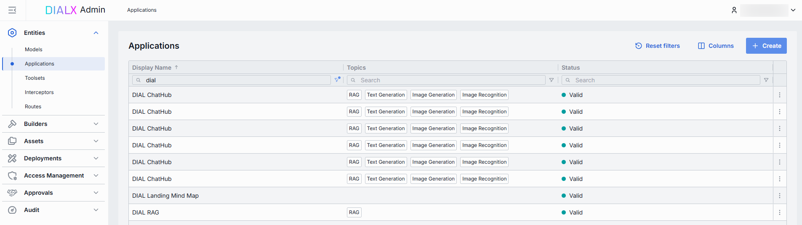

### Applications grid

**Tip**
> Use the **Columns** selector to customize which columns are visible in the grid and their order.

| Field | Description |
|-------|-------------|
| **Display Name** | Name of the application (e.g. "Data Clustering Application") rendered on UI. |
| **Version** | Semantic identifier of the application version (e.g. 1.0.0). |
| **Description** | Brief free-text summary describing the application (e.g. "Clusters incoming text into semantic groups"). |
| **ID** | Unique identifier used in the DIAL [dynamic settings](https://github.com/epam/ai-dial-core/blob/development/docs/dynamic-settings/applications.md) (e.g. dca, support-bot). This is the path segment of the application's HTTP endpoint. |
| **Source type** | The type of source used to create the application: Endpoints, App Runner, or Application Container. |
| **Source** | Name, URI, or other identifier of the source used to create the application. |
| **Author** | Information about the application's author. |
| **Topics** | Tags or categories (e.g. "finance," "support," "image-capable") you can assign for discovery, filtering, or grouping in large deployments. Helps end users and admins find the right application by use case. |
| **Attachment types** | Types of attachments this application can accept according to [MIME types](https://developer.mozilla.org/en-US/docs/Web/HTTP/Guides/MIME_types/Common_types). |
| **Max attachment number** | Maximum number of attachments allowed in a single request. |
| **Status** | Current status of the application: - **Valid**: application configuration is compatible with the JSON schema or the related application runner. Only valid entities will be materialized into the DIAL Core configuration. - **Invalid**: application configuration is incompatible with the JSON schema of the related application runner. |
| **Creation Time** | Entity creation timestamp. |
| **Updated Time** | Timestamp of the latest update of the entity. |

## Create

On the main screen you can add new application deployments.

**Note**
> Refer to [Enable App](../../building-with-dial/apps/custom-apps/5.register-app.md) to learn more about enabling applications in DIAL.

Follow these steps to add a new application deployment:

1. Click **+ Create** to invoke the **Create Application** modal.
2. Define the application's parameters:

    | Field | Required | Description |
    |-------|----------|-------------|
    | **ID** | Yes | Unique identifier under the `applications` section of DIAL Core's [dynamic settings](https://github.com/epam/ai-dial-core?tab=readme-ov-file#dynamic-settings) (e.g. support-bot, data-cluster). |
    | **Display Name** | Yes | Name of the application (e.g. "Data Clustering Application") rendered on UI. |
    | **Display version** | No | Semantic identifier (e.g., 1.2.0) of an application's version. |
    | **Description** | No | Free-text summary describing the application (e.g. supported inputs, business purpose). |
    | **Source Type** | Yes | Source type of the application: - **Endpoints**: Application with this source type is a standalone application. DIAL Core communicates with it via the explicitly-provided chat completion, responses, and/or MCP endpoints. - **App Runner**: Application runners can be seen as application factories, allowing users to create logical instances of apps with different configurations. Application runners are based on JSON schemas, which define structure, properties, and endpoints for applications. In [Builders](../3.builders.md) you can see all the available runners and add new ones. - **Application Container**: You can create applications based on [running containers](../deployments/container-management.md). |
    | **Completion endpoint** | Yes | Endpoint URL that will be used to process chat completion requests. Available if Source Type is **Endpoints**. |
    | **Responses endpoint** | No | Endpoint URL that supports the OpenAI Responses API. Available if Source Type is **Endpoints**. |
    | **MCP Endpoint** | No | The application's MCP endpoint DIAL Core will use to communicate with the application. Available if Source Type is **Endpoints**. - **Transport**: Transport used by the MCP server for transmitting MCP messages between client and server. HTTP by default. - **Forward per request key**: Set this flag to `true` if you want a [per-request key](../../building-with-dial/working-with-dial-resources/5.per-request-keys.md) to be forwarded to the MCP endpoint allowing the MCP server to access files in the DIAL storage. - **Configuration delivery**: Determines how application properties are sent to the MCP server. Choose `Header` to deliver application properties in an HTTP header. Choose `Meta` to include application properties in the `_meta` field within the MCP message payload. |
    | **Application runner** | Conditional | Select one of the [available application runners](../3.builders.md). Available and required if Source Type is **Application runner**. |
    | **Container** | Conditional | Select one of the [running containers](../deployments/container-management.md). Available and required if Source Type is **Application Container**. |

3. Once all required fields are filled, click **Create**. The dialog closes and the new [application configuration](#configuration) screen is opened. The new application deployment appears immediately in the listing once created. It may take some time for the changes to take effect after saving.

    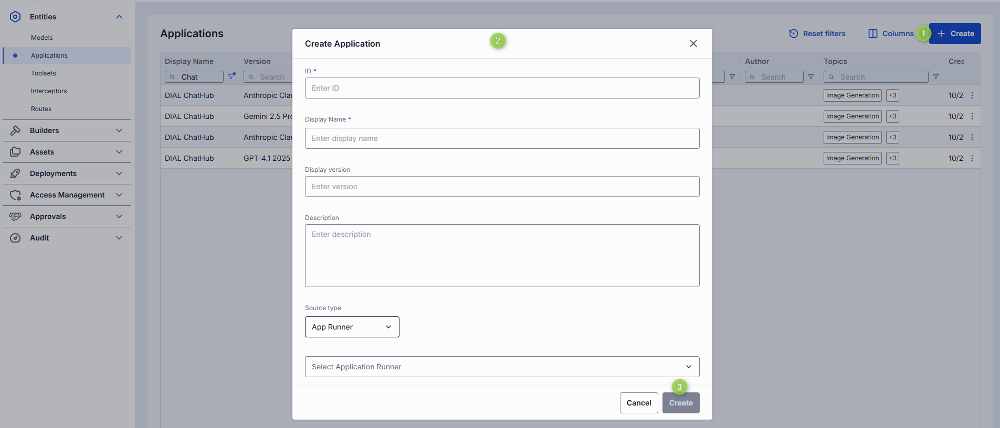

## Configuration

Click any application on the main screen to open the configuration section.

### Properties

In the **Properties** tab, you can define the application's identity, routing, UI metadata, and other basic runtime controls.

Once configured, your application is ready to orchestrate models and interceptors behind a single HTTP endpoint.

| Field | Required | Editable | Description |
|-------|----------|----------|-------------|
| **ID** | - | - | Unique key under `applications` in DIAL Core's [dynamic settings](https://github.com/epam/ai-dial-core?tab=readme-ov-file#dynamic-settings) (e.g. data-clustering, support-bot). |
| **Updated Time** | - | - | Date and time when the app's configuration was last updated. |
| **Creation Time** | - | - | Date and time when the app's configuration was created. |
| **Status** | - | - | Current status of the application: **Valid**: application configuration is compatible with the JSON schema or the related application runner. Only valid entities will be materialized into the DIAL Core configuration. **Invalid**: application configuration is incompatible with the JSON schema of the related application runner. |
| **Sync with core** | - | - | Indicates the state of the entity's configuration synchronization between Admin and DIAL Core. Synchronization occurs automatically every 2 mins (configurable via `CONFIG_AUTO_RELOAD_SCHEDULE_DELAY_MILLISECONDS`). **Important**: Sync state is not available for sensitive information (API keys/tokens/auth settings). **Synced**: Entity's states are identical in Admin and in Core for valid entities, or entity is missing in Core for invalid entities. **In progress...**: Synced conditions are not met and changes were applied within last 2 mins (this period is configurable via `CONFIG_EXPORT_SYNC_DURATION_THRESHOLD_MS`). **Out of sync**: Synced conditions are not met and changes were applied more than 2 mins ago (this period is configurable via `CONFIG_EXPORT_SYNC_DURATION_THRESHOLD_MS`). **Unavailable**: Displayed when it is not possible to determine the entity's state in Core. This occurs if the config was not received from Core for any reason, or the configuration of entities in Core is not entirely compatible with the one in the Admin service. |
| **Display Name** | Yes | Yes | Application name displayed on UI (e.g. "Data Clustering Application"). Helps end users identify and select applications. |
| **Display version** | No | Yes | Semantic identifier of the application version (e.g. 1.0.0). |
| **Description** | No | Yes | Free-text summary describing the application (e.g. tooling, supported inputs/outputs, SLAs). |
| **Maintainer** | No | Yes | Email address of the person or team responsible for the application. |
| **Icon** | No | Yes | Logo to visually distinguish the app on the UI. |
| **Topics** | No | Yes | Semantic labels that you can assign to apps (e.g. "finance", "support") for better navigation on UI. Click to display a list of available topics. You can add your own custom topics to the list following these rules: - The topic name must not exceed 255 characters. - The topic name must not contain leading or trailing spaces. |
| **Source Type** | Yes | Yes | Source type of application. - **Endpoints**: Application with this source type is a standalone application. DIAL Core communicates with it via the explicitly-provided chat completion, responses, and/or MCP endpoints. - **Application runner**: Application runners can be seen as application factories, allowing users to create logical instances of apps with different configurations. Application runners are based on JSON schemas, which define structure, properties, and endpoints for applications. Select one of the available application runners. If the application is created based on an application runner, DIAL Core will forward all payloads to endpoints defined in the [application runner configuration](../3.builders.md). - **Application Container**: You can create applications based on [running containers](../deployments/container-management.md). |
| **Container** | Conditional | Yes | [Application Container](../deployments/container-management.md) used to create the application. Available and required if Source Type is **Application Container**. |
| **Application runner** | Conditional | Yes | Select one of the [available application runners](../3.builders.md). Available and required if Source Type is **Application runner**. |
| **Completion endpoint** | Yes | Conditional | Endpoint URL that will be used to process chat completion requests. Editable if Source Type is **Endpoints**. Partially editable (base URL is determined by the selected container; endpoint path is editable) if Source Type is **Application Container**. Read-only if Source Type is **Application Runner**. |
| **Responses endpoint** | No | Conditional | Endpoint URL that supports the OpenAI Responses API. Editable if Source Type is **Endpoints**. |
| **MCP Endpoint** | No | Conditional | The application's MCP endpoint DIAL Core will use to communicate with the application. Editable if Source Type is **Endpoints**. Partially editable (base URL of the selected container is fixed; endpoint path is editable) if Source Type is **Application Container**. - **Transport**: Transport used by the MCP server for transmitting MCP messages between client and server. HTTP by default. - **Forward per request key**: Set this flag to `true` if you want a [per-request key](../../building-with-dial/working-with-dial-resources/5.per-request-keys.md) to be forwarded to the MCP endpoint allowing the MCP server to access files in the DIAL storage. - **Configuration delivery**: Determines how application properties are sent to the MCP server. Choose `Header` to deliver application properties in an HTTP header. Choose `Meta` to include application properties in the `_meta` field within the MCP message payload. |
| **Viewer URL** | No | Conditional | URL of the application's custom UI. A custom UI, if enabled, will override the standard DIAL Chat UI. Available and editable if Source Type is **Endpoints**. |
| **Editor URL** | No | Conditional | URL of the application's custom builder UI. The application builder allows creating instances of apps using a UI wizard. Available and editable if Source Type is **Endpoints**. |
| **Attachment types** | No | Yes | Defines the [attachment types](../../building-with-dial/developer-tools/chat-customization/1.custom-content.md#attachments) (images, files) this app can accept: **No attachments**: Disables all attachment types. **All attachments types**: Allows all types of file attachments. Optionally specify max number of attachments. **Specific attachments types**: Enables the user to define/select specific [MIME types](https://developer.mozilla.org/en-US/docs/Web/HTTP/Basics_of_HTTP/MIME_types/Common_types). Start typing to see suggestions or use `<type>/<subtype>` format for a manual entry. |
| **Attachments max number** | No | Yes | Maximum number of input attachments. Enabled if attachment types are defined. |
| **Forward auth token** | No | Yes | Determines whether to forward an Auth Token to your app's endpoint. If enabled, the HTTP header with the authorization token is forwarded to the chat completion endpoint. |
| **Max retry attempts** | No | Yes | Number of times DIAL Core will [retry](../../operating-dial/configuration/7.load-balancer.md#fallbacks) a failed run (due to timeouts or 5xx errors). |
| **Completion Defaults** | No | Yes | Default parameters are applied if a request doesn't contain them in an OpenAI `chat/completions` API call. |
| **Responses Defaults** | No | Conditional | Default parameters are applied if a request doesn't contain them in an OpenAI `openai/v1/responses` API call. Available and editable if the OpenAI Responses API is supported. |

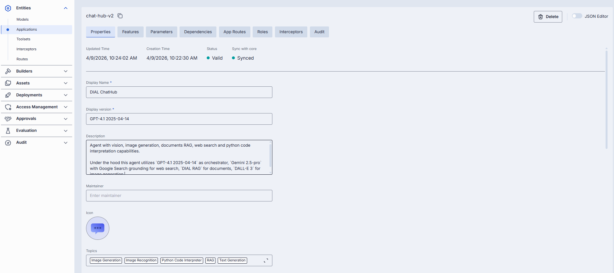

### Tools overview

**Important**
> This section is enabled for application deployments with **Source Type = Endpoints/MCP** or **Source Type = Application Runner** where the related Application Runner has the MCP endpoint enabled as the source type.

[Tools](https://modelcontextprotocol.io/specification/2025-06-18/server/tools) are functions supported by an MCP server that can be used by clients to perform specific actions. On this screen, you can discover, manage, and try all the available tools.

**Note**
> Refer to [Toolsets — Tools overview](./toolsets.md#tools-overview) to learn more about the purpose and functionality of this section.

### Features

In the **Features** tab, you can control optional capabilities of applications.

#### The difference between model and application features

While [model feature flags](./models.md#feature-flags-toggles) govern what each AI model integration can do, application feature flags define which of those capabilities your orchestrated service exposes to clients. You can also plug in custom preprocessing endpoints.

**Scope**

- **Model features** apply per AI model, controlling what the model endpoint itself supports (e.g. whether GPT-4 can accept system prompts or function calls).
- **Application features** apply per orchestrated service, governing what your composed workflow will accept and pass through — regardless of which models are called under the hood.

**Override capability**

- At the **application** level, you can disable a feature globally (even if models support it) or plug in custom endpoints that apply above all models.
- At the **model** level, toggles only reflect the true capabilities of that specific AI model integration.

**Use cases**

- **Model** toggles ensure you don't accidentally send unsupported parameters to a given model.
- **Application** toggles let you present a consistent API to your clients (e.g. always accept `temperature` or never allow attachments), even if different underlying models behave differently.

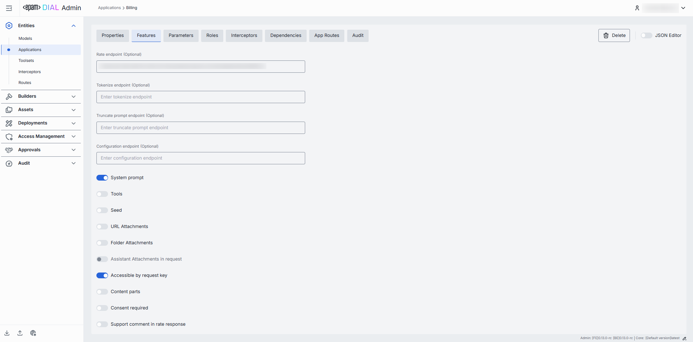

#### Endpoints

You can override or extend DIAL Core's built-in protocol calls with your own HTTP services. Here, you can specify endpoints used by [Application Runners](../3.builders.md) (e.g. a Python or Node Runner) to perform preprocessing or policy checks before delegating to your underlying models and workflows.

| Field | Description |
|-------|-------------|
| **Rate endpoint** | URL to call a custom rate-estimation API. Use this to compute cost or quota usage based on your own logic (e.g. grouping by tenant, complex billing rules). |
| **Tokenize endpoint** | URL to call a custom tokenization service. When you need precise, app-wide token counting (for mixed-model or multi-step prompts) that the model adapter can't provide. |
| **Truncate prompt endpoint** | URL to call your own prompt-truncation API. Useful if you implement advanced context-window management (e.g. dynamic summarization) before the actual application call. |
| **Configuration endpoint** | URL to fetch JSON Schema describing settings of the DIAL application. DIAL Core exposes this endpoint to DIAL clients as `GET v1/deployments/<deployment name>/configuration`. DIAL client must provide a JSON value corresponding to the configuration JSON Schema in a chat completion request in the `custom_fields.configuration` field. |

#### Feature flags (toggles)

Enable or disable per-request options that your application accepts from clients and forwards to the underlying models. Toggle On/Off any feature as needed.

**Note**
> Changes take effect immediately after saving.

| Toggle | Description |
|--------|-------------|
| **System prompt** | Enables an initial "system" message injection. Useful for orchestrating multi-step agents where you need to enforce a global policy at the application level. |
| **Tools** | Enables `tools`/`functions` payloads in API calls. Switch on if your application makes external function calls (e.g. calendar lookup, database fetch). |
| **Seed** | Enables the `seed` parameter for reproducible results. Good for testing or deterministic pipelines. Disable to ensure randomized creativity. |
| **URL Attachments** | Enables URL references (images, docs) as attachments in API requests. Must be enabled if your workflow downloads or processes remote assets via URLs. |
| **Folder Attachments** | Enables attachments of folders (batching multiple files). |
| **Assistant attachments in request** | Indicates whether the application supports `attachments` in `messages` from `role=assistant` in [chat completion request](https://dialx.ai/dial_api#operation/sendChatCompletionRequest). When set to `true`, DIAL Chat preserves `attachments` in `messages` in the chat completion requests to DIAL Core, instead of removing them. This feature is especially useful for apps that can generate attachments as well as take attachments as input. |
| **Accessible by request key** | Indicates whether the deployment is accessible using a [per-request API key](../../building-with-dial/working-with-dial-resources/5.per-request-keys.md). |
| **Content parts** | Indicates whether the deployment supports requests with content parts. |
| **Consent required** | Indicates whether the application requires user consent before use. |
| **Support comment in rate response** | Indicates whether the application supports the field `comment` in the rate response payload. |

### Parameters

If the application is created based on an Application Runner, the content of this screen is determined by the [parameters of the related Application Runner](../3.builders.md). Here, you can configure application-specific parameters that influence its behavior.

**Note**
> Refer to [Schema-rich Applications](../../building-with-dial/apps/0.index.md#schema-based-apps) to learn more.

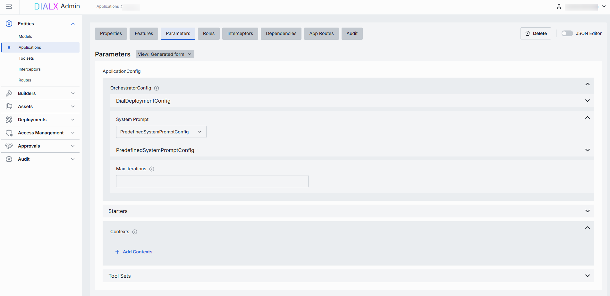

### Roles

In the **Roles** tab, you can create and manage roles that have access to the selected application. Roles are defined in the [Access Management](../access-management/roles.md) section. Here, you can define user groups that can use specific applications and define rate limits for them.

**Important**: If roles are not selected for a specific application or the **Make available to specific roles** toggle is disabled, it will be available to all user roles.

**Note**
> - Refer to [Access & Cost Control](../../understand-dial/security-and-governance/2.access-control-reference.md) to learn more about access control in DIAL.
> - Refer to [Roles](../../understand-dial/security-and-governance/2.access-control-reference.md) to learn more about roles in DIAL.
> - Refer to tutorials to learn how to configure access and limits for [JWT](../../operating-dial/auth-and-access-control/2.jwt.md) and [API keys](../../operating-dial/auth-and-access-control/1.api-keys.md).

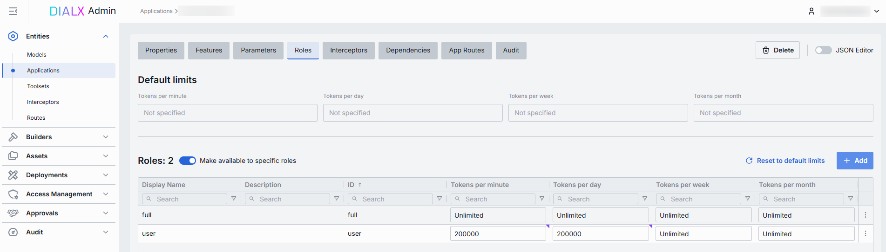

#### Roles grid

| Column | Description |
|--------|-------------|
| **Display Name** | Unique role name. |
| **ID** | Unique role identifier. |
| **Description** | Description of the role (e.g., "Admin, Prompt Engineer, Developer"). |
| **Tokens per minute** | Per-minute token limit for a specific role. Blank = no limits. Inherits the [default value](#default-rate-limits). Can be overridden. |
| **Tokens per day** | Daily token limit for a specific role. Blank = no limits. Inherits the [default value](#default-rate-limits). Can be overridden. |
| **Tokens per week** | Weekly token limit for a specific role. Blank = no limits. Inherits the [default value](#default-rate-limits). Can be overridden. |
| **Tokens per month** | Monthly token limit for a specific role. Blank = no limits. Inherits the [default value](#default-rate-limits). Can be overridden. |
| **Actions** | Additional role-specific actions. When **Make available to specific roles** toggle is off — opens the [Roles](../access-management/roles.md) section in a new tab. When **Make available to specific roles** toggle is on, you can open the [Roles](../access-management/roles.md) section in a new tab, set **Set unlimited**, [Remove](#remove-role) the role from the list, or **Reset to default limits**. |

#### Set rate limits

The Roles grid lists roles that can access a specific application. Here, you can also set individual limits for selected roles. For example, you can give the "Admin" role unlimited monthly tokens but throttle "Developer" to 100,000 tokens/day, or allow the "External Partner" role a small trial quota (e.g., 10,000 tokens/month) before upgrade.

**To set or change rate limits for a role:**

1. Click in the desired cell (e.g., **Tokens per day** for the "ADMIN").
2. Enter a numeric limit or leave blank to set no limits. Click **Reset to default limits** to restore default settings for all roles.
3. Click **Save** to apply changes.

#### Default rate limits

Default rate limits are set for all roles in the **Roles** grid by default; however, you can override them for any role.

| Field | Description |
|-------|-------------|
| **Default tokens per minute** | The maximum tokens any user can consume per minute unless a specific limit is in place. |
| **Default tokens per day** | The maximum tokens any user can consume per day unless a specific limit is in place. |
| **Default tokens per week** | The maximum tokens any user can consume per week unless a specific limit is in place. |
| **Default tokens per month** | The maximum tokens any user may consume per month unless a specific limit is in place. |

#### Role-specific access

Use the **Make available to specific roles** toggle to define access to the application:

- **Off**: Application is callable by any authenticated user. All existing user roles are in the grid.
- **On**: Application is restricted — only selected roles can access the application. If empty, the application is not available to any role.

#### Add a role

You can add a role only if the **Make available to specific roles** toggle is **On**.

1. Click **+ Add** (top-right of the Roles grid).
2. Select one or more roles in the modal. The list of roles is defined in the [Access Management](../access-management/roles.md) section.
3. Confirm to add role(s) to the table.

#### Remove a role {#remove-role}

You can remove a role only if the **Make available to specific roles** toggle is **On**.

1. Click the **actions** menu in the role's row.
2. Choose **Remove** in the menu.

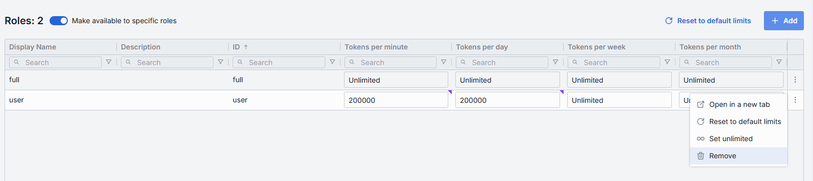

### Interceptors

DIAL uses interceptors to add custom logic to inbound and outbound requests for models and applications, enabling PII obfuscation, guardrails, safety checks, and more.

You can define interceptors in the [Entities → Interceptors](./interceptors.md) section to add them to the processing pipeline of DIAL Core.

**Note**
> Refer to [Interceptors](../../building-with-dial/interceptors/0.index.md) to learn more.

In the **Interceptors** tab of an application configuration, you can preview [global](../1.config-backup-and-global-settings.md#system-properties) interceptors and interceptors defined at the [application runner level](../3.builders.md), and also define local interceptors specific to this application.

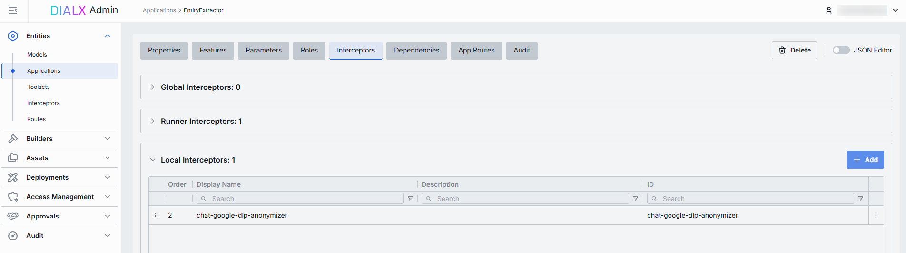

#### The difference between model and application interceptors

**Scope of invocation**

- **Model**: Interceptors are triggered with each request to a model (i.e. before/after the LLM invocation).
- **Application**: Interceptors wrap the entire orchestrated workflow, including multi-model sequences and branching logic.

**Use cases**

- **Model**: Ideal for prompt pre-processing or response transformations that are specific to each LLM.
- **Application**: Manage cross-cutting concerns across the whole application (e.g., tenant-based routing, unified logging, end-to-end policy enforcement).

#### Interceptors grid

| Column | Description |
|--------|-------------|
| **Order** | Execution sequence. Interceptors run in ascending order (1 → 2 → 3...). A request will flow through each interceptor in this order. Response interceptors are invoked in the reversed order. |
| **Display Name** | The interceptor's alias, matching the **Name** field in its definition. |
| **Description** | Free-text summary from the interceptor's definition, explaining its purpose. |
| **ID** | Unique identifier of the interceptor. |
| **Actions** | Additional interceptor-specific actions: open interceptor in a new tab, or [Remove](#remove-interceptor) the selected interceptor from the app's configuration. |

#### Add an interceptor

1. Click **+ Add** (in the upper-right of the interceptors grid).
2. In the **Add Interceptors** modal, choose one or more from the grid of [defined interceptors](./interceptors.md).
3. Click **Apply** to append them to the bottom of the list (added in the same order as selected in the modal).

**Tip**
> If you need a new interceptor, first create it under [Entities → Interceptors](./interceptors.md) and then revisit this tab to attach it to the application's configuration.

#### Reorder interceptors

1. Drag and drop the handle (⋮⋮⋮⋮) to reassign the order in which interceptors are triggered.
2. Release to reposition; order renumbers automatically.
3. Click **Save** to lock in the new execution sequence.

#### Remove an interceptor {#remove-interceptor}

1. Click the actions menu in the interceptor's row.
2. Choose **Remove** to detach it from this application.
3. Click **Save** to lock in the interceptors list.

### Dependencies

In interconnected systems, applications often rely on other applications or AI models to function, forming complex dependency chains. Access to sensitive data in such ecosystems can pose a challenge, especially when multiple applications interact and propagate requests, and may require explicit consent from a user to allow an application or AI model to access their data or perform actions on their behalf.

**Note**
> Refer to [Managing Authorization in Complex Application Ecosystems](../../building-with-dial/working-with-dial-resources/6.auth-matrix-for-apps.md) to learn more.

On this screen, you can find all dependencies configured for the selected application. Administrators can manually add new dependencies (by selecting from available AI models and applications) or remove the existing ones.

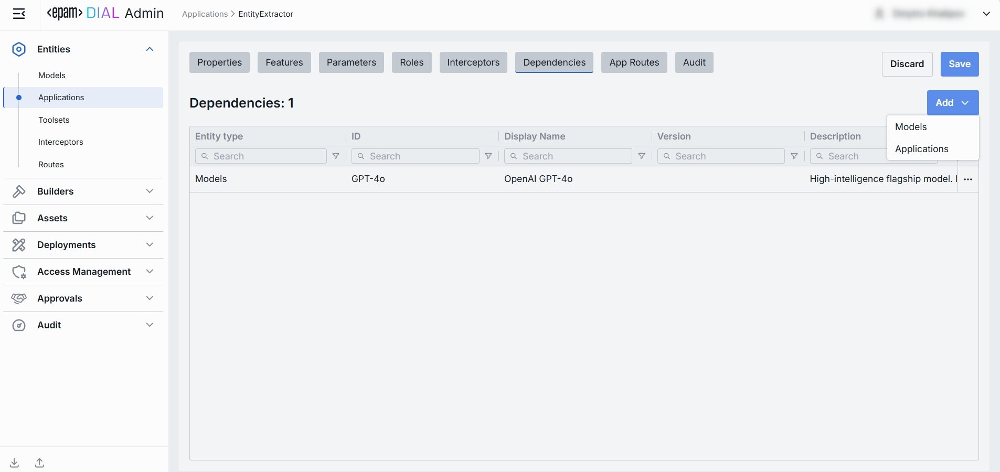

| Column | Description |
|--------|-------------|
| **Entity Type** | Indicates whether the dependent object is an Application or a Model. |
| **ID** | Identifier of the respective model or application. |
| **Display Name** | Descriptive name of the dependent model or application. |
| **Version** | Version of the dependent model. |
| **Description** | Additional textual details about the dependent model or application. |
| **Actions** | Allows opening the dependent object in a new tab or removing it from the list of dependencies. |

#### Add a dependency

1. Click **+ Add** (in the upper-right of the dependencies grid).
2. Select the type of object to add: Application or Model.
3. In the modal window, choose a model or application existing in DIAL from the grid.
4. Click **Add** to append them to the dependencies grid.

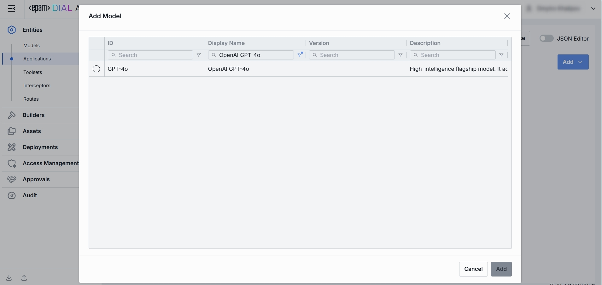

### App routes

In this section, you can define routes that will be used by DIAL Core for interaction with the application via specified endpoints.

If the application is created based on a [specific application runner](../3.builders.md), this tab allows only viewing routes inherited from it. Otherwise, it allows creating, viewing, editing, and deleting routes.

For App Routes, you can choose these HTTP methods: GET, POST, PUT, DELETE, HEAD, and PATCH. OPTIONS and TRACE are not available in App Routes.

**Note**
> Refer to [DIAL Core](https://github.com/epam/ai-dial-core/blob/development/docs/dynamic-settings/routes.md) to learn more about routes.

#### Properties

In the **Properties** sub-tab you can configure the route's identity and request handling behavior.

**Note**
> Configuration of this tab is similar to routes. See [Routes documentation](./routes.md) for more information.

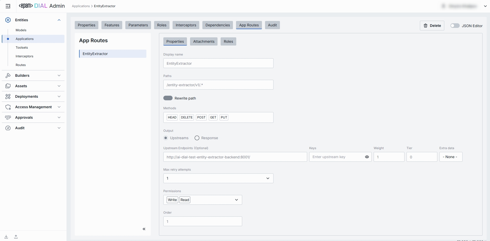

#### Attachments

In the **Attachments** sub-tab you can configure attachment paths for both requests and responses.

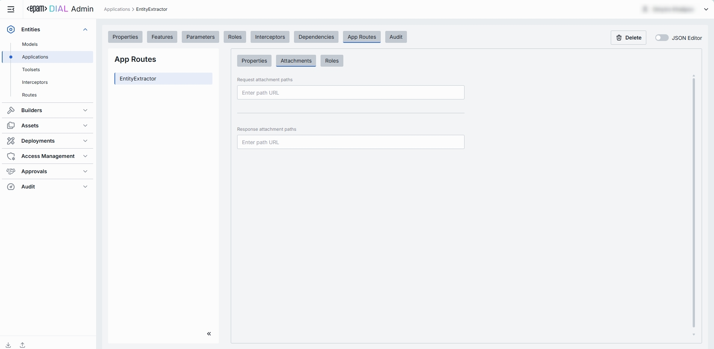

#### Roles

In the **Roles** sub-tab you can configure route-specific role assignments, allowing administrators to control access to each individual route.

**Note**
> Configuration of this tab is similar to routes. See [Routes documentation](./routes.md) for more information.

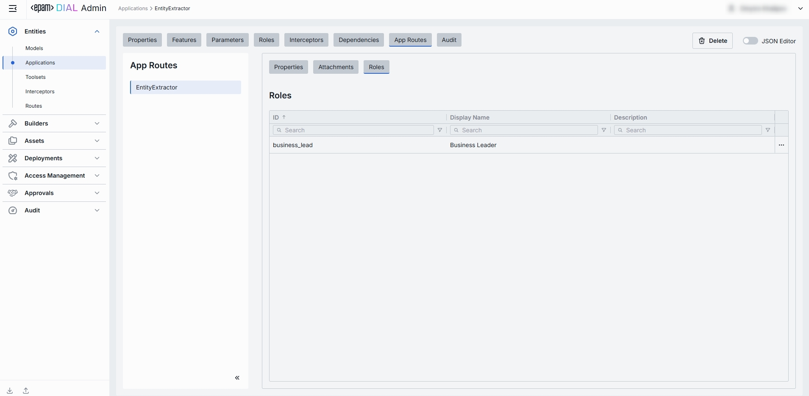

### Audit

In the **Audit** tab, you can monitor key metrics, activities, and usage related to the selected application. This tab provides comprehensive insights into application performance, user interactions, and operational changes. You can track real-time and historical data, identify usage patterns, and audit and roll back all modifications made to the selected application for compliance and troubleshooting purposes.

**Note**
> This section mimics the functionality available in the global [Dashboard and Usage Logs](../audit/monitoring-dashboards.md) and [Activity](../audit/activity-and-rollback.md) sections, but is scoped specifically to the selected application.

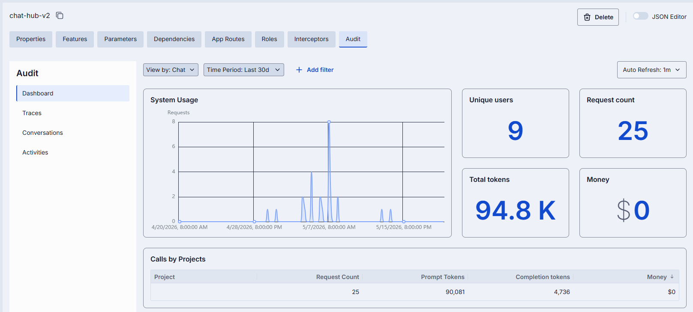

### JSON editor

Advanced users with technical expertise can work with the application properties in a JSON editor view mode. It is useful for advanced scenarios of bulk updates, copy/paste between environments, or tweaking settings not exposed on UI.

**Tip**
> You can switch between UI and JSON only if there are no unsaved changes.

In the JSON editor, you can use the view dropdown to select between Admin format and Core format. These formatting options are for your convenience only and do not render properties as they are defined in DIAL Core. After making changes, the **Sync with core** indicator on the main configuration screen will inform you about the synchronization state with DIAL Core.

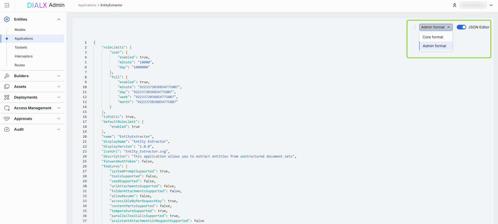

#### Working with the JSON editor

1. Navigate to **Entities → Applications**, then select the application you want to edit.
2. Click the **JSON Editor** toggle (top-right). The UI reveals the raw JSON.
3. Choose between the Admin and Core format to see and work with properties in the necessary format. **Note**: Core format view mode does not render the actual configuration stored in DIAL Core but the configuration in the Admin service displayed in the DIAL Core format.
4. Make changes and click **Save** to apply them.
5. After making changes, the **Sync with core** indicator on the main configuration screen will inform you about the synchronization state with DIAL Core.

### Delete

Use the **Delete** button in the Configuration screen toolbar to permanently remove the selected application.

## Next steps

- [Manage AI model deployments](./models.md) — configure the AI models your applications rely on.
- [Manage interceptors](./interceptors.md) — attach interceptors for content filtering and compliance across your application workflows.
- [Manage roles and access control](../access-management/roles.md) — define who can access each application and at what rate limits.
