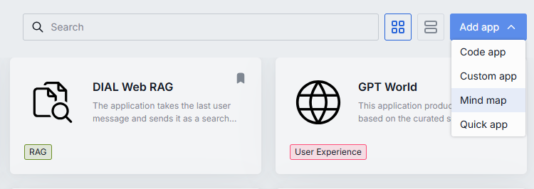
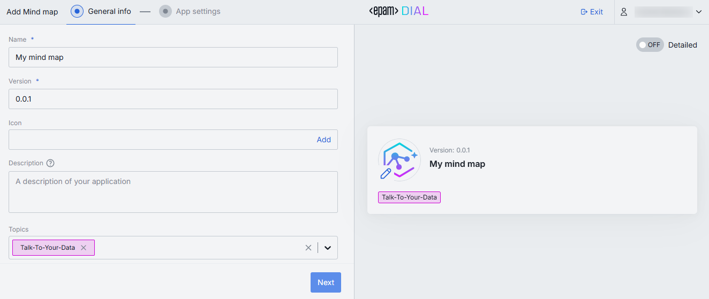
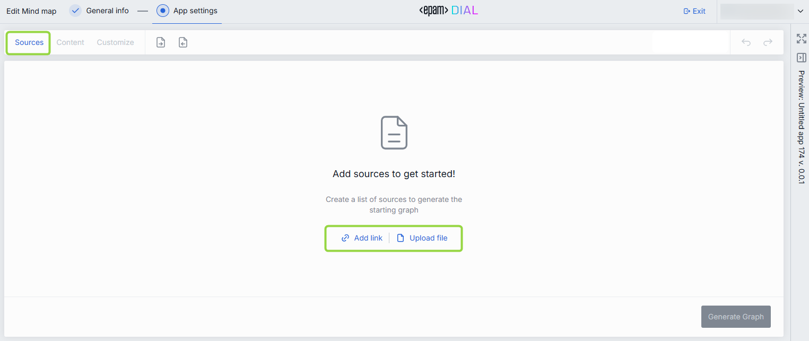
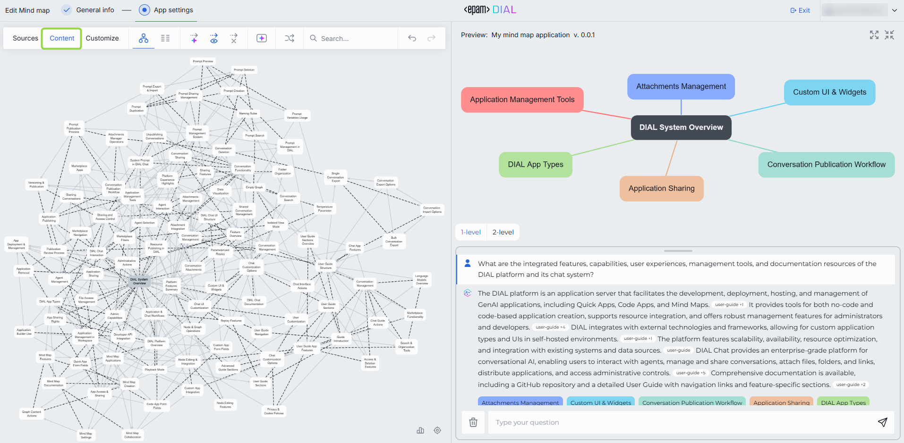
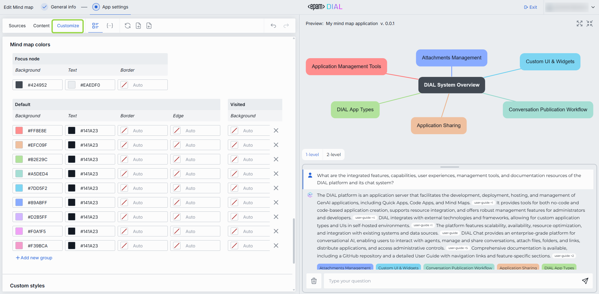

# Author a Mind Map app

This guide walks you through creating a Mind Map Studio knowledge graph in DIAL Chat — from providing sources through customizing the graph appearance.

## Prerequisites

- Access to a DIAL Chat instance with Mind Map Studio enabled
- Source material ready: one or more web URLs, PDF files, or a combination

## Launch Mind Map Studio

1. In [My Workspace](../../../chat-user-guide/0.index.md), click **Add app** and select **Mind Map**.

## Enter general info

2. On the first screen, fill in the application metadata:
   - **Name** — a descriptive title for your knowledge graph.
   - **Version** — version identifier for tracking changes.
   - **Icon** — a custom icon displayed in the Marketplace and My Workspace.
   - **Description** — a short summary rendered in the Marketplace card.

3. Click **Next** to proceed to app settings.

## Add sources

4. In the **Sources** section, provide the raw material for the knowledge graph. Mind Map Studio accepts:
   - **Web URLs** — public web pages.
   - **PDF files** — uploaded documents.
   - **Combinations** — mix URLs and PDFs in a single graph.

5. Click **Generate** to build the knowledge graph from your sources.

The generated graph is deterministic — it represents only information found in the provided sources. The accompanying chatbot answers questions based on the graph content and does not fabricate information beyond what the sources contain.

:::tip
You can return to the Sources section later to add, edit, or remove sources and regenerate the graph.
:::

## Edit content

6. Switch to the **Content** section to review and refine the generated graph. The editor provides:
   - **Graph view** — visual node-and-edge layout. Click nodes to select them, drag to rearrange.
   - **Table view** — tabular listing of all nodes and connections for bulk editing.
   - **Toolbar** — add, remove, or modify nodes and connections in either view.

## Customize appearance

7. Open the **Customize** section to style the knowledge graph and chatbot. You have two editing modes:
   - **Visual editor** — point-and-click controls for colors, fonts, layouts, and chatbot styling.
   - **JSON editor** — direct access to the full theme schema for fine-grained control.

8. To reuse styles across graphs, use **Export** to save your current theme as a JSON file. Use **Import** to apply a previously exported theme.

9. Preview your changes in real time on the **Preview** screen before saving.

## Preview and test

10. Use the live preview to verify both the visual graph and the chatbot:
    - Click nodes to confirm navigation works as expected.
    - Ask the chatbot questions to verify it responds with source-grounded answers.
    - Check that the visual styling matches your requirements.

When you are satisfied with the result, click **Save and exit** to register the application in DIAL.

## Next steps

- [Export and publish a Mind Map app](export-and-publish.md) — share or publish your completed graph
- [Mind Map Studio overview](0.index.md) — architecture, use cases, and limitations
- [When to use which app type](../when-to-use-which.md) — compare Mind Map Studio with other DIAL app types
