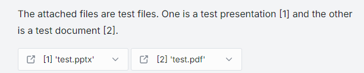
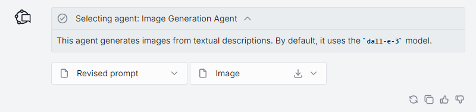
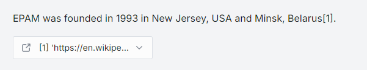
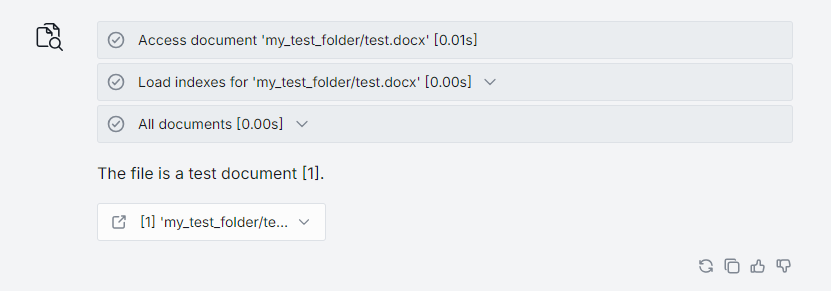
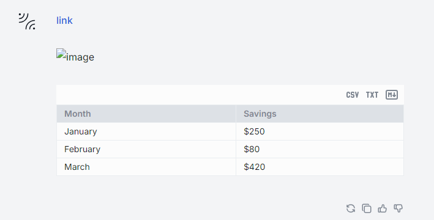
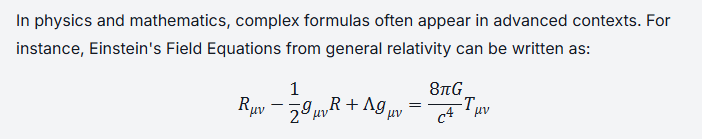
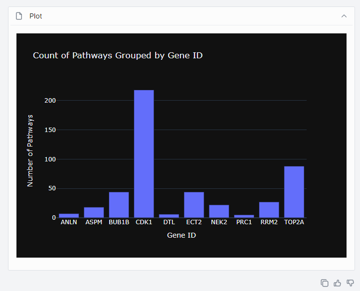

# Custom content in Chat

This reference describes the `custom_content` extension to the DIAL [Unified API](https://dialx.ai/dial_api#/paths/~1openai~1deployments~1%7BDeployment%20Name%7D~1chat~1completions/post) chat completion endpoint. Applications use `custom_content` to send rich content—attachments, progress stages, Markdown, visualizers, and Plotly charts—that DIAL Chat renders in the conversation UI.

## Where `custom_content` appears

`custom_content` is a DIAL-specific field in the **HTTP response body** of a chat completion call. When your application responds to a user message, it can include `custom_content` alongside the standard `content` field. DIAL Chat reads `custom_content` and renders the appropriate UI elements.

If you build your application with the [DIAL SDK](https://github.com/epam/ai-dial-sdk), the SDK produces this JSON for you—you call Python methods like `choice.add_attachment()` or `choice.create_stage()`, and the SDK serializes them into the wire format shown below. See the [Chat completion SDK reference](../sdk-reference/chat-completion/0.index.md) for the Python API.

If you build without the SDK (for example, in another language), your application must return this JSON structure directly in the HTTP response body.

## Attachments

An attachment is a file, image, URL, or folder that an application includes in its response. Attachments render in the Chat UI where users can view, download, or share them. Attached files are stored in the blob storage configured in DIAL Core.

Each attachment declares a `type` following the [MIME standard](https://developer.mozilla.org/en-US/docs/Web/HTTP/Basics_of_HTTP/MIME_types/Common_types) and can be either a URL reference (pointing to a file in DIAL storage) or a base64-encoded string (inline data).

### Attachment fields

| Field | Type | Description |
|---|---|---|
| `type` | string | MIME type of the attachment (for example, `application/pdf`, `image/png`). |
| `title` | string | Display name shown in the Chat UI. |
| `url` | string | Path to a file in DIAL storage (for example, `files/bucket/folder/file.pdf`). |
| `data` | string | Inline content—either plain text or a base64-encoded string. Use instead of `url` for small payloads. |
| `reference_url` | string | An external URL associated with the attachment (rendered as a clickable link). |
| `index` | integer | Position of the attachment when returning multiple attachments. |

For the complete field list, see the [Unified API specification](https://dialx.ai/dial_api#/paths/~1openai~1deployments~1%7BDeployment%20Name%7D~1chat~1completions/post).

### Document

Applications can return documents (PDF, DOC/DOCX, PPT/PPTX, TXT, and other plain text formats) as attachments. The following JSON shows the structure inside the HTTP response body:

```json
"custom_content": {
  "attachments": [
    {
      "type": "application/pdf",
      "title": "test.pdf",
      "url": "files/bucket/my_test_folder/test.pdf"
    }
  ]
}
```

With the DIAL SDK, the equivalent Python code is:

```python
with response.create_single_choice() as choice:
    choice.add_attachment(
        type="application/pdf",
        title="test.pdf",
        url="files/bucket/my_test_folder/test.pdf",
    )
```

DIAL Chat renders the attachment as a downloadable file card:



### Image

DIAL Chat natively renders image attachments. Supported MIME types:

```text
image/jpeg    image/png     image/gif     image/apng    image/webp
image/avif    image/svg+xml image/bmp     image/vnd.microsoft.icon
image/x-icon
```

Response body structure:

```json
"custom_content": {
  "attachments": [
    {
      "index": 1,
      "type": "image/png",
      "title": "Generated chart",
      "url": "files/file_bucket/appdata/app_name/images/chart.png"
    }
  ]
}
```

With the DIAL SDK:

```python
with response.create_single_choice() as choice:
    choice.add_attachment(
        type="image/png",
        title="Generated chart",
        url="files/file_bucket/appdata/app_name/images/chart.png",
    )
```



### URL

Applications can return a URL with optional Markdown-formatted context. The `reference_url` field renders as a clickable link, and `data` provides the text body.

Response body structure:

```json
"custom_content": {
  "attachments": [
    {
      "index": 0,
      "type": "text/markdown",
      "title": "Search result",
      "data": "Summary of the linked page in Markdown format.",
      "reference_url": "https://example.com/article"
    }
  ]
}
```

With the DIAL SDK:

```python
with response.create_single_choice() as choice:
    choice.add_attachment(
        type="text/markdown",
        title="Search result",
        data="Summary of the linked page in Markdown format.",
        reference_url="https://example.com/article",
    )
```



### Folder

Applications can return a reference to an entire folder in DIAL file storage. The folder renders as a navigable container in the Chat UI.

Response body structure:

```json
"custom_content": {
  "attachments": [
    {
      "index": 1,
      "type": "application/vnd.dial.metadata+json",
      "title": "Output files",
      "url": "files/file_bucket/appdata/app_name/output/"
    }
  ]
}
```

## Stages

Stages represent intermediate processing steps that your application reports while generating a response—for example, "Searching knowledge base," "Loading document indexes," or "Generating answer." They appear as expandable progress indicators in the Chat UI.

Each stage has a `name`, a `status` (`completed` or `failed`), optional `content` (text displayed when the stage is expanded), and optional nested `attachments`.

### Stage fields

| Field | Type | Description |
|---|---|---|
| `index` | integer | Position of the stage in the sequence. |
| `name` | string | Label shown in the Chat UI (for example, `"Load indexes [0.01s]"`). |
| `status` | string | Either `"completed"` or `"failed"`. |
| `content` | string | Text displayed when the user expands the stage. |
| `attachments` | array | Optional attachments nested inside the stage (same structure as top-level attachments). |

Response body structure:

```json
"custom_content": {
  "stages": [
    {
      "index": 0,
      "name": "Access document 'report.docx' [0.01s]",
      "status": "completed"
    },
    {
      "index": 1,
      "name": "Load indexes [0.00s]",
      "status": "completed",
      "content": "Number of chunks: 1\nTotal text size: 23 bytes"
    },
    {
      "index": 2,
      "name": "Retrieved documents [0.00s]",
      "status": "completed",
      "attachments": [
        {
          "index": 0,
          "type": "text/markdown",
          "title": "[0] 'report.docx'",
          "data": "This is the document content.",
          "reference_url": "files/<BUCKET_ID>/report.docx"
        }
      ]
    }
  ]
}
```

With the DIAL SDK, you create stages using `choice.create_stage()`. The SDK serializes them into the JSON above:

```python
with response.create_single_choice() as choice:
    with choice.create_stage("Access document 'report.docx'") as stage:
        stage.append_content("Document loaded successfully.")

    with choice.create_stage("Retrieved documents") as stage:
        stage.add_attachment(
            type="text/markdown",
            title="[0] 'report.docx'",
            data="This is the document content.",
            reference_url="files/<BUCKET_ID>/report.docx",
        )

    choice.append_content("Here is the answer based on the document.")
```

For the full Stage Python API, see [Stage](../sdk-reference/chat-completion/4.stage.md) in the SDK reference.



## Markdown

DIAL Chat automatically renders Markdown in the `content` field of any message—no `custom_content` wrapper needed. Tables, links, inline images, and code blocks all render natively.

```json
{
  "role": "assistant",
  "content": "| Month    | Savings |\n| -------- | ------- |\n| January  | $250    |\n| February | $80     |"
}
```

With the DIAL SDK, write Markdown directly via `choice.append_content()`:

```python
with response.create_single_choice() as choice:
    choice.append_content("| Month | Savings |\n| --- | --- |\n| January | $250 |")
```



## LaTeX formulas

DIAL Chat supports the Markdown LaTeX format for rendering mathematical formulas. Models that produce LaTeX output (such as GPT-4) have their formulas rendered automatically—no special configuration required.



## Visualizers

Visualizers are standalone web applications that render specific content types inside an iframe in DIAL Chat. DIAL Chat includes a built-in visualizer for [Plotly](#plotly). For other content types, you can build a custom visualizer using the [ChatVisualizerConnector](https://github.com/epam/ai-dial-chat/blob/development/libs/chat-visualizer-connector/README.md) library—see [Create a custom visualizer](3.create-custom-visualizer.md) for a step-by-step tutorial.

Custom visualizers require two DIAL Chat environment variables: `ALLOWED_IFRAME_SOURCES` and `CUSTOM_VISUALIZERS`. See [DIAL Chat configuration](../../../operating-dial/configuration/3.chat-configuration.md) for details.

## Plotly

DIAL Chat has built-in support for the [Plotly](https://plotly.com/javascript/) data visualization library. To include a Plotly chart in your application response, add an attachment with the MIME type `application/vnd.plotly.v1+json`. The attachment points to a JSON file in DIAL storage containing a standard [Plotly JSON schema](https://plotly.com/chart-studio-help/json-chart-schema/) (`data`, `layout`, and optional `frames`).

Response body structure:

```json
"custom_content": {
  "attachments": [
    {
      "index": 1,
      "type": "application/vnd.plotly.v1+json",
      "title": "Sales by quarter",
      "url": "files/bucket/appdata/app_name/chart.json"
    }
  ]
}
```

With the DIAL SDK:

```python
with response.create_single_choice() as choice:
    choice.add_attachment(
        type="application/vnd.plotly.v1+json",
        title="Sales by quarter",
        url="files/bucket/appdata/app_name/chart.json",
    )
```



For more on rendering visual content in Chat, see [Data visualization](2.data-visualization.md).

## Next steps

- [Data visualization](2.data-visualization.md) — how to render Plotly charts and Markdown content in Chat
- [Create a custom visualizer](3.create-custom-visualizer.md) — build a visualizer for custom content types
- [Chat completion SDK reference](../sdk-reference/chat-completion/0.index.md) — Python SDK classes for producing `custom_content`
