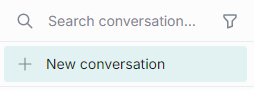
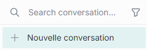

# Chat localization

This guide explains how to customize the text of UI elements in DIAL Chat using the [next-i18next](https://github.com/i18next/next-i18next) internationalization framework. You should be familiar with deploying DIAL Chat and editing its configuration files.

**Note**
> DIAL Chat currently supports only the `en` locale folder for text overrides. Full multi-language support is on the roadmap.

## Prerequisites

- A deployed DIAL Chat instance
- Access to the DIAL Chat filesystem or deployment configuration

## Step 1: Create the locales directory

DIAL Chat looks for translation overrides in the `locales/` directory inside its public assets folder. In the [DIAL Chat repository](https://github.com/epam/ai-dial-chat), this is located at `apps/chat/public/locales/`. If you deploy Chat via Docker, mount your custom `locales/` directory to the same path inside the container.

Create a sub-folder for the target language (currently only `en`):

```text
apps/chat/public/locales/
└── en/
    ├── chat.json
    ├── common.json
    ├── markdown.json
    ├── promptbar.json
    ├── settings.json
    ├── sidebar.json
    ├── files.json
    └── header.json
```

Each JSON file corresponds to a UI area:

| File | UI area |
|---|---|
| `chat.json` | Chat conversation area |
| `common.json` | Shared labels and buttons |
| `markdown.json` | Markdown-related UI text |
| `promptbar.json` | Prompt list panel |
| `settings.json` | Settings dialog |
| `sidebar.json` | Conversation list panel |
| `files.json` | File management UI |
| `header.json` | Header bar |

## Step 2: Provide translations

In each JSON file, add key-value pairs where the key is the original English text and the value is the replacement text. Only the pairs you provide are overridden—unlisted strings keep their defaults.

For example, to translate "New conversation" in the sidebar to French, add to `apps/chat/public/locales/en/sidebar.json`:

```json
{
  "New conversation": "Nouvelle conversation"
}
```

Before:



After:



## Step 3: Apply changes

Add the updated `locales` directory to your DIAL Chat deployment. You do not need to rebuild the application—the changes take effect on the next page load.

## Next steps

- [Theming and design](5.theming-and-design.md) — customize the Chat layout, color scheme, and branding
- [DIAL Chat configuration](../../../operating-dial/configuration/3.chat-configuration.md) — environment variables and feature flags for Chat
- [Custom content in Chat](1.custom-content.md) — render rich content in Chat responses
