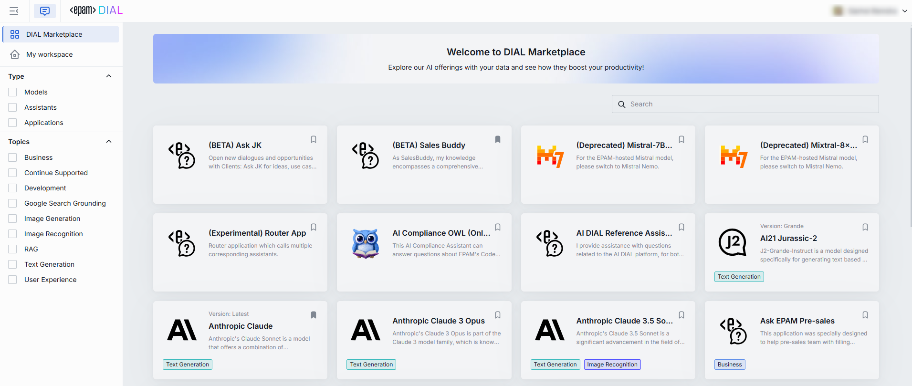

# Marketplace

DIAL Marketplace is the central hub where users discover and launch all applications, agents, tools, and models available in a DIAL environment. This page explains what Marketplace is, how it fits into the platform, and how the SaaS and On-Prem editions differ. For step-by-step instructions on using Marketplace as an end user, see the [Chat User Guide](../../../chat-user-guide/3.marketplace-and-apps.md).

## What Marketplace provides

Marketplace serves three roles:

- **Discovery** — a single entry point for all AI assets in your organization. Users browse, search, and launch models and applications without needing to know deployment details.
- **Collaboration** — users can share applications with colleagues, granting either editing rights or use-only permissions. Published applications go through an approval workflow before becoming available to the wider organization.
- **Development studio** — agent builders such as [Quick Apps](../../../chat-user-guide/3.marketplace-and-apps.md) and Code Apps let users create applications using low-code and no-code wizards directly from Marketplace. Pre-built agents can be used as building blocks in new applications.

## SaaS vs On-Prem editions

| Capability | SaaS | On-Prem |
|---|---|---|
| Browse and launch models and applications | Yes | Yes |
| Share applications with colleagues | Yes | Yes |
| Publish applications to the organization | Verified and approved by administrators | Controlled by the organization's own approval workflow |
| Agent builders (Quick Apps, Code Apps) | Available | Available |
| Hosting and infrastructure | Managed by DIAL | Managed by the organization |

In the SaaS edition, only applications verified and approved by administrators get published. This ensures security and safety for all users. In the On-Prem edition, organizations control the approval process and can customize it to their governance requirements.

## How publishing works

1. A developer or user creates an application in Marketplace.
2. They share it with colleagues for feedback or publish it to a wider audience.
3. Published applications enter an approval queue visible to administrators in the [DIAL Admin panel](../../../operating-dial/configuration/3.chat-configuration.md).
4. After approval, the application appears in Marketplace for all permitted users.

The permissions model integrates with the organization's identity provider. Access to specific applications can be scoped by role, team, or individual.

## Next steps

- [Chat customization overview](0.index.md) — all Chat customization topics
- [Custom content in Chat](1.custom-content.md) — render rich content in application responses displayed in Marketplace
- [DIAL Chat configuration](../../../operating-dial/configuration/3.chat-configuration.md) — enable or disable Marketplace via feature flags
