# Integration with Microsoft Copilot

This guide shows how to create a Microsoft Power Platform connector for DIAL and use it in Microsoft Copilot Studio prompt flows. It is for developers who want to call DIAL from Copilot-based business solutions. You need access to Microsoft Copilot Studio, an Azure tenant with permission to register applications, and a running DIAL instance.

**Tip**
> Watch a [demo video](../../../demos/6.integrations.md#microsoft-copilot) to see this integration in action.

DIAL supports two authentication types for the connector:

- **End-user identity (OAuth2)** — each user authenticates with their own identity.
- **API key** — a shared key authenticates all requests.

Choose the section that matches your authentication type and network setup.

## Limitations

- Copilot Studio agents cannot receive attachments. The underlying model supports attachments, but Copilot users cannot pass them to an agent through the UI or the API. See the Copilot Studio [documentation](https://learn.microsoft.com/en-us/microsoft-copilot-studio/publication-fundamentals-publish-channels?tabs=web).
- Copilot Studio does not support image generation or diagramming. See the Microsoft [community forum](https://community.powerplatform.com/forums/thread/details/?threadid=178879d8-dd5e-4d10-99df-4e8293affb6e).

## Authenticate with end-user identity (OAuth2)

**Prerequisites:**

- DIAL API is exposed to the internet (required for OAuth2).
- The DIAL API application registration in Azure has an Application ID URI and at least one scope configured under **Expose API**. The DIAL Application ID is known.
- The OpenAPI definition YAML file for the DIAL API is available.

### Step 1: Register an Entra ID application

Create an Entra ID application registration for the custom connector:

1. In **Entra ID -> App registrations**, click **New registration**.
2. Enter a **Name**, leave the remaining fields as is, and click **Register**.
3. In the new registration, go to **Certificates & secrets** and click **New client secret**.

   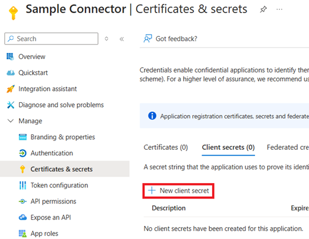

4. Enter a **Name** for the secret and click **Add**.
5. Copy the generated secret value to a secure location for later retrieval.
6. Go to **API permissions** and click **Add a permission**.

   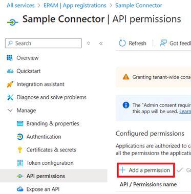

7. On the **APIs my organization uses** tab, find the application registration associated with the DIAL API.

   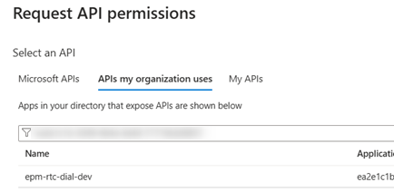

8. Select all scopes exposed by the DIAL application registration and click **Add permissions**.

   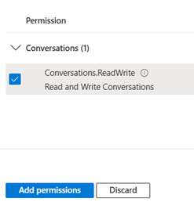

### Step 2: Create the connector in Copilot Studio

1. In the custom topic where DIAL needs to be called, click **+**, select **Call an action**, and then select **Add a plugin action** on the **Plugin** tab.

   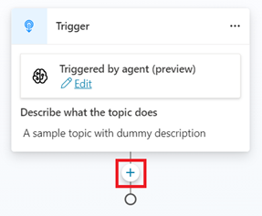

   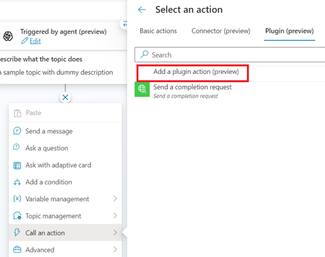

2. Click **Custom connector** and select **Add an API for a custom connector**.

   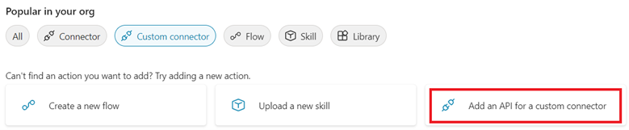

3. At the **Upload specification** step, select the DIAL API YAML specification file and click **Next**.

   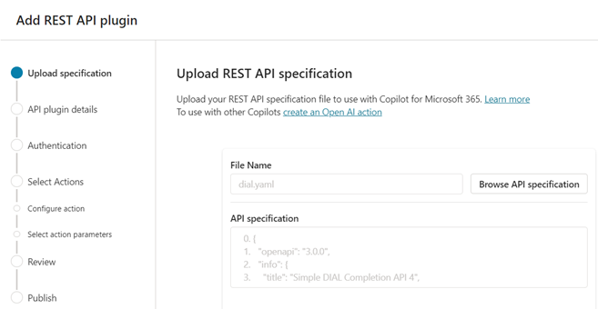

4. Enter the API plugin details and click **Next**. To add the connector to an existing Power Platform solution, select that solution in the corresponding field.

   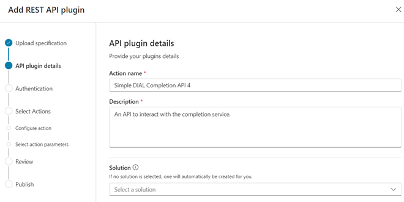

5. At the **Authentication** step, select **OAuth (2.0)** and populate the fields:

   - **Client ID** — the GUID from the **Application (client) ID** property of the connector's application registration.
   - **Client Secret** — the secret generated when creating the application registration.
   - **Authorization URL** — `https://login.microsoftonline.com/<TENANT>/oauth2/v2.0/authorize`, where `<TENANT>` is your Entra ID tenant identifier.
   - **Token URL** — `https://login.microsoftonline.com/<TENANT>/oauth2/v2.0/token`
   - **Refresh URL** — `https://login.microsoftonline.com/<TENANT>/oauth2/v2.0/token`
   - **Scope** — `openid profile email offline_access <DIAL_APPLICATION_ID>/.default`, where `<DIAL_APPLICATION_ID>` is the application identifier of the DIAL API.

6. At the **Select Actions** step, select the API method to call (for example, completion).

   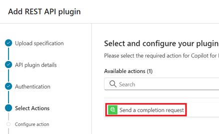

7. Enter the action **Name** and **Description**.
8. Enter a description for every input and output parameter.
9. Proceed to publish.
10. In Copilot Studio, go to **Solutions** and choose the solution created with the custom connector. It has the same name as the connector.

    

11. Find the custom connector in the solution and click it.
12. Copy the redirect URL shown on the connector page.

    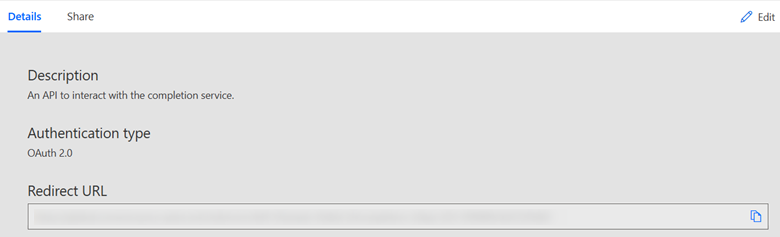

13. Open the Azure application registration created in Step 1 and go to **Authentication**.

    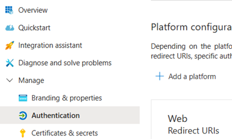

14. Click **Add platform**, select **Web**, paste the redirect URL, and click **Configure**.
15. Add the connector actions to the prompt flow within the Copilot Studio topic.

## Authenticate with an API key (DIAL exposed to the internet)

**Prerequisites:**

- DIAL API is exposed to the internet.
- The OpenAPI definition YAML file for the DIAL API is available.

1. Perform steps 1–4 of [Step 2: Create the connector in Copilot Studio](#step-2-create-the-connector-in-copilot-studio).
2. Select **API Key** as the authentication type and populate the required fields.

   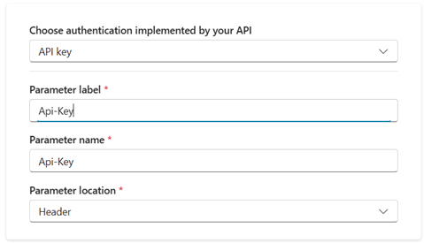

3. Perform steps 6–9 of [Step 2: Create the connector in Copilot Studio](#step-2-create-the-connector-in-copilot-studio).

## Authenticate with an API key (DIAL not exposed to the internet)

**Prerequisites:**

- An [on-premises data gateway](https://learn.microsoft.com/en-us/data-integration/gateway/service-gateway-install) is installed in the on-premises network, and the DIAL API is reachable from the machine it runs on.
- The OpenAPI definition YAML file for the DIAL API is available.

1. Patch the OpenAPI definition YAML file to add an API key parameter to each method:

   ```yaml
   - name: Api-Key
     in: header
     required: true
     schema:
       type: string
   ```

2. Perform steps 1–4 of [Step 2: Create the connector in Copilot Studio](#step-2-create-the-connector-in-copilot-studio).
3. Select **None** as the authentication type.
4. Perform steps 6–9 of [Step 2: Create the connector in Copilot Studio](#step-2-create-the-connector-in-copilot-studio).
5. In Copilot Studio, go to **Solutions** and choose the solution created with the custom connector. It has the same name as the connector.

   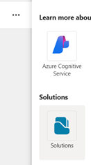

6. Find the custom connector in the solution and click it.
7. On the Power Automate page for the connector, click **Edit**.
8. Select **Connect via on-premises data gateway** in the connector properties and update the definition.

   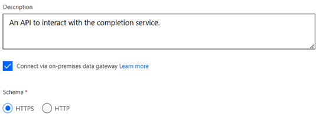

9. When creating a connection for later use, the connector administrator selects the on-premises data gateway.

   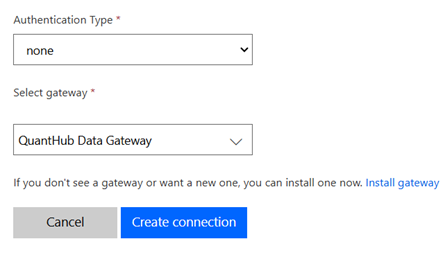

## Related tasks

- [Integration with Microsoft Teams](1.ms-teams.md) — bring DIAL into Microsoft Teams through a custom bot
- [Chatbot integrations](0.index.md) — all chatbot integration guides

## Next steps

- [Unified API reference](https://dialx.ai/dial_api) — the DIAL API methods your connector calls
- [Integrations overview](../0.index.md) — explore other ways to connect DIAL with external systems
