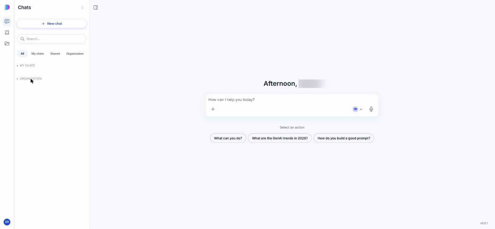

# Overview and interface

This guide shows you how to use DIAL Chat — the web interface most people use to work with DIAL every day. This page introduces the interface layout and the main areas you will use. It is for end users who interact with models and applications through DIAL Chat. No technical background is required.

DIAL Chat is an enterprise-grade application that serves as the default web interface for DIAL users, giving access to the full set of DIAL features.

**Note**
> This guide covers the standard DIAL Chat interface. Self-hosted deployments can replace parts of it with custom interfaces, which are out of scope here.

## Standard interface components

The DIAL Chat interface has several main areas:

1. **Navigation rail** — switch between the three main sections of DIAL Chat: **Chats**, **Catalog**, and **Files**.
2. **Chats** — access and manage your conversations, grouped into **My chats**, **Shared**, and **Organization**. See [Conversations](./1.conversations.md).
3. **Chat area** — enter a prompt, view results, and interact with conversational agents. See [Conversations](./1.conversations.md).
4. **Agent selector** — view and change the agent you are talking to, before or during a conversation.
5. **Composer menu** — attach files, browse prompts, and open conversation settings from the **+** icon next to the message box.
6. **Catalog** — browse all models, agents, toolsets, skills, and prompts available in your DIAL environment, and create new ones. See [Catalog](./2.catalog.md).
7. **Files** — manage your files. See [Files](./6.files.md).

The navigation rail on the far left switches between the three main sections:

## Custom interfaces

The standard DIAL Chat interface is designed for typical conversational applications. To support applications that need more than a chat interface, DIAL allows application types with a fully custom interface — even one that is not chat-like — which can replace the standard chat interface when you interact with that application.

## Next steps

- [Conversations](./1.conversations.md) — start chatting, attach files, and manage your conversation history
- [Catalog](./2.catalog.md) — find agents and models, and add them to your favorites
- [Usage and settings](./8.usage-and-settings.md) — track usage, set keyboard shortcuts, and configure conversation defaults
