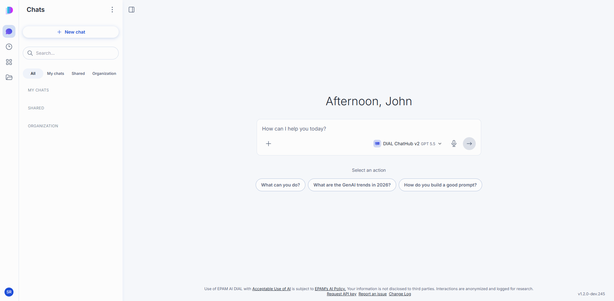

# Overview and interface

DIAL Chat is the default conversational interface for DIAL. From a single application, users can chat with AI models and agents, browse available resources in the Catalog, manage files, share and publish content across the organization, and build new applications using no-code editors. What each user sees is determined by their organization's access-control policies.

> This guide covers the standard DIAL Chat interface. Self-hosted deployments can customize or replace parts of it, which is out of scope here.

## Interface areas

The interface is organized into three sections, accessible from the navigation rail on the left:

- **Chats** — your conversations with AI models and agents, grouped into **My chats**, **Shared**, and **Organization**. The central chat area is where you compose messages, view responses, pick an agent, and attach files. See [Conversations](./1.conversations.md).
- **Catalog** — all models, agents, toolsets, skills, and prompts available in your environment. Browse, favorite, and create new ones. See [Catalog](./2.catalog/0.index.md).
- **File Manager** — upload, organize, and manage files you use in conversations. See [File Manager](./3.files.md).

Some applications replace the standard chat interface entirely with a custom UI — for example, a mind-map application renders an interactive canvas instead of a message thread.

## Next steps

- [Conversations](./1.conversations.md) — start chatting, attach files, and manage your conversation history
- [Catalog](./2.catalog/0.index.md) — find agents and models, and add them to your favorites
- [Usage and settings](./5.usage-and-settings.md) — track usage, set keyboard shortcuts, and configure conversation defaults
