# Conversations

This page shows you how to hold and manage conversations in DIAL Chat: send prompts, work with responses and attachments, choose an agent, adjust conversation settings, and manage your conversation list. It is for end users of DIAL Chat. No technical background is required. To share or publish a conversation, see [Sharing and publishing](./7.sharing-and-publishing.md).

In DIAL, a conversation is a dialogue between you and an agent — a language model or an application. Within one conversation you can refer to earlier questions and answers, but different conversations do not share context.

**Note**
> All your conversations are stored on the server, so you can access them from any device.

## The chat area

The chat occupies the central part of the main screen. Here you enter messages, see replies, and run supported tasks based on the agent and conversation settings.

## Work with prompts in a conversation

### Enter a prompt

Enter your prompt in the text box.

If the selected agent supports voice input, a microphone icon appears next to the composer. Click it to record a message instead of typing; click it again to stop. Depending on your deployment, the recording is either transcribed into the text box or attached as an audio file (the default in most deployments).

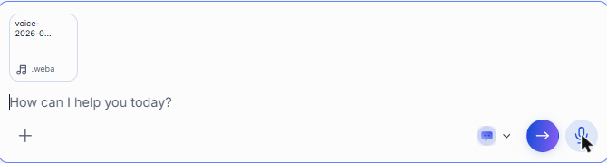

You can also insert a saved prompt: click the **+** icon in the composer and select **Prompts**. The submenu shows **My Collection** — prompts you starred — and a link to the **Catalog**, where you can browse and select any available prompt. Selecting a prompt inserts its text into the composer. See [Prompts](./3.prompts.md) for how to create and manage prompts.

### Edit and delete messages

Each message shows an **Edit** and a **Delete** icon.

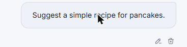

- **Edit** — edit a message in the ongoing conversation. You can also attach a file to the edited message. Click **Save & Submit** to regenerate the response, or **Cancel** to discard your changes. After you save an edit, the response is regenerated and all messages after the edited one are deleted.

  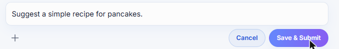

- **Delete** — delete a message in the ongoing conversation. The corresponding response is deleted too.

## Work with responses

Each response shows a row of action icons, in this order: **Regenerate**, **Copy**, **Copy as Markdown**, **Like**, and **Dislike**.

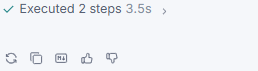

### Copy a response

Two icons let you reuse a response elsewhere:

- The document icon copies the response as plain text.
- The **MD** icon copies the response as Markdown.

### Regenerate

Click **Regenerate** to generate a new answer to the same prompt.

### Like or dislike a response

Use likes to highlight valuable responses and dislikes to mark responses you find unhelpful or incorrect.

- **Like** — click the thumbs-up icon. It highlights immediately; click it again to undo.

  

- **Dislike** — click the thumbs-down icon to open the **Send negative feedback** dialog. Choose a feedback type from the dropdown and, optionally, add a comment, then click **Send**.

  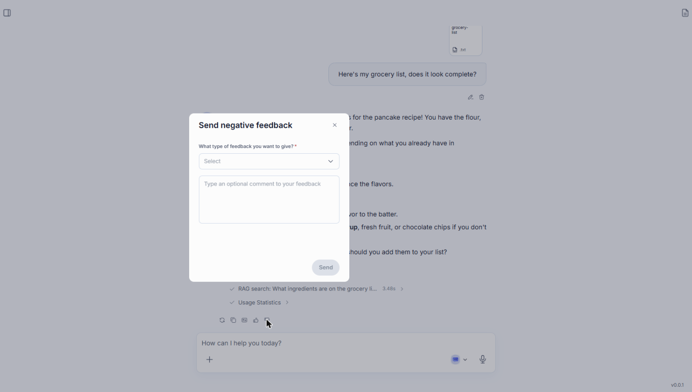

  **Note**
  > The list of available feedback types can change over time.

## Conversation stages

When an agent performs tool calls, document retrieval, or multi-step reasoning while generating a response, DIAL Chat shows that work as a list of steps. Each step shows its status (running, completed, or failed) and how long it took. Click a step to expand it and see its details.

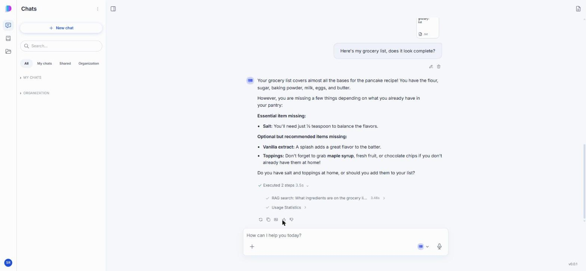

## Sources panel

Click the panel icon in the top-right corner of the chat area to open the sources panel. It lists the files you uploaded for the conversation and any sources the agent found or generated while answering — for example, retrieved documents or generated artifacts. Click an entry to preview it inline (supported for file types such as images and PDFs) or download it.

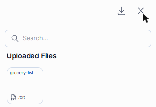

## Work with attachments

Some models and applications (for example, DIAL RAG) support attachments — files and folders. When supported, click the **+** icon in the composer to attach one.

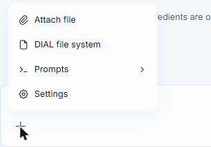

- **Attach file** — upload a file from your device.
- **DIAL file system** — select a file or folder you already have in [Files](./6.files.md).

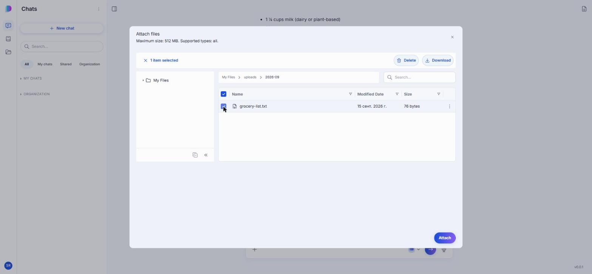

The attachment appears in the composer, above the text box, and becomes available to the agent when you send your message.

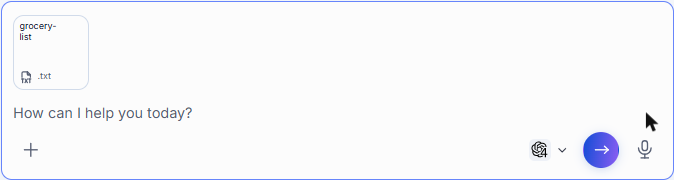

**Note**
> Attached files are available in [Files](./6.files.md).

## Choose and change the agent

In DIAL Chat you converse with agents: models and applications. You find available agents in the [Catalog](./2.catalog.md) and add them to your favorites.

Click the agent selector next to the composer — it shows the name of the currently selected agent — to open a popup with a search box, **My Collection**, your **Favorites**, and a link to the **Catalog** to find more agents.

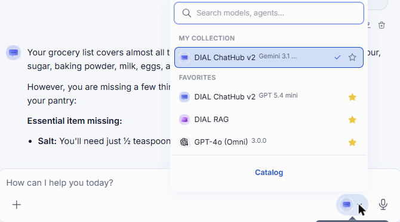

This same control is available before you start a conversation and at any point during it, including after the agent has already replied. Selecting a different agent switches it for the rest of the conversation; DIAL Chat posts an inline notice confirming the switch.

**Note**
> You can't change the agent while a response is still streaming.

## Conversation settings

**Note**
> Conversation settings vary by agent. Some agents have no configurable settings.

Click the **+** icon in the composer and select **Settings** to open the conversation settings, available before and during a conversation:

- **Response format** — choose whether the agent's response renders as **Markdown** or **Plain text**.
- **System prompt** — the initial set of instructions you give the model. It guides the model to stay aligned with the intended purpose and outcome of the conversation.

Click **Apply changes** to save.

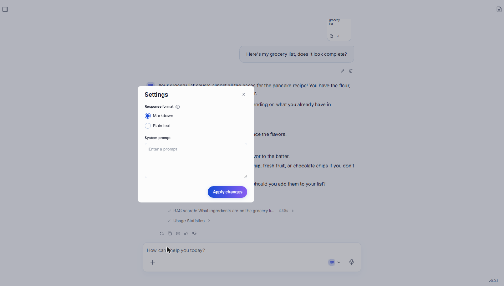

## The conversation actions menu

Hover over a conversation in the **Chats** panel and click the **...** icon to open its actions menu.

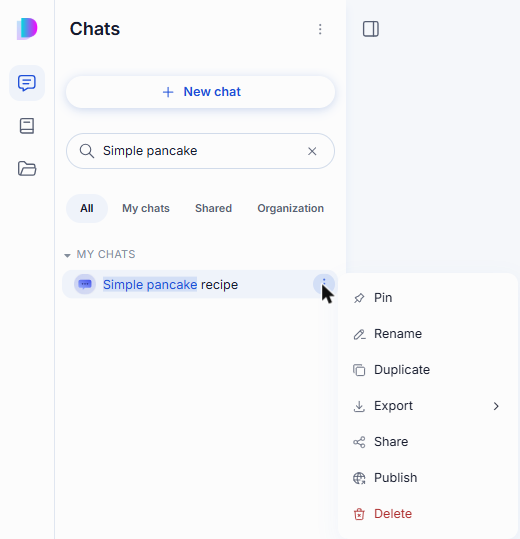

**Note**
> Available actions vary by conversation. A conversation shared with you or published to your organization only offers **Pin**, **Duplicate**, **Export**, and (for a conversation shared with you) **Remove from my list** — **Rename**, **Share**, **Publish**, and **Delete** are unavailable for it.

The supported actions are:

- **Pin** — keep a conversation at the top of your list.
- **Rename** — rename a conversation. See [Rename a conversation](#rename-a-conversation).
- **Duplicate** — create your own editable copy of a conversation. See [Duplicate](#duplicate).
- **Export** — export a conversation. See [Export](#export).
- **Share**, **Publish** — see [Sharing and publishing](./7.sharing-and-publishing.md).
- **Delete** — delete a single conversation. See [Delete](#delete).

## Search and filter

Use the **Search** box to find conversations by name. Use the tabs below it to filter the list:

- **All** — every conversation you can see, grouped into My Chats, Shared, and Organization.
- **My chats** — conversations you own.
- **Shared** — conversations others shared directly with you.
- **Organization** — conversations published to your organization.

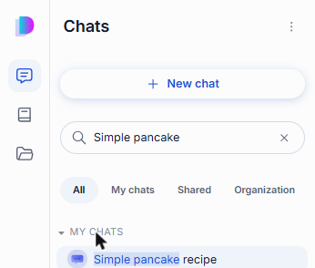

## Create a conversation

There are several ways to start a conversation with an [agent](#choose-and-change-the-agent):

- Start typing in the chat box to talk to the current agent.
- Click **New chat**.
- In the [Catalog](./2.catalog.md), open an agent and click **Use in chat**.

**Note**
> New conversations appear in the **Chats** panel. If you start a conversation and close it while it is still empty, it is neither displayed nor saved.

## Rename a conversation

A new conversation is named automatically based on your first prompt. To rename it, select **Rename** in its actions menu, edit the name, and click **Save**. Click the sparkle icon next to the field to have DIAL suggest a name instead.

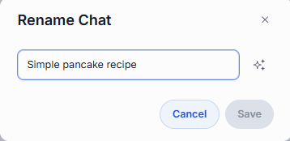

## Duplicate

**Duplicate** creates your own independent copy of a conversation — including one you own, one shared with you, or one published to your organization. Use it to branch a conversation or to make an editable copy of one you can't otherwise change. The copy appears in **My chats** under the same name.

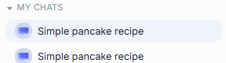

## Export

You can export conversations from their actions menu. If a conversation has attachments, export it with or without them.

- **Single conversation with attachments** — in the conversation menu, point to **Export** and click **With attachments**. The conversation is exported as a ZIP archive.
- **Single conversation without attachments** — point to **Export** and click **Without attachments**. The conversation is exported as a JSON file.

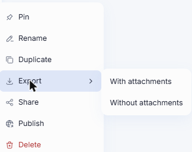

- **All conversations** — click the **...** icon at the top of the **Chats** panel and select **Export conversations**. All conversations are exported without attachments, as a single JSON file.

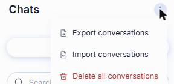

## Import

To import a previously exported JSON file or ZIP archive, click the **...** icon at the top of the **Chats** panel, select **Import conversations**, and choose the file.

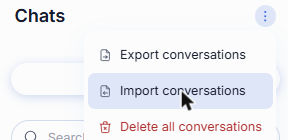

## Delete

You can delete a single conversation or all of your conversations.

- **Single** — in the conversation menu, select **Delete** and confirm.
- **All** — click the **...** icon at the top of the **Chats** panel (see the screenshot in [Export](#export)) and select **Delete all conversations**.

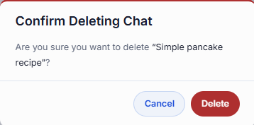

## Next steps

- [Sharing and publishing](./7.sharing-and-publishing.md) — share a conversation or publish it to your organization
- [Prompts](./3.prompts.md) — save reusable prompt templates
- [Catalog](./2.catalog.md) — find and add agents to your favorites
