# Conversations

A conversation is a dialogue between you and an agent (a language model or an application). Within one conversation you can refer to earlier messages, but different conversations do not share context.

This page covers starting a conversation, selecting an agent, sending messages and attachments, working with responses, and organizing your conversation list.

Conversations are stored in DIAL in a folder dedicated to your user and accessible from any device. If you navigate away while a response is still streaming, the conversation is preserved as it was generated, without duplication.

## Start a conversation

There are several ways to start a conversation:

- Start typing in the message composer to talk to the current agent.
- Click **New chat**.
- In the [Catalog](./2.catalog/0.index.md), open an agent and click **Use in chat**.
- Some applications display starter buttons near the message composer with predefined prompts. Click one to begin a conversation with that prompt.

**Note**
> New conversations appear in the **Chats** panel on the left. If you start a conversation and close it while it is still empty, it is neither displayed nor saved.

## Select an agent

In DIAL Chat you converse with agents: models and applications. You find available agents in the [Catalog](./2.catalog/0.index.md) and add them to your favorites.

Click the agent selector next to the message composer. It shows the name of the currently selected agent. This opens a popup with a search box, **My Collection**, your **Favorites**, and a link to the **Catalog** to find more agents.

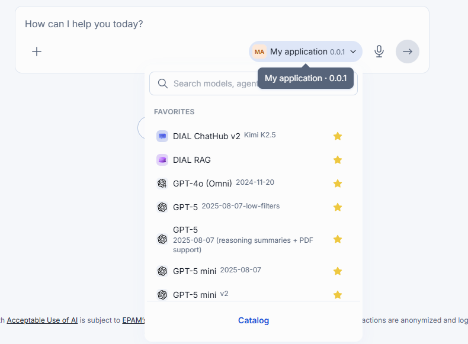

The agent selector is available before you start a conversation and at any point during it, including after the agent has already replied. Selecting a different agent switches it for the rest of the conversation. DIAL Chat posts an inline notice confirming the switch.

**Note**
> You cannot change the agent while a response is still streaming. If the agent used in a conversation is later removed from your environment, you need to select a new agent before you can continue that conversation.

## Send a message

Enter your prompt in the text box and send it.

### The Add menu

Click the **+** (**Add**) icon next to the message composer for everything you can add to a message. The available options depend on the selected agent, so you may not see all of them:

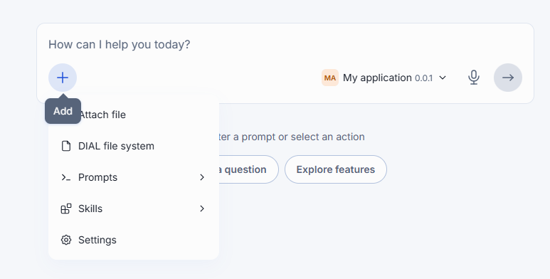

- **Attach file** — upload a file from your device.
- **DIAL file system** — select a file or folder you already have in the [File Manager](./3.files.md).
- **Skills** — attach a [skill](./2.catalog/4.skills.md) for the agent to use with your message.
- **Prompts** — insert a saved prompt. The submenu shows **My Collection** (prompts you starred) and a link to the **Catalog**, where you can browse all available prompts. Selecting a prompt inserts its text into the message composer. See [Prompts](./2.catalog/5.prompts.md) for how to create and manage prompts.
- **Record voice** — record a message and attach it as an audio file. See [Voice input](#voice-input).
- **Settings** — open [conversation settings](#conversation-settings).

### Attachments

Attachment support depends on the agent. When an agent supports files and folders, attach them from the **Add** menu.

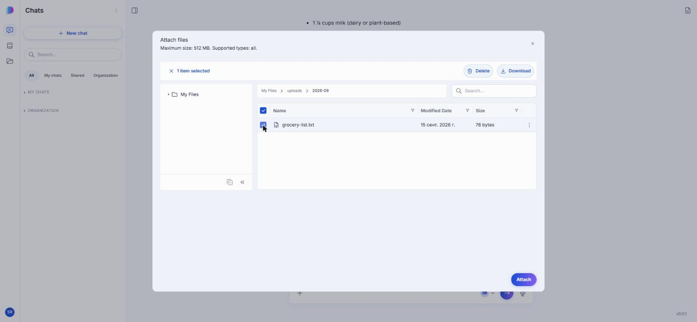

The attachment appears in the message composer, above the text box, and becomes available to the agent when you send your message.

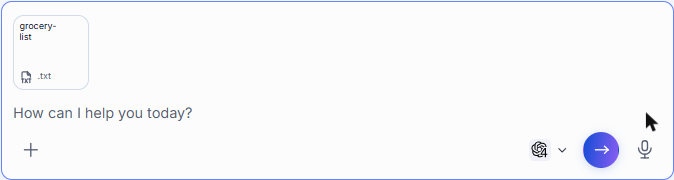

**Note**
> Attached files are also available in the [File Manager](./3.files.md).

### Voice input

There are two ways to use your voice, and they produce different results:

| | Dictate | Record voice |
|---|---|---|
| Where to find it | Microphone icon in the message composer | **Record voice** in the **Add** menu |
| What you get | Editable text in the text box | An audio file attached to your message |
| What the agent receives | Text | Audio |

**Dictate** turns speech into text you can review and edit before sending:

- Click the microphone icon and speak. Transcription does not happen while you talk. Click the confirm control to stop recording, and the text appears after a moment.
- The transcript is added to whatever is already in the text box, so you can dictate into a partly typed message.
- Nothing is sent automatically. Edit the text and send it yourself.

**Record voice** sends the recording itself, for agents that accept audio:

- Open the **Add** menu and select **Record voice**. Recording starts immediately.
- Click the confirm control to stop. The recording is attached to your message as an audio file, which you can play back to check it before sending.
- The recording is not transcribed. The agent receives the audio.

In both modes a waveform replaces the text box while you record. You cannot type or send until you stop. Click the discard icon to cancel without sending anything; your draft text and any existing attachments are preserved.

**Note**
> Voice input must be enabled in your deployment. **Dictate** also requires either a speech recognition model configured by your administrator or an agent that accepts audio. **Record voice** appears only when the selected agent accepts audio attachments, so switching agents can make it appear or disappear. Recordings are subject to a size limit set by your administrator.

## Work with responses

Each response shows a row of action icons, in this order: **Regenerate**, **Copy**, **Copy as Markdown**, **Like**, and **Dislike**.

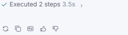

- **Regenerate** — generate a new answer to the same prompt.
- **Copy** — copy the response as plain text.
- **Copy as Markdown** — copy the response as Markdown.
- **Like** — click the thumbs-up icon to highlight a valuable response. It highlights immediately; click it again to undo.
- **Dislike** — click the thumbs-down icon to mark a response you find unhelpful or incorrect. This opens the **Send negative feedback** dialog, where you choose a feedback type and, optionally, add a comment before clicking **Send**.

**Note**
> The list of available feedback types can change over time.

### Stages

When an agent performs tool calls, document retrieval, or multi-step reasoning while generating a response, DIAL Chat shows that work as a list of steps. Each step shows its status (running, completed, or failed) and how long it took. Click a step to expand it and see its details.

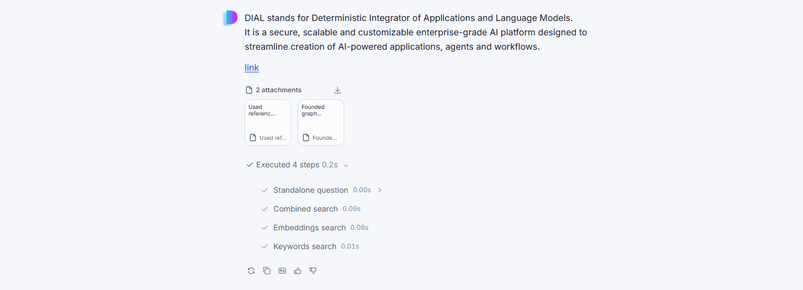

### MCP apps

When a toolset provides a visual interface for one of its tools, DIAL Chat renders that tool's output as an interactive app inside the response instead of plain text. The header names the tool and the app it belongs to, along with its version.

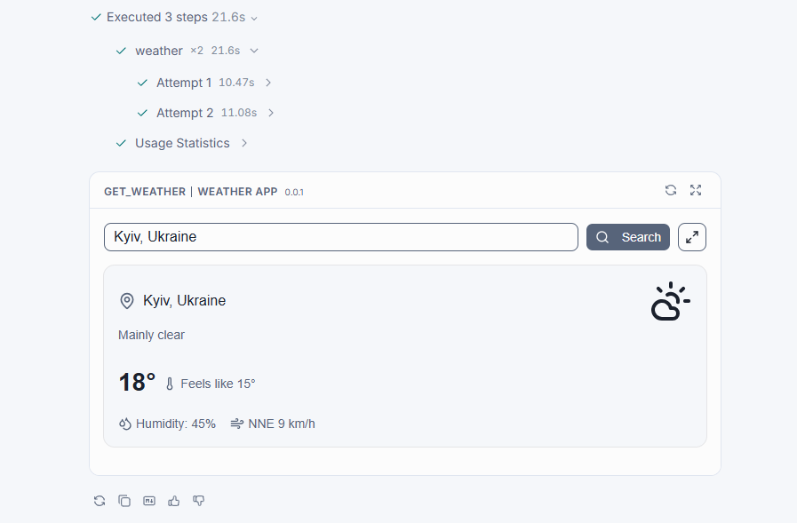

You can work with the app where it sits: fill in its fields, run a search, browse what it returns. Two controls in its header change how you view it:

- The expand icon opens the app in a side panel, which gives it more room for detailed results.
- The refresh icon reloads the app.

Each app runs in its own isolated sandbox, kept separate from the rest of DIAL Chat.

### Citations

When an agent answers from your documents, it marks each statement with a citation naming the file it came from. Citations sit inline, next to the specific claim they support, rather than being collected at the end of the response.

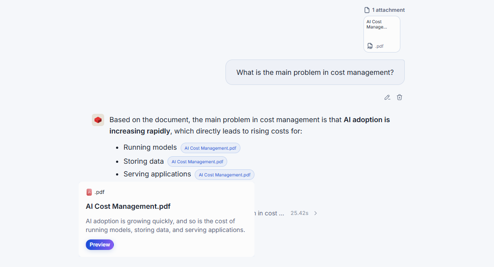

Open a citation to see the passage the agent actually drew on, quoted from the source. Click **Preview** to open the document itself and read the passage in context.

A citation points at a location, not just a file: the passage in a text document, the relevant rows of a table, or the region of a PDF page. PDFs open in the chat, so you can check a citation without downloading anything.

### Sources panel

Click the panel icon in the top-right corner of the chat area to open the sources panel. It lists the files you uploaded for the conversation and any sources the agent found or generated while answering, such as retrieved documents or generated artifacts.

Click an entry to preview it in place, without downloading it. Previews cover text files, Word documents, Excel spreadsheets, PDFs, and images, and you can play audio files directly in the panel. Any entry can also be downloaded.

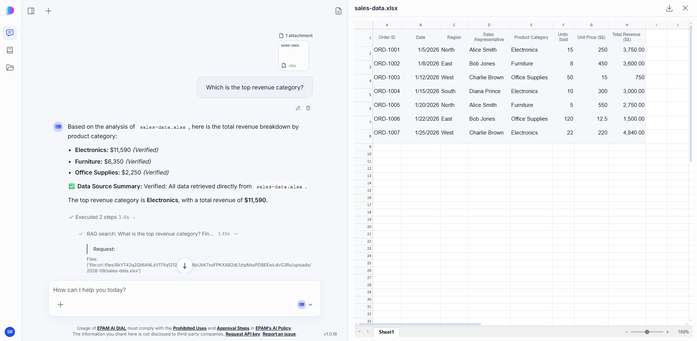

## Edit and delete messages

Each message you sent shows an **Edit** and a **Delete** icon.

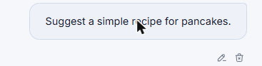

- **Edit** — change a message in the ongoing conversation. You can also attach a file to the edited message. Click **Save & Submit** to regenerate the response, or **Cancel** to discard your changes. After you save an edit, the response is regenerated and all messages after the edited one are deleted.

  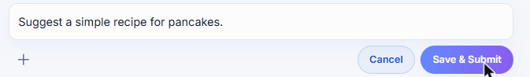

- **Delete** — delete a message in the ongoing conversation. The corresponding response is deleted too.

## Conversation settings

Click the **+** (**Add**) icon next to the message composer and select **Settings**. Conversation settings are available before and during a conversation:

- **Response format** — choose whether the agent's response renders as **Markdown** or **Plain text**.
- **System prompt** — the initial set of instructions you give the model. It guides the model to stay aligned with the intended purpose and outcome of the conversation.
- **Temperature** — how much variation the model allows in its answers. A lower value keeps responses focused and repeatable, which suits factual work; a higher value produces more varied and creative output.

Click **Apply changes** to save.

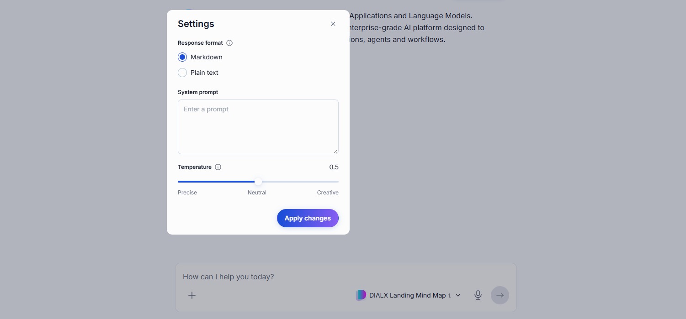

**Note**
> Conversation settings vary by agent. Some agents have no configurable settings.

## Organize your conversations

Conversation actions live in two menus. Hover over a conversation in the **Chats** panel and click its **...** icon for actions on that conversation:

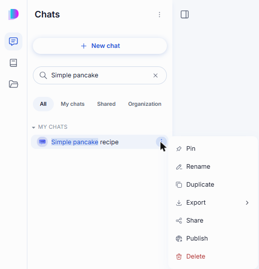

Click the **...** icon at the top of the **Chats** panel for actions that apply to all your conversations:

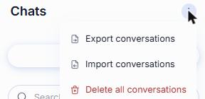

**Note**
> Available actions vary by conversation. A conversation shared with you or published to your organization only offers **Pin**, **Duplicate**, **Export**, and (for a conversation shared with you) **Remove from My List**. **Rename**, **Share**, **Publish**, and **Delete** are unavailable for it.

### Search and filter

Use the **Search** box to find conversations by name. Use the tabs below it to filter the list:

- **All** — every conversation you can see, grouped into My Chats, Shared, and Organization.
- **My chats** — conversations you own.
- **Shared** — conversations others [shared](./4.sharing-and-publishing.md) directly with you.
- **Organization** — conversations [published](./4.sharing-and-publishing.md) to your organization.

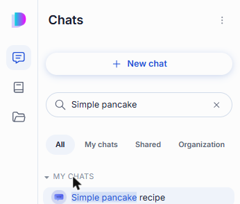

### Pin a conversation

Select **Pin** in the conversation actions menu to keep a conversation at the top of your list.

### Rename a conversation

A new conversation is named in two steps. When you send your first message, the conversation takes its name from that message. Once the agent has replied, DIAL replaces it with a short title that describes what you asked about, written in the language you used. This happens only once, so the name does not keep changing as the conversation grows.

To set the name yourself, select **Rename** in the conversation actions menu, edit the name, and click **Save**.

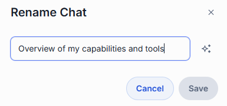

Click **Rename with AI** next to the field to generate a name from the conversation as it stands now, which is useful when a conversation has moved on from the topic it started with. The generated name appears in the field for you to review, so you can edit it or close the dialog without saving.

**Note**
> Generated names require a utility model configured by your administrator. Without one, **Rename with AI** reports an error and conversations keep the name taken from your first message.

Some characters are not allowed in a conversation name and are dropped as you type: tab, `"`, `:`, `;`, `/`, `\`, `,`, `=`, `{`, `}`, `%`, and `&`. You can use a period at the start of a name or inside it, but a period at the end is removed automatically.

### Duplicate a conversation

**Duplicate** creates an independent copy in **My chats**, under the same name as the original. The copy is yours, so changes to it do not affect the conversation you copied.

Use it to branch one of your own conversations and take it in a different direction without losing the original. It also works on conversations shared with you or published to your organization, which is the way to get a version of one of those you can actually edit and continue.

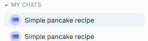

### Export and import conversations

To export a single conversation, point to **Export** in its actions menu and click **With attachments** to get a ZIP archive, or **Without attachments** to get a JSON file.

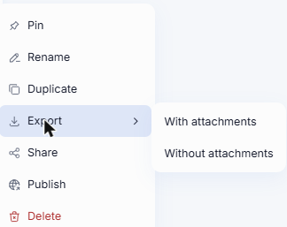

To export everything, click the **...** icon at the top of the **Chats** panel and select **Export conversations**. All conversations are exported without attachments, as a single JSON file.

To import, click the **...** icon at the top of the **Chats** panel, select **Import conversations**, and choose your file. A JSON file carries conversations on their own; a ZIP archive can carry several conversations together with their attachments.

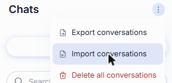

Attachments that come in with an import are available afterwards in the [File Manager](./3.files.md).

If an imported conversation has the same name as one you already have, DIAL Chat asks you how to handle the clash, separately for the conversation itself and for each of its attachments:

- **Replace** — overwrite the one you already have.
- **Ignore** — keep yours and skip the imported copy.
- **Postfix** — keep both, numbering the imported one, for example `my-conversation 1`.

### Share or publish a conversation

**Share** hands specific people a link that gives them access as soon as they open it. What they see stays live, so messages you add after sharing appear for them too.

**Publish** submits the conversation for review by an administrator, who can approve it into a folder under **Organization** where anyone with matching access can find it.

Both actions are in the conversation actions menu. See [Sharing and publishing](./4.sharing-and-publishing.md) for the full workflow, access rules, and how to revoke access.

### Remove a shared conversation from your list

A conversation someone shared with you stays in your **Shared** list until you remove it. Select **Remove from My List** in its actions menu.

This gives up your access rather than deleting anything. The conversation still belongs to whoever shared it, and you need a new link to get back in.

### Delete conversations

To delete one conversation, select **Delete** in its actions menu and confirm.

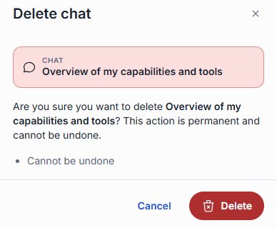

To delete all of them, click the **...** icon at the top of the **Chats** panel and select **Delete all conversations**.

## Next steps

- [Sharing and publishing](./4.sharing-and-publishing.md) — share a conversation or publish it to your organization
- [Prompts](./2.catalog/5.prompts.md) — save reusable prompt templates
- [Catalog](./2.catalog/0.index.md) — find and add agents to your favorites
