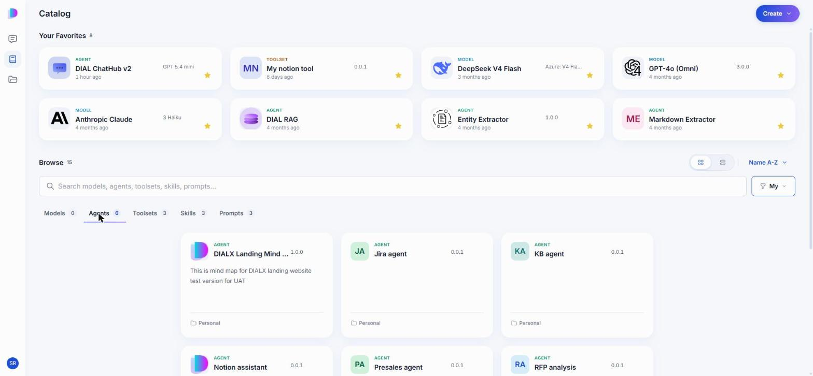
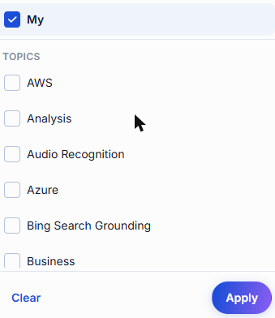
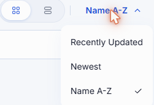
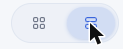
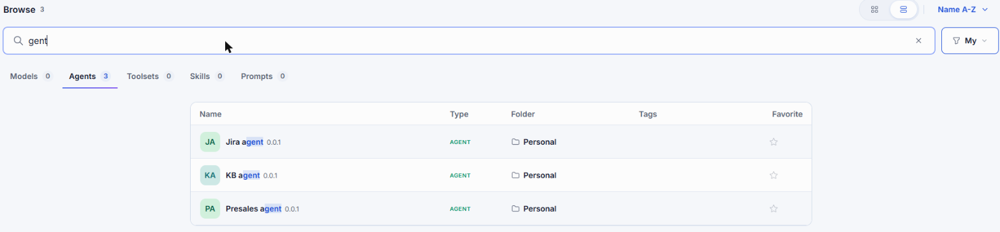
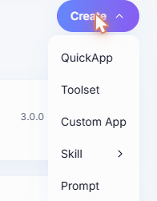

# Catalog

The Catalog is the single place where you find everything you can work with in DIAL Chat: AI models, agents, toolsets, skills, and prompts. What you see depends on your role — everything published across your organization that your permissions allow, plus everything you created yourself.

From the Catalog you can:

- Start a conversation with any model or agent.
- Keep the items you use most within reach as favorites.
- Look up what an item does, what it costs, and how much of it you have used.
- Copy an endpoint URL and a ready-made cURL command to call an item from your own code.
- Build your own agents, toolsets, skills, and prompts, without writing code.

**Note**
> Access to models and agents is governed by your role. See [Authentication and access control](../../2.understand-dial/4.security-and-governance/1.authentication-and-access-control.md).

Open the Catalog from the navigation rail on the left.

## Your Favorites

**Your Favorites** sits at the top of the Catalog and holds the items you starred, of any type. Click the star on a card, or the star in an item's details panel, to add it; click the star again to remove it. Favorites are personal — starring an item changes nothing for anyone else.

## Browse

Below your favorites, **Browse** lists everything available to you, split into five tabs. Each tab shows how many items it holds.

| Tab | What it holds |
|-----|---------------|
| [Models](./1.models.md) | The AI models available in your DIAL environment. |
| [Agents](./2.agents.md) | All AI agents you can use — your own and those published organization-wide. |
| [Toolsets](./3.toolsets.md) | Connections to MCP servers that let agents reach external systems. |
| [Skills](./4.skills.md) | Reusable instructions an agent picks up when a task calls for them. |
| [Prompts](./5.prompts.md) | Prompts saved for reuse in conversations. |

Click any card to open that item's details panel. What the panel contains differs by type — see the page for that type.

### Narrow the list

- **Search** — type part of a name to filter the current tab.
- **Filter** — **My** limits the list to items you created yourself, so your own work is not buried among everything published across the organization. **Topics** limits it to a subject area, such as Analysis or Business. Clear both to see everything again.

  

- **Sort** — order by **Recently Updated**, **Newest**, or **Name A-Z**.

  

- **View** — switch between cards and a compact list that shows type, folder, tags, and favorite state in columns.

  

  

## Create your own

Click **Create** to build something of your own.

| Option | What you get |
|--------|--------------|
| **QuickApp** | An agent you assemble from a model, toolsets, skills, and files — no code. See [Agents](./2.agents.md#build-a-quick-app). |
| **Toolset** | A connection to an MCP server. See [Toolsets](./3.toolsets.md). |
| **Custom App** | A registration for an application you host yourself. See [Agents](./2.agents.md#build-a-custom-app). |
| **Skill** | A set of instructions agents can load on demand. See [Skills](./4.skills.md). |
| **Prompt** | A prompt you want to reuse. See [Prompts](./5.prompts.md). |

## What you can change

Two rules apply to every item type in the Catalog:

- You can edit and delete only the items you created yourself. Everything else is read-only for you, however it reached your Catalog.
- A published item cannot be deleted. Unpublish it first, then delete it. See [Sharing and publishing](../4.sharing-and-publishing.md).

Anything you create stays in your private folder, visible only to you, until you share or publish it.

## Next steps

- [Models](./1.models.md) — see what a model costs, what it supports, and how much of it you have used
- [Agents](./2.agents.md) — use an agent, or build one with the no-code builders
- [Toolsets](./3.toolsets.md) — connect an MCP server and sign in to it
- [Conversations](../1.conversations.md) — start chatting with what you found
- [Sharing and publishing](../4.sharing-and-publishing.md) — let other people use what you built
