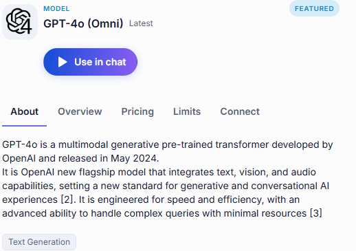
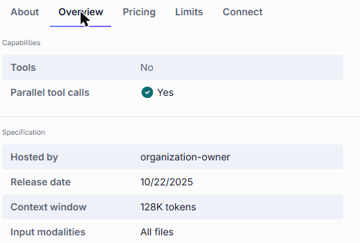
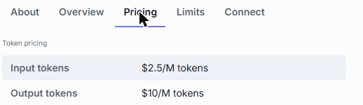
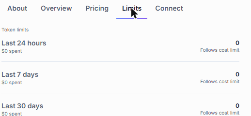
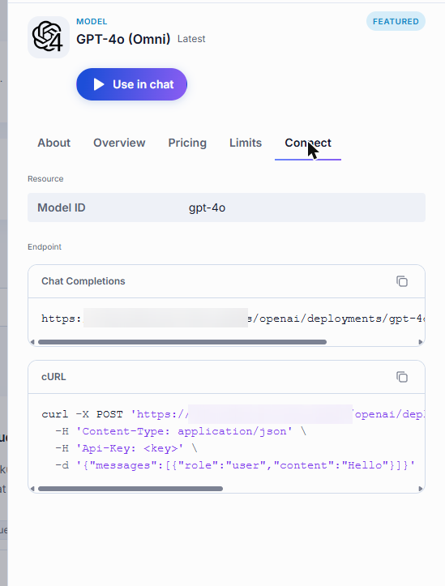

# Models

A model is an AI model that DIAL makes available through one common API — GPT-4o, Claude, DeepSeek, and so on. Models are set up centrally: administrators decide which models exist in your DIAL environment and who can use them, so the **Models** tab of the [Catalog](./0.index.md) shows exactly the models your role gives you access to. You cannot create, edit, or delete a model, and there is nothing to share — everyone who has access to a model sees the same one.

**Note**
> For the full list of model providers DIAL supports, see [Supported providers](../../3.building-with-dial/3.adapters/2.supported-providers.md).

## Talk to a model

Click a model's card to open its details panel, then click **Use in chat**. DIAL Chat opens with that model selected, ready for your first message. You can also pick a model from the agent selector next to the message box — see [Conversations](../1.conversations.md#choose-and-change-the-agent).

## What the details panel tells you

A model's panel has five tabs.

| Tab | What you find there |
|-----|---------------------|
| **About** | What the model is good at, and the topics it is tagged with. |
| **Overview** | Which capabilities it supports, and its technical specification. |
| **Pricing** | What a million input and output tokens cost. |
| **Limits** | How much of the model you personally have used recently. |
| **Connect** | What you need to call the model from your own code. |

### Overview

**Capabilities** tells you whether the model can call tools, and whether it can call several of them in parallel — useful to know before you pick an orchestrator model for a [Quick App](./2.agents.md#build-a-quick-app).

**Specification** covers who hosts the model, when it was released, how large its context window is, and which kinds of input it accepts.

### Pricing

Input and output tokens are priced separately, per million tokens.

### Limits

**Limits** shows your own consumption of this model over the last 24 hours, 7 days, and 30 days, together with what you spent and whether the period is capped by a cost limit. It is a per-user view: other people's usage does not appear here.

**Note**
> For how these limits are set and enforced, see [Usage limits and cost control](../../2.understand-dial/4.security-and-governance/3.usage-limits-and-cost-control.md).

### Connect

Use the **Connect** tab when you want to call the model from your own code rather than from the chat interface. It gives you the model's ID, the chat completions endpoint to post to, and a cURL command you can copy, paste your API key into, and run as-is. Both the endpoint and the command have a copy button.

## Next steps

- [Agents](./2.agents.md) — agents built on top of models, including ones you can build yourself
- [Conversations](../1.conversations.md) — send your first prompt
- [Catalog](./0.index.md) — back to browsing and filtering
