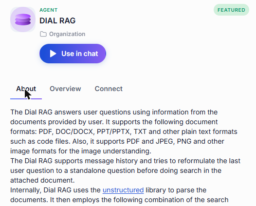
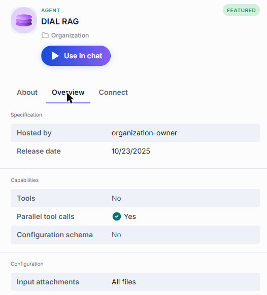
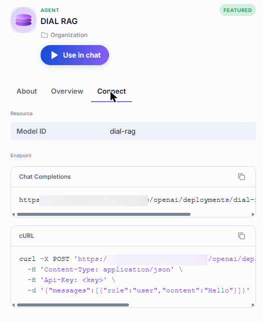
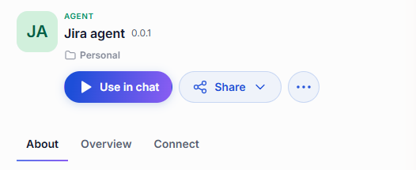
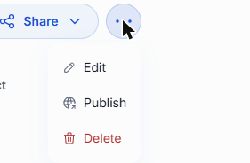
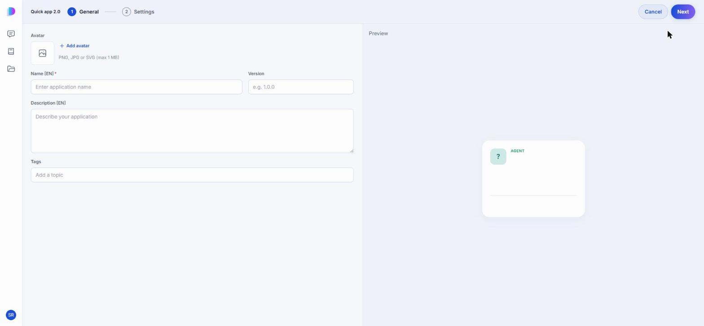
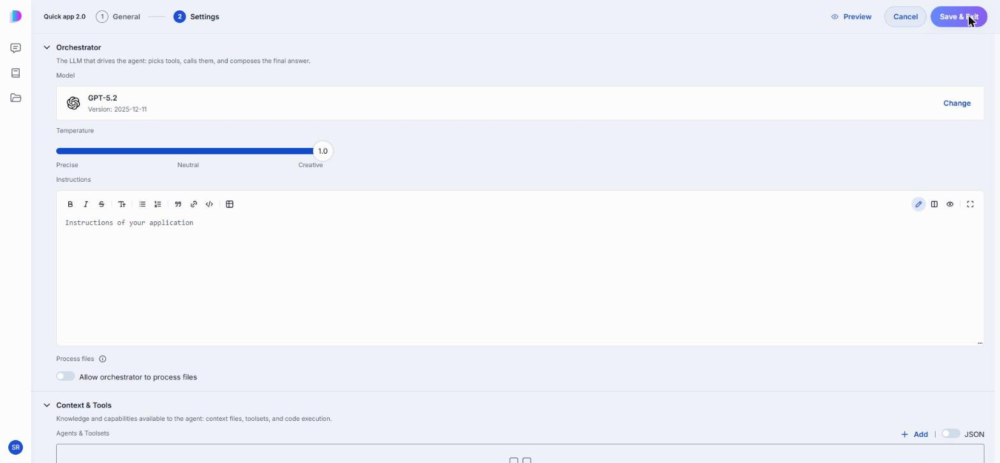
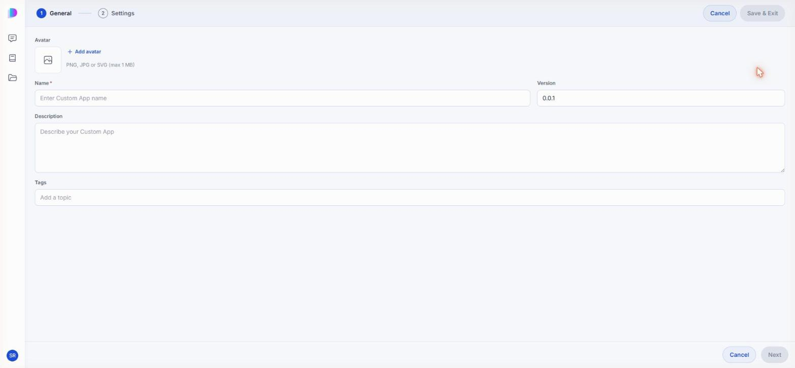
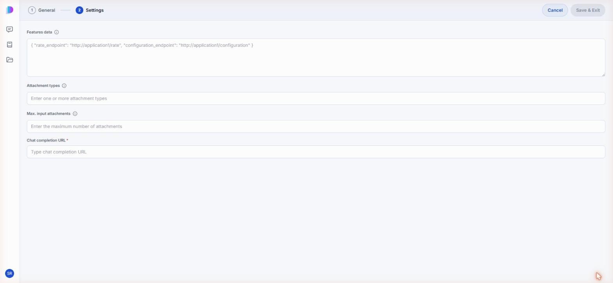
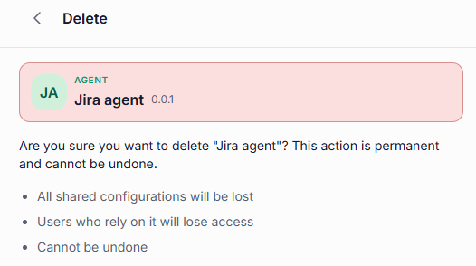

# Agents

An agent is anything you can hold a conversation with in DIAL Chat. Some agents are little more than a model with a fixed set of instructions; others combine a model with [toolsets](./3.toolsets.md), [skills](./4.skills.md), and files so they can do a particular job — answer questions about your documents, draft a proposal, or work with a system such as Jira.

The **Agents** tab of the [Catalog](./0.index.md) lists every agent you can use: the ones published across your organization and the ones you built yourself. Building one takes no code — see [Create an agent](#create-an-agent).

## Talk to an agent

Click an agent's card to open its details panel, then click **Use in chat**.

## What the details panel tells you

An agent's panel has three tabs.

### About

What the agent does, and how to get the most out of it. This is the description its author wrote, so its depth varies from a single line to a full briefing.

### Overview

The agent's specification — who hosts it and when it was released — and its capabilities: whether it can call tools, call several in parallel, and whether it exposes a configuration schema. **Configuration** shows what users may attach to a conversation with it.

### Connect

What you need to call the agent from your own code instead of from the chat interface: its **Model ID**, its **Chat Completions** endpoint, and a cURL command you can copy, paste your API key into, and run. The endpoint and the command each have a copy button.

## Actions on your own agents

An agent published by someone else offers only **Use in chat** — it is read-only for you. On an agent you created, two more controls appear next to it: **Share**, and a **...** menu.

- **Share** — give named people access to your agent. You can only share agents you own. See [Sharing and publishing](../4.sharing-and-publishing.md).
- **Edit** — reopen the builder you created the agent with, with everything filled in as you left it. See [Edit an agent](#edit-an-agent).
- **Publish** — offer the agent to your organization. A publication request goes to an administrator for review. See [Sharing and publishing](../4.sharing-and-publishing.md).
- **Delete** — remove the agent permanently. See [Delete an agent](#delete-an-agent).

Once an agent is published, its menu offers **Unpublish** instead, which withdraws it from the organization.

## Create an agent

Click **Create** in the Catalog and pick the kind of agent you want to build:

- **QuickApp** — assemble an agent from a model, toolsets, skills, and files. Nothing to host, nothing to code.
- **Custom App** — register an application you built and host yourself, so that it appears in DIAL Chat like any other agent.

Your new agent stays in your private folder, visible only to you, until you share or publish it.

### Build a Quick App

A Quick App is a no-code orchestrator, conceptually close to OpenAI's GPTs. You choose a model to drive the agent, give it instructions, and hand it the toolsets, skills, and files it needs. The model then decides which of them to use for each request.

**Note**
> For the developer's view of Quick Apps, including the JSON behind the editor, see [Quick Apps](../../3.building-with-dial/1.apps/2.quick-apps/0.index.md).

#### Step 1 — General

How the agent presents itself in the Catalog and in chat. A live preview of the card updates as you type.

| Field | Required | Description |
|-------|:--------:|-------------|
| Avatar | No | PNG, JPG, or SVG, up to 1 MB. |
| Name | Yes | The name shown on the agent's card. |
| Version | No | A version string, for example `1.0.0`. |
| Description | No | A short summary shown on the card and in the About tab. |
| Tags | No | Topics that help people find the agent when filtering the Catalog. |

#### Step 2 — Settings

Everything about how the agent behaves, grouped into sections you can expand one at a time.

**Orchestrator** — the model that drives the agent: it reads the request, decides which tools to call, and writes the final answer.

| Field | Description |
|-------|-------------|
| Model | The model that replies to prompts and orchestrates everything else. |
| Temperature | How predictable the answers are, from Precise to Creative. |
| Instructions | The standing instructions the model follows in every conversation. |
| Process files | Whether the model itself may read files attached to a conversation. |

**Tips for writing Instructions:**

- State the agent's purpose clearly in the first sentence.
- Describe what the model should and should not do.
- If tools are connected, tell the model when and how to use them.
- Use `{{variable}}` syntax for values that may change across deployments.

**Context & Tools** — what the agent can reach for.

| Field | Description |
|-------|-------------|
| Agents & Toolsets | Other agents and [toolsets](./3.toolsets.md) this agent may call. Advanced users can edit the same thing as JSON. |
| Context files | Files the agent draws on when answering. |
| Code Interpreter | Lets the agent run Python to compute or plot something. |
| File tools | Lets the agent read and write the app's own files. |

**Agent Skills** — [skills](./4.skills.md) the agent loads when a task matches them, instead of carrying every instruction in its system prompt.

**User attachments** — what the people using your agent may upload.

| Field | Description |
|-------|-------------|
| Attachment types | Allowed file types, given as [MIME types](https://developer.mozilla.org/en-US/docs/Web/HTTP/Basics_of_HTTP/MIME_types/Common_types). |
| Max. attachments number | How many files one message may carry. |

**Conversation starters** — the suggestion buttons shown under the message box when someone opens a new conversation with your agent.

| Field | Description |
|-------|-------------|
| Button title | The label on the button. |
| Prompt to send in chat | The prompt behind it. |
| Intro text | A line shown above the buttons. |
| Starters behavior | Send the prompt immediately, or drop it into the message box so the user can edit it first. |
| Disable chat input | Restrict the conversation to the starters only. |

**Advanced settings** — **Time awareness** tells the agent the current date and time.

Before saving, use the preview panel to send test messages and check that the agent behaves as expected — that it follows the instructions, invokes tools when it should, and answers at the quality you expect from the chosen temperature.

Click **Save & Exit** to register the agent.

**Note**
> Leaving the Settings step with **Cancel** does not always discard a Quick App. Check the Agents tab afterwards and [delete](#delete-an-agent) the draft if it was saved anyway.

### Build a Custom App

Register a Custom App when you have built and hosted an application yourself and want it to appear in DIAL Chat alongside everything else. DIAL Core sends requests to the endpoint you give it, so the application must expose a chat completion endpoint that follows the [Unified API](https://dialx.ai/dial_api#operation/sendChatCompletionRequest).

**Note**
> For how to build the application behind the registration, see [Custom Apps](../../3.building-with-dial/1.apps/5.custom-apps/0.index.md).

#### Step 1 — General

| Field | Required | Description |
|-------|:--------:|-------------|
| Avatar | No | PNG, JPG, or SVG, up to 1 MB. |
| Name | Yes | The name shown on the agent's card. |
| Version | No | Defaults to `0.0.1`. |
| Description | No | A short summary shown on the card and in the About tab. |
| Tags | No | Topics that help people find the agent when filtering the Catalog. |

#### Step 2 — Settings

| Field | Required | Description |
|-------|:--------:|-------------|
| Features data | No | Extra endpoints your application exposes, as JSON — for example `rate_endpoint` and `configuration_endpoint`. |
| Attachment types | No | Allowed file types, given as [MIME types](https://developer.mozilla.org/en-US/docs/Web/HTTP/Basics_of_HTTP/MIME_types/Common_types). |
| Max. input attachments | No | How many files one message may carry. |
| Chat completion URL | Yes | Where DIAL Core sends chat completion requests. |

Click **Save & Exit** to register the agent.

## Edit an agent

Open the agent's **...** menu and click **Edit**. The builder reopens with your settings in place; change what you need and click **Save & Exit**.

You can edit only agents you created. A published version is fixed — keep working on your own copy and publish a new version when it is ready.

## Delete an agent

Open the agent's **...** menu and click **Delete**, then confirm. Deleting is permanent: anyone you shared the agent with loses access, and any configuration shared with it is lost.

You can delete only agents you created, and only while they are unpublished. To get rid of a published agent, unpublish it first.

## Next steps

- [Conversations](../1.conversations.md) — talk to the agent you picked or built
- [Toolsets](./3.toolsets.md) — give your agent access to external systems
- [Skills](./4.skills.md) — teach your agent a procedure it can reuse
- [Sharing and publishing](../4.sharing-and-publishing.md) — let other people use your agent
