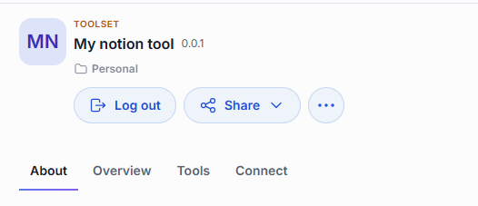
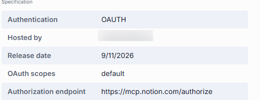
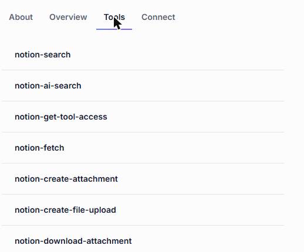
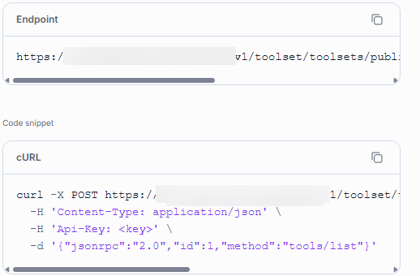
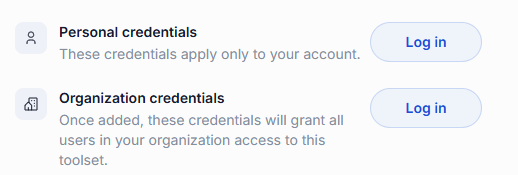
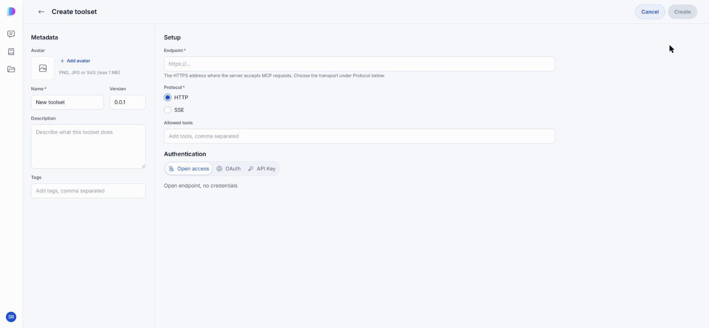
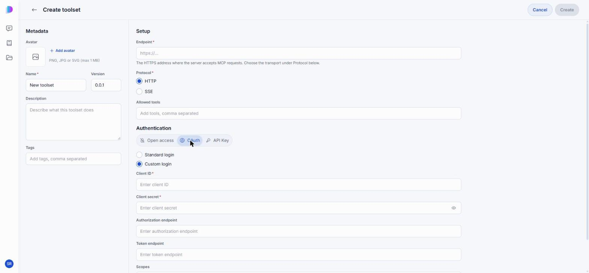

# Toolsets

A toolset is a connection to an MCP server, and through it, to a system outside DIAL — Notion, GitHub, Jira, a database. It brings a set of tools with it: individual functions such as "search pages" or "create an issue" that an agent can call while it works on your request.

You do not talk to a toolset directly. You attach it to an agent — see [Agents](./2.agents.md#build-a-quick-app) — and the agent calls its tools when a request needs them. The **Toolsets** tab of the [Catalog](./0.index.md) lists the toolsets published across your organization and the ones you created yourself.

**Note**
> For the technical side — MCP transports, tool filtering, registration through the API — see [Toolsets](../../3.building-with-dial/1.apps/2.quick-apps/1.quick-app-2/9.tool-sets/0.index.md).

## What the details panel tells you

Click a toolset's card to open its details panel. It has up to four tabs, and its main button reflects the toolset's sign-in state — **Manage credentials** when it needs authentication, **Log out** once you are signed in.

### About

What the toolset connects to and what it is for.

### Overview

How the toolset authenticates, who hosts it, when it was released, and — for OAuth connections — the scopes it requests and the authorization endpoint it sends you to. The scopes are worth a glance before you sign in: they are the permissions the toolset will hold on your account.

### Tools

The individual functions the toolset exposes, such as `notion-search` or `notion-fetch`. This is the most practical tab: it tells you exactly what an agent will be able to do once you attach the toolset.

The tab appears only when the tool list can be loaded. For a toolset that requires authentication, that means you have to [sign in](#sign-in-to-a-toolset) first.

### Connect

The toolset's MCP endpoint, and a cURL command that calls its `tools/list` method — enough to reach the toolset from your own client instead of through an agent. Unlike a model or an agent, a toolset has no model ID.

## Authentication

Most toolsets reach a system that knows who you are, so they need you to sign in before they will work. A toolset that requires authentication and does not have it shows a warning marker on its card, and its details panel opens with **Manage credentials** where other items show **Use in chat**.

Signing in matters before you start, not after: if an agent tries to use a toolset you are not signed in to, the conversation fails with an authentication error instead of an answer.

### Personal and organization credentials

A toolset can be signed in two ways, and the difference is who the connection belongs to.

- **Personal credentials** — your own account at the external system. Only you use them, and the agent sees only what your account may see. This is the usual choice.
- **Organization credentials** — one shared account for everybody. Once added, every user in your organization can use the toolset without signing in themselves. These are normally set up by an administrator, or published together with the toolset.

If both are configured, your personal credentials are used.

### Sign in to a toolset

1. Open the toolset's details panel and click **Manage credentials**.
2. Click **Log in** next to **Personal credentials**, or next to **Organization credentials** if you are setting up a shared connection.
3. Complete the sign-in at the external provider — for example, the Notion or Microsoft login page — and approve the access the toolset asks for.

When you come back, the panel's main button reads **Log out**, and the **Tools** tab lists what the toolset can now do.

### Sign out

Open the toolset's details panel and click **Log out**. The toolset stops working for you until you sign in again; agents that rely on it will report an authentication error.

## Create a toolset

Click **Create** in the Catalog and choose **Toolset**. The editor puts the toolset's identity on the left and its connection on the right.

**Metadata** — how the toolset appears in the Catalog.

| Field | Required | Description |
|-------|:--------:|-------------|
| Avatar | No | PNG, JPG, or SVG, up to 1 MB. |
| Name | Yes | The name shown on the toolset's card. |
| Version | No | Defaults to `0.0.1`. |
| Description | No | What this toolset does. |
| Tags | No | Comma-separated topics that help people find it. |

**Setup** — where the toolset connects and what it may expose.

| Field | Required | Description |
|-------|:--------:|-------------|
| Endpoint | Yes | The HTTPS address where the MCP server accepts requests. |
| Protocol | Yes | The transport the server speaks: **HTTP** or **SSE**. |
| Allowed tools | No | A comma-separated list restricting which of the server's tools this toolset exposes. Leave it empty to expose all of them. |

### Choose how it authenticates

The **Authentication** switch at the bottom of Setup offers three modes.

- **Open access** — an open endpoint that needs no credentials.
- **OAuth** — sign-in through the provider. **Standard login** relies on the server registering clients dynamically, so the endpoint is all you need. **Custom login** is for a provider that expects you to register the client yourself, and asks for the details below.

  

  | Field | Required | Description |
  |-------|:--------:|-------------|
  | Client ID | Yes | The client identifier the provider issued you. |
  | Client secret | Yes | The matching secret. |
  | Authorization endpoint | No | Where users are sent to approve access. |
  | Token endpoint | No | Where DIAL exchanges the code for a token. |
  | Scopes | No | The permissions to request. |

- **API Key** — authenticate with a key instead of a sign-in. Choose **With login** or **Without login**, then give the **API Key parameter name** the server expects and the **API key** itself.

Click **Create** to register the toolset. It stays in your private folder, visible only to you, until you [share or publish](../4.sharing-and-publishing.md) it.

**Note**
> To register a toolset without the UI, see [Define and register a toolset](../../3.building-with-dial/1.apps/2.quick-apps/1.quick-app-2/9.tool-sets/1.define-and-register.md).

## Edit and delete

The **...** menu on a toolset you created offers **Edit**, **Publish**, and **Delete**, the same as for an [agent](./2.agents.md#actions-on-your-own-agents). You can edit and delete only toolsets you created, and only while they are unpublished.

Deleting a toolset breaks the agents that use it: they report an error when they try to reach it, and the missing toolset is flagged in the Quick App builder.

## Next steps

- [Agents](./2.agents.md#build-a-quick-app) — attach a toolset to an agent you build
- [Skills](./4.skills.md) — pair a toolset with instructions for using it well
- [Sharing and publishing](../4.sharing-and-publishing.md) — let other people use your toolset
