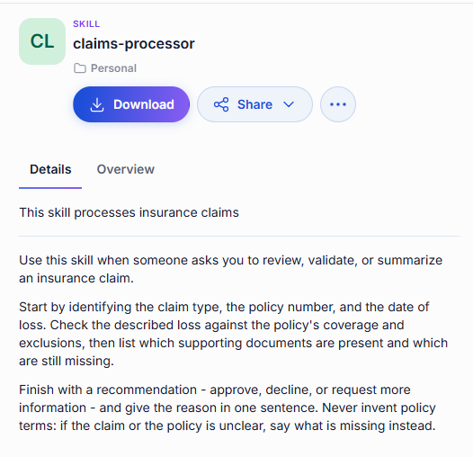
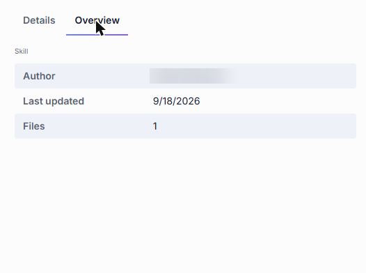
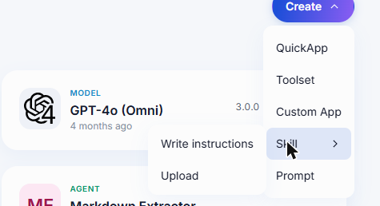
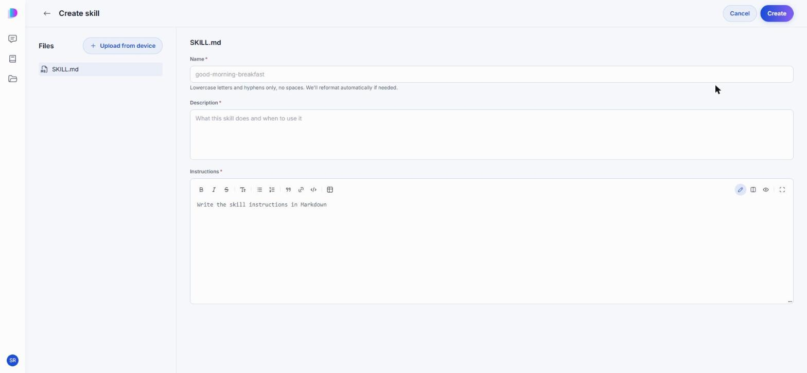
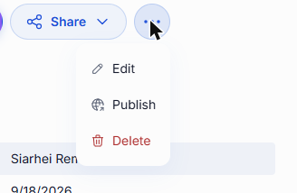

# Skills

A skill is a set of instructions an agent picks up only when it needs them. Instead of writing everything an agent might ever need to know into one long system prompt, you write each procedure once — how your company processes an insurance claim, how a business email should be worded, how to put together a proposal for an RFP — and save it as a skill. The agent loads the skill when the conversation calls for it, and ignores it the rest of the time.

That keeps agents focused and keeps the knowledge reusable: the same skill can serve several agents, and updating it updates them all.

The **Skills** tab of the [Catalog](./0.index.md) lists the skills published across your organization and the ones you wrote yourself.

## How an agent uses a skill

Skills are attached to an agent, not called directly. When you build a [Quick App](./2.agents.md#build-a-quick-app), the **Agent Skills** section of the builder is where you pick the skills the agent may draw on. From then on the agent decides for itself when a task matches one — which is why a skill's description matters as much as its instructions: it is what the agent reads to recognize the moment to use it.

## What the details panel tells you

Click a skill's card to open its details panel.

- **Details** — the skill's description, followed by its full instructions, so you can read exactly what an agent will follow before you attach it.
- **Overview** — who wrote the skill, when it was last updated, and how many files it contains.

  

Click **Download** to save the skill's files, for example to adapt them into a skill of your own.

## Create a skill

Click **Create** in the Catalog, point at **Skill**, and choose how you want to start.

- **Write instructions** — compose the skill in the editor.
- **Upload** — bring in files you already have.

A skill is a `SKILL.md` file: a name, a description, and the instructions themselves in Markdown. You can add supporting files with **Upload from device**, and they travel with the skill.

| Field | Required | Description |
|-------|:--------:|-------------|
| Name | Yes | Lowercase letters and hyphens, no spaces — for example `claims-processor`. DIAL reformats the name if needed. |
| Description | Yes | What this skill does and when to use it. The agent reads this to decide whether a task matches. |
| Instructions | Yes | The procedure itself, in Markdown. |

Click **Create** to save. The skill stays in your private folder, visible only to you, until you [share or publish](../4.sharing-and-publishing.md) it.

## Edit and delete

The **...** menu on a skill you created offers **Edit**, **Publish**, and **Delete**.

You can edit and delete only skills you created, and only while they are unpublished.

## Next steps

- [Agents](./2.agents.md#build-a-quick-app) — attach your skills to an agent
- [Toolsets](./3.toolsets.md) — give the agent the tools a skill tells it how to use
- [Sharing and publishing](../4.sharing-and-publishing.md) — let other people use your skill
