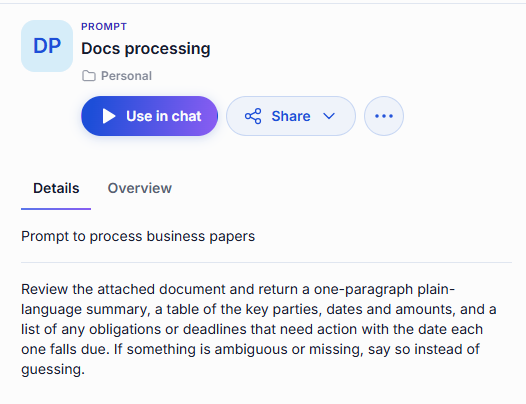
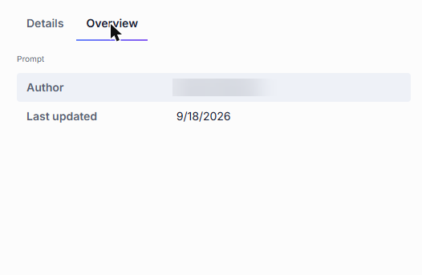
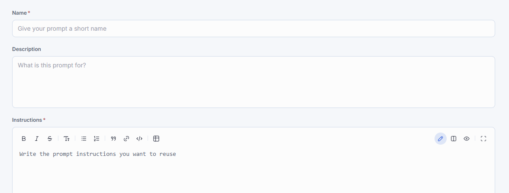

# Prompts

A prompt is an instruction, a question, or a message you send to an agent. When you find yourself typing the same one repeatedly — a request to summarize a document a particular way, the framing you always use for market research — save it as a prompt and reuse it instead of retyping it.

The **Prompts** tab of the [Catalog](./0.index.md) lists the prompts published across your organization and the ones you saved yourself. Prompts are stored on the server, so they follow you to any device you sign in from.

## Use a prompt

There are two ways to reach a saved prompt:

- **From the Catalog** — open the prompt's card and click **Use in chat**.
- **In a conversation** — click the **+** icon in the message box and choose **Prompts**. See [Conversations](../1.conversations.md#work-with-prompts-in-a-conversation).

Either way the prompt's text lands in the message box, where you can adjust it before sending.

## What the details panel tells you

Click a prompt's card to open its details panel.

- **Details** — the prompt's description, followed by the prompt text itself, so you can check what you are about to send.
- **Overview** — who wrote the prompt and when it was last updated.

  

## Create a prompt

Click **Create** in the Catalog and choose **Prompt**.

| Field | Required | Description |
|-------|:--------:|-------------|
| Name | Yes | A short name you will recognize in the Catalog. |
| Description | No | What this prompt is for. |
| Instructions | Yes | The prompt text to reuse. The editor supports Markdown formatting. |

Click **Save**. The prompt stays in your private folder, visible only to you, until you [share or publish](../4.sharing-and-publishing.md) it.

## Edit and delete

The **...** menu on a prompt you created offers **Edit**, **Download**, **Publish**, and **Delete**. You can edit and delete only prompts you created, and only while they are unpublished.

## Next steps

- [Conversations](../1.conversations.md) — put a saved prompt to work
- [Skills](./4.skills.md) — for instructions an agent should apply on its own, rather than a message you send
- [Sharing and publishing](../4.sharing-and-publishing.md) — let other people use your prompts
