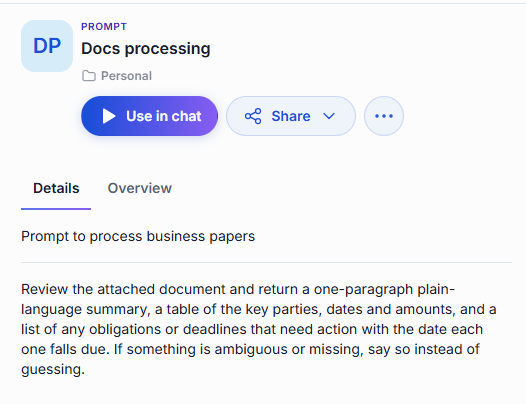
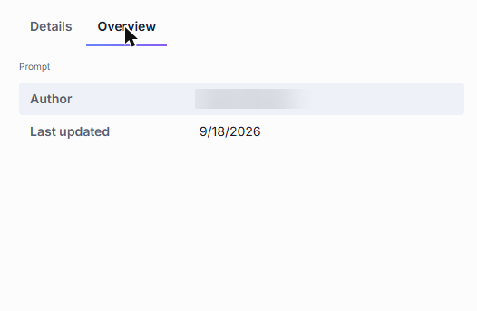
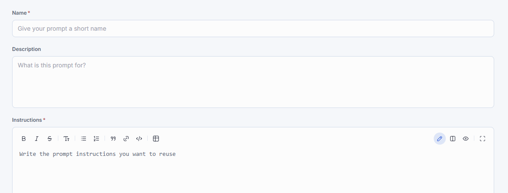

# Prompts

A prompt is an instruction, a question, or a message you send to an agent. When you find yourself typing the same one repeatedly — a request to summarize a document a particular way, the framing you always use for market research — save it as a prompt and reuse it instead of retyping it.

The **Prompts** tab of the [Catalog](./0.index.md) lists the prompts published across your organization and the ones you saved yourself. Prompts are stored in DIAL, so they follow you to any device you sign in from.

## Use a prompt

There are two ways to reach a saved prompt:

- **From the Catalog** — open the prompt's card and click **Use in chat**. DIAL Chat opens a new conversation and places the prompt text in the composer.
- **In a conversation** — click the **+** icon in the message box and choose **Prompts**. See [Conversations](../1.conversations.md#work-with-prompts-in-a-conversation).

A prompt contributes text only — it does not change which agent or model you are talking to. If the prompt contains [variables](#variables), a form opens first so you can fill in each value before the resolved text is placed in the composer. You can review and edit the text before sending.

## Details panel

Click a prompt's card to open its details panel.

- **Details** — the prompt's description, followed by the prompt text itself, so you can check what you are about to send.
- **Overview** — who wrote the prompt and when it was last updated.

  

## What you can do with a prompt

What actions are available depends on how the prompt reached your Catalog.

### Published prompts

Published prompts are made available to the organization by any user or administrator. Their location shows a folder within the organization.

- **Use in chat** — place the prompt text in the composer and start a conversation.
- **Download** — save the prompt file to your device.
- **Unpublish** — withdraw the prompt from the organization. An unpublish request goes to an administrator for review.

### Prompts shared with you

When another user shares a prompt directly with you, it appears in the Shared with me folder in the file manager.

- **Use in chat** — place the prompt text in the composer and start a conversation.
- **Download** — save the prompt file to your device.
- **Remove from My List** — remove the prompt from your catalog. This does not delete the original prompt.

### Your own prompts

Prompts you created stay in your personal folder until you share or publish them. You have full control over your own prompts.

- **Use in chat** — place the prompt text in the composer and start a conversation.
- **Share** — let specific people access your prompt. See [Sharing and publishing](../4.sharing-and-publishing.md).
- **Edit** — reopen the editor with your content in place. See [Edit a prompt](#edit-a-prompt).
- **Download** — save the prompt file to your device.
- **Publish** — offer the prompt to your organization. A publication request goes to an administrator for review. See [Sharing and publishing](../4.sharing-and-publishing.md).
- **Revoke access** — remove access you previously shared with specific people.
- **Delete** — remove the prompt permanently. See [Delete a prompt](#delete-a-prompt).

## Create a prompt

Click **Create** in the Catalog and choose **Prompt**.

| Field | Required | Description |
|-------|:--------:|-------------|
| Name | Yes | A short name you will recognize in the Catalog. |
| Description | No | What this prompt is for. |
| Instructions | Yes | The prompt text to reuse. The editor supports Markdown formatting. |

Click **Save**. The prompt stays in your private folder, visible only to you, until you [share or publish](../4.sharing-and-publishing.md) it.

### Variables

Use a prompt as a template by adding variables to its instructions: `{{variableName}}`, or `{{variableName|Default Value}}` to give it a default — for example, `Who played {{character}} in {{movie|Inception}}?`

When you use a prompt that has variables, DIAL Chat opens a form asking for a value for each one before it places the text in the composer. Variables inside code blocks are not treated as live placeholders.

## Edit a prompt

Open the prompt's **...** menu and click **Edit**. The editor reopens with your content in place; change what you need and click **Save**.

You can edit prompts in two cases:

- **Your own prompts** — found in your personal folder.
- **Prompts shared with you with editing rights** — found in the Shared with me folder in the file manager.

## Delete a prompt

Open the prompt's **...** menu and click **Delete**, then confirm. Deleting is permanent.

Only the prompt's creator can delete it — editing rights do not grant delete access. To delete a published prompt, unpublish it first.

## Next steps

- [Conversations](../1.conversations.md) — put a saved prompt to work
- [Skills](./4.skills.md) — for instructions an agent should apply on its own, rather than a message you send
- [Sharing and publishing](../4.sharing-and-publishing.md) — let other people use your prompts
