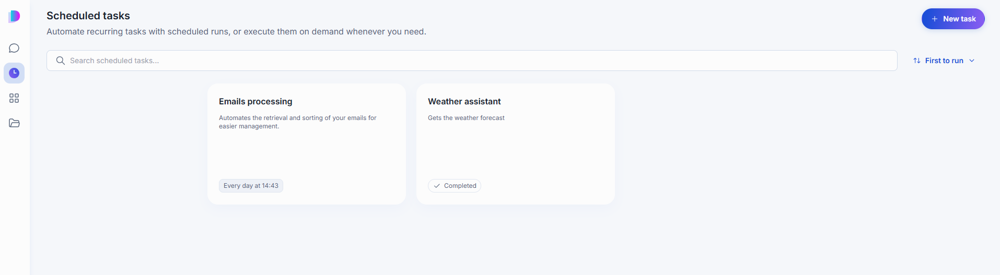
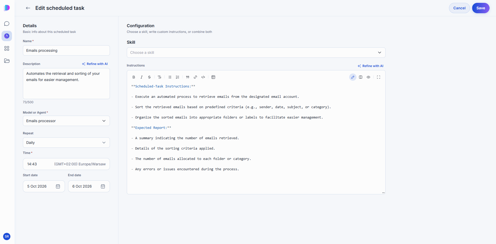
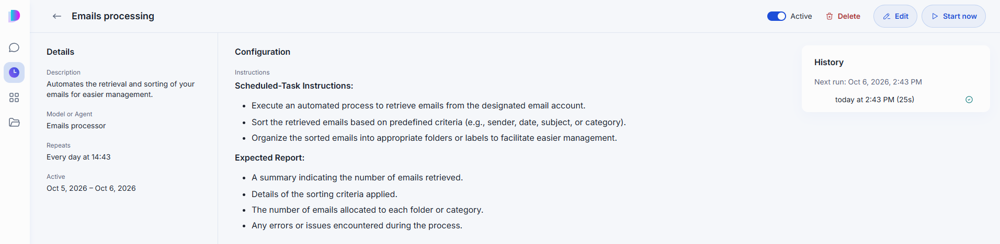
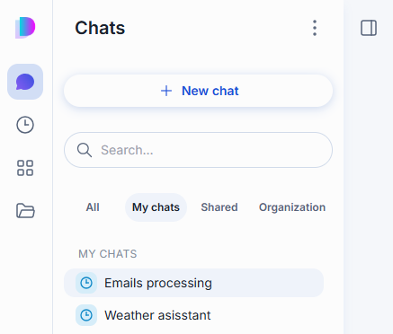

# Scheduled tasks

A scheduled task is a message that DIAL Chat sends for you on a schedule. You pick a model or an agent, write the instructions, and choose when it runs: once, hourly, daily, weekly, or monthly. Every run produces its own conversation, so you can open the result later like any other chat. You can also run a task on demand with **Start now**.

Use it for work you would otherwise repeat by hand: have an agent summarize overnight support tickets every morning, generate a weekly project status report from your team's updates, or check a competitor's pricing page daily and flag changes.

> Scheduled tasks are an optional feature. If the clock icon is missing from the navigation rail, your deployment has not enabled it.

## The task list

Select the clock icon in the navigation rail. The page lists your tasks as cards.

Each card shows the task name, its description, and a badge with the schedule, for example **Every day at 14:43**. A task that has finished all its runs shows **Completed** instead.

To find a task, type in **Search scheduled tasks**. The sort menu offers **First to run**, **Last to run**, **Newest**, and **Name A-Z**.

When your tasks need to run while you are away, DIAL Chat asks for your authorization once. A **Log in required** banner appears on this page with a login button, which opens a sign-in popup. If your browser blocks the popup, allow popups for DIAL Chat and try again. Until you log in, scheduled runs cannot start on their own.

## Create a task

Select **New task**. The form has two parts: **Details** on the left and **Configuration** on the right. The page for editing an existing task has the same fields.

### Details

| Field | Required | What it does |
|---|---|---|
| **Name** | Yes | Shown on the card and as the title of the task page. |
| **Description** | No | Up to 500 characters. **Refine with AI** rewrites your draft. |
| **Model or Agent** | Yes | The model or agent that receives the instructions on every run. |
| **Repeat** | Yes | **One-time**, **Hourly**, **Daily**, **Weekly**, or **Monthly**. Controls the schedule fields below. |
| **Start date**, **End date** | No | Recurring tasks only. The window in which the task is active. The end date must be after the start date, and neither can be in the past. |

The remaining schedule fields depend on the **Repeat** value you choose:

| Repeat | You also set |
|---|---|
| One-time | **Run at**: a specific future date and time. |
| Hourly | **Minutes past the hour**: 0 to 59. |
| Daily | **Time**. |
| Weekly | **Day of week** and **Time**. |
| Monthly | **Day of month** and **Time**. |

DIAL Chat uses your browser's time zone. The **Time** field shows it next to the value, for example `(GMT+02:00) Europe/Warsaw`.

### Configuration

Tell the task what to do with a skill, with instructions, or with both. You must provide at least one.

- **Skill**: choose a skill from the Catalog. The field is available only when the selected model or agent supports skills. For more about skills, see [Skills](./3.catalog/4.skills.md).
- **Instructions**: the message the task sends on every run. The editor accepts Markdown and offers **Refine with AI**. Describe the expected result as well as the work, for example which summary you want back.

Select **Save** to create the task. **Cancel** discards the form.

## Open a task

Select a card to open the task page.

The left column repeats the task's description, model or agent, schedule, and active window. The center shows the instructions. The **History** card on the right shows when the next run happens and lists past runs with their time and duration. A run can have one of four statuses: **Succeeded**, **Failed**, **Running**, or **Missed**. Select a run to open its conversation.

The buttons at the top of the page manage the task.

### Pause and resume a task

The **Active** switch turns the schedule off and on. A paused task keeps its settings and does not run until you switch it back on. You cannot reactivate a task that already completed or whose active window has ended. Create a new task instead.

### Run a task now

**Start now** runs the task immediately, without waiting for the schedule. The run appears in **History**. If a run is already in progress, you get a message instead of a second run.

### Edit a task

Select **Edit** to change any field. Some schedules cannot be edited in the form yet. In that case the page says so, and you can still pause or delete the task.

### Delete a task

Select **Delete** and confirm. Deleting a task is permanent, but the conversations from its earlier runs stay available in your chat list.

## Read the results

Each run creates a conversation in your chat list. These conversations carry a clock icon, so they are easy to tell from regular chats.

The list shows one row per task, and the row opens the latest run. Open an older run from the task's **History**. At the top of a run conversation, a banner shows the task name and the time of the run. Select **Task details** in the banner to go back to the task page.

You can continue the conversation as in any other chat, for example to ask a follow-up question about the result.

## Next steps

- [Conversations](./1.conversations.md): work with the conversations that runs create
- [Skills](./3.catalog/4.skills.md): write a skill that a task can apply on every run
- [Agents](./3.catalog/2.agents.md): choose the agent a task runs with
