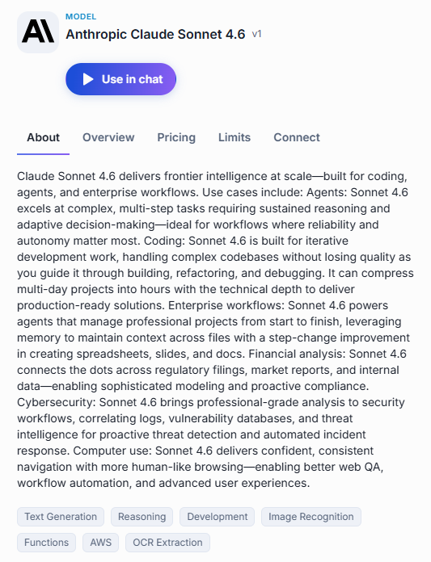
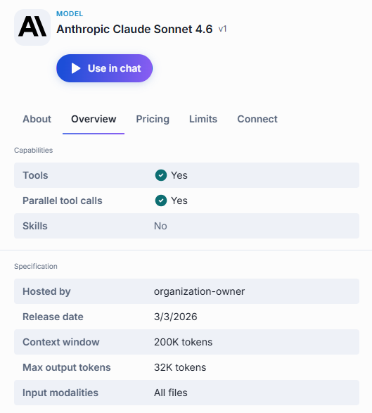
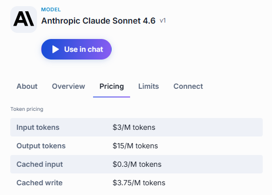
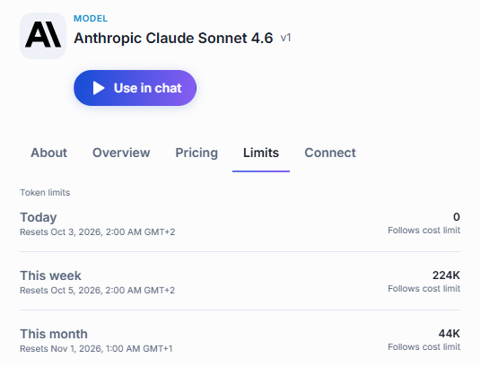
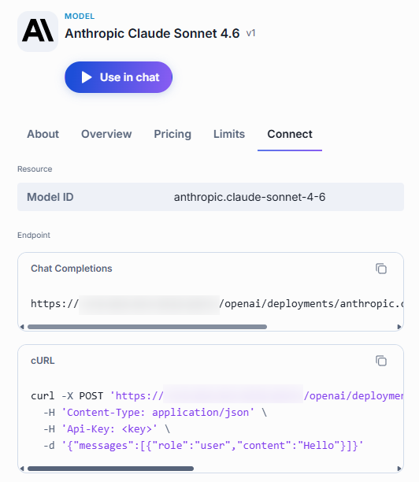

# Models

A model is an AI model available in your DIAL environment — GPT-4o, Claude, DeepSeek, and others. Models are set up centrally: administrators decide which models are available and who can use them, so the **Models** tab of the [Catalog](./0.index.md) shows exactly the models your role gives you access to. You cannot create, edit, or delete a model, and there is nothing to share — everyone who has access to a model sees the same one.

**Note**
> For the full list of model providers DIAL supports, see [Supported providers](../../3.building-with-dial/3.adapters/2.supported-providers.md).

## Talk to a model

Click a model's card to open its details panel, then click **Use in chat**. DIAL Chat opens with that model selected, ready for your first message. You can also pick a model from the agent selector next to the message box — see [Conversations](../1.conversations.md#select-an-agent).

Beyond conversations, you can select a model as the orchestrator when you [build a Quick App](./2.agents.md#build-a-quick-app).

## Details panel

A model's panel has five tabs.

| Tab | What you find there |
|-----|---------------------|
| **About** | The model's description, and the topic labels it is tagged with. |
| **Overview** | Capabilities the model supports, and its technical specification. |
| **Pricing** | Token pricing: cost per million tokens for input, output, cached input, and cached write. |
| **Limits** | Your token usage for today, this week, and this month, with reset dates and cost-limit status. |
| **Connect** | What you need to call the model from your own code. |

### About

The description explains what the model is designed for. Below the description, topic labels such as *Text Generation*, *Reasoning*, or *Development* indicate the model's strengths. You can filter by these topics in the Catalog's Browse section.

### Overview

**Capabilities** tells you whether the model supports tools, parallel tool calls, and skills — useful to know before you pick an orchestrator for a [Quick App](./2.agents.md#build-a-quick-app) or before you apply a skill directly to a message.

**Specification** lists the model's technical details:

| Field | Meaning |
|-------|---------|
| **Hosted by** | The organization that runs this model instance. |
| **Release date** | When the model version was released. |
| **Context window** | The maximum number of tokens — input plus output — the model can work with in a single conversation turn. |
| **Max output tokens** | The longest response the model can produce in one turn. |
| **Input modalities** | The kinds of input the model accepts — text only, images, or all file types. |

### Pricing

Token pricing is listed per million tokens:

| Field | Meaning |
|-------|---------|
| **Input tokens** | Tokens you send to the model in your prompts. |
| **Output tokens** | Tokens the model generates in its responses. |
| **Cached input** | Input tokens reused from a previous request, charged at a lower rate. |
| **Cached write** | The one-time cost of storing input tokens in the cache so later requests can reuse them. |

### Limits

**Limits** shows your personal token consumption for today, this week, and this month. Each period displays the number of tokens used, when the counter resets, and whether a cost limit applies. This is a per-user view: other people's usage does not appear here.

You can also check your usage limits across all models in [Settings](../6.usage-and-settings.md).

**Note**
> For how these limits are set and enforced, see [Usage limits and cost control](../../2.understand-dial/4.security-and-governance/3.usage-limits-and-cost-control.md).

### Connect

Use the **Connect** tab when you want to call the model from your own code rather than from the chat interface. It gives you the model's ID, the chat completions endpoint to post to, and a cURL command you can copy, paste your API key into, and run as-is. Both the endpoint and the command have a copy button.

## Next steps

- [Agents](./2.agents.md) — agents built on top of models, including ones you can build yourself
- [Toolsets](./3.toolsets.md) — connect an MCP server and sign in to it
- [Skills](./4.skills.md) — write reusable instructions agents can pick up on demand
- [Prompts](./5.prompts.md) — save and reuse prompt templates
