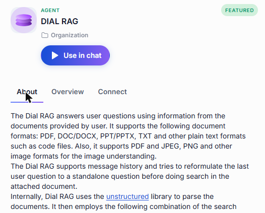
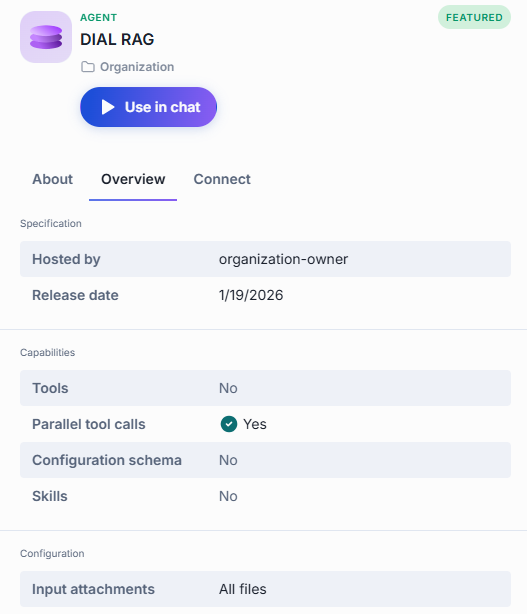
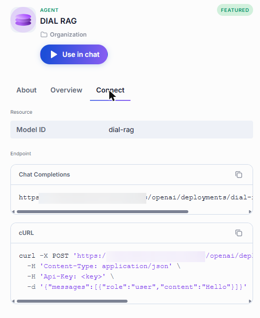
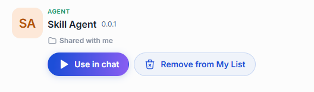
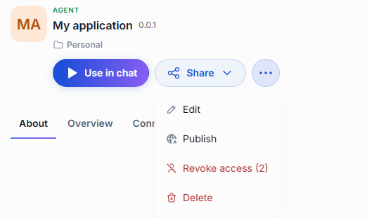
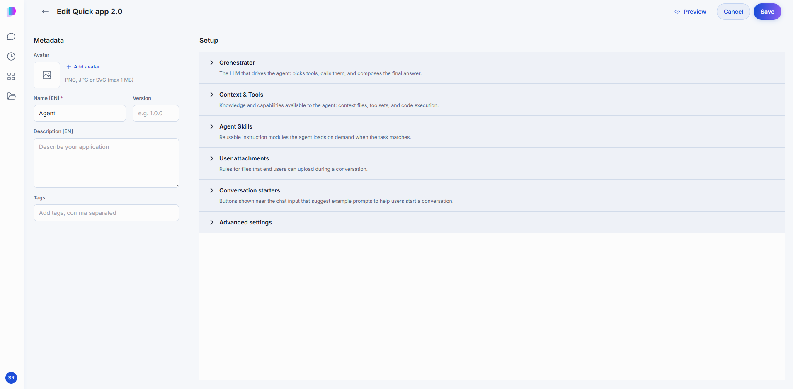
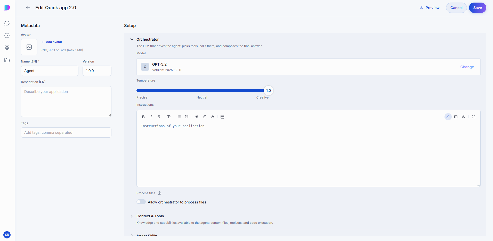
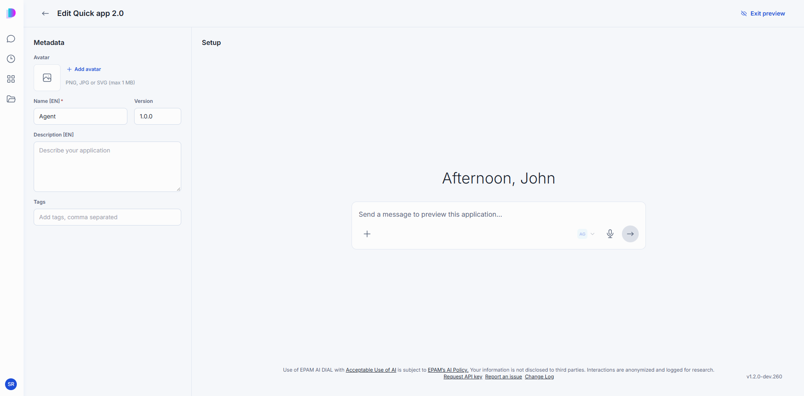
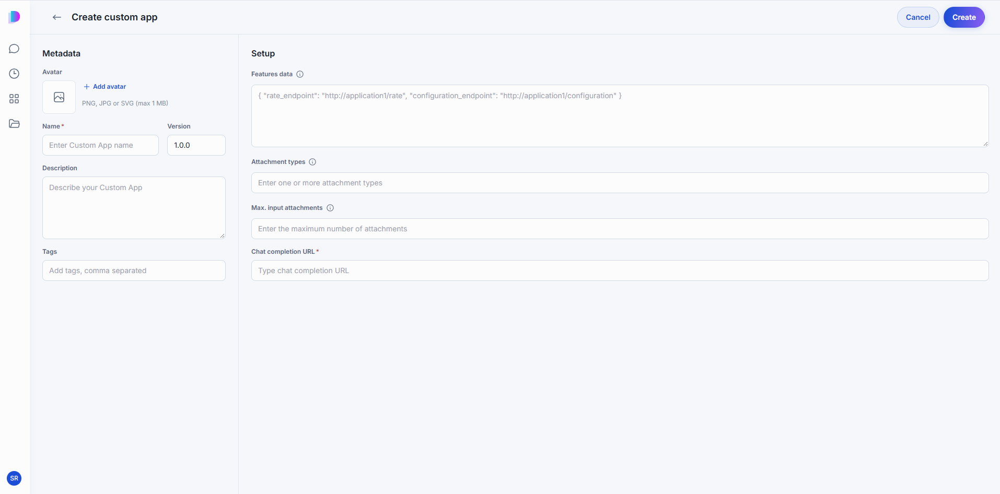
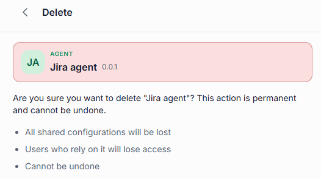

# Agents

An agent is an application you can converse with in DIAL Chat. Some agents are a model with a fixed set of instructions; others combine a model with [toolsets](./3.toolsets.md), [skills](./4.skills.md), and files to do a particular job — answer questions about your documents, draft a proposal, or work with a system such as Jira. Unlike a bare [model](./1.models.md), an agent packages model capabilities with context and tools into a ready-to-use solution.

The **Agents** tab of the [Catalog](./0.index.md) lists every agent you can use: agents preconfigured in your DIAL environment, agents published by users, and agents you built yourself. Building one takes no code — see [Create an agent](#create-an-agent).

## Talk to an agent

Click an agent's card to open its details panel, then click **Use in chat**.

## Details panel

An agent's panel has three tabs.

### About

The description written by the agent's author — what the agent does, what inputs it expects, and any tips for getting the best results. Below the description, topic labels indicate the agent's area of expertise. You can filter by these topics in the Catalog's Browse section.

### Overview

**Specification** lists the agent's metadata. All fields are optional and appear only when provided.

| Field | Meaning |
|-------|---------|
| **Provider** | The AI provider behind the agent. |
| **Vendor** | The organization that built the agent. |
| **License** | The license under which the agent is offered. |
| **Knowledge cutoff date** | The date up to which the agent's training data extends. |
| **Parameters** | The number of parameters in the underlying model. |
| **Hosted by** | The organization that runs this agent instance. |
| **Release date** | When this version of the agent was released. |
| **Routes** | The routing paths the agent is reachable through. |

**Capabilities** tells you whether the agent supports:

| Capability | Meaning |
|------------|---------|
| **Tools** | Whether the agent can call external tools. |
| **Parallel tool calls** | Whether the agent can call several tools at once instead of one at a time. |
| **Configuration schema** | Whether the agent was built from a configurable builder template that defines its settings as a structured form. |
| **Skills** | Whether the agent can load and use skills. |

**Configuration** shows what users may attach to a conversation with the agent — for example, which file types are accepted as input attachments.

### Connect

What you need to call the agent from your own code instead of from the chat interface: its **Model ID**, its **Chat Completions** endpoint, and a cURL command you can copy, paste your API key into, and run. The endpoint and the command each have a copy button.

## What you can do with an agent

What actions are available depends on how the agent reached your Catalog. The agent's card shows its location — a folder in your personal files, or a folder within the organization.

### Preconfigured agents

Preconfigured agents are set up in the platform configuration by administrators. They carry the **Featured** label in the Catalog and their location shows an organization folder. These agents are read-only — you can only use them in chat.

### Published agents

Published agents are made available to the organization by any user or administrator. Their location shows a folder within the organization. Any user can request to unpublish a published agent — the request goes to an administrator for review.

- **Use in chat** — start a conversation with the agent.
- **Unpublish** — withdraw the agent from the organization. An unpublish request goes to an administrator for review.

### Agents shared with you

When another user shares an agent directly with you, it appears in the Catalog under **Shared with me**. You can use it in chat or remove it from your list — removing it does not delete the original agent.

- **Use in chat** — start a conversation with the agent.
- **Remove from My List** — remove the agent from your catalog.

### Your own agents

Agents you created stay in your personal folder until you share or publish them. You have full control over your own agents.

- **Use in chat** — start a conversation with the agent.
- **Share** — let specific people access your agent. See [Sharing and publishing](../5.sharing-and-publishing.md).
- **Edit** — reopen the builder with your settings in place. See [Edit an agent](#edit-an-agent).
- **Publish** — offer the agent to your organization. A publication request goes to an administrator for review. See [Sharing and publishing](../5.sharing-and-publishing.md).
- **Revoke access** — remove access you previously shared with specific people.
- **Delete** — remove the agent permanently. See [Delete an agent](#delete-an-agent).

## Create an agent

Click **Create** in the Catalog and pick the kind of agent you want to build. The options shown here are the defaults — your organization may add custom builders to this list.

- **Quick App** — build an AI agent by picking a model, writing instructions, and connecting tools and files. Nothing to host, nothing to code.
- **Custom App** — register an application you built and host yourself, so that it appears in DIAL Chat like any other agent.

Your new agent stays in your private folder, visible only to you, until you share or publish it.

### Build a Quick App

A Quick App lets you build an AI agent without writing code. You pick a model to drive the agent, write instructions that tell it how to behave, and connect it to the toolsets, skills, and files it needs. The model then decides which of them to use for each request — calling tools, reading documents, or handing off to other agents as the task requires.

Quick Apps suit a wide range of use cases:

- A Q&A assistant that answers questions using your company's documents (via DIAL RAG).
- A workflow agent that calls external APIs — weather services, CRMs, ticketing systems — through MCP toolsets.
- A multi-agent orchestrator that routes each request to the right specialist agent.
- A research assistant that retrieves and summarizes content from the web.
- A support assistant with conversation starters that guide users toward common tasks.

You can use other DIAL models and agents as building blocks in your agent's workflow, attach skills that teach it specific procedures, and let it browse the web for up-to-date information. Because a Quick App runs on DIAL infrastructure from the moment you create it, there is no server to provision and no deployment to schedule. It inherits the platform's access control, sharing, and cost limits automatically. You can share it with colleagues, publish it to the Catalog, or use it as a building block inside another Quick App.

**Note**
> For the developer's view of Quick Apps, including the JSON behind the editor, see [Quick Apps](../../3.building-with-dial/1.apps/2.quick-apps/0.index.md).

The editor has two sections on one screen: **Metadata** on the left and **Setup** on the right.

#### Metadata

How the agent presents itself in the Catalog and in chat.

| Field | Required | Description |
|-------|:--------:|-------------|
| Avatar | No | PNG, JPG, or SVG, up to 1 MB. |
| Name | Yes | The name shown on the agent's card. |
| Version | No | A version string, for example `1.0.0`. |
| Description | No | A short summary shown on the card and in the About tab. |
| Tags | No | Topics that help people find the agent when filtering the Catalog. |

#### Setup

Everything about how the agent behaves, grouped into collapsible sections.

**Orchestrator** — the model that drives the agent: it picks tools, calls them, and composes the final answer.

| Field | Description |
|-------|-------------|
| Model | The model that replies to prompts and orchestrates everything else. |
| Temperature | How predictable the answers are, from Precise to Creative. |
| Instructions | The standing instructions the model follows in every conversation. |
| Process files | When enabled, the orchestrator can read files attached to a conversation. |

**Tips for writing Instructions:**

- State the agent's purpose clearly in the first sentence.
- Describe what the model should and should not do.
- If tools are connected, tell the model when and how to use them.
- Use `{{variable}}` syntax for values that may change across deployments.

**Context & Tools** — knowledge and capabilities available to the agent: context files, toolsets, and code execution.

| Field | Description |
|-------|-------------|
| Agents & Toolsets | Other agents and [toolsets](./3.toolsets.md) this agent may call. Advanced users can edit the same thing as JSON. |
| Context files | Files the agent draws on when answering. |
| Code Interpreter | Lets the agent run Python to compute or plot something. |
| File tools | When enabled, the orchestrator can access, read, write, and edit files in the app's file context. |

**Agent Skills** — reusable instruction modules the agent loads on demand when the task matches. See [Skills](./4.skills.md).

**User attachments** — rules for files that end users can upload during a conversation.

| Field | Description |
|-------|-------------|
| Attachment types | Allowed file types, given as [MIME types](https://developer.mozilla.org/en-US/docs/Web/HTTP/Basics_of_HTTP/MIME_types/Common_types). |
| Max. attachments number | How many files one message may carry. |

**Conversation starters** — buttons shown near the chat input that suggest example prompts to help users start a conversation.

| Field | Description |
|-------|-------------|
| Button title | The label on the button. |
| Prompt to send in chat | The prompt behind it. |
| Intro text | A line shown above the buttons. |
| Starters behavior | Send the prompt immediately, or drop it into the message box so the user can edit it first. |
| Disable chat input | Restrict the conversation to the starters only. |

**Advanced settings** — **Time awareness** tells the agent the current date and time.

#### Preview

Click **Preview** in the top-right corner to test your agent in real time. The Setup section is replaced by a chat interface where you can send messages and see how the agent responds with its current configuration. Changes you make to Metadata or Setup take effect on the next message, so you can iterate without leaving the editor. Click **Exit preview** to return to the full editor.

Click **Save** to register the agent, or **Cancel** to discard your changes and return to the Catalog.

### Build a Custom App

Register a Custom App when you have built and hosted an application yourself and want it to appear in the Catalog so that anyone with access can use it in chat or connect to it through the API. Your application must expose a chat completion endpoint that follows the [Unified API](https://dialx.ai/dial_api#operation/sendChatCompletionRequest) — DIAL routes requests to the URL you provide during registration.

**Note**
> For how to build the application behind the registration, see [Custom Apps](../../3.building-with-dial/1.apps/5.custom-apps/0.index.md).

The editor has two sections on one screen: **Metadata** on the left and **Setup** on the right.

#### Metadata

How the agent presents itself in the Catalog and in chat.

| Field | Required | Description |
|-------|:--------:|-------------|
| Avatar | No | PNG, JPG, or SVG, up to 1 MB. |
| Name | Yes | The name shown on the agent's card. |
| Version | No | Defaults to `1.0.0`. |
| Description | No | A short summary shown on the card and in the About tab. |
| Tags | No | Topics that help people find the agent when filtering the Catalog. |

#### Setup

| Field | Required | Description |
|-------|:--------:|-------------|
| Features data | No | A JSON object declaring optional endpoints your application supports. `rate_endpoint` points to the URL where DIAL sends user feedback on responses. `configuration_endpoint` points to the URL that serves a settings UI, letting users customize the app's behavior per conversation. |
| Attachment types | No | Allowed file types, given as [MIME types](https://developer.mozilla.org/en-US/docs/Web/HTTP/Basics_of_HTTP/MIME_types/Common_types). |
| Max. input attachments | No | How many files one message may carry. |
| Chat completion URL | Yes | The URL of your application's chat completion endpoint. DIAL sends every user message to this address. |

Click **Create** to register the agent, or **Cancel** to return to the Catalog.

## Edit an agent

Open the agent's **...** menu and click **Edit**. The builder reopens with your settings in place; change what you need and click **Save**.

You can edit agents in two cases:

- **Your own agents** — found in your personal folder.
- **Agents shared with you with editing rights** — found in the Catalog under **Shared with me**.

A published version is fixed — keep working on your own copy and publish a new version when it is ready.

## Delete an agent

Open the agent's **...** menu and click **Delete**, then confirm. Deleting is permanent: anyone you shared the agent with loses access, and any configuration shared with it is lost.

Only the agent's creator can delete it — editing rights do not grant delete access. To delete a published agent, unpublish it first.

## Next steps

- [Models](./1.models.md) — the AI models agents are built on
- [Toolsets](./3.toolsets.md) — give your agent access to external systems
- [Skills](./4.skills.md) — teach your agent a procedure it can reuse
- [Prompts](./5.prompts.md) — save and reuse prompt templates
