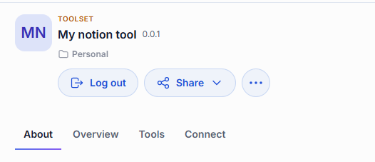
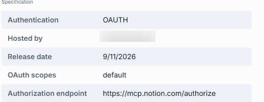
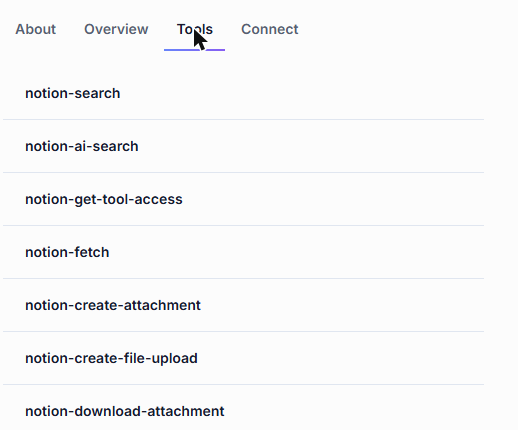
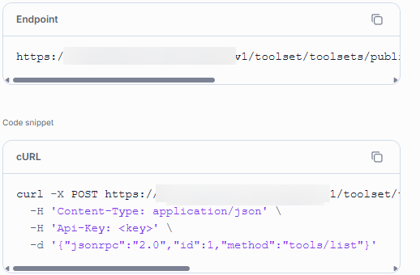
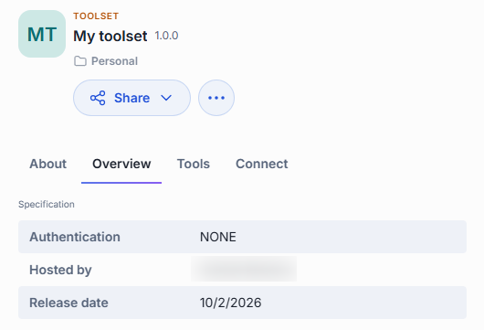
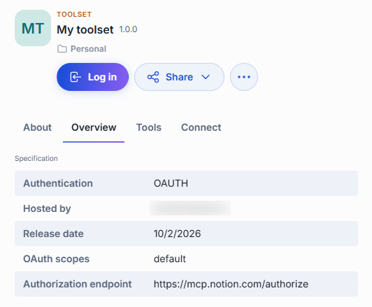
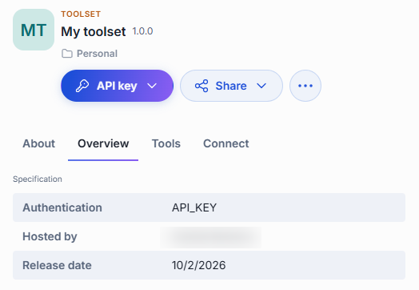
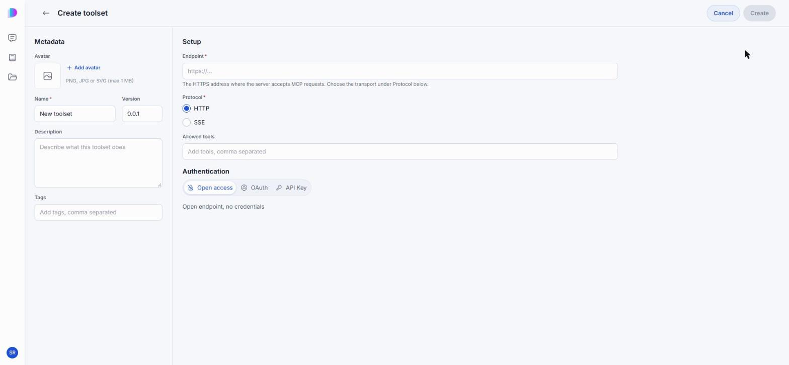
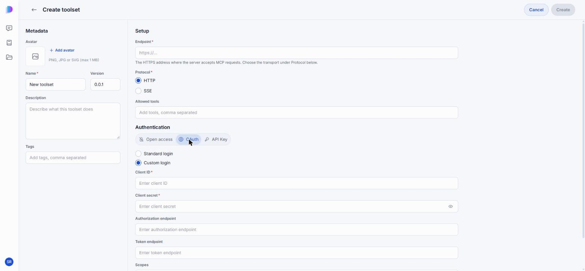

# Toolsets

A toolset is a connection to an [MCP](https://modelcontextprotocol.io/) server that gives agents access to external systems — Notion, GitHub, Jira, a database, or any service with an MCP endpoint. Each toolset brings a set of tools: individual functions such as "search pages" or "create an issue" that an agent can call while working on your request.

The Catalog and the no-code [Quick App editor](./2.agents.md#build-a-quick-app) let anyone connect MCP tools to DIAL and use them in their agents — no technical expertise required. You can build a solution that talks to an external system and performs tasks for you in minutes.

The **Toolsets** tab of the [Catalog](./0.index.md) lists toolsets preconfigured in your DIAL environment, toolsets published by users, and toolsets you created yourself.

**Note**
> For the technical side — MCP transports, tool filtering, registration through the API — see [Toolsets](../../3.building-with-dial/1.apps/2.quick-apps/1.quick-app-2/9.toolsets/0.index.md).

## Use a toolset

You do not talk to a toolset directly — you attach it to an agent, and the agent calls its tools when needed. Open the [Quick App editor](./2.agents.md#build-a-quick-app), expand the **Context & Tools** section, and add the toolset under **Agents & Toolsets**. The orchestrator model then decides which tools to call based on the user's request.

If the toolset requires authentication, sign in before starting a conversation. An agent that tries to use a toolset you are not signed in to will report an authentication error.

## Details panel

Click a toolset's card to open its details panel. It has up to four tabs.

### About

A description written by the toolset's author — what external system it connects to, what tasks it enables, and any prerequisites such as an account at the external service. Below the description, topic labels indicate the toolset's domain. You can filter by these topics in the Catalog's Browse section.

### Overview

**Specification** lists the toolset's metadata. All fields are optional and appear only when provided.

| Field | Meaning |
|-------|---------|
| **Authentication** | How the toolset verifies your identity: `NONE` (open access), `OAUTH` (sign in through the provider), or `API_KEY` (authenticate with a key). |
| **Hosted by** | The organization that runs this toolset instance. |
| **Release date** | When this version of the toolset was published. |
| **OAuth scopes** | The permissions the toolset requests at the external provider. Shown only for OAuth toolsets. Review these before signing in — they determine what the toolset can do on your behalf. |
| **Authorization endpoint** | The URL the toolset sends you to for sign-in. Shown only for OAuth toolsets. |

### Tools

The individual functions the MCP server behind this toolset exposes — for example, `notion-search` or `jira-create-issue`. Each tool has a name and a short description of what it does. This is the most practical tab: it tells you exactly what an agent will be able to do once you attach the toolset.

The tab appears only when the tool list can be loaded — for OAuth toolsets, you need to sign in first so the server can authorize the request.

### Connect

The toolset's MCP endpoint, and a cURL command that calls its `tools/list` method — enough to reach the toolset from your own client instead of through an agent. Unlike a model or an agent, a toolset has no model ID.

## What you can do with a toolset

What actions are available depends on how the toolset reached your Catalog. The toolset's card shows its location — a folder in your personal files, or a folder within the organization.

### Preconfigured toolsets

Preconfigured toolsets are set up in the platform configuration by administrators. Their location shows an organization folder. These toolsets are read-only — you can only attach them to your agents. No actions are available beyond authentication (if the toolset requires it).

### Published toolsets

Published toolsets are made available to the organization by any user or administrator. Their location shows a folder within the organization.

- **Unpublish** — withdraw the toolset from the organization. An unpublish request goes to an administrator for review.

### Toolsets shared with you

When another user shares a toolset directly with you, it appears in the Catalog under **Shared with me**.

- **Remove from My List** — remove the toolset from your catalog. This does not delete the original toolset.

### Your own toolsets

Toolsets you created stay in your personal folder until you share or publish them. You have full control over your own toolsets.

- **Share** — let specific people access your toolset. See [Sharing and publishing](../5.sharing-and-publishing.md).
- **Edit** — reopen the editor with your settings in place. See [Edit a toolset](#edit-a-toolset).
- **Publish** — offer the toolset to your organization. A publication request goes to an administrator for review. See [Sharing and publishing](../5.sharing-and-publishing.md).
- **Revoke access** — remove access you previously shared with specific people.
- **Delete** — remove the toolset permanently. See [Delete a toolset](#delete-a-toolset).

## Authentication

Toolsets support three authentication modes, shown in the Overview tab's **Authentication** field. A toolset that requires authentication and has not been signed in shows a warning marker on its card.

### No authentication

The toolset connects to an open endpoint that requires no credentials. No auth button appears in the details panel — you can attach it to an agent and start using it right away.

### OAuth

The toolset requires you to sign in through the external provider (for example, Notion or Microsoft). Before you sign in, the primary button reads **Log in**. After signing in, it changes to **Log out**.

To sign in, click **Log in**, complete the sign-in at the external provider, and approve the access the toolset asks for. When you return, the button reads **Log out** and the **Tools** tab shows the available functions.

To sign out, click **Log out**. The toolset stops working for you until you sign in again; agents that rely on it will report an authentication error.

### API key

The toolset authenticates with an API key you provide. Before you enter a key, the primary button reads **API key**. Click it to open a dropdown where you enter your key. After you save a key, the button changes to **Change API key**.

## Create a toolset

Click **Create** in the Catalog and choose **Toolset**. The editor has two sections on one screen: **Metadata** on the left and **Setup** on the right.

**Metadata** — how the toolset appears in the Catalog.

| Field | Required | Description |
|-------|:--------:|-------------|
| Avatar | No | PNG, JPG, or SVG, up to 1 MB. |
| Name | Yes | The name shown on the toolset's card. |
| Version | No | Defaults to `0.0.1`. |
| Description | No | What this toolset does. |
| Tags | No | Comma-separated topics that help people find it. |

**Setup** — where the toolset connects and what it may expose.

| Field | Required | Description |
|-------|:--------:|-------------|
| Endpoint | Yes | The HTTPS address where the MCP server accepts requests. |
| Protocol | Yes | The transport the server speaks: **HTTP** or **SSE**. |
| Allowed tools | No | A comma-separated list restricting which of the server's tools this toolset exposes. Leave it empty to expose all of them. |

### Choose how it authenticates

The **Authentication** switch at the bottom of Setup offers three modes.

- **Open access** — an open endpoint that needs no credentials.
- **OAuth** — sign-in through the provider. **Standard login** relies on the server registering clients dynamically, so the endpoint is all you need. **Custom login** is for a provider that expects you to register the client yourself, and asks for the details below.

  

  | Field | Required | Description |
  |-------|:--------:|-------------|
  | Client ID | Yes | The client identifier the provider issued you. |
  | Client secret | Yes | The matching secret. |
  | Authorization endpoint | No | Where users are sent to approve access. |
  | Token endpoint | No | Where DIAL exchanges the code for a token. |
  | Scopes | No | The permissions to request. |

- **API Key** — authenticate with a key instead of a sign-in. Choose **With login** or **Without login**, then give the **API Key parameter name** the server expects and the **API key** itself.

Click **Create** to register the toolset. It stays in your private folder, visible only to you, until you [share or publish](../5.sharing-and-publishing.md) it.

**Note**
> To register a toolset without the UI, see [Define and register a toolset](../../3.building-with-dial/1.apps/2.quick-apps/1.quick-app-2/9.toolsets/1.define-and-register.md).

## Edit a toolset

Open the toolset's **...** menu and click **Edit**. The editor reopens with your settings in place; change what you need and click **Save**.

You can edit toolsets in two cases:

- **Your own toolsets** — found in your personal folder.
- **Toolsets shared with you with editing rights** — found in the Catalog under **Shared with me**.

## Delete a toolset

Open the toolset's **...** menu and click **Delete**, then confirm. Deleting is permanent.

Only the toolset's creator can delete it — editing rights do not grant delete access. To delete a published toolset, unpublish it first.

Deleting a toolset breaks the agents that use it: they report an error when they try to reach it, and the missing toolset is flagged in the Quick App builder.

## Next steps

- [Agents](./2.agents.md#build-a-quick-app) — attach a toolset to an agent you build
- [Skills](./4.skills.md) — pair a toolset with instructions for using it well
- [Sharing and publishing](../5.sharing-and-publishing.md) — let other people use your toolset
