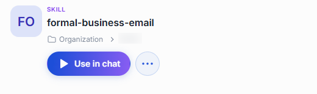
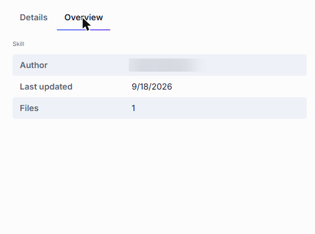
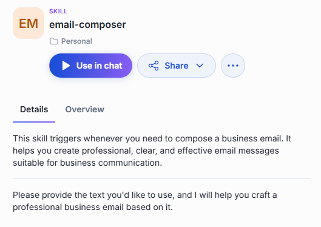
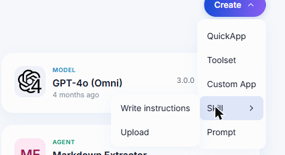
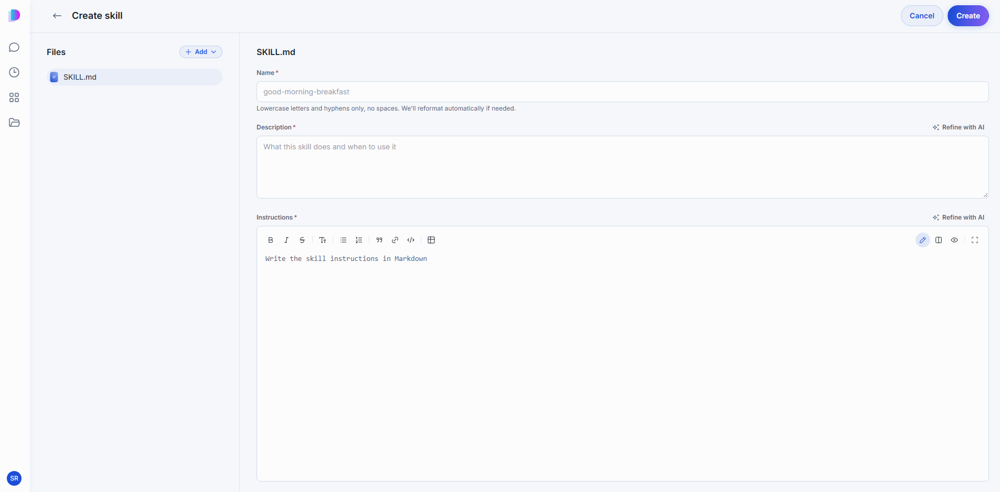

# Skills

A skill is a set of instructions an agent picks up only when it needs them. Instead of writing everything an agent might ever need to know into one long system prompt, you write each procedure once — how your company processes an insurance claim, how a business email should be worded, how to put together a proposal for an RFP — and save it as a skill. The agent loads the skill when the conversation calls for it, and ignores it the rest of the time.

You can share a skill across multiple agents: attach it once and every agent that uses it follows the same procedure. When you update the skill, every agent picks up the change automatically.

The **Skills** tab of the [Catalog](./0.index.md) lists skills published across your organization and the ones you wrote yourself.

## Use a skill

There are two ways to use a skill.

**Attach it to an agent.** When you build a [Quick App](./2.agents.md#build-a-quick-app), the **Agent Skills** section of the editor is where you pick the skills the agent may draw on. The agent then decides for itself when a task matches one — which is why a skill's description matters as much as its instructions: it is what the agent reads to recognize the moment to use it.

**Use it directly in chat.** Click **Use in chat** on the skill's card in the Catalog. DIAL Chat opens a new conversation and adds the skill to the composer, so the agent applies the skill's instructions when you send your message. You can also attach a skill from the chat input area — type `@` to open the skill selector and pick the one you need.

## Details panel

Click a skill's card to open its details panel.



- **Details** — the skill's description, followed by its full instructions, so you can read exactly what an agent will follow before you attach it. If the skill includes supporting files, they are listed on the card and can be previewed.
- **Overview** — who wrote the skill, when it was last updated, and how many files it contains.

  

## What you can do with a skill

What actions are available depends on how the skill reached your Catalog.

### Published skills

Published skills are made available to the organization by any user or administrator. Their location shows a folder within the organization.

- **Use in chat** — add the skill to the composer and start a conversation.
- **Download** — save the skill's files to your device.
- **Unpublish** — withdraw the skill from the organization. An unpublish request goes to an administrator for review.


### Skills shared with you

When another user shares a skill directly with you, it appears in the Shared with me folder in the file manager.

- **Use in chat** — add the skill to the composer and start a conversation.
- **Download** — save the skill's files to your device.
- **Remove from My List** — remove the skill from your catalog. This does not delete the original skill.

### Your own skills

Skills you created stay in your personal folder until you share or publish them. You have full control over your own skills.

- **Use in chat** — add the skill to the composer and start a conversation.
- **Share** — let specific people access your skill. See [Sharing and publishing](../5.sharing-and-publishing.md).
- **Edit** — reopen the editor with your content in place. See [Edit a skill](#edit-a-skill).
- **Download** — save the skill's files to your device.
- **Publish** — offer the skill to your organization. A publication request goes to an administrator for review. See [Sharing and publishing](../5.sharing-and-publishing.md).
- **Delete** — remove the skill permanently. See [Delete a skill](#delete-a-skill).



## Create a skill

Click **Create** in the Catalog, point at **Skill**, and choose how you want to start.



- **Write instructions** — compose the skill in the editor.
- **Upload** — bring in files you already have. The primary file must be a `SKILL.md` with YAML frontmatter — `name` and `description` fields between `---` fences — followed by the instructions in Markdown:

  ```yaml
  ---
  name: email-composer
  description: This skill triggers whenever you need to compose a business email.
  ---

  Your instructions in Markdown…
  ```

  You can include supporting files alongside `SKILL.md` — they travel with the skill.



| Field | Required | Description |
|-------|:--------:|-------------|
| Name | Yes | Lowercase letters and hyphens, no spaces — for example `claims-processor`. DIAL reformats the name if needed. |
| Description | Yes | What this skill does and when to use it. The agent reads this to decide whether a task matches. |
| Instructions | Yes | The procedure itself, in Markdown. |

The editor can refine your description and instructions with AI — look for the refinement action next to each field. It rewrites the text to be clearer and more effective for agent consumption.

Click **Create** to save. The skill stays in your private folder, visible only to you, until you [share or publish](../5.sharing-and-publishing.md) it.

## Edit a skill

Open the skill's **...** menu and click **Edit**. The editor reopens with your content in place; change what you need and click **Save**.

You can edit skills in two cases:

- **Your own skills** — found in your personal folder.
- **Skills shared with you with editing rights** — found in the Shared with me folder in the file manager.

## Delete a skill

Open the skill's **...** menu and click **Delete**, then confirm. Deleting is permanent.

Only the skill's creator can delete it — editing rights do not grant delete access. To delete a published skill, unpublish it first.

## Next steps

- [Agents](./2.agents.md#build-a-quick-app) — attach your skills to an agent
- [Toolsets](./3.toolsets.md) — give the agent the tools a skill tells it how to use
- [Sharing and publishing](../5.sharing-and-publishing.md) — let other people use your skill
