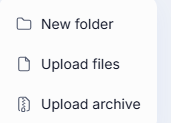
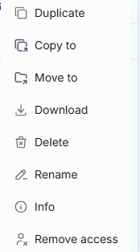

# File Manager

The File Manager holds every file and folder you can reach in DIAL Chat — the ones you uploaded yourself, the ones other people shared with you, and the ones published to your organization. Open it from the navigation rail on the left.

It's also where a conversation's attachments actually live. When a model or agent supports attachments — DIAL RAG is the clearest example — attaching a file or folder to a message points the agent at a file stored here, and the agent reads its content to answer you. Upload a file during a conversation and it lands in **My Files** at the same time, so it's there to attach to a different conversation later without uploading it again. See [Work with attachments](./1.conversations.md#work-with-attachments) in Conversations for how to attach one.

The File Manager has three tabs:

| Tab | What it holds |
|---|---|
| **My Files** | Your own files and folders — anything you uploaded directly or that a conversation attached on your behalf. Private to you. |
| **Shared with Me** | Files and folders other people shared with you, including attachments that came along with a conversation someone shared with you. |
| **Organization** | Files published to your organization, including attachments of published items that carry files with them. |

**Note**
> Sharing a conversation shares its attachments along with it; publishing one does not — see [Sharing and publishing](./4.sharing-and-publishing.md).

## My Files

This is your private space: upload here, organize into folders, and every action is available because you own everything in it.

### Add a file or folder

Click **New** for three options:

- **New folder** — creates a folder in the current location.
- **Upload files** — uploads one or more files from your device.
- **Upload archive** — uploads a `.zip` and extracts it into a new folder, instead of leaving the archive itself as a file.

**Note**
> These characters are stripped from file and folder names: tab, `"`, `:`, `;`, `/`, `\`, `,`, `=`, `{`, `}`, `%`, `&`. A leading or inner `.` is kept, but a trailing one is removed.

### File and folder actions

Open a file or folder's **···** menu for the actions available on it:

- **Duplicate** — makes a copy in the same location.
- **Copy to** / **Move to** — copy or move it to another folder in your private space, picked from a folder browser.
- **Download** — downloads it to your device.
- **Delete** — removes it, after you confirm.
- **Rename** — changes the name in place.
- **Info** — a read-only panel with name, modified date, size, author, and full path. Only files show this; folders don't.
- **Remove access** — appears once the file has been shared with someone and they've opened it (typically because it was attached to a shared conversation). Cuts off their access to this one file without touching the conversation it came from.

**Note**
> Some applications can be configured to attach an entire folder to a conversation. Only folders you created in the File Manager — not folders that appear only inside a conversation's attachments — can be attached this way.

### Hidden files

Toggle **Hidden files** on to reveal files whose name starts with a dot. Most of these are internal markers rather than content you'd open — for instance, creating a folder also creates an empty `.dial_folder` marker inside it, which is what makes an otherwise-empty folder exist in storage. Leave the toggle off day to day; turn it on only when you need to confirm one of these markers is there, or to find a file you uploaded with a leading dot in its name.

## Shared with Me

Files and folders other people have shared with you land here — most commonly the attachments of a conversation someone shared with you, since sharing a conversation shares its files along with it.

You didn't create these, so your options are narrower: you can download a file, and remove it from this list once you no longer need it. If a file arrived as part of an application shared with you **with editing rights**, you can also delete it from the application's own source files.

## Organization

Files published to your organization sit here — mainly the attachments of published agents, toolsets, skills, or Quick Apps that depend on files to work.

The action set is the shortest of the three tabs: **Download** and **Info**. You can look, and you can take a copy; you can't rename, move, or delete anything here.

## Next steps

- [Conversations](./1.conversations.md#work-with-attachments) — attach a file to a message
- [Sharing and publishing](./4.sharing-and-publishing.md) — how a file ends up in Shared with Me or Organization in the first place
- [Catalog](./2.catalog/0.index.md) — build a Quick App that uses files as context
