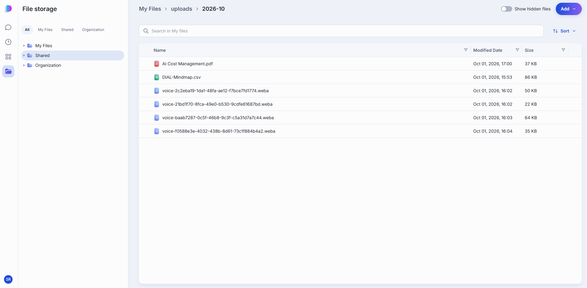
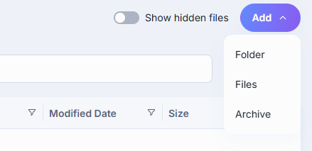
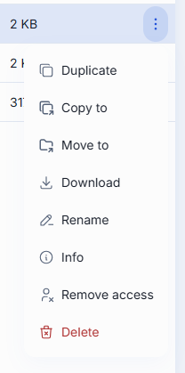

# File Manager

The File Manager is where everything you upload or receive in DIAL Chat is stored: your own files, the attachments you added to conversations, files other people shared with you, and files available to your whole organization. Open it from the navigation rail on the left.

On the left are the tabs and the folder tree. On the right is the open folder, with its path above the list, a search box, **Sort**, a **Show hidden files** toggle, and the **Add** button.

## Tabs

| Tab | What it holds | What you can do | Sharing and publishing |
|---|---|---|---|
| **All** | The default view: **My Files**, **Shared**, and **Organization** as three top-level folders in one tree. | Whatever the folder you open allows. | — |
| **My Files** | Your own files and folders: uploads, conversation attachments, and voice recordings. Private to you. | Everything: add, organize, rename, download, delete. See [Work in My Files](#work-in-my-files). | Sharing a conversation also shares the files attached to it, as long as they're in your storage. Publishing a conversation doesn't publish its attachments. |
| **Shared** | Files and folders other people shared with you, including the attachments of a conversation someone shared with you. | **Download**, and **Unshare** to remove an item from your list. You can't rename, move, or delete what you didn't create. | Sharing an application shares the application only, so its files don't appear here. |
| **Organization** | Files stored for your whole organization. What's there depends on your organization. See [Authentication and access control](../2.understand-dial/4.security-and-governance/1.authentication-and-access-control.md) for how private and public storage differ. | **Download** and **Info** only. | Publishing submits only the item itself, so attachments don't come along. |

**Note**
> Your administrator can limit which tabs appear. You can't copy or move items between My Files, Shared, and Organization.

## How files get into My Files

- **Attachments.** A file you attach to a message is uploaded the moment you add it, not when you send the message. It's stored under `uploads/<year-month>`, so you can attach it to another conversation later without uploading it again. See [Attachments](./1.conversations.md#attachments) in Conversations.
- **Voice recordings.** Audio you attach, and recordings you dictate, go to the same `uploads/<year-month>` folder and stay there after the message is sent. They appear as `voice-<id>.weba` files.
- **Direct uploads.** Files you add in the File Manager itself, and files you pick or upload when you edit an app, skill, or toolset.
- **Files created by applications.** An application or agent can return files in its replies. Whether such a file is also kept in your storage depends on the application.

## Work in My Files

### Find a file

Type in the search box to look for files by name. Search covers the whole tab you're in, not only the open folder. **Sort** changes the order of the list.

### Add a file or folder

Click **Add** for three options:

- **Folder** — creates a folder in the current location.
- **Files** — uploads one or more files from your device.
- **Archive** — uploads a `.zip` and extracts it into a new folder, instead of leaving the archive itself as a file.

**Note**
> These characters are stripped from file and folder names: tab, `"`, `:`, `;`, `/`, `\`, `,`, `=`, `{`, `}`, `%`, `&`. A leading or inner `.` is kept, but a trailing one is removed.

### File and folder actions

Open a file or folder's **···** menu for the actions available on it:

- **Duplicate** — makes a copy in the same location.
- **Copy to** / **Move to** — copy or move it to another folder in your private space, picked from a folder browser.
- **Download** — downloads it to your device.
- **Delete** — removes it, after you confirm.
- **Rename** — changes the name in place.
- **Info** — a read-only panel with name, modified date, size, author, and full path. Only files show this; folders don't.
- **Remove access** — appears once the file has been shared with someone and they've opened it (typically because it was attached to a shared conversation). Cuts off their access to this one file without touching the conversation it came from.

**Note**
> Some applications can be configured to attach an entire folder to a conversation. Only folders you created in the File Manager — not folders that appear only inside a conversation's attachments — can be attached this way.

### Hidden files

Turn on **Show hidden files** to reveal items whose name starts with a dot. These are system files rather than content you'd open. For example, creating a folder also creates an empty `.dial_folder` marker inside it, which is what makes an otherwise-empty folder exist in storage. Leave the toggle off day to day; turn it on only to confirm one of these markers is there, or to find a file you uploaded with a leading dot in its name.

## Next steps

- [Conversations](./1.conversations.md#attachments) — attach a file to a message
- [Sharing and publishing](./5.sharing-and-publishing.md) — how files travel with shared and published items
- [Catalog](./3.catalog/0.index.md) — build a Quick App that uses files as context
