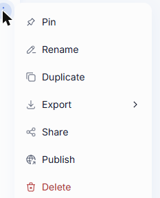
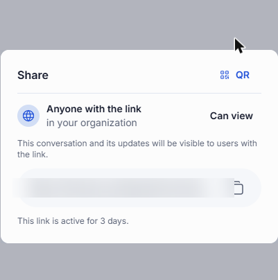
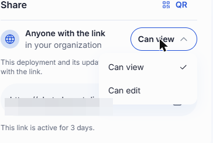
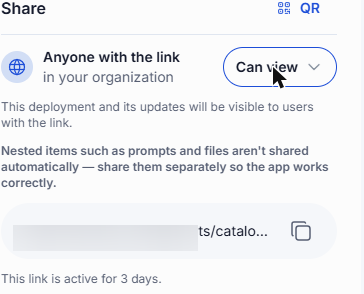
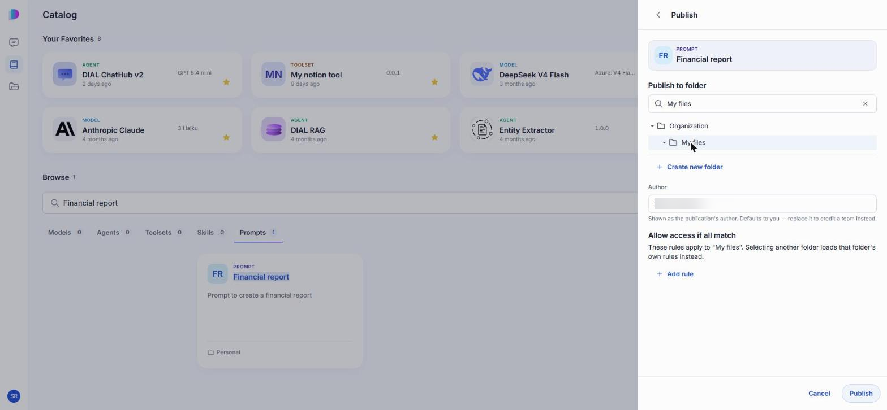
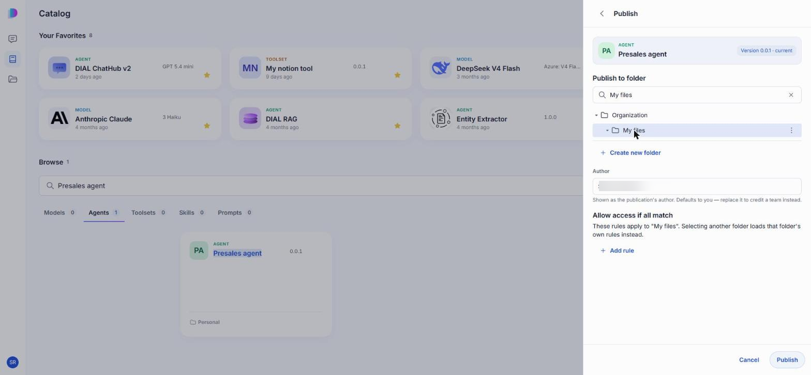
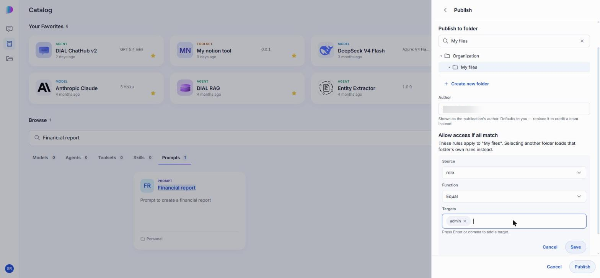
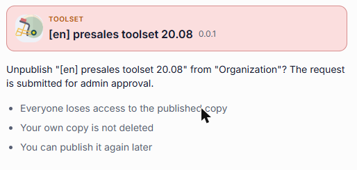

# Sharing and publishing

Everything you create in DIAL Chat — a conversation, a prompt, an agent, a toolset, a skill — is stored in your own private space and is visible only to you. Sharing and publishing are the two ways to let other people in.

They solve different problems. Sharing hands a link to the people you choose, takes effect at once, and can grant editing rights. Publishing puts the item in front of your whole organization, or the part of it that matches rules you set, and an administrator reviews the request before anything becomes visible.

| | Sharing | Publishing |
|---|---|---|
| Who gets access | Anyone you send the link to, inside your organization | Everyone in the organization who matches the folder's access rules |
| Takes effect | Immediately | Only after an administrator approves the request |
| Access granted | View, or edit for most item types | Use — the published copy can't be edited |
| What the other person gets | A live view of your item, updates included | A separate published copy |
| Lifetime | The link expires after 3 days, and you can revoke access sooner | Stays until it's unpublished |

**Note**
> Publishing has to be enabled in your deployment. If you don't see **Publish** anywhere, ask your administrator — see [Enable publications](../4.operating-dial/4.configuration/8.enable-publications.md).

## Sharing

Open an item's menu — in the **Chats** list, or in its details panel in the [Catalog](./2.catalog/0.index.md) — and click **Share**.

The panel gives you a link and a QR code for the same item; click **QR** and **Link** in the top right to switch between them. Send either one to the people you want to reach. Anyone in your organization who opens it gets access — the link doesn't pick out named individuals, so treat it as something to pass to specific people rather than post somewhere open.

The panel also states the two things people most often get wrong about sharing:

- **The link is temporary.** It stays active for 3 days. Share the item again to hand out a fresh link.
- **What you share stays live.** Recipients see the item as it is now, including later changes you make — a shared conversation shows messages you add after sharing. You aren't sending a snapshot.

### View or edit access

For a prompt, agent, toolset, or skill, a **Can view / Can edit** dropdown sits next to the link.

**Can edit** is the real difference between sharing and publishing: it lets someone change the item itself, not merely use it. That makes it the tool for collaborating on something still being built — a colleague can fix your agent's instructions rather than describing the fix to you.

Two consequences are worth knowing before you grant it. Edits apply to the one shared item, so whoever saves last wins; DIAL doesn't merge simultaneous changes. And a conversation is the exception to all of this — it has no permission dropdown and is always shared view-only, so recipients can read it and duplicate it, but never alter your original.

**Warning**
> Sharing an agent shares the agent's own definition only. The prompts and files it depends on are **not** included automatically, so an agent shared on its own may not work for the recipient. Share those items separately.

### What recipients see

Opening a share link grants access immediately — there's no invitation to accept or decline. DIAL Chat takes the recipient straight to the item.

From then on it sits alongside their own work, marked by where it appears rather than by any badge on it:

- **Conversations** appear under the **Shared** tab in the Chats list.
- **Agents, toolsets, skills, and prompts** appear in the [Catalog](./2.catalog/0.index.md) in the normal list, with **Shared with me** where an item of their own would say **Personal**.
- **Files**, including attachments that came along with a shared conversation, appear under **Shared with Me** in the [File Manager](./3.files.md).

A conversation shared with you is read-only. To build on it, use **Duplicate** to make a copy of your own — see [Conversations](./1.conversations.md).

To clear a shared item out of their lists, the recipient uses **Remove from My List** in its menu. That gives up their access — they need a fresh link to get it back.

### Revoke access

Once at least one person has opened your link, **Revoke access** appears in the item's menu, with the number of people who have access next to it. Use it to cut everyone off before the link would expire on its own; confirm when prompted. The item itself is untouched — only other people's access to it goes away.

**Note**
> The action stays hidden until somebody actually opens the link. A link you've issued but nobody has used yet grants access to no one, so there's nothing to revoke.

## Publishing

Publishing moves beyond the people you can hand a link to. It places a copy of your item in a folder under **Organization**, where anyone whose attributes match that folder's access rules can find it. Because that potentially means everyone you work with, every request is reviewed by an administrator, who can approve it, decline it, or adjust it — including its access rules — before it goes live.

To publish, open the item's menu (or the **···** menu in its details panel) and click **Publish**.

The form has three parts:

| Field | What it does |
|---|---|
| **Publish to folder** | Picks the destination folder under **Organization**. Search the tree, or use **Create new folder**. The folder does double duty: it organizes published items and it carries the access rules that decide who can see them. |
| **Author** | Who the publication is credited to. It defaults to your name; replace it to credit a team instead. |
| **Allow access if all match** | The access rules attached to the folder you picked. Choosing a different folder replaces them with that folder's own rules. |

For a model, agent, or toolset, the header shows which version is going out, read from the item itself — there's no version field to fill in. If you need to publish a different version, change the item first, then publish.

**Warning**
> **Publish** submits the request straight away — the form has no second confirmation step, and the folder tree sits above the button, so you can click it before you've scrolled down and checked the author and rules. Review both before you click.

DIAL Chat then confirms the request was submitted and names the folder it's headed for. Nothing changes for anyone else yet: your item stays private, exactly where it was, until an administrator approves the request.

### What happens after approval

Approval creates a **separate published copy**. Your original stays in your private space, still yours to edit — and editing it does not change what other people see. To put newer work in front of the organization, unpublish the current copy and publish again; an item can't be published twice at the same time.

Where the published copy turns up depends on what it is:

- **Agents, toolsets, skills, and prompts** appear in the [Catalog](./2.catalog/0.index.md), labelled **Organization** rather than **Personal**.
- **Conversations** appear under the **Organization** tab in the Chats list, read-only for everyone but you.

**Warning**
> Publishing a conversation publishes the conversation only — its attachments do **not** go with it, so other people may open it and find files they can't reach. This differs from sharing, which does include a conversation's attachments. If people need the files, publish them separately.

### Access rules

An access rule decides who can reach anything published into a folder. Add one with **Add rule**; it has three parts:

| Part | Meaning |
|---|---|
| **Source** | The piece of information about the user to test — `title`, `role`, or `dial_roles`. These come from the claims your identity provider puts in the user's token, so ask your administrator which ones your organization actually populates. |
| **Function** | How to compare: **Equal**, **Contain**, or **Regex**. |
| **Targets** | The values to match against. Press Enter or comma after each one to add it as a chip. |

The example above grants access to everyone whose `role` equals `admin`.

A few rules about the rules:

- They belong to the **folder**, not to the individual item, so everything published into the same folder shares one audience. Publishing two items to different audiences means publishing them into different folders.
- A folder with no rules at all is open to every authorized user in the organization.
- Restrictions accumulate down the tree: a folder inherits the restrictions of every folder above it, up to the root. See [Effective rules](../3.building-with-dial/7.working-with-dial-resources/2.publications-api.md#effective-rules).

## Unpublishing

Unpublishing withdraws the published copy so the organization can no longer reach it. Open the published item in the Catalog, and click **Unpublish** in its **···** menu.

**Unpublish** appears on items **you** published — DIAL Chat works it out from your own publication history, not from who currently owns the copy. So you may well see it on something that now sits under **Organization** and no longer looks like yours. On a published item somebody else put there, the action doesn't appear at all; withdrawing that one is an administrator's job.

The confirmation spells out what it does and doesn't do:

- Everyone loses access to the published copy.
- Your own copy is not deleted.
- You can publish it again later.

Like publishing, unpublishing is a request that an administrator reviews before it takes effect.

**Note**
> A published item can't be deleted while it's published. Unpublish it first, then delete your own copy.

## Next steps

- [Catalog](./2.catalog/0.index.md) — where published agents, toolsets, skills, and prompts show up
- [Conversations](./1.conversations.md) — duplicating a conversation someone shared with you
- [File Manager](./3.files.md) — the Shared with Me and Organization tabs
- [Collaboration and sharing](../2.understand-dial/3.capabilities/4.collaboration-and-sharing.md) — how sharing and publication fit into DIAL's access model
- [Publications and review](../5.administering-dial/7.publications-and-review.md) — what administrators do with your request
