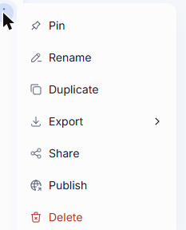
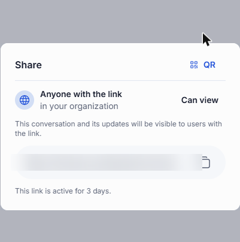
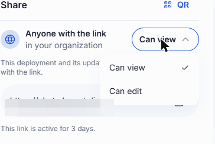
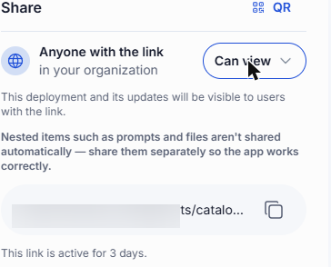
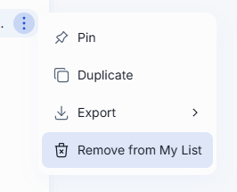
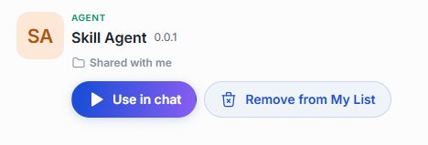
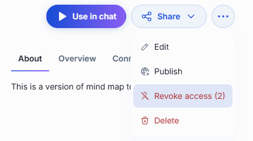
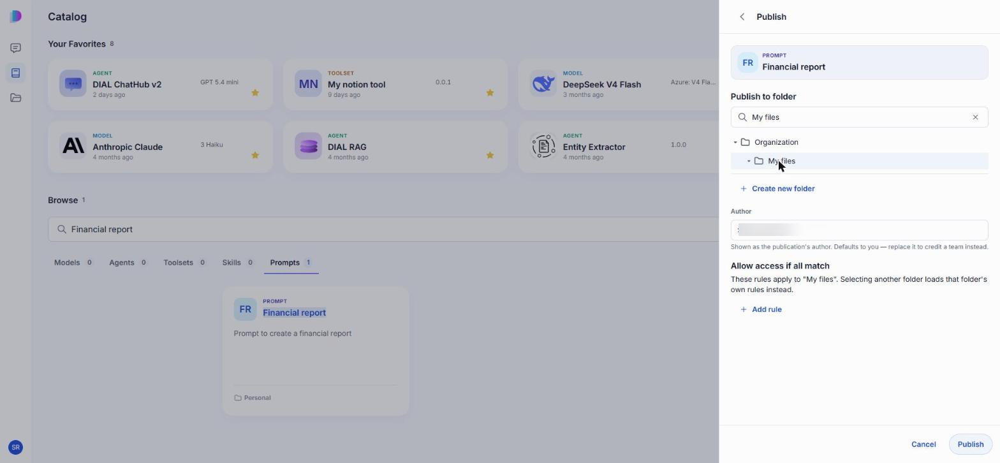
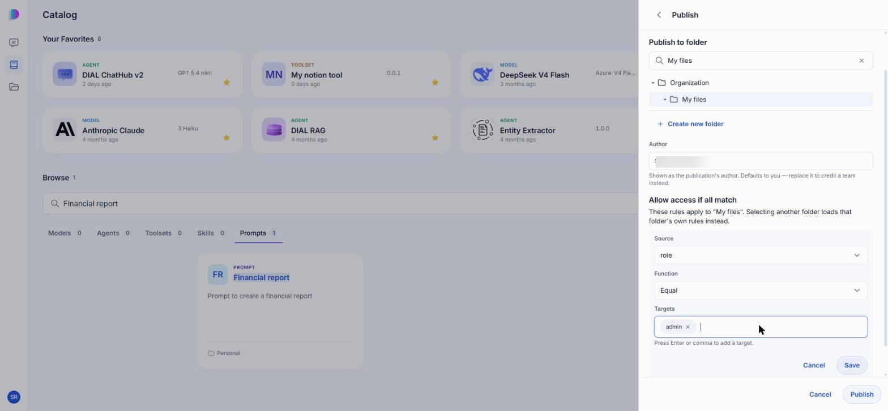
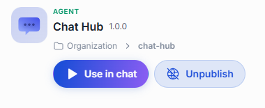

# Sharing and publishing

Everything you create in DIAL Chat — a conversation, a prompt, an agent, a toolset, a skill — is stored in your own private space and is visible only to you. Every user has a dedicated space in DIAL file storage, and only the owner can open what is in it. Sharing and publishing are the two ways to let other people in.

They solve different problems. Sharing hands a link to the people you choose, takes effect at once, and can grant editing rights. Publishing puts the item in front of your whole organization, or the part of it that matches rules you set, and an administrator reviews the request before anything becomes visible.

| | Sharing | Publishing |
|---|---|---|
| Who gets access | Anyone you send the link to, inside your organization | Everyone in the organization who matches the folder's access rules |
| Takes effect | Immediately | Only after an administrator approves the request |
| Access granted | View, or edit for most item types | Use — the published copy can't be edited |
| What the other person gets | A live view of your item, updates included | A separate published copy |
| Lifetime | The link expires after a while, and you can revoke access sooner | Stays until it's unpublished |

**Note**
> Publishing has to be enabled in your deployment. If you don't see **Publish** anywhere, ask your administrator — see [Enable publications](../4.operating-dial/4.configuration/8.enable-publications.md).

## Sharing

### What you can share

You can share conversations, prompts, and agents, toolsets, and skills. Files can't be shared on their own: they travel with the conversation they're attached to.

### Share an item

Open an item's menu — in the **Chats** list, or in its details panel in the [Catalog](./3.catalog/0.index.md) — and click **Share**.

The panel gives you a link and a QR code for the same item; click **QR** and **Link** in the top right to switch between them. Send either one to the people you want to reach. Anyone in your organization who opens it gets access — the link doesn't pick out named individuals, so treat it as something to pass to specific people rather than post somewhere open.

The panel also states the two things people most often get wrong about sharing:

- **The link is temporary.** It stays active for a limited time — the panel shows how many days. Share the item again to hand out a fresh link.
- **What you share stays live.** Recipients see the item as it is now, including later changes you make — a shared conversation shows messages you add after sharing. You aren't sending a snapshot.

**Note**
> DIAL Chat doesn't limit how many people can open a link. An administrator can set such a limit in DIAL Core; once it's reached, further people see "This share link is invalid or has expired."

### View or edit access

For a prompt, agent, toolset, or skill, a **Can view / Can edit** dropdown sits next to the link.

**Can edit** is the real difference between sharing and publishing: it lets someone change the item itself, not merely use it. That makes it the tool for collaborating on something still being built — a colleague can fix your agent's instructions rather than describing the fix to you.

Two consequences are worth knowing before you grant it. Edits apply to the one shared item, and DIAL doesn't lock it, so concurrent edits can overwrite each other. And a conversation is the exception to all of this — it has no permission dropdown and is always shared view-only, so recipients can read it and duplicate it, but never alter your original.

### What is shared along with an item

- **Conversation:** its attachments are shared along with it — files from messages, stages, and citations — and they appear in the recipient's Files. A file stored in another user's bucket is not shared. Conversations are always shared view-only.
- **Agent:** the agent is shared together with the prompts its skills use, and appears under **Shared with me**. Source files, context files, and toolsets are not shared. Edit access applies to the agent and those prompts only, so the recipient cannot change or delete the agent's files.
- **Folder:** sharing a folder is not available. Share conversations one at a time.

### Where shared items appear

Opening a share link grants access immediately — there's no invitation to accept or decline. DIAL Chat takes the recipient straight to the item, where it then sits alongside their own work:

- **Conversations** appear under the **Shared** tab in the Chats list.
- **Agents, toolsets, skills, and prompts** appear in the [Catalog](./3.catalog/0.index.md). Under the item's name, a shared item says **Shared with me** where one of your own says **Personal**.
- **Files**, including attachments that came along with a shared conversation, appear under **Shared** in the [File Manager](./4.files.md).

A conversation shared with you is read-only. To build on it, use **Duplicate** to make a copy of your own — see [Conversations](./1.conversations.md).

### Remove a shared item from your list

If someone shared an item with you and you no longer need it, click **Remove from My List** in its menu. In the Chats list it's in the conversation's menu:

In the Catalog it's a button on the item:

You lose access, other people keep theirs, and the owner's item is untouched. To get it back, you need a new link.

### Revoke access

If you shared an item and want to take it back, use **Revoke access** in the item's menu. The number next to it is how many people have access.

Confirm when prompted. Everyone you shared it with loses access, the link stops working, and your own item is kept.

**Note**
> The action stays hidden until somebody actually opens the link. A link you've issued but nobody has used yet grants access to no one, so there's nothing to revoke.

## Publishing

Publishing moves beyond the people you can hand a link to. It places a copy of your item in a folder under **Organization**, where anyone whose attributes match that folder's access rules can find it. Because that potentially means everyone you work with, every request is reviewed by an administrator, who can approve it, decline it, or adjust it — including its access rules — before it goes live.

### What you can publish

You can publish your own conversations, prompts, agents, toolsets, and skills. Models can't be published.

### Publish an item

To publish, open the item's menu (or the **···** menu in its details panel) and click **Publish**.

The form has three parts:

| Field | What it does |
|---|---|
| **Publish to folder** | Picks the destination folder under **Organization**. Search the tree, or use **Create new folder**. The folder does double duty: it organizes published items and it carries the access rules that decide who can see them. |
| **Author** | Who the publication is credited to. It defaults to your name; replace it to credit a team instead. |
| **Allow access if all match** | The access rules attached to the folder you picked; see [Access rules](#access-rules). Choosing a different folder replaces them with that folder's own rules. |

### Access rules

An access rule decides who can open what's published into a folder. Add one with **Add rule**. Each rule checks one fact about the person and compares it to the values you list, and a person reaches the folder only if they pass every rule on it.

A rule has three parts:

| Part | What you set |
|---|---|
| **Source** | Which claim about the person to check — for example `title`, `role`, or `dial_roles`. These claims come from your identity provider, so ask your administrator which ones your organization fills in. |
| **Function** | How to compare that fact with your values: **Equal** matches one of them exactly, **Contain** matches when the fact includes one of them, and **Regex** matches a pattern. |
| **Targets** | The values to accept. Press Enter or comma after each one to add it. |

For example, to open a folder only to administrators, set **Source** to `role`, **Function** to **Equal**, and add `admin` to **Targets**:

Keep in mind:

- Rules belong to the **folder**, not to the individual item, so everything published into the same folder shares one audience. To publish two items to different audiences, publish them into different folders.
- A folder with no rules is open to every authorized user in the organization.
- Restrictions add up down the tree: a folder also inherits the rules of every folder above it. See [Effective rules](../3.building-with-dial/7.working-with-dial-resources/2.publications-api.md#effective-rules).

**Warning**
> **Publish** sends the request as soon as you click it — there's no confirmation step. Check the author and access rules first.

DIAL Chat confirms the request and names the folder it's headed for. Nothing changes for anyone else yet: your item stays private until an administrator approves the request.

### What is published along with an item

- **Conversation:** only the conversation is published. Attachments are **not** published, and you cannot choose attachments to include. Other people may open the conversation and find files they cannot reach. This differs from sharing, which does include a conversation's attachments. If people need the files, publish them separately.
- **Agent:** only the agent is published. Its files and prompts are **not** published. Once approved, it appears under **Organization**.

### After you publish

Approval creates a **separate published copy**. Your original stays in your private space, still yours to edit — and editing it does not change what other people see. To put newer work in front of the organization, unpublish the current copy and publish again; an item can't be published twice at the same time.

Where the published copy turns up depends on what it is:

- **Agents, toolsets, skills, and prompts** appear in the [Catalog](./3.catalog/0.index.md), labelled **Organization** rather than **Personal**.
- **Conversations** appear under the **Organization** tab in the Chats list, read-only.

### Unpublish

Unpublishing withdraws a published copy so the organization can no longer reach it. Open the published copy — the one shown under **Organization** — and click **Unpublish**.

**Unpublish** acts on the published copy, not on your private original, so it appears on the copy whoever published it: administrators see it on any copy, and so does anyone with write access to the folder the copy sits in. Like publishing, it's a request an administrator reviews before the copy is removed. Your own copy stays untouched, and you can publish again later.

**Note**
> Published **conversations** work differently: only the person who published a conversation sees **Unpublish** on it, in the **Organization** tab of the Chats list.

## Next steps

- [Catalog](./3.catalog/0.index.md) — where published agents, toolsets, skills, and prompts show up
- [Conversations](./1.conversations.md) — duplicating a conversation someone shared with you
- [File Manager](./4.files.md) — the Shared and Organization tabs
- [Collaboration and sharing](../2.understand-dial/3.capabilities/4.collaboration-and-sharing.md) — how sharing and publication fit into DIAL's access model
- [Publications and review](../5.administering-dial/7.publications-and-review.md) — what administrators do with your request
