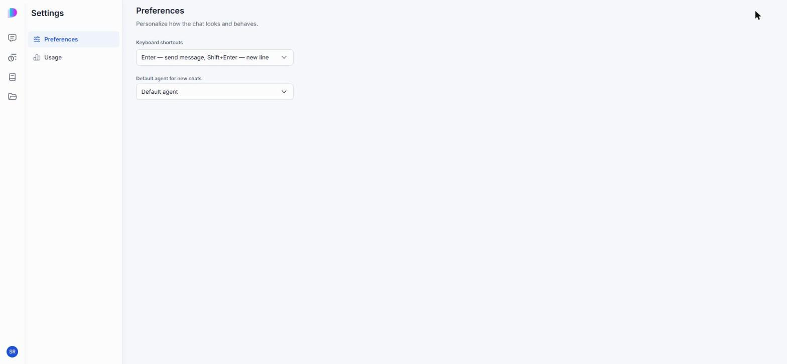
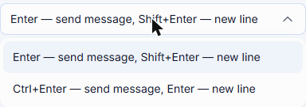
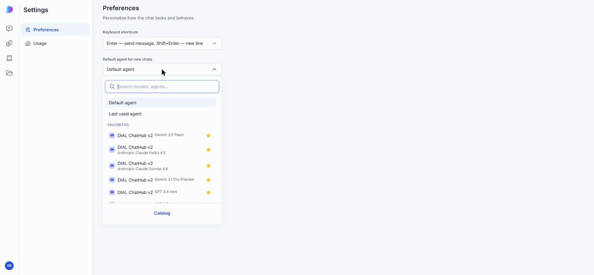
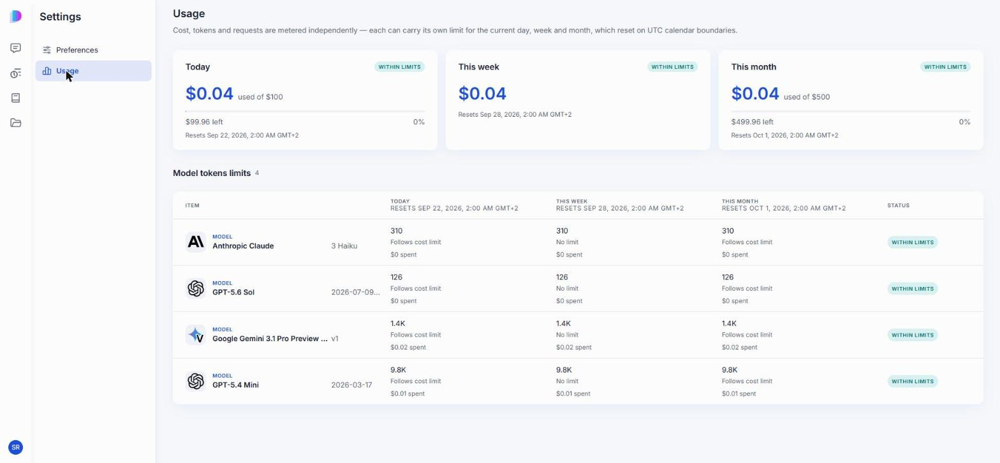

# Usage and settings

Your personal settings and usage numbers live in one place, separate from the Catalog and the File Manager. Open it from your account icon in the bottom corner of the navigation rail, then **Settings**.

It has two tabs: **Preferences**, where you set how the chat behaves for you, and **Usage**, where you see what you've spent against your limits.

## Preferences

**Keyboard shortcuts** decides what Enter does in the composer:

- **Enter — send message, Shift+Enter — new line** (the default)
- **Ctrl+Enter — send message, Enter — new line** — pick this if you write multi-line messages often and don't want to hold Shift every time.

**Default agent for new chats** decides which agent a brand-new conversation opens with:

- **Default agent** — your deployment's standard agent.
- **Last used agent** — whichever agent you talked to most recently, in any conversation.
- Any specific model or agent — search for it, or pick from your Catalog favorites shown directly in the list. Click **Catalog** at the bottom to browse further.

This only sets the starting point for a **new** conversation. You can still switch agents before or during any conversation — see [Choose and change the agent](./1.conversations.md#choose-and-change-the-agent).

## Usage

The Usage tab shows what you've spent against the limits your administrator set, for three rolling windows: today, this week, and this month. Each resets independently on its own UTC calendar boundary — a new day doesn't reset your weekly or monthly totals.

The three cards at the top show your overall spend against your overall cost limit for that window, with a **WITHIN LIMITS** badge while you're under it and how much is left.

**Model tokens limits** breaks that down per model, showing tokens used and cost spent for the same three windows, and whether each one follows its own cost limit or has no limit for that window. A model's status turns from **WITHIN LIMITS** once you're within a set margin of any of its limits — check with your administrator what counts against it and how the limits for your account were set.

**Note**
> Cost, tokens, and requests are metered independently. A model can be within its token limit while over its cost limit, or the reverse.

## Next steps

- [Conversations](./1.conversations.md#choose-and-change-the-agent) — switch agents within a conversation
- [Catalog](./2.catalog/0.index.md) — find and favorite the agent you want as your default
