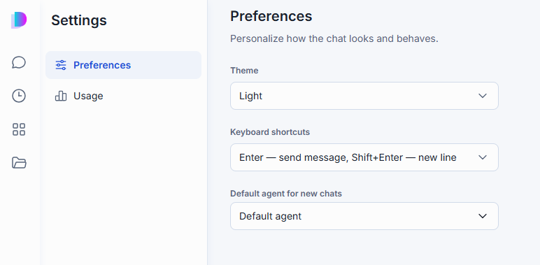
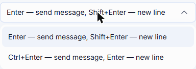
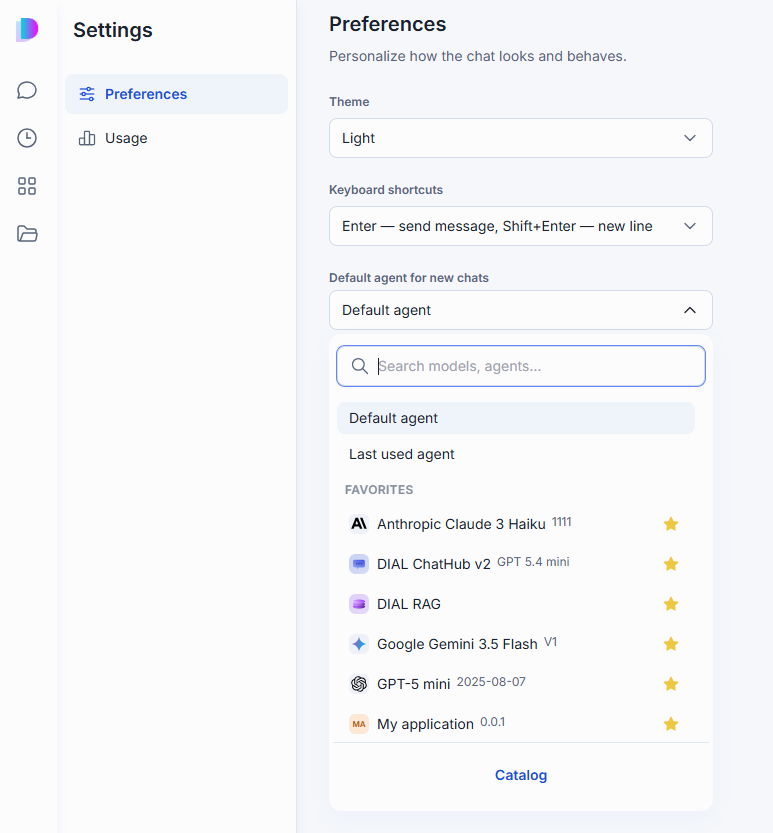
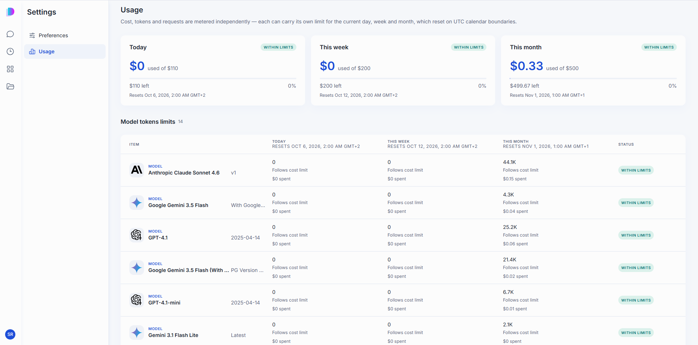

# Usage and settings

Your personal settings and usage numbers live in one place, separate from the Catalog and the File Manager. Open it from your account icon in the bottom corner of the navigation rail, then **Settings**.

It has two tabs: **Preferences**, where you set how the chat behaves for you, and **Usage**, where you see what you've spent against your limits.

## Preferences

The Preferences tab has three settings: **Theme**, **Keyboard shortcuts**, and **Default agent for new chats**.

**Theme** sets the chat's color scheme:

- **Light** and **Dark** — the schemes your deployment ships. (A deployment can add its own themes, which appear in the list too.)
- **System** — follows your operating system's light or dark setting and switches with it. This option appears only when your deployment offers both a Light and a Dark theme.

Your choice is remembered in the current browser. If you've never picked one, the chat starts in Light.

**Keyboard shortcuts** decides what Enter does in the composer:

- **Enter — send message, Shift+Enter — new line** (the default)
- **Ctrl+Enter — send message, Enter — new line** — pick this if you write multi-line messages often and don't want to hold Shift every time. On macOS the modifier is ⌘ instead of Ctrl.

**Default agent for new chats** decides which agent a brand-new conversation opens with:

- **Default agent** — your deployment's standard agent.
- **Last used agent** — whichever agent you talked to most recently, in any conversation.
- Any specific model or agent — search for it, or pick from your Catalog favorites shown directly in the list. Click **Catalog** at the bottom to browse further.

This only sets the starting point for a **new** conversation. You can still switch agents before or during any conversation — see [Choose and change the agent](./1.conversations.md#select-an-agent).

## Usage

The Usage tab shows what you've used against the limits your administrator set, for three periods: **Today**, **This week**, and **This month**. These are calendar periods, not rolling windows — each resets on its own UTC boundary, so a new day doesn't reset your weekly or monthly totals.

The three cards at the top show your overall cost against your overall cost limit for each period, with how much is left and a status badge:

- **Within limits** — you're under the limit.
- **Running low** — you're close to the limit.
- **Limit reached** — the limit is used up. While a period's overall cost limit is reached, you can't use any model until that period resets, no matter how many tokens you have left.

**Model tokens limits** breaks usage down per item for the same three periods, in an **Item / Cost / Tokens / Status** table. It lists the models and agents you've used — an agent's cost includes the models it called. Each row carries the same three status badges, and shows whether that item **Follows cost limit** or has **No limit** for the period.

**Note**
> Cost, tokens, and requests are metered independently, and each can carry its own limit. A model can be within its token limit while over its cost limit, or the reverse. Check with your administrator how the limits for your account were set.

## Next steps

- [Conversations](./1.conversations.md#select-an-agent) — switch agents within a conversation
- [Catalog](./3.catalog/0.index.md) — find and favorite the agent you want as your default
