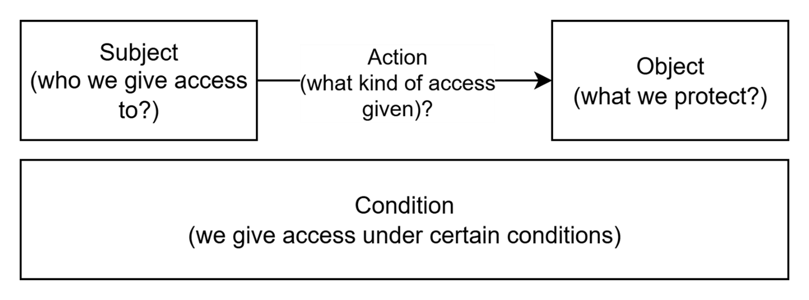
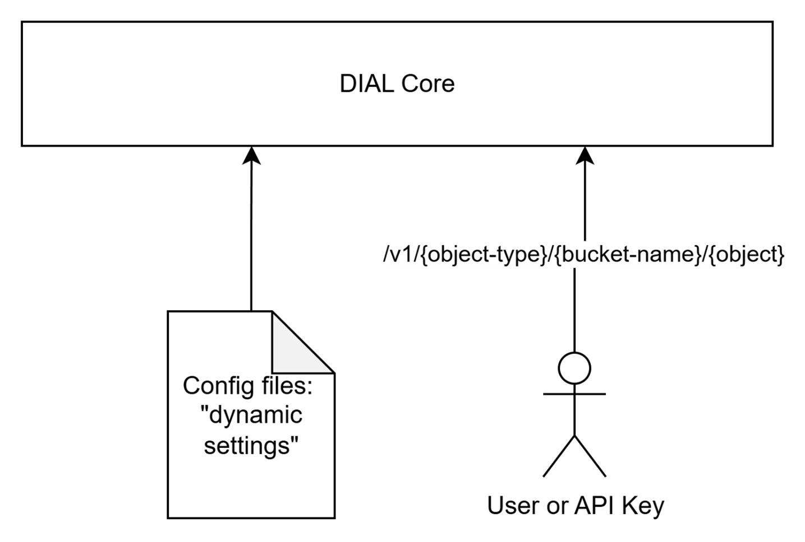
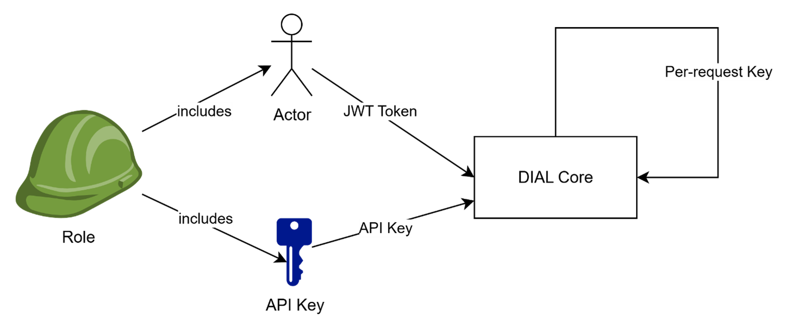
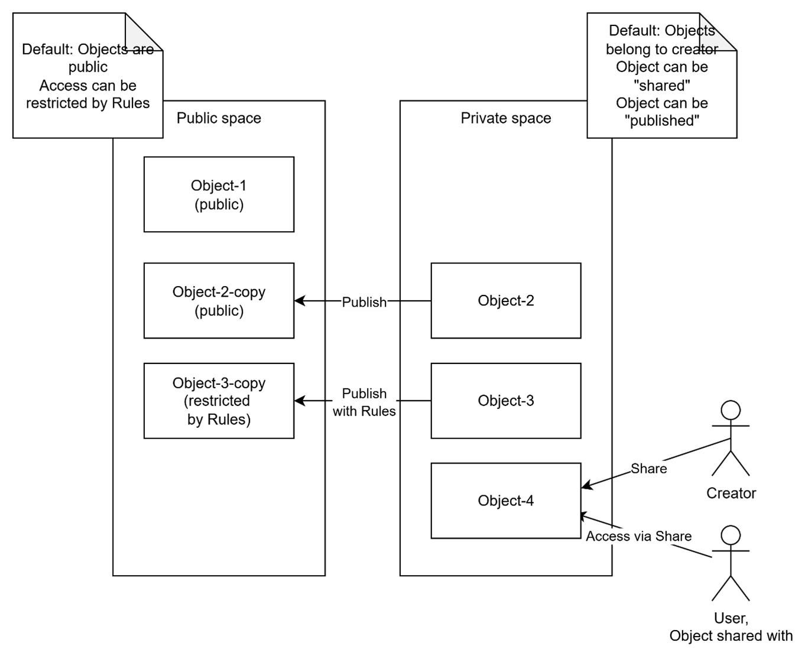
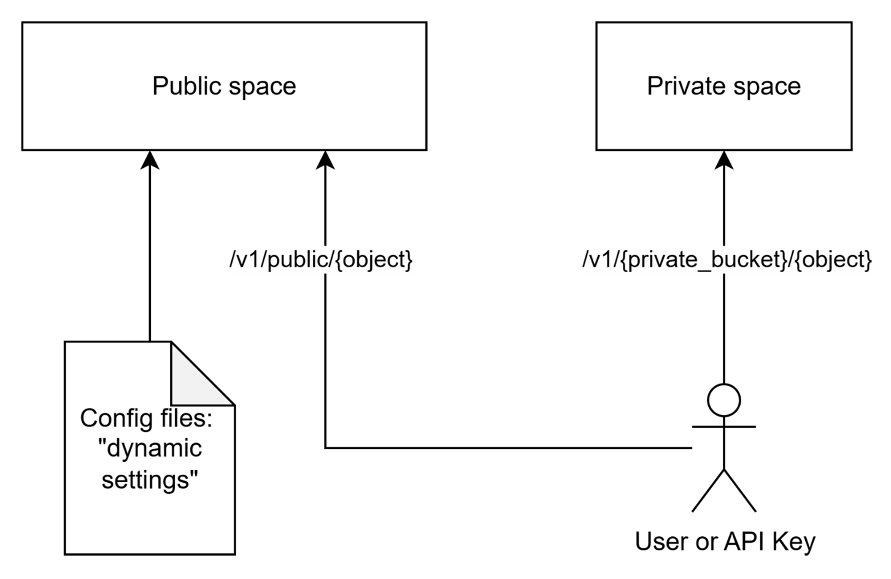
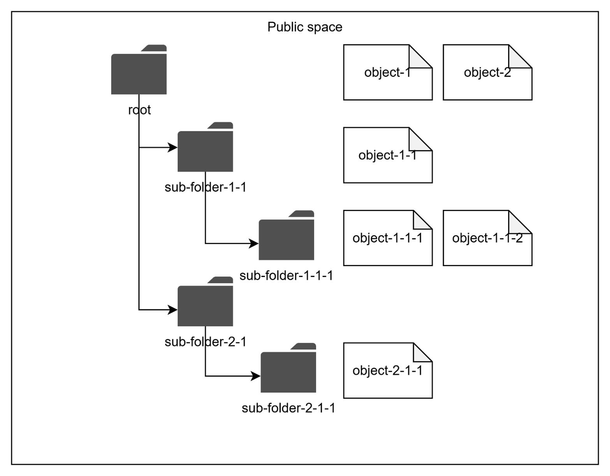
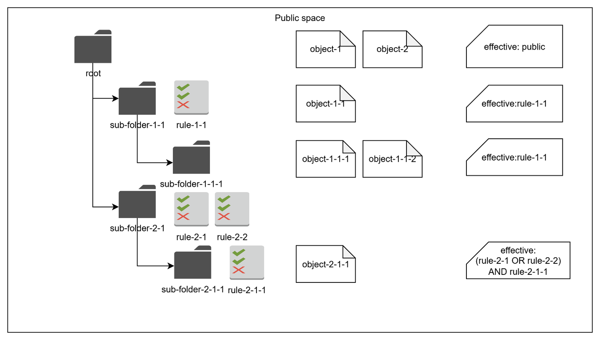

# Authentication and access control

DIAL controls who can reach the platform and what each caller may do with the resources inside it. This page explains the model behind that control: how callers prove their identity (authentication) and how DIAL decides what they are allowed to access (authorization). It is written for architects and developers who want to understand the model before configuring it. For the exact permission matrices, see the [Access control reference](./2.access-control-reference.md); for setup, see [Auth and access control](../../operating-dial/auth-and-access-control/0.index.md) how-tos.

## Two questions: who are you, and what can you do

Every request to [DIAL Core](../architecture/1.architecture-highlights.md) answers two questions in order. Authentication establishes identity — who is making the request. Authorization then decides access — what that identity may read, write, or run.

Both questions are answered by DIAL Core, the only mandatory component. DIAL Chat and DIAL Admin sit on top of Core and rely on the same mechanisms, which is why this page describes Core's model directly.

## Authentication: proving identity

DIAL Core accepts two methods of authentication. They serve different callers.

- **JSON Web Token (JWT)** authenticates end users. When a user signs in, an identity provider validates their credentials and returns a signed JWT carrying the user's identity and roles. DIAL accepts tokens from any standards-compliant identity provider.
- **API key** authenticates server-to-server callers that have no user context. API keys are defined in DIAL Core's [dynamic settings](../../operating-dial/auth-and-access-control/1.api-keys.md) and associated with roles that govern their access.

A third credential, the [per-request key](../../building-with-dial/working-with-dial-resources/5.per-request-keys.md), is not used by external callers. DIAL Core generates it internally for the lifetime of a single request when an application acts on a user's behalf. It carries both the application's and the user's identity, and is invalidated when the request completes.

## Access control: the object, subject, action model

Authorization in DIAL is best read as three questions: what is being protected, who wants access, and what kind of access is granted. DIAL frames these as **objects**, **subjects**, and **actions**.

### Objects: what is protected

Objects are the resources DIAL Core manages: models, applications, tool sets, files, prompts, and conversations. Each object is defined in one of two ways, and the choice shapes how it is governed.

- **Pre-configured objects** are declared in DIAL Core's dynamic settings configuration files. They suit an infrastructure-as-code approach and are immutable through the API.
- **Runtime objects** are created through the [Unified API](../architecture/4.unified-api-overview.md), which suits resources that regular users create themselves.

Both approaches can be combined freely. Some objects, such as models and roles, exist only as pre-configured objects.

### Subjects: who wants access

Subjects are the actors that act on objects. DIAL recognizes three:

- **End users**, authenticated by JWT.
- **API keys**, used by external applications without a user context.
- **Applications acting on a user's behalf**, authenticated by a per-request key.

To avoid managing permissions for every individual, DIAL groups subjects with **roles**. A role applies to many users, user groups, and API keys at once, and is then used as a subject in authorization rules. Roles are defined only in configuration files, never through the API.

DIAL ships one default role, **DIAL Administrators**, with elevated access: administrators can reload dynamic settings without a restart and reach Core APIs and objects that other subjects cannot.

### Actions: what kind of access

Actions are the operations a subject performs on an object — typically read, write, or run. An authorization rule binds the three together: a set of subjects is granted a set of actions on a set of objects.

## How access is granted: public and private spaces

Every object lives in exactly one of two logical spaces, and the space sets the default authorization rules.

- The **public space** makes objects broadly available while keeping governance central. By default, any object in public space is readable by every user; only DIAL Administrators may write to it.
- The **private space** keeps objects visible only to their owner. Every subject has its own private space, so users work without exposing their resources to anyone else.

Pre-configured objects always land in the public space. Runtime objects can be created in either space, but only DIAL Administrators may create objects directly in public space. Regular users and API keys create objects in their own private space.

### Narrowing public access

Default public read access can be restricted. For pre-configured objects, a `userRoles` attribute limits an object to the listed roles. For runtime objects, the public space is organized as a hierarchy of subfolders, much like a file system.

Each subfolder can carry access rules — attribute-based predicates that describe which subjects may enter it. The effective rule for an object combines the rules on its own subfolder with those inherited from every parent, so access narrows as the hierarchy deepens.

Regular users place objects into the public space only through [publication](../capabilities/4.collaboration-and-sharing.md), which always requires administrator approval.

### Extending private access

Owners can extend access to a private object without publishing it. They create a **sharing link** granting read or read-and-write access and send it to specific users. The object stays in the owner's private space, and access can be revoked at any time. [Collaboration and sharing](../capabilities/4.collaboration-and-sharing.md) covers this model in depth.

## Applications acting on a user's behalf

A subtle case arises when a user invokes an application that, in turn, calls Core APIs, another application, or a model. The application uses a per-request key that represents both itself and the user.

Logically, the application acts as the user and should share the user's access. But applications are themselves objects that any user can create and deploy, so they cannot be fully trusted. DIAL resolves the tension by deliberately narrowing what a per-request key can reach: instead of the user's entire private space, it sees only the application's dedicated subfolder within that space, plus the application's own private space. This keeps a potentially untrusted application from reading everything its caller owns.

## Implications

The model favors safe defaults. New resources are private; public exposure is read-only and gated by administrator-approved publication; applications get the least access that lets them function. Loosening any of these is an explicit act — a sharing link, a publication, a role assignment — never an accident.

## Further reading

- [Access control reference](./2.access-control-reference.md) — the full permission matrices for every object and subject
- [Collaboration and sharing](../capabilities/4.collaboration-and-sharing.md) — how sharing and publication build on this model
- [Usage limits and cost control](./3.usage-limits-and-cost-control.md) — the limits that roles also enforce

## Next steps

- [Auth and access control](../../operating-dial/auth-and-access-control/0.index.md) — configure authentication and authorization in DIAL Core
- [JWT configuration](../../operating-dial/auth-and-access-control/2.jwt.md) — connect an identity provider and map roles
- [API keys](../../operating-dial/auth-and-access-control/1.api-keys.md) — create keys and bind them to roles
